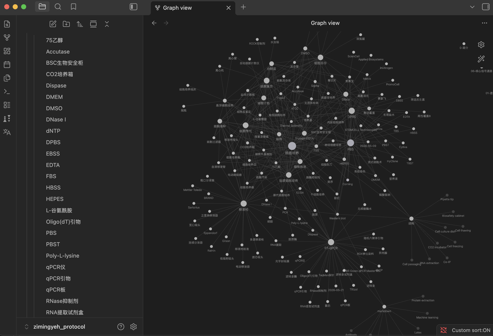

# Zimingyeh Protocol

Zimingyeh Protocol 是一个基于 Markdown 与 Obsidian 构建的生物医学实验 protocol 与实验知识库。

它不是只整理固定步骤的 recipe，而是希望把实验流程、试剂耗材、实验工具、厂商信息和相关背景知识连接起来，并尽量解释每一步背后的原因、可调整策略、常见错误和记录方式。

## 推荐使用方式

最推荐的使用方式是将整个仓库下载或 `git clone` 到本地，然后用 Obsidian 打开 `Zimingyeh_protocol` 文件夹。

这样你可以把它当作一个本地个人实验 protocol 知识库使用：阅读、搜索、跳转、修改、补充，并根据自己的实验方向和实验室条件继续扩展。

GitHub 上也可以直接阅读这些 Markdown 文件。为了兼容 GitHub，本库使用标准 Markdown 链接 ``，而不是 Obsidian 专属双链。

## 使用说明

更完整的目录说明、阅读方式和写作原则见：

[Zimingyeh Protocol 使用说明](<Zimingyeh_protocol/使用说明/结构.md>)

## 内容范围

当前内容主要围绕生物医学实验，包括：

- 细胞培养、复苏、传代、冻存、接种、计数等基础细胞实验。
- RT-qPCR、RNA 提取、逆转录等分子实验。
- PBS、DPBS、DMSO、HEPES、Trypsin-EDTA、台盼蓝等常用试剂。
- 移液枪、生物安全柜、培养容器等实验工具和耗材。
- 实验室基础安全、风险评估、PPE、化学品安全、生物安全和事故应急。
- Gibco、Thermo Fisher、ATCC 等试剂厂商和资源来源。

## 笔记特点

- 基于 Markdown，适合 GitHub 阅读和版本管理。
- 使用 Obsidian 管理，适合作为本地知识库长期扩展。
- 重要概念尽量同时给出英文全称和中文名称。
- 不只写“怎么做”，也写“为什么这样做”。
- 包含注意事项、替代方案、常见错误和 troubleshooting。
- 推荐记录模板尽量同时提供中文和英文版本。
- 关键知识点尽量附参考来源。

## 当前状态

这个知识库仍在建设中。

有些页面已经比较完整，有些页面只是未来扩展的空白占位。内容会持续修订，目录结构也可能随着知识库增长继续调整。

## 注意事项

本知识库不是临床诊断指南，也不能替代具体试剂说明书、本实验室 SOP、机构安全规范或导师/平台老师的指导。

实际实验条件、细胞类型、试剂品牌和仪器型号不同，protocol 需要结合具体情况调整。
