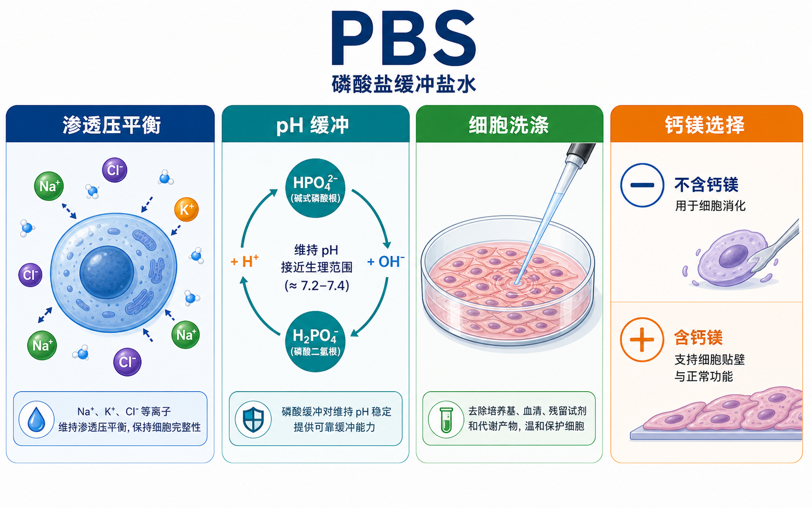

# Zimingyeh Protocol 使用说明

## 这个知识库是什么

Zimingyeh Protocol 是一个面向生物医学实验的 protocol 与实验知识库。它试图整理实验流程、试剂耗材、实验工具、试剂厂商和相关生命科学背景知识。

这个知识库不是只给一个固定 recipe（配方/步骤），而是尽量解释：

- 这个实验或试剂是什么。
- 为什么要这样做。
- 每一步操作的目的是什么。
- 哪些地方可以根据实验条件调整。
- 哪些错误会导致什么结果。
- 实验记录中应该记录哪些关键信息。

理想状态下，它应该既能当作实验前的学习材料，也能当作实验中的 protocol 参考，还能作为之后复盘实验问题的知识库。

## 这个知识库如何创建

本知识库主要使用 Markdown 格式写作。Markdown 是一种轻量文本格式，适合长期保存、版本管理、GitHub 阅读，也适合 AI 工具辅助整理和修改。

本知识库使用 Obsidian 进行本地管理。Obsidian 是一个本地化笔记软件，可以直接打开 Markdown 文件夹，把普通 `.md` 文档组织成一个可检索、可链接、可持续扩展的个人知识库。

为了兼容 GitHub，本知识库的内部链接使用标准 Markdown 链接：

```md
[PBS](<../材(实验耗材工具篇)/PBS.md>)
[RT-qPCR](<../用(实验流程内容篇)/RT-qPCR.md>)
```

而不是 Obsidian 专属的双链语法：

```text
\[\[PBS\]\]
```

这样做的好处是：同一份笔记既可以在 Obsidian 中阅读和管理，也可以在 GitHub 上直接浏览。

图片、概要图和资料图统一放在 `z_asset` 文件夹中，并通过标准 Markdown 图片链接引用。

## 最推荐的使用方式

最推荐的使用方式是：

- 下载或 `git clone` 整个仓库到本地。
- 使用 Obsidian 打开 `Zimingyeh_protocol` 文件夹。
- 在 Obsidian 中阅读、搜索、跳转和修改这些 Markdown 笔记。
- 根据自己的实验方向、实验室条件和个人习惯，继续增删、改写和补充。

这样它就不只是一个在线文档，而可以变成你的个人实验 protocol 知识库。

如果只是在 GitHub 上阅读，也可以正常浏览大部分内容；但本地 Obsidian 阅读会更适合长期使用和个人化管理。

## 适合谁阅读

这个知识库主要适合：

- 刚进入实验室、需要系统理解实验流程的人。
- 生物医学相关专业的本科生、研究生和科研训练者。
- 想查某个试剂、耗材、仪器或实验步骤细节的人。
- 想知道实验步骤背后逻辑，而不是只照着 protocol 做的人。
- 想把公共知识库改造成个人实验记录和 protocol 系统的人。

如果你已经很熟悉某个实验，也可以把它当作复查细节、比较试剂或整理 SOP 的参考。

## 内容范围

目前内容主要围绕生物医学实验，尤其是常见细胞实验、分子实验、蛋白实验、试剂耗材和实验工具。

当前重点包括：

- 细胞培养、细胞复苏、传代、冻存、接种、计数等基础细胞实验。
- RT-qPCR、RNA 提取、逆转录等分子实验。
- PBS、DPBS、DMSO、HEPES、Trypsin-EDTA、台盼蓝等常用试剂。
- 移液枪、生物安全柜、培养容器等实验工具和耗材。
- Gibco、Thermo Fisher、ATCC 等试剂厂商和资源来源。

它不是临床诊断指南，也不是所有生命科学领域的完整百科。内容会随着使用和写作逐步扩展。

## 文件结构

公开知识库主要包括以下目录：

```text
Zimingyeh_protocol/
├── 使用说明/
├── 实验室安全/
├── 材(实验耗材工具篇)/
├── 用(实验流程内容篇)/
├── 番外/
└── z_asset/
```

### 使用说明

`使用说明` 用于解释这个知识库的使用方式、文件结构和阅读建议。

### 实验室安全

`实验室安全` 用于存放进入实验室前后都需要反复参考的基础安全规范。

例如：

- [实验室安全总览](<../实验室安全/实验室安全总览.md>)
- [安全风险评估](<../实验室安全/安全风险评估.md>)
- [个人防护装备](<../实验室安全/个人防护装备.md>)
- [事故与应急处理](<../实验室安全/事故与应急处理.md>)

这类笔记通常会写：风险评估、培训授权、PPE、化学品安全、生物安全、设备风险、废弃物处理和事故报告。实际执行时仍然必须以所在机构的 EHS、PI、平台老师和正式 SOP 为准。

### 材(实验耗材工具篇)

`材(实验耗材工具篇)` 用于存放试剂、耗材、仪器和工具类笔记。

例如：

- [PBS](<../材(实验耗材工具篇)/PBS.md>)
- [DMSO](<../材(实验耗材工具篇)/DMSO.md>)
- [Trypsin-EDTA](<../材(实验耗材工具篇)/Trypsin-EDTA.md>)
- [移液枪](<../材(实验耗材工具篇)/移液枪.md>)

这类笔记通常会写：定义、英文全称、中文名、用途、常见版本、使用方法、注意事项、购买建议和记录模板。

### 用(实验流程内容篇)

`用(实验流程内容篇)` 用于存放实验方法、操作流程和 protocol。

例如：

- [细胞培养](<../用(实验流程内容篇)/细胞培养.md>)
- [细胞复苏](<../用(实验流程内容篇)/细胞复苏.md>)
- [细胞传代](<../用(实验流程内容篇)/细胞传代.md>)
- [RT-qPCR](<../用(实验流程内容篇)/RT-qPCR.md>)

这类笔记通常会写：实验目的、原理、所需试剂与器材、详细操作、每步意义、替代方案、可能错误和结果解析。

### 番外

`番外` 用于存放不直接属于某一个实验步骤，但会帮助理解实验系统的内容。

目前主要包括：

- 试剂厂商。
- 生命科学背景知识。
- 某些实验体系或产品生态的补充说明。

例如：

- [Gibco](<../番外/试剂厂商/Gibco.md>)

### z_asset

`z_asset` 用于存放图片、概要图和其他 Markdown 引用资源。

例如，一个 PBS 笔记中的图片会放在：

```text
z_asset/材/PBS/
```

笔记中通过 Markdown 图片语法引用：

```md

```

## 推荐阅读方式

建议从上级主题进入，再逐步进入子主题和材料页。

例如学习细胞培养，可以按这个路径阅读：

- [细胞培养](<../用(实验流程内容篇)/细胞培养.md>)
- [细胞复苏](<../用(实验流程内容篇)/细胞复苏.md>)
- [细胞传代](<../用(实验流程内容篇)/细胞传代.md>)
- [细胞冻存](<../用(实验流程内容篇)/细胞冻存.md>)
- [贴壁细胞培养](<../用(实验流程内容篇)/贴壁细胞培养.md>)
- [悬浮细胞培养](<../用(实验流程内容篇)/悬浮细胞培养.md>)
- [原代细胞培养](<../用(实验流程内容篇)/原代细胞培养.md>)

遇到某个试剂或工具时，再跳到对应材料页：

- [DMSO](<../材(实验耗材工具篇)/DMSO.md>)
- [HEPES](<../材(实验耗材工具篇)/HEPES.md>)
- [Trypsin-EDTA](<../材(实验耗材工具篇)/Trypsin-EDTA.md>)
- [台盼蓝](<../材(实验耗材工具篇)/台盼蓝.md>)
- [移液枪](<../材(实验耗材工具篇)/移液枪.md>)

主篇负责建立框架，子篇负责展开操作，材料页负责解释试剂、耗材和工具。

## 笔记写作原则

这个知识库的笔记尽量遵循以下原则：

- 第一次出现重要英文概念时，写出英文全称和中文名称。
- 重要试剂、实验、工具和厂商使用标准 Markdown 链接。
- 不只写“怎么做”，也写“为什么这样做”。
- 不只写标准 protocol，也写可以调整的策略。
- 说明常见错误、异常结果和 troubleshooting。
- 推荐记录模板尽量同时提供中文和英文版本。
- 关键知识点旁边尽量标注参考来源。
- 如果一个上级主题有多个子类，会在上级主题中加入对比板块。

例如 [细胞培养](<../用(实验流程内容篇)/细胞培养.md>) 中会对比贴壁细胞、悬浮细胞、原代细胞、干细胞、类器官等分支，帮助读者先理解不同培养逻辑之间的差异。

## 证据来源与可信度

本知识库会尽量为关键内容提供参考来源。优先级大致如下：

- 官方说明书、厂商 protocol 和产品技术资料。
- 标准、指南和共识文件。
- 经典论文和同行评议论文。
- 大型机构、细胞库或大学实验室资料。
- 实验经验、操作建议和 AI 辅助整理内容。

参考来源越接近原始资料，可信度通常越高；但实用性并不完全等于权威等级。有些小技巧可能来自经验总结，也会尽量说明原因和潜在风险。

## 使用时的注意

实验 protocol 不能机械照搬。不同细胞类型、试剂品牌、仪器型号、实验室环境和研究目的，都可能要求调整操作条件。

实际操作时应优先参考：

- 具体细胞或试剂的说明书。
- 本实验室已有 SOP。
- 机构安全规范。
- 导师、平台老师或有经验同事的建议。

涉及人源样本、动物实验、病原体、病毒、基因编辑、放射性、有毒有害试剂等内容时，必须遵守所在机构的伦理、安全和审批要求。

## 当前状态

这个知识库仍在建设中。

有些页面已经比较完整，有些页面只是空白占位。空白页通常表示这个主题已经被链接到，未来会继续补充，并不代表文件损坏。

内容会持续修订。随着新的实验、试剂和资料加入，目录结构、链接和笔记内容也可能继续调整。
