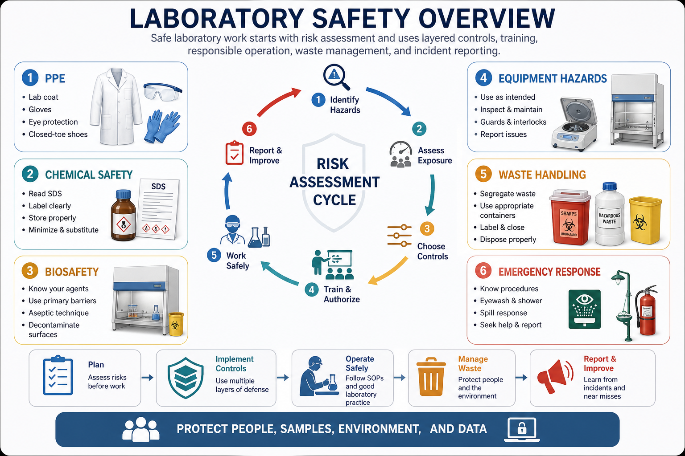
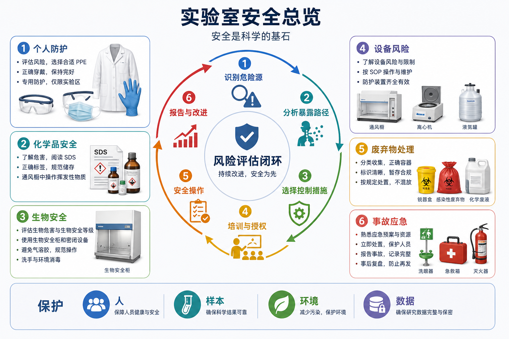

# 实验室安全总览





## 页面定位

本页是整个 `实验室安全` 板块的入口页，也是一份面向新进入实验室成员的基础安全总纲。它的目标不是替代学校、医院、公司、PI、EHS（Environmental Health and Safety，环境健康与安全）或生物安全委员会的正式培训，而是帮助读者在阅读具体实验 protocol 之前，先建立一套通用安全框架。

实验室安全不是“背一组禁忌”，而是把每一个实验动作放进 risk assessment（风险评估）里：识别危险源，判断暴露路径，估计后果和概率，选择控制措施，记录责任人，并在条件变化时重新评估。WHO（World Health Organization，世界卫生组织）第四版 Laboratory Biosafety Manual（实验室生物安全手册）强调以风险评估为核心来决定安全控制措施，而不是只按固定清单机械套用。[参考：WHO Laboratory Biosafety Manual, 4th edition](https://www.who.int/publications/i/item/9789240011311)

## 建议拆分的子页

这个板块建议先拆成以下页面。总览页只讲共同原则，子页再展开具体操作、记录模板和检查表。

| 子页 | 主要内容 | 使用场景 |
| --- | --- | --- |
| [安全风险评估](安全风险评估.md) | hazard（危险源）、risk（风险）、暴露路径、风险等级、控制措施、残余风险 | 开始任何新实验、换试剂、换样本、换设备前 |
| [入室培训与授权](入室培训与授权.md) | 新人培训、授权范围、禁止独立操作的项目、培训记录 | 新成员入组、轮转、开始新技术 |
| [个人防护装备](个人防护装备.md) | lab coat（实验服）、gloves（手套）、eye protection（眼部防护）、mask/respirator（口罩/呼吸防护） | 日常实验、化学品、生物样本、飞溅风险 |
| [化学品安全](化学品安全.md) | 化学品危险分类、暴露控制、通风橱、腐蚀/毒性/易燃/氧化性试剂 | 使用有害化学品前 |
| [SDS与GHS标签](SDS与GHS标签.md) | SDS（Safety Data Sheet，安全数据表）、GHS（Globally Harmonized System，全球化学品统一分类和标签制度） | 查试剂危险性、储存、急救和废弃物处理 |
| [危险化学品储存](危险化学品储存.md) | 相容性、易燃柜、酸碱分开、氧化剂/还原剂隔离、二级容器 | 建立试剂柜、整理库存 |
| [生物安全基础](生物安全基础.md) | BSL（Biosafety Level，生物安全等级）、risk group（风险组）、气溶胶、去污染 | 细胞、微生物、人体样本和重组核酸实验 |
| [生物安全柜使用规范](生物安全柜使用规范.md) | BSC（Biological Safety Cabinet，生物安全柜）类型、气流逻辑、开机/操作/收尾 | 细胞培养、无菌操作、感染性材料 |
| [通风橱使用规范](通风橱使用规范.md) | fume hood（化学通风橱）的气流、挡板高度、摆放距离、禁忌 | 挥发性、有毒、有腐蚀性化学品 |
| [锐器安全](锐器安全.md) | needle stick（针刺）、刀片、玻璃、锐器盒、禁止回套针帽 | 注射器、玻璃巴 Pasteur 管、手术刀片 |
| [实验室废弃物处理](实验室废弃物处理.md) | 生物废弃物、化学废液、锐器、玻璃、污染耗材、标签 | 实验结束和实验室日常管理 |
| [事故与应急处理](事故与应急处理.md) | 暴露、溅洒、针刺、火灾、泄漏、眼冲洗、报告链 | 事故发生时，以及入室培训 |
| [液氮安全](液氮安全.md) | cryogenic hazard（低温危害）、窒息风险、冻伤、防护面屏 | 细胞冻存、液氮罐、干冰/低温操作 |
| [离心机安全](离心机安全.md) | 转子平衡、密封杯、气溶胶、转子疲劳、破管处理 | 细胞、微生物、血液、挥发性样本离心 |
| [高压灭菌锅安全](高压灭菌锅安全.md) | autoclave（高压蒸汽灭菌锅）压力、烫伤、液体延迟沸腾、装载 | 灭菌、废弃物处理、培养基准备 |
| [压缩气瓶安全](压缩气瓶安全.md) | 气瓶固定、减压阀、氧化/可燃/惰性气体、运输 | CO2、氮气、氧气、氢气等气瓶 |
| [电气与消防安全](电气与消防安全.md) | 插座负载、老化电线、火灾分类、灭火器、疏散 | 所有实验室日常安全 |
| [重组DNA与基因编辑安全](重组DNA与基因编辑安全.md) | recombinant/synthetic nucleic acids（重组/合成核酸）、载体、病毒包装、审批 | 分子克隆、病毒载体、CRISPR 实验 |
| [人体样本与血源性病原体安全](人体样本与血源性病原体安全.md) | bloodborne pathogens（血源性病原体）、人体样本、隐私和伦理 | 血液、组织、临床样本 |
| [动物实验安全](动物实验安全.md) | 过敏、咬伤抓伤、麻醉剂、动物源病原、伦理审批 | 动物实验平台或动物来源样本 |
| [实验室安全检查清单](实验室安全检查清单.md) | 入室前、实验前、离开前、周/月度巡检 checklist | 自查、带教、组会前安全检查 |

## 权威资料骨架

这份总览建议以以下资料作为长期参考骨架。后续每个子页可以再补充更专门的机构手册、国家标准和设备说明书。

| 资料 | 适合覆盖的主题 | 使用方式 |
| --- | --- | --- |
| CDC/NIH BMBL（Biosafety in Microbiological and Biomedical Laboratories，微生物和生物医学实验室生物安全） | 生物安全等级、微生物/生物医学实验室实践、风险评估、BSC、去污染 | 生物安全相关子页的主参考之一。[参考：CDC BMBL](https://www.cdc.gov/labs/bmbl/index.html) |
| WHO Laboratory Biosafety Manual, 4th edition | 风险评估驱动的实验室生物安全、核心要求、良好微生物技术 | 总览页和生物安全基础页的主参考之一。[参考：WHO LBM](https://www.who.int/publications/i/item/9789240011311) |
| OSHA Laboratory Standard 29 CFR 1910.1450 | 化学实验室职业暴露、Chemical Hygiene Plan（化学卫生计划） | 化学品安全、培训和暴露控制参考。[参考：OSHA 1910.1450](https://www.osha.gov/laws-regs/regulations/standardnumber/1910/1910.1450) |
| OSHA Laboratory Safety Guidance | 实验室危险识别、PPE、化学品、生物危害、物理危害和应急 | 通用安全培训和检查清单参考。[参考：OSHA Laboratory Safety Guidance](https://www.osha.gov/sites/default/files/publications/OSHA3404laboratory-safety-guidance.pdf) |
| Prudent Practices in the Laboratory | 化学品管理、储存、废弃物、应急、实验室安全文化 | 化学品和实验室管理参考。[参考：NCBI Bookshelf](https://www.ncbi.nlm.nih.gov/books/NBK55878/) |
| NIH Guidelines | 重组或合成核酸、病毒载体、机构生物安全委员会 | 分子克隆、病毒包装和基因编辑实验参考。[参考：NIH Biosafety and Biosecurity Policy](https://osp.od.nih.gov/policies/biosafety-and-biosecurity-policy/) |
| 《病原微生物实验室生物安全管理条例》与 GB 19489 | 国内病原微生物实验室管理、等级、责任和基本要求 | 国内机构合规入口，具体执行以本单位 EHS/生物安全委员会要求为准。[参考：司法部法规库](https://xzfg.moj.gov.cn/mobile/law/detail?LawID=1024) |

## 安全的核心逻辑

实验室安全可以用一个循环来理解：

```text
实验目的
-> 危险源识别
-> 暴露路径分析
-> 风险等级判断
-> 控制措施选择
-> 培训与授权
-> 操作记录
-> 事故/异常反馈
-> 重新评估
```

其中最容易被忽略的是“条件变化”。只要样本来源、试剂浓度、操作规模、设备型号、地点、操作者经验或废弃物方式发生变化，就不应该默认旧 SOP 仍然安全。

## 入室前必须明确的事情

进入实验室前，至少要明确：

- 这个实验室的 PI、安全负责人、EHS 联系人和紧急联系人是谁。
- 哪些区域可以进入，哪些设备可以使用，哪些实验必须有人在场。
- 是否完成了本单位要求的安全培训、生物安全培训、化学品培训、消防培训和废弃物培训。
- 是否读过与自己实验相关的 SOP（Standard Operating Procedure，标准操作流程）。
- 是否知道 eyewash station（洗眼器）、safety shower（安全喷淋）、fire extinguisher（灭火器）、spill kit（泄漏处理包）、first aid kit（急救箱）、紧急出口的位置。
- 是否知道本实验室的事故报告流程，包括 near miss（未遂事故/险情）也要报告。

没有培训和授权，不应该独立进行高风险实验。对新人来说，“我看别人这样做过”不等于已经具备操作资格。

## 控制措施优先级

安全控制不应该只依赖 PPE。更推荐按照 hierarchy of controls（控制层级）思考：

- Elimination（消除）：能不能不做这个危险步骤，或改用非危险方法。
- Substitution（替代）：能不能用低毒、低挥发、低感染风险、低浓度、低压力、低温和更小规模的方法替代。
- Engineering controls（工程控制）：例如 [生物安全柜使用规范](生物安全柜使用规范.md)、[通风橱使用规范](通风橱使用规范.md)、离心密封杯、防爆冰箱、联锁装置。
- Administrative controls（管理控制）：SOP、培训、授权、标签、门禁、时间安排、双人操作、库存管理。
- PPE（个人防护装备）：实验服、手套、护目镜、面屏、口罩或呼吸防护。

这也是为什么“戴了手套”不是安全的充分条件。手套只是最后一层屏障，不能替代通风、密闭、培训和正确废弃物处理。

## 通用行为红线

以下行为应默认禁止，除非本单位正式 SOP 有明确例外：

- 在实验区饮食、喝水、嚼口香糖、化妆或存放食品。
- 用嘴吸移液管。
- 未授权独立操作高风险设备或高风险样本。
- 戴污染手套触摸门把手、手机、电脑键盘、个人水杯、电梯按钮等公共或个人物品。
- 未贴标签或标签不清的试剂、废液、样本长期留在公共区域。
- 把不明化学品倒入水槽，或把不同废液随意混合。
- 将锐器丢入普通垃圾袋。
- 在不知道泄漏物性质时直接徒手清理。
- 为了赶进度跳过平衡转子、预热/冷却、通风橱检查、BSC 预运行或废弃物分类。

这些红线看起来普通，但很多实验室事故都不是来自复杂技术，而是来自“临时一下”“应该没事”“以前都这么做”。

## 化学品安全总纲

化学品安全的入口是 [SDS与GHS标签](SDS与GHS标签.md)。SDS 应该用于判断危险分类、急救措施、泄漏处理、储存要求、个人防护、消防措施和废弃物处理。OSHA Hazard Communication（危害沟通）体系要求通过标签、SDS 和培训让使用者理解化学品危险。[参考：OSHA Hazard Communication](https://www.osha.gov/hazcom)

通用原则：

- 新试剂第一次使用前先读 SDS，不要只看商品名。
- 挥发性、有毒、强刺激或腐蚀性化学品优先在 [通风橱使用规范](通风橱使用规范.md) 下操作。
- 易燃品、氧化剂、强酸、强碱、还原剂、剧毒品不能只按字母顺序摆放，要按相容性储存。
- 废液瓶必须有清楚标签：成分、浓度范围、日期、负责人和危险类型。
- 小量试剂也可能高危，尤其是强氧化剂、叠氮化物、氢氟酸、苯酚、氯仿、甲醛、丙烯酰胺、强挥发溶剂等。

后续可以把高频试剂的风险链接到具体试剂页，例如 [DMSO](<../材(实验耗材工具篇)/DMSO.md>)、[氯仿](<../材(实验耗材工具篇)/氯仿.md>)、[异丙醇](<../材(实验耗材工具篇)/异丙醇.md>)、[75% 乙醇](<../材(实验耗材工具篇)/75乙醇.md>) 等。

## 生物安全总纲

生物安全的起点是明确材料是什么，而不是只看实验名称。相同的“细胞培养”在不同材料下风险完全不同：普通商业细胞系、原代人体样本、病毒包装细胞、病原微生物、动物组织和未知来源样本，对应的审批、PPE、BSC、废弃物和暴露处理都可能不同。

通用原则：

- 区分 risk group（风险组）和 BSL（Biosafety Level，生物安全等级）。风险组描述生物因子的固有危害，BSL 是实验室设施、操作和管理控制的组合。
- 关注 aerosol（气溶胶）风险：吹打、涡旋、离心、开盖、超声、混匀和倾倒都可能产生气溶胶。
- 使用 [生物安全柜使用规范](生物安全柜使用规范.md) 时，要理解它保护的是样本、操作者和环境的组合，不等于普通超净台。
- 所有疑似污染材料都要先按规定去污染，再进入废弃物流。
- 人体样本、重组核酸、病毒载体、病原微生物和动物样本都可能需要额外审批。

CDC/NIH BMBL 和 WHO LBM 都强调生物安全不能只依赖设备，必须结合风险评估、良好微生物操作、培训、设施和应急流程。[参考：CDC BMBL](https://www.cdc.gov/labs/bmbl/index.html)；[参考：WHO LBM](https://www.who.int/publications/i/item/9789240011311)

## 设备和物理风险总纲

实验室设备风险经常被低估，因为它们看起来不像“有毒试剂”。但很多严重事故来自设备、压力、低温、旋转和电气。

- [离心机安全](离心机安全.md)：重点是转子平衡、管子破裂、气溶胶、转子寿命和密封转子/安全杯。
- [高压灭菌锅安全](高压灭菌锅安全.md)：重点是压力、蒸汽烫伤、液体延迟沸腾、装载方式和开盖时机。
- [液氮安全](液氮安全.md)：重点是低温冻伤、面部/眼部防护、密闭容器爆裂和缺氧窒息。
- [压缩气瓶安全](压缩气瓶安全.md)：重点是固定、防倾倒、减压阀匹配、可燃/氧化/惰性气体区分。
- [电气与消防安全](电气与消防安全.md)：重点是过载插线板、老化电线、加热设备、易燃溶剂和疏散路线。

## 废弃物和去污染总纲

废弃物处理不是实验结束后的杂事，而是风险控制的一部分。错误废弃物处理可能让风险从实验台转移到保洁人员、同组成员、公共区域和环境中。

基础分类应至少包括：

- 普通生活垃圾。
- 未污染实验耗材。
- 生物污染耗材。
- 锐器。
- 化学废液。
- 含特殊危害的废弃物，例如含重金属、强氧化剂、卤代溶剂、放射性或感染性材料。
- 玻璃废弃物。

具体分类以本单位 EHS 要求为准。总原则是：不确定时先隔离、贴标签、询问负责人，不要为了“清台面”而随意倒掉或混合。

## 事故和异常报告

事故处理要追求快、清楚、可追踪，而不是追求“自己解决掉”。尤其是针刺、眼部暴露、皮肤接触、吸入暴露、生物材料泄漏、化学品泄漏、火灾和设备异常，都应该按照 [事故与应急处理](事故与应急处理.md) 的流程记录和上报。

需要记录的基本信息包括：

- 发生时间和地点。
- 涉及材料、浓度、体积、样本来源和危险分类。
- 暴露路径：皮肤、眼睛、吸入、针刺、口鼻黏膜、破损皮肤等。
- 现场处理：冲洗、隔离、撤离、去污染、封存。
- 已通知人员：PI、EHS、平台负责人、医生或生物安全负责人。
- 后续建议：医学评估、复训、SOP 修改、设备维护、废弃物追踪。

near miss（未遂事故/险情）也值得记录。它通常是低成本修正 SOP 的最好机会。

## 新人入室最低 checklist

正式进入实验室独立操作前，建议至少完成：

```text
□ 已完成本单位实验室基础安全培训
□ 已完成消防/疏散培训
□ 已阅读本实验室通用安全 SOP
□ 已知道紧急联系人和事故报告流程
□ 已知道洗眼器、安全喷淋、灭火器、急救箱、泄漏处理包位置
□ 已接受 PPE 穿脱和手套污染边界培训
□ 已接受废弃物分类培训
□ 已接受化学品 SDS/GHS 基础培训
□ 已接受本实验相关生物安全或化学安全培训
□ 已获得需要使用设备的授权
□ 已明确哪些实验不能独立进行
□ 已完成第一次带教观察或模拟演练
```

English template:

```text
□ Completed institutional laboratory safety training
□ Completed fire safety and evacuation training
□ Read the laboratory general safety SOP
□ Know emergency contacts and incident reporting route
□ Know the locations of eyewash, safety shower, fire extinguisher, first aid kit, and spill kit
□ Trained in PPE use and glove contamination boundaries
□ Trained in waste segregation
□ Trained in basic SDS/GHS interpretation
□ Trained in experiment-specific chemical or biosafety requirements
□ Authorized to use required equipment
□ Know which procedures must not be performed alone
□ Completed first supervised observation or mock practice
```

## 后续写作顺序建议

这个板块不建议一次性写完所有子页。更合理的顺序是：

- 先写 [安全风险评估](安全风险评估.md)、[入室培训与授权](入室培训与授权.md)、[个人防护装备](个人防护装备.md)，因为它们是所有安全规范的底层。
- 再写 [化学品安全](化学品安全.md)、[生物安全基础](生物安全基础.md)、[实验室废弃物处理](实验室废弃物处理.md)、[事故与应急处理](事故与应急处理.md)，这是实验室日常最高频的四类。
- 然后根据 protocol 中出现频率补 [生物安全柜使用规范](生物安全柜使用规范.md)、[通风橱使用规范](通风橱使用规范.md)、[离心机安全](离心机安全.md)、[液氮安全](液氮安全.md) 等设备/场景页。

## 小结

实验室安全的核心不是“避免麻烦”，而是保护人、样本、环境和数据。一个实验如果没有明确风险评估、授权边界、PPE、工程控制、废弃物处理和应急流程，它就还不是完整 protocol。

后续所有实验笔记都可以在“所需条件”或“注意事项”中回链到本板块。例如细胞培养相关笔记可以链接 [生物安全基础](生物安全基础.md)、[生物安全柜使用规范](生物安全柜使用规范.md) 和 [实验室废弃物处理](实验室废弃物处理.md)；化学相关笔记可以链接 [SDS与GHS标签](SDS与GHS标签.md)、[化学品安全](化学品安全.md) 和 [通风橱使用规范](通风橱使用规范.md)。
