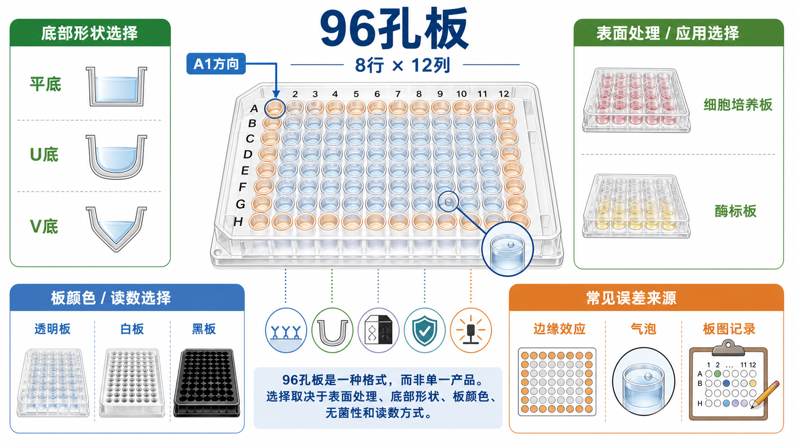

# 96孔板

96-well plate（96 孔板）是一种 microplate / multiwell plate（[微孔板](微孔板.md) / 多孔板）格式：一块标准板上有 8 行 × 12 列，共 96 个独立孔。它不是某一种固定产品，而是一个实验平台；同样叫“96 孔板”，可能是 [细胞培养板](细胞培养板.md)、[酶标板](酶标板.md)、低吸附板、黑壁透明底板、白色发光板，甚至是 [qPCR板](qPCR板.md) 这类热循环专用板。



图源：Image2 生成的 96 孔板结构与选择示意图；重点展示 8 行 × 12 列布局、A1 方向、平底 / U 底 / V 底、透明板 / 白板 / 黑板、边缘效应、气泡和板图记录。

## 定义与命名

96 孔板的英文常见写法包括 96-well plate、96-well microplate、96-well cell culture plate、96-well assay plate。中文常写作 96 孔板、九十六孔板、96 孔微孔板、96 孔细胞培养板或 96 孔酶标板。

最容易误解的一点是：**96 孔板描述的是孔数和排布，不直接描述用途、表面或材质**。真正决定它能不能用于某个实验的是下面这些参数：

- surface treatment（表面处理）：tissue culture treated（TC-treated，细胞培养处理）、non-treated（未处理）、high-binding（高蛋白结合）、low-binding（低吸附）、low-attachment（低贴附）等。
- bottom shape（孔底形状）：flat bottom（平底）、U-bottom（U 底 / 圆底）、V-bottom（V 底）。
- color / optical mode（颜色 / 光学模式）：clear（透明）、white（白色）、black（黑色）、black wall clear bottom（黑壁透明底）、white wall clear bottom（白壁透明底）。
- sterility（无菌状态）：sterile（无菌）或 non-sterile（非无菌）。
- compatibility（兼容性）：是否适配酶标仪、洗板机、自动化移液系统、显微镜、热循环仪或封板膜。

Society for Laboratory Automation and Screening（实验室自动化与筛选协会，SLAS）发布了微孔板尺寸、底座、孔位置和高度等 ANSI / SLAS 标准，目的是让不同厂商的微孔板能被自动化设备、读板仪和堆叠系统识别。这里的 ANSI 指 American National Standards Institute（美国国家标准协会）。参考：[SLAS Microplate Standards](https://www.slas.org/resources/information/industry-standards/)。

## 核心结构

| 结构 | 常见写法 | 实验意义 |
| --- | --- | --- |
| 行列排布 | A-H 行，1-12 列 | 便于板图记录、自动读板和样本定位 |
| A1 方向 | A1 corner / orientation mark | 防止整板旋转、样本错位和读板文件对应错误 |
| 每孔体积 | working volume / total volume | 影响蒸发、混匀、读板光路和细胞状态 |
| 孔间距 | well spacing / pitch | 影响多道移液枪、读板仪和自动化兼容 |
| 外圈孔 | edge wells | 更容易受蒸发和温度梯度影响 |

在很多平底 96 孔板中，每孔工作体积常见在 75-200 uL 量级，细胞培养时常用 100-200 uL / well；但这不是通用定值。不同厂商、底形、低裙边 / 高裙边、板盖设计和特殊表面处理都会改变推荐体积。Corning、Thermo Fisher 和 Greiner Bio-One 的微孔板资料都把孔数、颜色、表面处理、孔底形状和应用场景作为选型核心。参考：[Corning Microplates](https://www.corning.com/worldwide/en/products/life-sciences/products/microplates.html)；[Thermo Fisher Cell Culture Plates](https://www.thermofisher.com/us/en/home/life-science/cell-culture/cell-culture-plastics/cell-culture-plates.html)；[Greiner Bio-One Microplates](https://shop.gbo.com/en/row/products/bioscience/microplates/)。

## 常见用途

| 用途 | 常用板型 | 为什么适合 96 孔板 |
| --- | --- | --- |
| [ELISA](<../用(实验流程内容篇)/ELISA.md>)，enzyme-linked immunosorbent assay（酶联免疫吸附测定） | 透明平底高结合酶标板 | 适合标准曲线、重复孔和 OD450 读数 |
| [CCK-8实验](<../用(实验流程内容篇)/CCK-8实验.md>) | 透明平底 TC-treated 细胞培养板 | 细胞贴壁 + 吸光度读数都方便 |
| [MTT实验](<../用(实验流程内容篇)/MTT实验.md>) | 透明平底 TC-treated 细胞培养板 | 适合细胞培养和终点吸光度检测 |
| [ATP细胞活性检测](<../用(实验流程内容篇)/ATP细胞活性检测.md>) | 白色不透明板或白壁透明底板 | 白板能增强 luminescence（发光）信号 |
| [LDH释放实验](<../用(实验流程内容篇)/LDH释放实验.md>) | 透明平底板 | 常见 colorimetric assay（比色检测）读吸光度 |
| 药物筛选 | 透明 / 白 / 黑板，视读出方式决定 | 同一块板可并行多个浓度和重复孔 |
| 酶活和蛋白定量 | 透明或黑 / 白微孔板 | 取决于 absorbance（吸光度）、fluorescence（荧光）或 luminescence（发光）读出 |
| 细胞染色和成像 | 黑壁透明底或光学底板 | 降低孔间串光并保留底部成像能力 |

如果实验要培养细胞，优先确认板是否标注 sterile、TC-treated 或 cell culture grade；如果实验只做免疫吸附或蛋白包被，优先确认 high-binding 或 immunoassay surface，而不是只看“透明 96 孔”。

## 关键选型参数

### 表面处理

| 表面 | 中文理解 | 适合 | 不适合 |
| --- | --- | --- | --- |
| TC-treated | 细胞培养处理表面 | 常规贴壁细胞培养、药物处理、细胞活性检测 | 需要低吸附或蛋白包被特性的实验 |
| Non-treated | 未处理表面 | 悬浮细胞、一般储液、部分非贴壁检测 | 贴壁细胞可能贴附差 |
| High-binding | 高蛋白结合表面 | ELISA 抗原 / 抗体包被 | 细胞培养和低背景蛋白实验 |
| Low-binding | 低蛋白吸附表面 | 减少蛋白损失、低背景检测 | 需要包被固定蛋白的 ELISA |
| Low-attachment | 低细胞贴附表面 | 细胞球、悬浮团聚、类器官预培养 | 常规贴壁扩增 |
| Coated | 预包被表面 | 胶原、poly-L-lysine、Matrigel 等特殊贴壁需求 | 需要无包被背景的实验 |

同样是透明 96 孔板，ELISA high-binding plate 和 TC-treated cell culture plate 的表面逻辑完全不同。把高结合酶标板拿来培养贴壁细胞，可能出现贴壁差、形态异常或背景吸附偏高；把普通培养板拿来做包被 ELISA，则可能出现信号低、标准曲线斜率差和重复性差。

### 孔底形状

| 孔底 | 英文 | 适合 | 常见风险 |
| --- | --- | --- | --- |
| 平底 | flat bottom | 贴壁细胞、显微观察、吸光度读数 | 洗涤时残液可能沿孔底分布不均 |
| U 底 | U-bottom / round-bottom | 悬浮细胞沉降、免疫细胞反应、细胞团聚 | 不适合常规贴壁观察和均一底读 |
| V 底 | V-bottom | 离心收集、沉淀集中、小体积转移 | 贴壁培养和吸光度读数不友好 |

日常细胞活性实验通常优先选平底板，因为它兼顾贴壁、显微镜观察和底部读数。U 底或 V 底更像“让细胞或颗粒集中到底部”的工具，不应默认替代平底细胞培养板。

### 板颜色

| 颜色 | 更适合 | 原因 |
| --- | --- | --- |
| 透明板 | 吸光度、显微观察、常规 ELISA | 光路直接通过液体和透明底部 |
| 白板 | 发光检测 | 增强反射，提高发光信号强度 |
| 黑板 | 荧光检测 | 降低孔间串光和背景 |
| 黑壁透明底 | 荧光 + 底部成像 | 侧壁抑制串光，底部保留显微成像 |
| 白壁透明底 | 发光 / 荧光 + 底部观察 | 信号增强和观察需求折中 |

如果读的是 [吸光度](<../番外/补充知识/吸光度.md>) 或 optical density（光密度，OD），通常用透明平底板；如果读的是发光，白板常更合适；如果读的是荧光，黑板或黑壁透明底板通常更能降低背景。读板前还要确认仪器是否需要 [光程校正](<../番外/补充知识/光程校正.md>) 或 [参考波长](<../番外/补充知识/参考波长.md>)。

## 96 孔板 vs 相近板型

| 对比对象 | 最核心区别 | 什么时候选 96 孔板 | 什么时候选对方 |
| --- | --- | --- | --- |
| [微孔板](微孔板.md) | 微孔板是上位概念，96 孔板只是其中一种规格 | 常规检测、通用读板、手动操作友好 | 需要 24、384、1536 孔等不同通量时 |
| [酶标板](酶标板.md) | 酶标板强调免疫吸附 / 光学读数表面 | 只是在说“96 孔规格”时 | 做 ELISA 时要具体选 high-binding 酶标板 |
| [细胞培养板](细胞培养板.md) | 细胞培养板强调无菌、TC-treated 和细胞生长 | 做细胞活性、药物处理、转染筛选 | 只是做蛋白包被或非无菌读板时 |
| [384孔板](384孔板.md) | 384 孔更高通量、更省试剂 | 手动实验、入门优化、样本量中等 | 自动化平台、高通量筛选、试剂昂贵 |
| [qPCR板](qPCR板.md) | qPCR 板强调热传导、封板和热循环兼容 | 不用于热循环，只做培养/读板 | 做 quantitative polymerase chain reaction（定量聚合酶链式反应，qPCR） |

一句话判断：**96 孔板回答“有多少孔”，不回答“能做什么实验”。真正要写在记录里的是：96 孔 + 表面 + 颜色 + 孔底 + 无菌 + 货号 + 批号。**

## 使用 protocol

### 选板

**怎么做**：先根据读出方式选颜色，再根据样本类型选表面，最后确认孔底、无菌、体积、封板膜和仪器兼容性。

**为什么**：96 孔板实验失败，很多不是 protocol 本身错，而是板型不匹配。例如发光实验用了透明板，信号可能偏弱；贴壁细胞用了 non-treated 板，细胞可能贴不牢；ELISA 用了普通细胞培养板，包被可能不足。

**注意事项**：

- 细胞实验优先确认 sterile、TC-treated、flat-bottom。
- ELISA 优先确认 high-binding、clear、flat-bottom。
- 荧光实验优先确认 black wall 或 black plate，并检查是否需要 clear bottom。
- 发光实验优先考虑 white plate。
- 需要显微成像时确认底部材质、厚度、平整度和物镜工作距离。

**替代方案**：如果已有板型不理想，可以先做小规模预实验比较信噪比和重复性，不要直接用于正式大批样本。

### 设计板图

**怎么做**：实验前创建 [板图](<../番外/补充知识/板图.md>)，标清样本、浓度、重复孔、blank（空白）、negative control（[阴性对照](<../番外/补充知识/阴性对照.md>)）、positive control（[阳性对照](<../番外/补充知识/阳性对照.md>)）、标准品和边缘孔策略。

**为什么**：96 孔板一旦方向错、加样顺序错或文件导入错，后续数据很难救。板图是样本身份、读板文件和统计分析之间的桥。

**注意事项**：

- 标出 A1 方向，不要只在板盖上标记。
- 关键组别不要全部放在外圈。
- 浓度梯度最好与加样顺序、时间差和边缘效应错开。
- 同一项目尽量保留电子板图和读板原始文件。

**替代方案**：复杂药筛可以使用随机化板图或分区随机化；小实验也至少要有手写板图照片或电子表格。

### 加样和混匀

**怎么做**：使用 [多道移液枪](多道移液枪.md) 或电动分液器保持节奏一致。细胞悬液加样过程中定期轻柔混匀，试剂 master mix 要提前混匀，避免每孔临时拼小体积。

**为什么**：96 孔板每孔体积小，1-2 uL 误差、细胞沉降、吸头残留和气泡都会被放大成孔间差异。

**注意事项**：

- 吸头贴近孔壁加液，减少气泡。
- 不要让吸头碰到孔底细胞层。
- 加细胞后只做前后、左右十字轻晃，不要旋转画圈。
- 读板前检查气泡、板底污渍和孔内液面。

**替代方案**：高重复实验可以使用自动化分液器；粘稠试剂或含血清样本要考虑反向移液或预润洗吸头。

### 控制边缘效应

**怎么做**：对容易受蒸发影响的实验，提前设计 edge wells（边缘孔）策略：外圈只加 [PBS](PBS.md) 或培养基保湿、外圈作为非关键样本、或统计时预先排除外圈。

**为什么**：[边缘效应](<../番外/补充知识/边缘效应.md>) 会让外圈孔的体积、渗透压、温度和细胞状态偏离内圈孔，最后表现为外圈信号系统性偏高或偏低。

**注意事项**：

- 不是所有实验都必须弃用外圈；关键在于提前定义策略。
- 培养箱湿度、板盖、封板膜、孵育时间和开门次数都会影响边缘效应。
- 同一块板内的关键比较最好不要只发生在“外圈 vs 内圈”。

**替代方案**：对高价值样本，可以用内圈放正式孔、外圈保湿；对高通量筛选，可以用板位随机化和批内校正。

### 读板和数据导出

**怎么做**：读板前确认模式、波长 / 激发发射波长、增益、积分时间、读数方向、是否底读或顶读、是否需要震板和温控。导出数据时保留原始 matrix（矩阵）格式，并和板图对应。

**为什么**：96 孔板数据不是单个数值，而是一张空间矩阵。读数方向、A1 定义、空白扣除和数据转置都可能造成整体错位。

**注意事项**：

- 吸光度实验要确认波长和参考波长。
- 荧光实验要检查孔间串光和自发荧光背景。
- 发光实验要控制底物加入到读数之间的时间。
- OD 值过高时可能超出线性范围，需要稀释或缩短反应。

**替代方案**：关键实验可以同时保存仪器原始文件、导出表格和分析脚本，避免只保留处理后的柱状图。

## 常见错误与 troubleshooting

| 现象 | 可能原因 | 解决策略 |
| --- | --- | --- |
| 外圈孔整体偏高或偏低 | 边缘效应、蒸发、温度梯度 | 外圈保湿、减少孵育时间、优化培养箱湿度、预先定义是否排除外圈 |
| 重复孔 CV 高 | 移液误差、细胞沉降、气泡、板底污渍 | 使用多道移液枪，定期混匀，读板前检查气泡和板底 |
| 同一列或同一行异常 | 加样顺序、通道误差、多道移液枪某通道不准 | 校准移液枪，交叉检查通道，记录加样顺序 |
| 细胞贴壁差 | non-treated 板、细胞状态差、包被不足 | 换 TC-treated 板或包被板，优化接种密度和培养基 |
| ELISA 标准曲线低 | 板面不是 high-binding、包被不足 | 使用 ELISA / immunoassay plate，优化包被浓度和时间 |
| 荧光背景高 | 用了透明板、孔间串光、样本自发荧光 | 换黑板或黑壁透明底板，设置空白和背景扣除 |
| 发光信号弱 | 用了透明板、读数延迟、底物衰减 | 换白板，统一加底物到读数时间 |
| 数据整体错位 | A1 方向错、板图转置、导出格式错 | 标记 A1，保留原始矩阵，导入前核对第一孔和最后一孔 |

这里的 CV 指 coefficient of variation（变异系数），常用于描述重复孔离散程度。CV 高不一定代表生物学差异大，常常先指向加样、细胞分布或读板误差。

## 购买建议

买 96 孔板不要只搜“96 well plate”。更可靠的写法是把用途写完整：

- 常规贴壁细胞活性：sterile TC-treated clear flat-bottom 96-well cell culture plate。
- ELISA：clear flat-bottom high-binding 96-well ELISA plate。
- ATP 发光检测：white opaque 96-well assay plate，必要时选 white wall clear bottom。
- 荧光检测或细胞成像：black 96-well plate 或 black wall clear bottom 96-well plate。
- 细胞球 / 悬浮聚集：96-well round-bottom low-attachment plate。
- 小体积离心收集：96-well V-bottom plate。

常见供应商包括 [Corning](<../番外/试剂厂商/Corning.md>) / [Costar](<../番外/试剂厂商/Costar.md>)、[Thermo Fisher Scientific](<../番外/试剂厂商/Thermo Fisher Scientific.md>) / [Nunc](<../番外/试剂厂商/Nunc.md>)、[Greiner Bio-One](<../番外/试剂厂商/Greiner Bio-One.md>)、[Eppendorf](<../番外/试剂厂商/Eppendorf.md>)、[Sarstedt](<../番外/试剂厂商/Sarstedt.md>)、[NEST](<../番外/试剂厂商/NEST.md>)、[TPP](<../番外/试剂厂商/TPP.md>) 等。同一项目尽量使用同一品牌、同一货号、同一批号，至少要在记录中写清批号和表面类型。

## 推荐记录模板

中文模板：

```text
耗材名称：96 孔板
用途：细胞培养 / ELISA / 荧光 / 发光 / 比色 / 其他
品牌：
货号：
批号：
板型：透明 / 白色 / 黑色 / 黑壁透明底 / 白壁透明底
孔底：平底 / U 底 / V 底
表面处理：TC-treated / non-treated / high-binding / low-binding / low-attachment / coated
是否无菌：
是否带盖：
推荐工作体积：
实际每孔体积：
样本 / 细胞：
板图文件：
读板模式与参数：
边缘孔策略：
操作者：
日期：
备注：
```

English template:

```text
Consumable: 96-well plate
Application: cell culture / ELISA / fluorescence / luminescence / colorimetric assay / other
Brand:
Catalog number:
Lot number:
Plate color: clear / white / black / black wall clear bottom / white wall clear bottom
Well bottom: flat / U-bottom / V-bottom
Surface treatment: TC-treated / non-treated / high-binding / low-binding / low-attachment / coated
Sterile:
Lid included:
Recommended working volume:
Actual volume per well:
Sample / cell type:
Plate map file:
Reader mode and settings:
Edge-well strategy:
Operator:
Date:
Notes:
```

## 小结

96 孔板的核心不是“96 个孔”，而是把多个样本、浓度、重复和对照放进同一张空间矩阵。写 protocol 时要把板型说完整：孔数、表面、颜色、孔底、无菌、体积、A1 方向、板图和边缘孔策略。只要这些信息不清楚，后面的细胞状态、包被效率、吸光度、荧光、发光和统计分析都可能一起变得不可靠。

## 主要参考来源

- [SLAS: Microplate Standards](https://www.slas.org/resources/information/industry-standards/)
- [Corning: Microplates](https://www.corning.com/worldwide/en/products/life-sciences/products/microplates.html)
- [Thermo Fisher Scientific: Cell Culture Plates](https://www.thermofisher.com/us/en/home/life-science/cell-culture/cell-culture-plastics/cell-culture-plates.html)
- [Greiner Bio-One: Microplates](https://shop.gbo.com/en/row/products/bioscience/microplates/)
