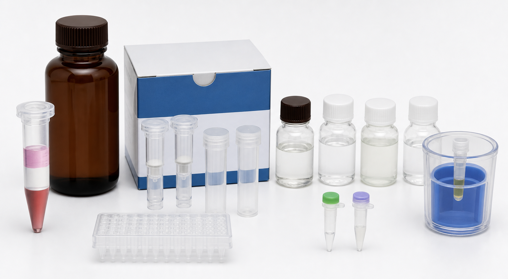

# DNase I

DNase I（Deoxyribonuclease I，脱氧核糖核酸酶 I）是一种能降解 DNA 的核酸酶。在 RNA 提取和 RT-qPCR 前处理中，RNase-free DNase I（无 RNase 的 DNase I）常用于去除 genomic DNA（基因组 DNA）污染，避免 DNA 被 qPCR 引物扩增而造成假阳性或 Cq 偏低。



图源：Image2 生成的 RNA 提取核心材料参考图；右下方小管代表 DNase I 等酶类处理试剂。

## 为什么 RNA 实验需要 DNase I

RNA 提取过程中，尤其是 TRIzol 或柱式提取，样本中可能残留 genomic DNA。后续 [RT-qPCR](<../用(实验流程内容篇)/RT-qPCR.md>) 中，如果 [qPCR引物](qPCR引物.md) 也能扩增基因组 DNA，就会导致 No-RT control（无逆转录酶对照）出现信号。

Thermo Fisher、Qiagen 和 NEB 都提供 RNase-free DNase I 或集成在 RNA purification workflow（RNA 纯化流程）中的 DNase 处理方案，用于减少 RNA 样本中的 DNA 污染。[参考：Thermo Fisher TURBO DNase](https://www.thermofisher.com/order/catalog/product/AM2238)；[参考：Qiagen RNase-Free DNase Set](https://www.qiagen.com/us/products/discovery-and-translational-research/dna-rna-purification/rna-purification/accessories/rnase-free-dnase-set)；[参考：NEB DNase I](https://www.neb.com/en-us/products/m0303-dnase-i-rnase-free)

## 常见使用方式

| 方式 | 特点 | 适合场景 |
| --- | --- | --- |
| On-column DNase digestion | 在硅胶膜柱上消化 DNA | 柱式 [RNA提取试剂盒](RNA提取试剂盒.md)，流程方便 |
| In-solution DNase digestion | 洗脱后在溶液中消化 | 去 DNA 更充分，适合严格 RT-qPCR |
| Kit-integrated gDNA removal | 试剂盒内置去 DNA 步骤 | 标准化流程，减少操作 |
| No DNase | 不处理 | 仅在引物严格跨外显子且 No-RT 阴性时考虑 |

## DNase I 与 No-RT 对照

[No-RT对照](<../番外/补充知识/No-RT对照.md>) 是判断 DNA 污染的关键控制。DNase I 处理后仍应设置 No-RT，尤其是：

- qPCR 引物不跨 exon-exon junction。
- 目标基因无内含子或有 pseudogene（伪基因）。
- 样本 DNA 含量高。
- 用于发表或重要验证实验。

## 使用 protocol

### 选择 RNase-free DNase

**怎么做**：选择明确标注 RNase-free 的 DNase I，并确认其 buffer、温度和后续灭活/清除方式适合 RNA 样本。

**为什么**：普通 DNase 可能带 RNase 污染，反而降解 RNA。

**注意事项**：

- 不要用普通分子生物学 DNase 替代 RNA 用 DNase。
- DNase buffer 中的离子可能影响后续反应，处理后要按说明清除。

### 柱上处理

**怎么做**：RNA 结合到柱膜后，加入 DNase I 工作液，在柱膜上孵育，再继续洗涤。

**为什么**：操作简单，能在纯化流程中去除部分 DNA。

**注意事项**：

- 柱膜不要干掉。
- 孵育时间和 buffer 体积按 kit 说明。
- DNA 污染严重时，柱上处理可能不够。

### 溶液中处理

**怎么做**：RNA 洗脱后加入 DNase I、buffer 和水，在推荐温度孵育。处理后通过灭活、柱纯化或酚/氯仿抽提去除 DNase 和盐。

**为什么**：溶液中处理更充分，但需要后续清除酶和 buffer。

**注意事项**：

- 热灭活条件不能损伤 RNA。
- 处理后重新测浓度和纯度。
- 下游 RT-qPCR 前保留 No-RT 对照。

## 常见错误与 troubleshooting

| 问题 | 可能原因 | 处理 |
| --- | --- | --- |
| No-RT 仍有信号 | DNase 不足、DNA 污染严重、引物扩增 gDNA | 延长处理、溶液中 DNase、重设计引物 |
| RNA 降解 | DNase 不纯或 RNase 污染 | 换 RNase-free DNase，检查操作环境 |
| 逆转录受抑制 | DNase buffer 或灭活试剂残留 | 纯化 RNA 后再逆转录 |
| RNA 产量下降 | 处理后纯化损失 | 优化回收方式，减少转移次数 |

## 购买与记录建议

常见供应商包括 [Thermo Scientific](<../番外/试剂厂商/Thermo Scientific.md>) / Invitrogen、[Qiagen](<../番外/试剂厂商/Qiagen.md>)、[NEB](<../番外/试剂厂商/NEB.md>)、[Takara](<../番外/试剂厂商/Takara.md>) 等。购买时确认 RNase-free、是否适合 on-column、是否可热灭活和单位定义。

推荐记录：

```text
DNase I:
RNase-free: yes/no
Supplier:
Catalog number:
Lot number:
Treatment mode: on-column/in-solution
RNA input:
Reaction temperature/time:
Cleanup method:
No-RT result:
```

## 小结

DNase I 是 RNA 样本去除 DNA 污染的核心工具。它不是所有 RNA 提取都必须做，但只要下游是 RT-qPCR、引物可能扩增 gDNA，或数据需要高可信度，就应该认真设置 DNase 处理和 No-RT 对照。

## 参考来源

- [Thermo Fisher TURBO DNase](https://www.thermofisher.com/order/catalog/product/AM2238)
- [Qiagen RNase-Free DNase Set](https://www.qiagen.com/us/products/discovery-and-translational-research/dna-rna-purification/rna-purification/accessories/rnase-free-dnase-set)
- [NEB DNase I, RNase-free](https://www.neb.com/en-us/products/m0303-dnase-i-rnase-free)
