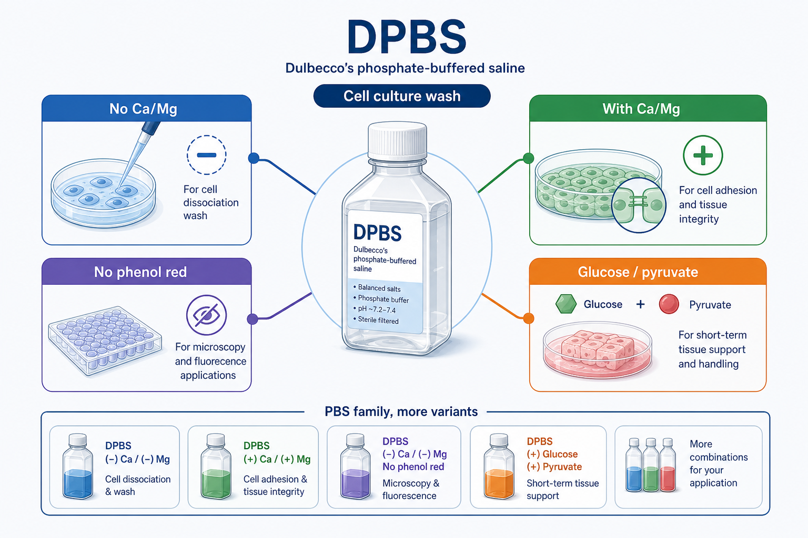
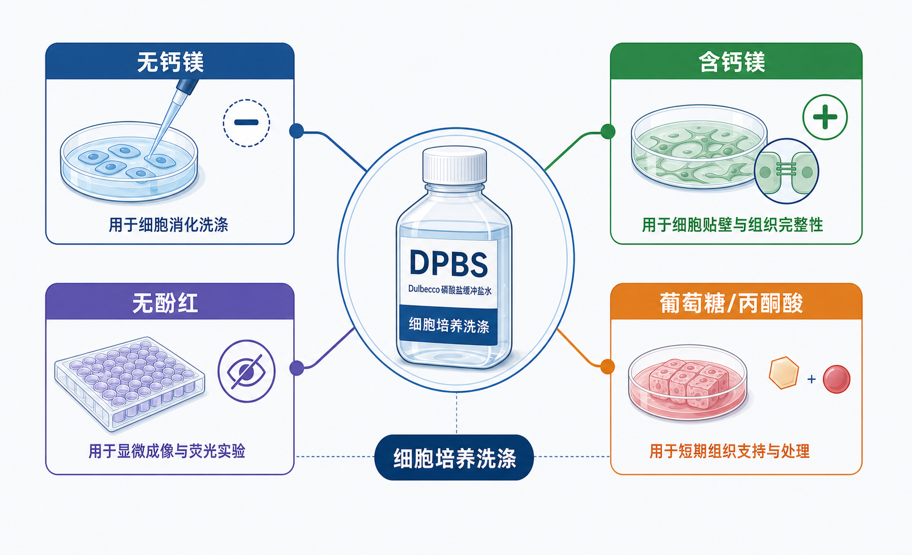

# DPBS

## 一句话定义

DPBS（Dulbecco's phosphate-buffered saline，Dulbecco 磷酸盐缓冲盐水）是 [PBS](PBS.md)（Phosphate-buffered saline，磷酸盐缓冲盐水）家族中常用于细胞培养的平衡盐溶液。它的核心作用和 PBS 类似：维持接近生理状态的渗透压和 pH，用于洗涤、稀释、短时间运输或维持细胞与组织样品。

但 DPBS 不是“随便换个名字的 PBS”。在细胞培养语境里，DPBS 更强调 Dulbecco 配方体系，并且常见商业版本会细分为是否含 Ca2+/Mg2+、是否含 glucose（葡萄糖）、是否含 sodium pyruvate（丙酮酸钠）、是否含 phenol red（酚红）等。Thermo Fisher 的 balanced salt solutions 页面也把 PBS 和 DPBS 分开比较，并说明 DPBS 有更多配方变体。[参考：Thermo Fisher Balanced Salt Solutions](https://www.thermofisher.com/de/de/home/life-science/cell-culture/mammalian-cell-culture/reagents/balanced-salt-solutions.html)





## 名称与常见写法

- DPBS：Dulbecco's phosphate-buffered saline，Dulbecco 磷酸盐缓冲盐水。
- DPBS without calcium and magnesium：无钙镁 DPBS。
- DPBS with calcium and magnesium：含钙镁 DPBS。
- DPBS without phenol red：无酚红 DPBS。
- 1× DPBS：可直接使用的工作浓度。
- 10× DPBS：浓缩储液，使用前需要稀释。

实际记录实验时，不建议只写“DPBS”。更推荐写成：

```text
1× DPBS, without Ca2+/Mg2+, without phenol red, sterile, Gibco, Cat. No. xxxxx
```

如果是含钙镁、含葡萄糖、含丙酮酸钠或含酚红的版本，也必须写清楚。DPBS 的坑几乎都来自“名字一样，配方不同”。

## DPBS 和 PBS 的区别

PBS 和 DPBS 都属于 phosphate-buffered saline（磷酸盐缓冲盐水）体系，都可以维持 pH 并减少细胞渗透压冲击。但两者在实验记录中不应该完全等同。

| 项目   | [PBS](PBS.md)               | DPBS                                    |
| ---- | --------------------------- | --------------------------------------- |
| 英文全称 | Phosphate-buffered saline   | Dulbecco's phosphate-buffered saline    |
| 中文名称 | 磷酸盐缓冲盐水                     | Dulbecco 磷酸盐缓冲盐水                        |
| 配方定位 | 通用磷酸盐缓冲盐水                   | 更常用于细胞培养体系的 Dulbecco 配方                 |
| 常见变体 | pH、是否无菌、是否含 Ca2+/Mg2+、是否含酚红 | 除上述外，还常见是否含 glucose、sodium pyruvate 等变体 |
| 常见用途 | 洗涤、稀释、免疫实验、基础缓冲             | 细胞洗涤、消化前冲洗、组织运输、短时间维持、细胞计数稀释            |
| 记录重点 | pH、无菌、Ca/Mg、酚红              | Ca/Mg、酚红、葡萄糖、丙酮酸钠、1×/10×、货号             |

最实用的理解是：PBS 是更通用的基础概念，DPBS 是细胞培养里更常见、更细分的 Dulbecco 版本。两者很多时候功能相近，但只要 protocol 指定 DPBS，就应该优先使用对应 DPBS，而不是随手用普通 PBS 替代。

## 核心成分与作用

DPBS 的基础逻辑仍然是“盐 + 磷酸盐缓冲体系”。

| 成分类型 | 典型成分 | 主要作用 |
| --- | --- | --- |
| 主要盐离子 | NaCl、KCl | 提供接近生理状态的离子强度和渗透压 |
| 磷酸盐缓冲体系 | Na2HPO4、KH2PO4 或相关盐形式 | 维持 pH 稳定 |
| 二价阳离子，可选 | CaCl2、MgCl2 | 支持部分细胞黏附、细胞连接、组织完整性或二价阳离子依赖反应 |
| 能量/代谢相关成分，可选 | glucose、sodium pyruvate | 给短时间处理中的细胞提供一定代谢支持 |
| 指示剂，可选 | phenol red | pH 指示，但可能干扰显微、吸光、荧光或流式读数 |

不同厂家的 DPBS 配方不一定完全一样，尤其是是否含 Ca2+/Mg2+、葡萄糖、丙酮酸钠和酚红。DPBS 的可靠写法永远是“名称 + 配方版本 + 货号”。

## 常见配方版本

### 无 Ca2+/Mg2+、无酚红 DPBS

这是细胞培养里最常用的 DPBS 版本，尤其适合[细胞消化](<../用(实验流程内容篇)/细胞消化.md>)前冲洗、洗去血清、[细胞计数](<../用(实验流程内容篇)/细胞计数.md>)稀释、[免疫染色](<../用(实验流程内容篇)/免疫染色.md>)和部分[流式细胞术](<../用(实验流程内容篇)/流式细胞术.md>)前处理。[Gibco](<../番外/试剂厂商/Gibco.md>) 的无钙镁 DPBS 产品说明中列出用途包括 washing cells before dissociation（细胞解离前洗涤）、transporting cells or tissue（运输细胞或组织）、diluting cells for counting（细胞计数稀释）和 preparing reagents（配制试剂）。[参考：Gibco DPBS, no calcium, no magnesium](https://www.thermofisher.com/order/catalog/product/tw/en/14190136)

这类 DPBS 适合用于细胞消化前冲洗，因为无 Ca2+/Mg2+ 不会额外支持细胞黏附，也不会干扰 [EDTA](EDTA.md)（Ethylenediaminetetraacetic acid，乙二胺四乙酸）螯合二价阳离子的作用。

### 含 Ca2+/Mg2+ DPBS

含钙镁 DPBS 更适合需要维持细胞黏附、组织结构、细胞连接或二价阳离子依赖过程的场景，例如组织短时间处理、某些灌流、部分免疫组织化学或需要维持细胞表面结构的实验。[Corning](<../番外/试剂厂商/Corning.md>) 的含钙镁 DPBS 产品说明中提到，它可以作为 irrigating、transporting、diluting fluid，在有限时间内维持细胞张力和活性。[参考：Corning DPBS with calcium and magnesium](https://ecatalog.corning.com/life-sciences/b2b/US/en/Media%2C-Sera%2C-and-Reagents/Buffered-Salt-Solutions/Dulbecco%27s-Phosphate-Buffered-Saline-%28DPBS%29/Corning%C2%AE-DPBS-%28Dulbecco%E2%80%99s-Phosphate-Buffered-Saline%29/p/21-030-CV)

但如果目的是贴壁细胞传代或消化，不建议使用含 Ca2+/Mg2+ 的 DPBS。它可能让细胞更难脱落，也可能影响 [Trypsin-EDTA](Trypsin-EDTA.md)（Trypsin-ethylenediaminetetraacetic acid，胰蛋白酶-乙二胺四乙酸）体系中 EDTA 的效果。

### 10× DPBS

10× DPBS 是浓缩储液，需要稀释到 1× 后使用。Gibco 的 10× DPBS 说明中提醒，浓缩形式的 DPBS 在制备时可能需要 pH adjustment（pH 调整）和 filtration（过滤）。[参考：Gibco DPBS 10×, no calcium, no magnesium](https://www.thermofisher.com/order/catalog/product/14200091)

使用 10× DPBS 时，最需要注意的是：不要直接把 10× 当 1× 用；稀释后要确认 pH、无菌状态和是否完全溶解。浓缩盐溶液在低温或长期放置后也可能出现析晶。

## 主要用途

- 细胞消化前冲洗：洗去 [FBS](FBS.md)（Fetal bovine serum，胎牛血清），避免血清抑制 trypsin（胰蛋白酶）。
- 细胞洗涤：换液、染色、固定、裂解前洗去[培养基](培养基.md)、药物或血清残留。
- 细胞计数稀释：短时间稀释细胞悬液，便于计数或后续处理。
- 组织或细胞短时间运输：在短时间内维持渗透压和 pH。
- 免疫染色或流式前处理：作为温和洗涤液或稀释液。
- 试剂配制：作为一些细胞实验试剂的基础盐溶液。

一句话：DPBS 可以在细胞离开完整培养基后的短时间窗口内提供一个温和、接近等渗的环境，但它仍然不能替代培养基。

## DPBS 不能替代什么

DPBS 不能替代 [DMEM](DMEM.md)、RPMI 1640、MEM 等培养基。它没有完整的氨基酸、维生素、血清、生长因子体系，不能长期支持细胞生长。

DPBS 也不能简单替代 [HBSS](HBSS.md) 或 [EBSS](EBSS.md)。HBSS（Hank's balanced salt solution，Hank 平衡盐溶液）和 EBSS（Earle's balanced salt solution，Earle 平衡盐溶液）通常更强调短时间细胞维持，可能含 glucose、sodium bicarbonate（碳酸氢钠）、phenol red 等。Thermo Fisher 说明中提到，EBSS 设计用于 5% CO2 条件，而 HBSS 因碳酸氢盐较少可不依赖 CO2 使用。[参考：Thermo Fisher HBSS vs EBSS](https://www.thermofisher.com/de/de/home/life-science/cell-culture/mammalian-cell-culture/reagents/balanced-salt-solutions.html)

DPBS 也不能替代 [TBS](TBS.md)（Tris-buffered saline，Tris 缓冲盐水）。如果实验涉及 alkaline phosphatase（AP，碱性磷酸酶）检测体系或磷酸化蛋白检测，磷酸盐缓冲体系可能造成干扰，通常更偏向选择 TBS/[TBST](TBST.md)。

## 选择 DPBS 时看什么

选择 DPBS 时至少看 6 个参数：

1. 浓度：1× 还是 10×。
2. 是否无菌：细胞培养相关用途应使用 sterile（无菌）产品。
3. 是否含 Ca2+/Mg2+：细胞消化前一般选无 Ca2+/Mg2+；组织维持、某些染色或灌流可能选含 Ca2+/Mg2+。
4. 是否含 phenol red：显微、吸光、荧光、流式一般优先选无酚红。
5. 是否含 glucose / sodium pyruvate：短时间组织处理或某些 assay 可能需要，但细胞消化前通常不需要。
6. pH 和渗透压：细胞实验中尤其重要，最好查看 COA（Certificate of analysis，分析证书）。

最实用的判断句：**DPBS 的选择不是看名字，而是看 Ca/Mg、酚红、葡萄糖/丙酮酸、浓度、无菌和货号。**

## 实际使用方案：贴壁细胞消化前冲洗

### 推荐版本

```text
1× DPBS, without Ca2+/Mg2+, without phenol red, sterile
```

### 操作逻辑

1. 吸走旧培养基。
2. 加入适量 DPBS，轻轻晃动培养皿或培养瓶，让 DPBS 覆盖细胞表面。
3. 吸走 DPBS。
4. 必要时重复一次，尤其是血清浓度高或培养基残留较多时。
5. 加入 Trypsin-EDTA 或其他细胞解离试剂。

### 为什么要这样做

血清中的蛋白和 trypsin inhibitor（胰蛋白酶抑制成分）会降低 trypsin 消化效率。DPBS 冲洗可以去除血清残留；无 Ca2+/Mg2+ 版本可以减少细胞黏附相关二价阳离子的支持，也更配合 EDTA 的螯合作用。

## 实际使用方案：细胞或组织短时间运输

### 可选版本

- 若只需要短时间、普通细胞悬液转移：可用无 Ca2+/Mg2+ DPBS。
- 若需要维持组织结构、细胞连接或二价阳离子依赖状态：可考虑含 Ca2+/Mg2+ DPBS。
- 若需要短时间代谢支持：可考虑含 glucose / sodium pyruvate 的 DPBS 或改用 HBSS/EBSS。

### 注意

DPBS 只适合短时间处理或运输，不适合长时间保存细胞。长时间离开培养基会造成营养缺乏、pH 波动、应激增加，最终影响细胞状态。

## 常见错误与 troubleshooting

| 现象 | 可能原因 | 处理策略 |
| --- | --- | --- |
| 细胞消化很慢 | 用了含 Ca2+/Mg2+ 的 DPBS；血清没有洗干净 | 换成无 Ca2+/Mg2+ DPBS，充分洗去血清 |
| 显微或荧光背景异常 | DPBS 含 phenol red 或污染 | 换成无酚红、无菌 DPBS |
| 细胞短时间处理后状态变差 | DPBS 暴露时间过长；温度或 pH 不合适 | 缩短处理时间，必要时使用培养基或更合适的 HBSS/EBSS |
| 同一 protocol 复现实验不稳定 | DPBS 配方版本不同 | 记录并统一货号、Ca/Mg、酚红、葡萄糖/丙酮酸信息 |
| 10× 稀释后 pH 不合适 | 浓缩液稀释后未重新确认 pH | 按说明稀释，必要时测最终 1× 工作液 pH |
| 细胞出现沉淀或颗粒背景 | 盐析、污染或与其他组分发生沉淀 | 检查是否澄清、是否过期、是否与钙镁/磷酸盐体系兼容 |

## 购买建议

常规细胞培养最常用：

```text
1× DPBS, without calcium, without magnesium, without phenol red, sterile
```

如果实验室消耗量大，可以购买 10× DPBS 或 powder（干粉），但要建立统一稀释、调 pH、过滤和标记流程。

优先选择有完整 COA、货号、批号、配方说明的品牌，例如 [Gibco](<../番外/试剂厂商/Gibco.md>)/[Thermo Fisher Scientific](<../番外/试剂厂商/赛默飞.md>)、[Corning](<../番外/试剂厂商/Corning.md>)、[Cytiva](<../番外/试剂厂商/Cytiva.md>)/[HyClone](<../番外/试剂厂商/HyClone.md>)、[Sigma-Aldrich](<../番外/试剂厂商/Sigma-Aldrich.md>)/[Merck](<../番外/试剂厂商/Merck.md>)、[碧云天](<../番外/试剂厂商/碧云天.md>)、[索莱宝](<../番外/试剂厂商/索莱宝.md>)等。购买时不要只看“DPBS”四个字，要看具体 formulation（配方）。

## 小结

DPBS 是 PBS 家族中最常用于细胞培养的平衡盐溶液之一。它和 PBS 的关系很近，但不能完全混用。DPBS 的核心不是“Dulbecco 这个名字”，而是它在细胞培养场景中有更多明确配方版本：是否含 Ca2+/Mg2+、是否含酚红、是否含 glucose/sodium pyruvate、是否为 1× 或 10×。

最重要的使用原则是：**细胞消化前通常用无 Ca2+/Mg2+、无酚红、无菌 1× DPBS；需要维持组织结构或二价阳离子依赖状态时，才考虑含 Ca2+/Mg2+ DPBS。**
