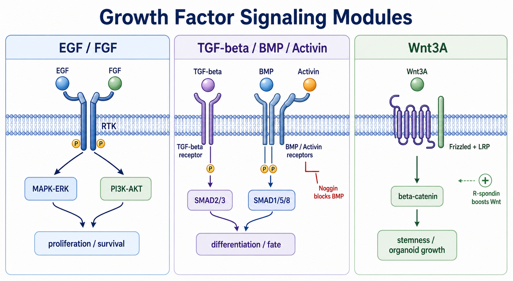

# EGF

EGF（Epidermal Growth Factor，表皮生长因子）是一类能结合 EGFR（Epidermal Growth Factor Receptor，表皮生长因子受体）的 [生长因子](生长因子.md)，常用于上皮细胞、神经干细胞、类器官和部分无血清培养体系中，促进细胞 survival（存活）、proliferation（增殖）和 epithelial maintenance（上皮状态维持）。



图源：Image2 生成的生长因子信号模块参考图；EGF 位于 RTK 信号模块，常通过 MAPK-ERK 和 PI3K-AKT 影响增殖和存活。

## 核心定位

EGF 主要通过 EGFR 这类 receptor tyrosine kinase（RTK，受体酪氨酸激酶）激活下游 [MAPK-ERK通路](<../番外/补充知识/MAPK-ERK通路.md>)、[PI3K-AKT通路](<../番外/补充知识/PI3K-AKT通路.md>) 等模块。R&D Systems 的 recombinant human EGF 产品资料将 EGF 描述为 53 amino acid protein，可刺激多种 epidermal and epithelial cells（表皮和上皮细胞）增殖。参考：[R&D Systems Recombinant Human EGF](https://www.rndsystems.com/products/recombinant-human-egf-protein_236-eg)。

在培养体系里，EGF 常不是“让所有细胞长得更快”的通用添加剂，而是维持某些上皮、神经前体或类器官体系的特定信号输入。

## 常见用途

| 场景 | EGF的角色 |
| --- | --- |
| 上皮细胞培养 | 支持上皮增殖和状态维持 |
| 神经干细胞/神经球 | 常与 [FGF2](FGF2.md) 共同促进增殖 |
| 类器官培养 | 肠道、胃、气道等上皮类器官 cocktail 中常见 |
| 无血清培养基 | 替代血清中的部分促增殖信号 |
| 迁移/修复模型 | 作为 EGFR 激活刺激 |

## EGF vs FGF2

| 项目 | EGF | FGF2 |
| --- | --- | --- |
| 主要受体 | EGFR/ErbB family | FGFR family |
| 常见培养逻辑 | 上皮、神经前体、类器官促增殖 | 干细胞维持、神经前体、成纤维/内皮相关 |
| 常见组合 | EGF + FGF2；EGF + R-spondin/Noggin | FGF2 + EGF；FGF2 + TGF-β/Activin 抑制剂等 |
| 不能互换的原因 | 受体表达和下游反馈不同 | 同左 |

## 使用 protocol

### 重构和分装

**怎么做**：按厂家说明用无菌水、PBS、酸性缓冲液或含 carrier protein 的 buffer 重构，轻柔混匀后小分装，避免反复冻融。

**为什么**：EGF 使用浓度通常很低，蛋白容易因吸附、污染或冻融导致有效浓度下降。

**注意事项**：

- carrier-free EGF 适合更严格成分控制，但低浓度时更容易吸附到管壁。
- 使用含 BSA 或其他载体蛋白的重构液时，要把载体本身写进记录。
- 每次更换 EGF 批号或品牌，最好用生长曲线或 marker 做桥接。

### 加入培养基

**怎么做**：按 protocol 设置终浓度，常见范围需要依细胞体系而定；类器官或神经前体体系中常与其他因子同时加入。

**为什么**：EGF 信号强度、持续时间和换液频率都会影响细胞状态，不只是“有没有加”。

## 常见错误与 troubleshooting

| 现象 | 可能原因 | 处理 |
| --- | --- | --- |
| 加EGF后无反应 | 细胞 EGFR 表达低、EGF失活或缺少协同因子 | 检查受体、换新分装、补齐 cocktail |
| 细胞过度增殖或分化漂移 | EGF浓度过高或暴露时间太长 | 降低浓度或优化换液节奏 |
| 批间差异 | EGF批号、载体蛋白或活性不同 | 记录 lot 并做桥接 |
| 信号实验背景高 | EGF直接激活 MAPK/AKT | 设置 no-EGF 对照和时间梯度 |

## 购买与记录建议

常见供应商包括 [PeproTech](<../番外/试剂厂商/PeproTech.md>)、[R&D Systems](<../番外/试剂厂商/R&D Systems.md>)、[Gibco](<../番外/试剂厂商/Gibco.md>)、[STEMCELL Technologies](<../番外/试剂厂商/STEMCELL Technologies.md>)、[Sino Biological](<../番外/试剂厂商/Sino Biological.md>) 等。优先记录物种来源、表达系统、carrier-free 与否、内毒素、活性单位和重构液。

推荐记录模板（中文）：

```text
EGF产品全名：
品牌：
货号：
批号：
物种来源：
表达系统：
是否carrier-free：
重构液：
储液浓度：
终浓度：
冻融次数：
使用细胞/体系：
加入时间/换液频率：
异常现象：
```

Recommended record template (English):

```text
EGF product full name:
Brand:
Catalog number:
Lot number:
Species source:
Expression system:
Carrier-free: yes/no
Reconstitution buffer:
Stock concentration:
Final concentration:
Freeze-thaw cycles:
Cell type/system:
Addition timing/media change frequency:
Abnormal observation:
```

## 小结

EGF 是上皮、神经前体和类器官体系中常见的 RTK 激活因子。它的关键不是“加了会长”，而是 EGFR 是否存在、浓度是否合适、是否与其他因子配套，以及是否影响下游信号实验解释。

## 参考来源

- [R&D Systems Recombinant Human EGF](https://www.rndsystems.com/products/recombinant-human-egf-protein_236-eg)
- [Thermo Fisher PeproTech Proteins](https://www.thermofisher.com/tr/en/home/brands/peprotech.html)

