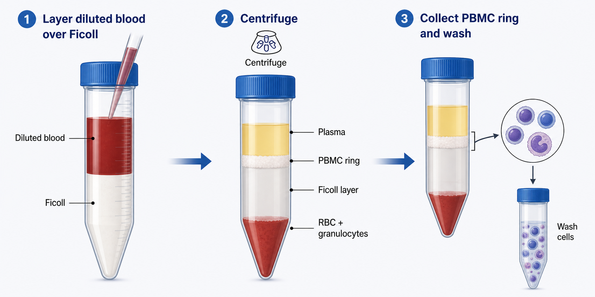

# Ficoll

Ficoll（菲可，常指 Ficoll polysucrose 或 Ficoll-based density medium）是一类亲水性高分子蔗糖聚合物相关密度介质。在细胞实验语境中，大家说“用 Ficoll 分 PBMC”时，通常不是指单纯 Ficoll 粉末，而是指 Ficoll-Paque、Ficoll-Paque PLUS 或其他 Ficoll-based density gradient medium（Ficoll 基密度梯度介质）。



图源：Image2 生成的密度梯度离心示意图。Ficoll 的核心实验角色是形成密度屏障，使 PBMC 在血浆和 Ficoll 层交界处形成可回收的 interface ring。

## 定义与命名

Ficoll 本身是 neutral, highly branched, hydrophilic polymer（中性、高度分支、亲水性聚合物）。在 PBMC 分离中常用的 Ficoll-Paque 类产品通常还包含 sodium diatrizoate（泛影酸钠）等成分，用于调节密度和渗透压，使介质适合分离 mononuclear cells（单个核细胞）。

因此，实验记录不要只写“Ficoll”。更推荐写完整产品名，例如 Ficoll-Paque PLUS、Ficoll-Paque PREMIUM、Histopaque-1077 或 Lymphoprep，并记录密度、货号和批号。Cytiva 的 Ficoll-Paque PLUS 页面将其定位为用于人外周血、骨髓和脐血样本中 lymphocytes（淋巴细胞）和 mononuclear cells（单个核细胞）分离的 ready-to-use density medium。参考：[Cytiva Ficoll-Paque PLUS](https://www.cytiva.com/en/us/shop/cell-culture-and-fermentation/cell-culture-media/density-gradient-media/ficoll-paque-plus-p-05679)。

## 核心成分与作用

| 成分/属性 | 作用 |
| --- | --- |
| Ficoll polysucrose | 提供高分子、低黏附、相对温和的密度介质基础 |
| Sodium diatrizoate | 帮助调节密度，常见于 Ficoll-Paque 类介质 |
| 约 1.077 g/mL 密度 | 让 PBMC 停留在界面，红细胞和多数粒细胞沉到底部 |
| 近似生理渗透压 | 降低对细胞的渗透压损伤 |
| 无菌液体形式 | 可直接用于血液样本分层，不需要自己配制 |

不同品牌和型号的具体组成、密度、渗透压、内毒素等级和适用样本可能不同。正式记录应以产品说明书为准。

## 常见配方与版本

| 产品/类型 | 常见用途 | 注意事项 |
| --- | --- | --- |
| Ficoll-Paque PLUS | PBMC/MNC 分离经典选择 | 常见密度 1.077 g/mL，文献和 SOP 很多 |
| Ficoll-Paque PREMIUM | 对批间一致性要求更高的场景 | 注意具体密度版本 |
| Ficoll-Paque PREMIUM 1.084 | 某些更高密度分离需求 | 不能和 1.077 g/mL 版本混用 |
| [Lymphoprep](Lymphoprep.md) | PBMC 分离常用替代介质 | 记录品牌和密度，不要笼统写 Ficoll |
| [Histopaque](Histopaque.md) | Sigma-Aldrich 密度介质产品线 | 1077、1119 等密度版本用途不同 |
| [Percoll](Percoll.md) | 可调密度梯度体系 | 灵活但配制和验证成本更高 |

## 主要用途

| 用途 | 为什么用 Ficoll |
| --- | --- |
| 分离 PBMC | 去除大部分红细胞和粒细胞，获得免疫细胞混合群 |
| 分离骨髓或脐血 MNC | 获得 mononuclear cell fraction，用于培养、分选或功能检测 |
| 分选前预处理 | 为 [磁性细胞分选](<../用(实验流程内容篇)/磁性细胞分选.md>) 或 [流式细胞术](<../用(实验流程内容篇)/流式细胞术.md>) 提供更干净输入 |
| 冻存前样本制备 | 获得相对稳定的 PBMC/MNC 输入，用于后续冻存 |
| 功能实验前制备 | 为刺激实验、细胞因子检测、T/NK 细胞实验提供输入 |

## Ficoll 与 PBS/DPBS 的关系

| 项目 | [Ficoll](Ficoll.md) | [PBS](PBS.md) / [DPBS](DPBS.md) |
| --- | --- | --- |
| 本质 | 密度梯度介质 | 缓冲盐溶液 |
| 核心作用 | 按密度分离细胞层 | 稀释、洗涤、维持渗透压和 pH |
| 在 PBMC 分离中的位置 | 位于血液下方形成密度屏障 | 用于稀释血液、洗涤 PBMC |
| 是否直接培养细胞 | 不用于培养，应洗掉 | 一般也不作为营养培养基 |
| 记录重点 | 产品名、密度、货号、批号、有效期 | 是否含钙镁、是否无菌、pH、批号 |

一句话：Ficoll 是“分层工具”，PBS/DPBS 是“稀释和洗涤工具”。两者在 PBMC 分离中经常一起出现，但作用完全不同。

## 与类似介质对比

| 介质 | 优点 | 局限 | 适合 |
| --- | --- | --- | --- |
| Ficoll-Paque | 标准化、文献多、操作熟悉 | 对分层和刹车敏感 | 常规 PBMC/MNC 分离 |
| Lymphoprep | PBMC 分离常用替代品 | 品牌/SOP 迁移时需要验证 | 常规免疫细胞分离 |
| Histopaque | 密度版本多，购买方便 | 不同密度用途差异大 | 单个核细胞或特定血细胞分离 |
| Percoll | 可自定义梯度 | 配制复杂，批次和渗透压要验证 | 需要特殊密度窗口的分离 |
| 免洗/专用分离管 | 操作更简单，界面更稳 | 成本更高，依赖耗材体系 | 样本量大、培训成本高或需要标准化时 |

## 使用注意事项

| 变量 | 为什么重要 | 建议 |
| --- | --- | --- |
| 温度 | 密度和细胞状态都可能受温度影响 | 记录室温或 4°C 条件，不要随意改变 |
| 分层手法 | 决定界面清晰度 | 缓慢加样，避免冲散 Ficoll |
| RCF 而非 rpm | 不同转子半径下 rpm 对应离心力不同 | 记录 x g、时间、转子和 brake |
| Brake 设置 | 急刹会扰动界面 | 经典分离通常降低或关闭 brake |
| Ficoll 残留 | 会影响培养、计数和功能实验 | 回收后充分洗涤 |
| 批号和有效期 | 影响追溯和重复性 | 记录货号、批号、开封时间和有效期 |

## 通用使用 protocol

这个 protocol 是理解框架，不能替代具体产品说明书。

| 步骤 | 操作 | 关键点 |
| --- | --- | --- |
| 样本稀释 | 用 PBS/DPBS 或合适缓冲液稀释抗凝血样 | 降低黏稠度，减少分层困难 |
| Ficoll 加入管底 | 按体积要求加入 Ficoll | 保持液面平稳 |
| 血样分层 | 将稀释血样缓慢铺在 Ficoll 上方 | 不要混合两层 |
| 离心 | 按说明书设置 RCF、时间、温度和 brake | 记录 x g，不只写 rpm |
| 吸取界面 | 回收白色 PBMC/MNC ring | 避免吸入下层 Ficoll 和底部沉淀 |
| 洗涤 | 用 PBS/DPBS 或培养基洗涤细胞 | 去除 Ficoll、血小板和血浆残留 |
| 计数与质控 | 记录总数、活率、红细胞/血小板残留 | 决定是否进入下游实验 |

更完整的操作逻辑见：[密度梯度离心](<../用(实验流程内容篇)/密度梯度离心.md>)。

## 购买建议

| 选择 | 适合情况 | 记录重点 |
| --- | --- | --- |
| [Cytiva](<../番外/试剂厂商/Cytiva.md>) Ficoll-Paque PLUS/PREMIUM | 常规 PBMC/MNC 分离、需要经典参考体系 | 产品名、密度、货号、批号 |
| [Sigma-Aldrich](<../番外/试剂厂商/Sigma-Aldrich.md>) Histopaque | 希望使用不同密度版本或已有 Sigma 采购体系 | 1077/1119 等密度版本 |
| [Axis-Shield](<../番外/试剂厂商/Axis-Shield.md>) Lymphoprep | 使用 Lymphoprep SOP 或当地采购方便 | 密度、批号和说明书版本 |
| [STEMCELL Technologies](<../番外/试剂厂商/STEMCELL Technologies.md>) SepMate 体系 | 希望降低分层操作难度、提高流程标准化 | 管型、介质、离心条件必须成套记录 |

如果实验室已有稳定 SOP，不建议仅因价格更低就随意替换密度介质。换品牌或换密度版本时，至少要比较 PBMC 回收率、活率、红细胞/血小板残留和下游功能读数。

## 常见错误与 troubleshooting

| 问题 | 可能原因 | 处理 |
| --- | --- | --- |
| PBMC 层不清楚 | Ficoll 与血样混合、刹车过强、样本凝块 | 优化分层，降低/关闭 brake，检查抗凝 |
| 红细胞污染多 | 吸界面太深、密度不合适、样本处理延迟 | 吸取更保守，必要时用 [红细胞裂解液](红细胞裂解液.md) |
| 活率低 | 样本放置太久、离心过强、温度不合适 | 缩短处理时间，优化 RCF 和温度 |
| 血小板残留多 | 洗涤不足或离心条件不合适 | 增加合适洗涤步骤，记录洗涤条件 |
| 后续培养状态差 | Ficoll 残留、血浆/血小板残留、处理过久 | 洗涤充分，尽快进入下游处理 |

## 推荐记录模板

中文记录模板：

```text
产品名称：
品牌：
供应商：
货号：
批号：
密度：
储存条件：
开封日期：
有效期：
样本类型：
样本体积：
稀释液：
Ficoll体积：
离心条件：
brake设置：
PBMC界面状态：
洗涤条件：
回收细胞数：
活率：
红细胞/血小板残留：
下游用途：
异常现象：
```

English record template:

```text
Product name:
Brand:
Supplier:
Catalog number:
Lot number:
Density:
Storage condition:
Open date:
Expiration date:
Sample type:
Sample volume:
Diluent:
Ficoll volume:
Centrifugation condition:
Brake setting:
PBMC interface appearance:
Wash condition:
Recovered cell number:
Viability:
RBC/platelet contamination:
Downstream use:
Abnormal observation:
```

## 小结

Ficoll 在 PBMC/MNC 分离中是密度屏障，不是洗涤液、培养基或普通缓冲液。实验失败时，问题常常不在 Ficoll “有没有用”，而在产品密度、样本状态、分层手法、离心条件、刹车设置和洗涤是否被完整记录和控制。

## 参考来源

- [Cytiva Ficoll-Paque PLUS](https://www.cytiva.com/en/us/shop/cell-culture-and-fermentation/cell-culture-media/density-gradient-media/ficoll-paque-plus-p-05679)
- [STEMCELL Technologies PBMC Isolation](https://www.stemcell.com/peripheral-blood-mononuclear-cell-isolation.html)
- [Sigma-Aldrich Histopaque-1077](https://www.sigmaaldrich.com/US/en/product/sigma/10771)
- [STEMCELL Technologies SepMate](https://www.stemcell.com/products/brands/sepmate.html)
