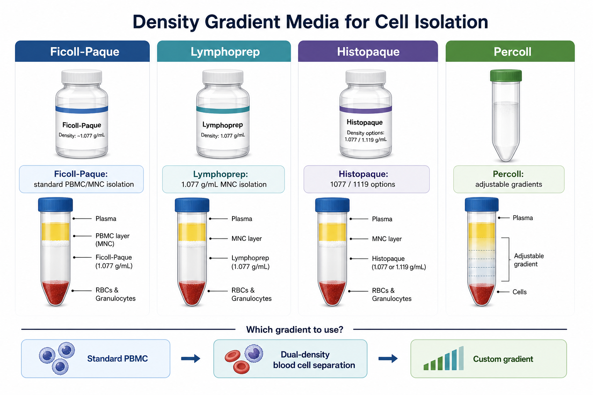

# Lymphoprep

Lymphoprep 是一种 ready-to-use density gradient medium（即用型密度梯度介质），常用于从人外周血、buffy coat（白膜层）、骨髓或脐血样本中分离 mononuclear cells（单个核细胞），尤其是 [外周血单个核细胞](<../番外/补充知识/外周血单个核细胞.md>)（Peripheral Blood Mononuclear Cells，PBMC）。它的常见密度为 1.077 g/mL，使用逻辑与 [Ficoll](Ficoll.md)/Ficoll-Paque 类产品接近。



图源：Image2 生成的密度梯度介质比较图。Lymphoprep 的核心定位是标准 PBMC/MNC 分离，与 Ficoll-Paque 属于同一类常规选择。

## 定义与命名

Lymphoprep 不是“培养基”，而是 density gradient centrifugation（[密度梯度离心](<../用(实验流程内容篇)/密度梯度离心.md>)）用的分离介质。它通常通过特定密度屏障，让 PBMC/MNC 停留在血浆和密度介质交界处，而红细胞和多数粒细胞沉到底部。

STEMCELL Technologies 的 Lymphoprep 产品资料将其描述为用于分离人单个核细胞的 sterile, ready-to-use density gradient medium（无菌即用型密度梯度介质），密度为 1.077 g/mL。参考：[STEMCELL Technologies Lymphoprep](https://www.stemcell.com/products/lymphoprep.html)。

## 核心组成与作用

| 属性 | 作用 |
| --- | --- |
| 1.077 g/mL 密度 | 适合分离 PBMC/MNC，使单个核细胞位于界面层 |
| Sodium diatrizoate（泛影酸钠）相关成分 | 调节介质密度 |
| Polysaccharide（多糖）相关成分 | 提供密度介质骨架 |
| 无菌即用液体 | 减少自配梯度带来的批间差异 |
| 等渗/近生理条件 | 降低细胞在分离过程中的渗透压损伤 |

不同地区销售版本、说明书和供应链可能有差异，正式记录应以手头瓶身标签和说明书为准。

## 主要用途

| 用途 | 为什么选择 Lymphoprep |
| --- | --- |
| PBMC 分离 | 标准 1.077 g/mL 密度，适合常规人血样本 |
| Buffy coat MNC 分离 | 可从浓缩白膜层获得单个核细胞 |
| 骨髓/脐血 MNC 分离 | 可作为 HSPC 或免疫细胞实验前处理 |
| 分选前预处理 | 为 [磁性细胞分选](<../用(实验流程内容篇)/磁性细胞分选.md>) 或 [流式细胞术](<../用(实验流程内容篇)/流式细胞术.md>) 提供输入 |
| 冻存前样本制备 | 获得较干净的 PBMC/MNC，用于后续冻存或功能实验 |

## Lymphoprep vs Ficoll-Paque

| 项目 | Lymphoprep | Ficoll-Paque |
| --- | --- | --- |
| 常见密度 | 1.077 g/mL | 常见 1.077 g/mL，也有其他版本 |
| 主要用途 | PBMC/MNC 分离 | PBMC/MNC 分离 |
| 操作逻辑 | 分层、离心、吸取界面、洗涤 | 分层、离心、吸取界面、洗涤 |
| 是否可直接互换 | 不建议未经验证直接替换 | 不建议未经验证直接替换 |
| 记录重点 | 产品名、密度、货号、批号、说明书版本 | 产品名、密度、货号、批号、说明书版本 |

两者很像，但“很像”不等于“实验上完全等价”。如果换品牌或换产品线，应至少比较 PBMC 回收率、活率、红细胞/血小板残留、亚群比例和下游功能读数。

## 与 Histopaque 和 Percoll 的区别

| 介质 | 主要特点 | 适合场景 |
| --- | --- | --- |
| Lymphoprep | 标准 1.077 g/mL 即用型 MNC 分离介质 | 常规 PBMC/MNC 分离 |
| [Histopaque](Histopaque.md) | 有 1077、1119 等不同密度版本 | 需要 Sigma 产品体系或双密度分离 |
| [Percoll](Percoll.md) | 可自定义连续/不连续密度梯度 | 特殊细胞、亚细胞组分或更灵活梯度 |
| [Ficoll](Ficoll.md) | 经典 Ficoll-Paque 类体系，文献和 SOP 多 | 常规 PBMC/MNC 分离 |

## 使用要点

| 变量 | 为什么重要 | 建议 |
| --- | --- | --- |
| 样本稀释 | 血样太黏会影响分层 | 用 PBS/DPBS 或说明书推荐缓冲液稀释 |
| 分层手法 | 决定 PBMC 界面清晰度 | 缓慢沿管壁加入，不要冲散 Lymphoprep |
| 离心条件 | 影响回收率和纯度 | 记录 RCF、时间、温度和 brake |
| Brake 设置 | 急刹会扰动界面 | 按说明书设置，经典流程常降低或关闭 brake |
| 洗涤 | 去除残留介质和血小板 | 记录洗涤次数、RCF 和缓冲液 |

## 购买建议

如果实验室已有 Lymphoprep SOP，就优先沿用同一品牌、同一规格和同一说明书版本。若从 Ficoll-Paque 切换到 Lymphoprep，或者从 Lymphoprep 切换到其他 1.077 g/mL 介质，不建议只做一次“能分出来”就认为等价，最好用同一批样本并行比较回收率、活率和下游功能。

常见供应信息可记录为 [STEMCELL Technologies](<../番外/试剂厂商/STEMCELL Technologies.md>) 或 [Axis-Shield](<../番外/试剂厂商/Axis-Shield.md>) 相关 Lymphoprep 产品线，具体以实际采购标签为准。

## 常见错误与 troubleshooting

| 问题 | 可能原因 | 处理 |
| --- | --- | --- |
| PBMC ring 不清楚 | 分层扰动、刹车太强、样本凝块 | 优化分层，检查抗凝，降低/关闭 brake |
| 红细胞污染多 | 吸取界面太深或样本处理不佳 | 吸取更保守，必要时使用 [红细胞裂解液](红细胞裂解液.md) |
| 活率低 | 样本放置太久、离心过强、温度不合适 | 缩短处理时间，复核 RCF 和温度 |
| 血小板残留多 | 洗涤不足 | 增加合适洗涤步骤并记录条件 |
| 和 Ficoll 结果不同 | 产品差异、说明书条件不同、操作未重新优化 | 并行验证，不要机械套用旧 SOP |

## 推荐记录模板

中文记录模板：

```text
产品名称：
品牌/供应商：
货号：
批号：
密度：
储存条件：
开封日期：
有效期：
样本类型：
样本体积：
稀释液：
Lymphoprep体积：
离心条件：
brake设置：
PBMC/MNC界面状态：
洗涤条件：
回收细胞数：
活率：
红细胞/血小板残留：
下游用途：
异常现象：
```

English record template:

```text
Product name:
Brand/supplier:
Catalog number:
Lot number:
Density:
Storage condition:
Open date:
Expiration date:
Sample type:
Sample volume:
Diluent:
Lymphoprep volume:
Centrifugation condition:
Brake setting:
PBMC/MNC interface appearance:
Wash condition:
Recovered cell number:
Viability:
RBC/platelet contamination:
Downstream use:
Abnormal observation:
```

## 小结

Lymphoprep 是常规 PBMC/MNC 分离中与 Ficoll-Paque 类似的 1.077 g/mL 即用型密度梯度介质。实验记录中不要只写“密度梯度”或“Ficoll 类”，而要写清产品名、密度、货号、批号、离心条件和 brake 设置。

## 参考来源

- [STEMCELL Technologies Lymphoprep](https://www.stemcell.com/products/lymphoprep.html)
- [STEMCELL Technologies PBMC Isolation](https://www.stemcell.com/peripheral-blood-mononuclear-cell-isolation.html)
- [Axis-Shield Lymphoprep product information](https://www.axis-shield-density-gradient-media.com/products/lymphoprep)
