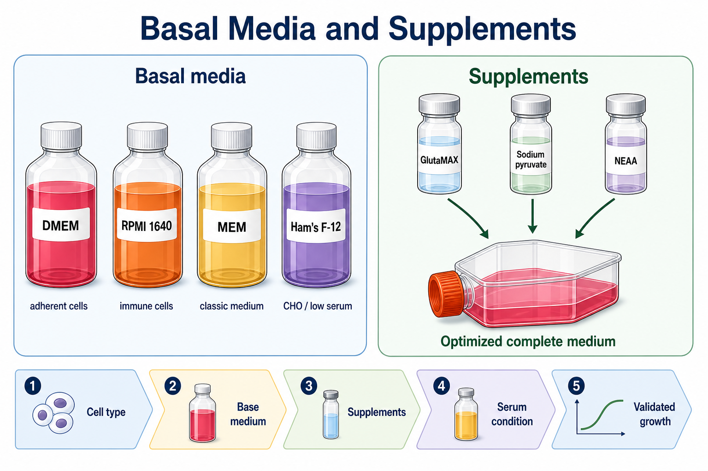

# MEM

MEM（Minimum Essential Medium，最低必需培养基；也常称 Eagle's Minimum Essential Medium，Eagle 最低必需培养基）是 Harry Eagle 在基础培养基发展中建立的经典哺乳动物细胞培养体系之一，是 [DMEM](DMEM.md)、α-MEM 等许多后续培养基的历史基础。



图源：Image2 生成的基础培养基与补充剂参考图；MEM 代表较经典、较简洁的基础培养基选择。

## 核心定位

Gibco MEM 产品页面说明，MEM 是最常用的细胞培养基之一，可用于多种悬浮和贴壁哺乳动物细胞，包括 HeLa、BHK-21、293、HEP-2、HT-1080、MCF-7、fibroblasts 和 primary rat astrocytes；该页面也说明 MEM 源于 Harry Eagle 早期的 Basal Medium Eagle（BME），之后发展出 Glasgow's MEM、α-MEM、DMEM 和 Temin's Modification 等多种变体。参考：[Gibco MEM](https://www.thermofisher.com/order/catalog/product/11095080)。

MEM 的重点是“经典基础配方”，而不是专门为某一类现代细胞优化。实际使用时通常需要 [FBS](FBS.md)、[L-谷氨酰胺](L-谷氨酰胺.md)、[NEAA](NEAA.md) 或其他补充剂。

## 常见版本与相关体系

| 名称 | 英文 | 说明 |
| --- | --- | --- |
| MEM | Minimum Essential Medium | 经典 Eagle 系基础培养基 |
| [DMEM](DMEM.md) | Dulbecco's Modified Eagle Medium | DMEM 是 MEM 逻辑上的高营养改良版本之一 |
| [α-MEM](α-MEM.md) | Alpha Minimum Essential Medium | 常用于某些原代细胞、干细胞或骨相关细胞 |
| MEM + Earle's salts | MEM with Earle's balanced salts | 常用于 CO2 培养箱 |
| MEM + Hanks' salts | MEM with Hanks' balanced salts | 更适合非 CO2 或短时开放环境 |

Gibco 页面指出，MEM 可带 Earle's salts 供 CO2 incubator 使用，也可带 Hanks' salts 供无 CO2 条件使用；该产品使用 Earle's salts，并依赖 sodium bicarbonate buffer system。参考：[Gibco MEM](https://www.thermofisher.com/order/catalog/product/11095080)。

## Earle's salts vs Hanks' salts

| 盐体系 | 常见对应 | 使用逻辑 |
| --- | --- | --- |
| Earle's balanced salts | [EBSS](EBSS.md) 相关 | 适合 CO2 培养箱，碳酸氢盐缓冲更明显 |
| Hanks' balanced salts | [HBSS](HBSS.md) 相关 | 适合短时间洗涤、运输或非 CO2 条件 |

这不是简单的“盐多盐少”，而是和 CO2、pH 缓冲、使用时间和开放环境相关。

## MEM vs DMEM/RPMI 1640/Ham F-12

| 培养基 | 典型理解 | 何时考虑 |
| --- | --- | --- |
| MEM | 经典、基础、较简洁 | 细胞说明书指定或历史 SOP |
| DMEM | 更高营养版本，常见高糖/低糖 | 常规贴壁细胞或高代谢需求 |
| [RPMI 1640](<RPMI 1640.md>) | 免疫/血液/悬浮细胞常见 | 免疫细胞、PBMC、Jurkat 等 |
| [Ham F-12](<Ham F-12.md>) | 成分更复杂，常见 CHO/低血清体系 | CHO、上皮、低血清/无血清优化 |

## 使用 protocol

### 配制完全MEM

常见起点：

```text
MEM：500 mL
FBS：10% v/v
L-glutamine：按培养基版本决定是否补加
NEAA：按细胞需求或历史 SOP 加入
Penicillin-Streptomycin：1% v/v（可选）
```

MEM 本身不含 protein、lipid 或 growth factors，通常需要血清或定义明确的补充剂。Gibco MEM 页面也说明 MEM 通常需要补充 10% FBS。参考：[Gibco MEM](https://www.thermofisher.com/order/catalog/product/11095080)。

## 常见错误与 troubleshooting

| 现象 | 可能原因 | 处理 |
| --- | --- | --- |
| 细胞长得慢 | MEM 营养/补充剂不符合细胞需求 | 核对细胞说明书和 FBS/NEAA/L-glutamine |
| pH 不稳 | Earle's/Hanks' 盐体系和 CO2 条件不匹配 | 选择正确版本并检查 CO2 |
| 和 DMEM 结果不同 | 糖、氨基酸、维生素、盐体系不同 | 不要把 MEM/DMEM 当作只差名字 |
| 批次间状态漂移 | 血清或补充剂变化 | 记录并固定配方 |

## 购买与记录建议

常见供应商包括 [Gibco](<../番外/试剂厂商/Gibco.md>)、[HyClone](<../番外/试剂厂商/HyClone.md>)、[Corning](<../番外/试剂厂商/Corning.md>)、[Sigma-Aldrich](<../番外/试剂厂商/Sigma-Aldrich.md>)/[Merck](<../番外/试剂厂商/Merck.md>)。记录时写清 Earle's salts/Hanks' salts、是否含 L-glutamine、phenol red、HEPES 和 sodium pyruvate。

推荐记录模板（中文）：

```text
MEM品牌：
货号：
批号：
盐体系：Earle's / Hanks'
是否含L-glutamine：
是否含酚红：
是否含HEPES：
是否含丙酮酸钠：
是否补加NEAA：
FBS品牌/批号/比例：
使用细胞：
CO2条件：
异常现象：
```

Recommended record template (English):

```text
MEM brand:
Catalog number:
Lot number:
Salt system: Earle's / Hanks'
Contains L-glutamine:
Contains phenol red:
Contains HEPES:
Contains sodium pyruvate:
NEAA supplemented: yes/no
FBS brand/lot/percentage:
Cell type:
CO2 condition:
Abnormal observation:
```

## 小结

MEM 是很多培养基体系的“经典骨架”。它本身相对简洁，真正决定培养效果的是盐体系、CO2 条件、血清和补充剂，而不是只看瓶身上写着 MEM。

## 参考来源

- [Gibco MEM](https://www.thermofisher.com/order/catalog/product/11095080)
- [ATCC Animal Cell Culture Guide](https://www.atcc.org/resources/culture-guides/animal-cell-culture-guide)

