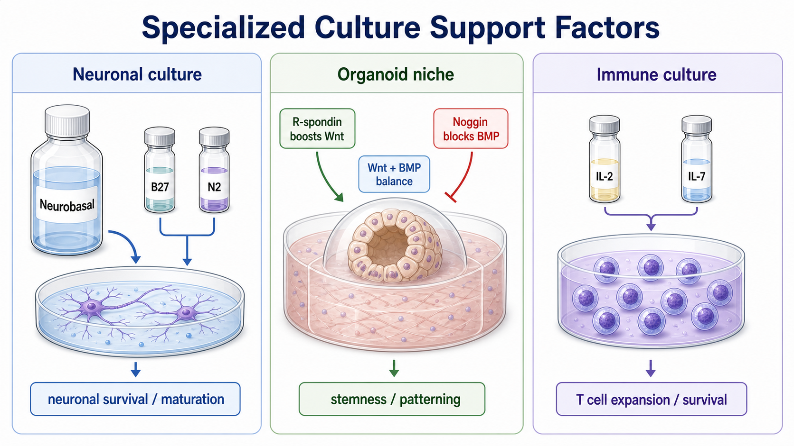

# Neurobasal培养基

Neurobasal培养基（Neurobasal Medium，Neurobasal 神经细胞培养基）是 Gibco/Thermo Fisher 体系中用于 neuronal cell culture（神经细胞培养）的 serum-free basal medium（无血清基础培养基），常与 [B27补充剂](B27补充剂.md)、[N2补充剂](N2补充剂.md) 和 L-glutamine/GlutaMAX 共同使用。



图源：Image2 生成的专用培养支持因子参考图；Neurobasal 位于神经培养模块，常与 B27/N2 配套支持 neuronal survival/maturation。

## 核心定位

Gibco Neurobasal Medium 产品页面说明，Neurobasal medium 设计用于与 Gibco B-27 supplement 联用，在不需要 astrocyte feeder layer（星形胶质细胞饲养层）的情况下长期维持和成熟纯化的 prenatal and embryonic neuronal cell populations（出生前和胚胎神经元细胞群）；该页面也将其分类为 serum-free，并建议 2-8°C 避光保存。参考：[Gibco Neurobasal Medium](https://www.thermofisher.com/order/catalog/product/21103049)。

Neurobasal 不是普通 [DMEM](DMEM.md) 的神经版，也不是完整培养基。它通常需要 B27、N2、L-glutamine 或 GlutaMAX，以及根据细胞阶段加入 EGF、FGF2、[BDNF](BDNF.md)、[GDNF](GDNF.md) 等因子。

## 常见版本和搭配

| 体系 | 常见用途 | 注意 |
| --- | --- | --- |
| Neurobasal + B27 | 原代神经元长期培养和成熟 | 经典组合 |
| Neurobasal-A + B27 | postnatal/adult neurons（出生后/成年神经元） | 需按细胞来源选择 |
| Neurobasal + B27 + N2 | 神经分化、神经前体成熟 | 一些 protocol 常见 |
| Neurobasal + B27 + EGF/FGF2 | 神经干/前体细胞扩增或过渡阶段 | 不同阶段逻辑不同 |
| Neurobasal phenol red-free | 成像、荧光或敏感实验 | 需确认产品版本 |

## Neurobasal vs DMEM-F12

| 项目 | Neurobasal | [DMEM-F12](DMEM-F12.md) |
| --- | --- | --- |
| 定位 | 神经元/神经培养专用基础液 | 专用无血清/低血清体系常用底座 |
| 常见补充剂 | B27、N2、GlutaMAX、神经营养因子 | ITS、B27/N2、生长因子、类器官 cocktail |
| 适合对象 | 神经元、神经分化、神经前体成熟 | 神经、上皮、干细胞、类器官等更广 |
| 不能互换原因 | 离子、氨基酸和神经细胞适配不同 | 同左 |

## 使用 protocol

### 配制神经培养完全培养基

常见起点：

```text
Neurobasal Medium：基础液
B27 Supplement：1X
GlutaMAX 或 L-glutamine：按说明书
N2 Supplement：按 protocol 可选
神经营养因子或生长因子：按细胞阶段
```

**注意事项**：

- 不要冻结 Neurobasal 成品培养基。Thermo Fisher FAQ 提醒，培养基冻结后可能形成沉淀，盐和氨基酸受温度波动影响后不易重新溶解。
- 按说明 2-8°C、避光保存。
- 不同神经细胞来源需要不同 Neurobasal/Neurobasal-A 和补充剂组合。
- 神经元培养中，接种密度、包被和机械损伤往往和培养基同样重要。

### 换液和维护

**怎么做**：神经元通常不耐受剧烈全量换液，常采用半量换液或按 protocol 保留部分 conditioned medium（条件化培养基）。

**为什么**：成熟神经元对环境变化、渗透压、温度和机械扰动敏感。过强换液会造成突触和突起损伤或细胞死亡。

## 常见错误与 troubleshooting

| 现象 | 可能原因 | 处理 |
| --- | --- | --- |
| 神经元大量死亡 | 接种密度低、包被差、B27/N2错误或机械损伤 | 优化包被、密度和换液方式 |
| 分化成熟差 | 缺少 B27、神经营养因子或时间不足 | 补齐补充剂并延长成熟期 |
| 培养基有沉淀 | 冻结或温度波动 | 不建议继续用于关键实验 |
| 背景荧光高 | 酚红或补充剂背景 | 使用无酚红版本并优化成像液 |

## 购买与记录建议

常见供应商主要是 [Gibco](<../番外/试剂厂商/Gibco.md>)，也可根据 protocol 使用其他神经培养基础培养基。购买和记录时要写清 Neurobasal、Neurobasal-A、是否含 phenol red、是否含 glutamine、搭配哪种 B27/N2 版本。

推荐记录模板（中文）：

```text
Neurobasal产品全名：
品牌：
货号：
批号：
版本：Neurobasal / Neurobasal-A / 其他
是否含酚红：
是否含glutamine：
B27版本/批号：
N2版本/批号：
其他生长因子：
包被条件：
使用细胞/分化阶段：
换液方式：
异常现象：
```

Recommended record template (English):

```text
Neurobasal product full name:
Brand:
Catalog number:
Lot number:
Version: Neurobasal / Neurobasal-A / other
Contains phenol red:
Contains glutamine:
B27 version/lot:
N2 version/lot:
Other growth factors:
Coating condition:
Cell type/differentiation stage:
Media change strategy:
Abnormal observation:
```

## 小结

Neurobasal 是神经培养体系的基础液，不是完整培养基。它最常和 B27/N2、glutamine 来源、神经营养因子、包被和温和换液策略一起工作；真正影响神经元状态的是整个神经培养生态。

## 参考来源

- [Gibco Neurobasal Medium](https://www.thermofisher.com/order/catalog/product/21103049)
- [Thermo Fisher Primary Neural and Neuronal Culture Supplements](https://www.thermofisher.com/ca/en/home/life-science/cell-culture/primary-cell-culture/neuronal-cell-culture/neuronal-cell-culture-supplement.html)
