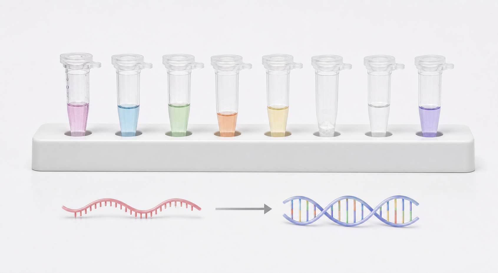

# Oligo(dT)引物

Oligo(dT) primer（Oligo(dT) 引物，寡聚脱氧胸苷引物）是一类由连续 dT（deoxythymidine，脱氧胸苷）组成的逆转录引物，能够与真核 mRNA 3' 端的 poly(A) tail（多聚腺苷酸尾）结合，用于启动 [逆转录](<../用(实验流程内容篇)/逆转录.md>) 并合成 [cDNA](<../番外/补充知识/cDNA.md>)。



图源：Image2 生成的逆转录核心材料参考图；彩色小管代表不同逆转录组分，其中包含 Oligo(dT) 引物和随机引物。

## 工作原理

大多数真核 mature mRNA（成熟 mRNA）3' 端带 poly(A) tail。Oligo(dT) 通过 A-T 碱基配对结合 poly(A) tail，让 [逆转录酶](逆转录酶.md) 从 mRNA 3' 端附近开始合成 cDNA。

Thermo Fisher 和 NEB 的逆转录资料都把 Oligo(dT) 与 random primers（随机引物）列为常见 cDNA 合成引物策略；Oligo(dT) 更偏向 polyadenylated RNA（带 poly(A) 尾的 RNA）。[参考：Thermo Fisher cDNA Synthesis Basics](https://www.thermofisher.com/us/en/home/references/ambion-tech-support/rtpcr-analysis/general-articles/cdna-synthesis.html)；[参考：NEB cDNA Synthesis](https://www.neb.com/en-us/applications/cdna-synthesis)

## 常见版本

| 类型 | 特点 | 适合场景 |
| --- | --- | --- |
| Oligo(dT)12-18 | 常见长度，通用 | 普通 mRNA 逆转录 |
| Oligo(dT)20 | 较长，结合更稳定 | 需要更稳定 poly(A) 结合时 |
| Anchored Oligo(dT) | 末端带锚定碱基，减少内部 A-rich 区域误结合 | 更希望从 poly(A) 起点附近启动时 |
| Mixed with random primers | 与随机引物混合 | 兼顾 mRNA 3' 端和转录本覆盖 |

## 优点和限制

| 优点 | 限制 |
| --- | --- |
| 富集 mRNA 信号 | 不适合没有 poly(A) tail 的 RNA |
| 减少 rRNA 逆转录 | 对总 RNA 背景更有选择性 |
| 适合常规基因表达 RT-qPCR | 对长转录本 5' 端覆盖可能不足 |
| 反应体系简单 | RNA 降解时偏倚更明显 |

如果 RNA 已经部分降解，Oligo(dT) 只从 3' 端启动，可能让靠近 5' 端的目标区域代表性变差。

## Oligo(dT) vs 随机六聚体

| 策略 | 覆盖对象 | 优势 | 风险 |
| --- | --- | --- | --- |
| Oligo(dT) | poly(A)+ mRNA | mRNA 选择性好，rRNA 背景低 | 3' 偏倚，降解 RNA 不友好 |
| [随机六聚体引物](随机六聚体引物.md) | 多种 RNA 区域 | 覆盖更均匀，适合降解 RNA | 会逆转录 rRNA、非目标 RNA |
| 混合引物 | mRNA 选择性和覆盖折中 | RT-qPCR 常用 | 体系更复杂，需要固定配方 |

## 使用 protocol

### 选择策略

**怎么做**：如果目标是常规 mRNA 表达分析且 RNA 完整性较好，可以使用 Oligo(dT) 或 Oligo(dT)+random primer 混合策略。如果目标是 non-poly(A) RNA、rRNA、部分 lncRNA 或降解 RNA，优先考虑随机引物或专用策略。

**为什么**：引物策略决定 cDNA 代表了哪些 RNA。

**注意事项**：

- 不要把 Oligo(dT) 用于没有 poly(A) tail 的目标。
- 同一项目中不要随意更换 Oligo(dT) 和随机引物策略。
- RT-qPCR 结果比较必须使用相同逆转录策略。

### 复溶和保存

**怎么做**：收到干粉后短暂离心，用 [无核酸酶水](无核酸酶水.md) 或 TE buffer 复溶为 stock，再分装工作液。

**为什么**：低浓度寡核苷酸反复冻融和吸附会造成实际浓度变化。

**注意事项**：

- 使用 RNase/DNase-free 管和滤芯吸头。
- 记录序列长度、浓度和批号。

## 常见错误与 troubleshooting

| 问题 | 可能原因 | 处理 |
| --- | --- | --- |
| 5' 端目标 Cq 偏高 | Oligo(dT) 3' 偏倚或 RNA 降解 | 换随机引物或设计靠近 3' 的 qPCR 引物 |
| non-poly(A) RNA 检测失败 | Oligo(dT) 不适合目标 RNA | 使用随机引物或特异引物 |
| 样本间差异大 | RNA 完整性不同导致偏倚 | 评估 RNA 完整性，统一引物策略 |

## 购买与记录建议

常见供应商包括 [Invitrogen](<../番外/试剂厂商/Invitrogen.md>)、[IDT](<../番外/试剂厂商/IDT.md>)、[NEB](<../番外/试剂厂商/NEB.md>)、[Takara](<../番外/试剂厂商/Takara.md>) 等。购买或记录时写清 Oligo(dT) 长度、是否 anchored、纯化等级、stock 浓度和工作浓度。

推荐记录：

```text
Oligo(dT) type:
Length:
Anchored: yes/no
Supplier:
Catalog/order ID:
Lot number:
Stock concentration:
Working concentration:
RT reaction amount:
Storage/open date:
```

## 小结

Oligo(dT) 是 mRNA 逆转录最经典的引物策略，适合 poly(A)+ mRNA 表达分析。它的主要问题是 3' 偏倚和对 RNA 完整性的依赖，因此不能无脑替代随机引物。

## 参考来源

- [Thermo Fisher cDNA Synthesis Basics](https://www.thermofisher.com/us/en/home/references/ambion-tech-support/rtpcr-analysis/general-articles/cdna-synthesis.html)
- [NEB cDNA Synthesis](https://www.neb.com/en-us/applications/cdna-synthesis)
