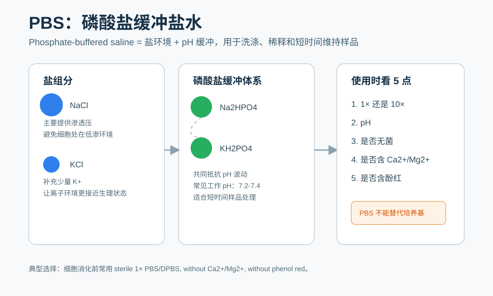

# PBS

## 一句话定义

PBS（Phosphate-buffered saline，磷酸盐缓冲盐水；也常译为磷酸盐缓冲生理盐水）是一种接近生理渗透压、以磷酸盐维持 pH 的基础盐溶液。它不是[培养基](培养基.md)（culture medium），也不是[营养液](营养液.md)（nutrient solution），因为它基本不提供细胞长期生长所需的氨基酸、维生素、葡萄糖、血清或生长因子；它更像一种温和的“洗涤、稀释、短时间维持环境”的基础试剂。Corning 对 PBS 的产品说明也强调 PBS 由氯化钠、磷酸盐等组成，用于维持 pH，且通常对细胞相对温和。[参考：Corning PBS 产品说明](https://ecatalog.corning.com/life-sciences/b2c/US/en/Media%2C-Sera%2C-and-Reagents/Buffered-Salt-Solutions/Phosphate-Buffered-Saline/Corning%C2%AE-PBS-%28-Phosphate-Buffered-Saline%29/p/21-040-CV)

## 名称与常见写法

- PBS：Phosphate-buffered saline，磷酸盐缓冲盐水。
- DPBS：Dulbecco's phosphate-buffered saline，Dulbecco 磷酸盐缓冲盐水。DPBS 属于 PBS 家族的一个常见细胞培养配方分支，常见版本包括含或不含 Ca2+/Mg2+、含或不含 [Phenol red（酚红）](酚红.md)。[参考：Thermo Fisher DPBS 配方页](https://www.thermofisher.com/ca/en/home/technical-resources/media-formulation.147.html)
- 1× PBS：可直接使用的工作浓度 PBS。
- 10× PBS：浓缩储液，使用前通常以 1:10 稀释成 1×。

实际记录实验时，不建议只写“PBS”。更推荐写成：`1× PBS, pH 7.4, without Ca2+/Mg2+, without phenol red, sterile`。这比单纯写 PBS 更能减少复现实验时的歧义。

## 核心成分与作用

经典 1× PBS 通常包含 NaCl、KCl、Na2HPO4、KH2PO4。Cold Spring Harbor Protocols（CSH Protocols，冷泉港实验方案库）给出的 1 L 1× PBS 配方为 NaCl 8 g、KCl 0.2 g、Na2HPO4 1.44 g、KH2PO4 0.24 g，pH 通常调到 7.4，也可按实验需要调到 7.2；该方案也说明可以按需求加入 CaCl2 和 MgCl2。[参考：CSH Protocols PBS 配方](https://cshprotocols.cshlp.org/content/2006/1/pdb.rec8247)

| 成分 | 常见终浓度 | 主要作用 | 理解方式 |
| --- | --- | --- | --- |
| NaCl（Sodium chloride，氯化钠） | 约 137 mM | 提供主要渗透压和 Na+、Cl- 离子环境 | 避免细胞直接处在纯水中胀裂 |
| KCl（Potassium chloride，氯化钾） | 约 2.7 mM | 提供少量 K+，让离子环境更接近生理状态 | 模拟细胞外液中的低浓度钾离子 |
| Na2HPO4（Disodium hydrogen phosphate，磷酸氢二钠） | 约 10 mM | 与 KH2PO4 共同构成磷酸盐缓冲体系 | 偏碱性组分 |
| KH2PO4（Potassium dihydrogen phosphate，磷酸二氢钾） | 约 1.8 mM | 与 Na2HPO4 共同抵抗 pH 波动 | 偏酸性组分 |

真正要记住的是：PBS 的“盐”负责温和的渗透压环境，“磷酸盐”负责 pH 缓冲。PBS 的强项是短时间洗涤和维持样品状态，不是支持细胞长期生长。

## 常见配方版本

### 无 Ca2+/Mg2+、无酚红 PBS

实验室最常用的是无 Ca2+/Mg2+、无酚红的 1× PBS 或 DPBS。它适合[细胞培养](<../用(实验流程内容篇)/细胞培养.md>)中的洗细胞、[细胞消化](<../用(实验流程内容篇)/细胞消化.md>)前冲洗、[细胞计数](<../用(实验流程内容篇)/细胞计数.md>)稀释、[流式细胞术](<../用(实验流程内容篇)/流式细胞术.md>)前处理、免疫实验洗涤等。Gibco 的无 Ca2+/Mg2+ DPBS 说明中也列出细胞解离前冲洗、组织或细胞运输、细胞计数稀释、试剂配制等用途。[参考：Gibco DPBS without calcium and magnesium](https://www.fishersci.com/shop/products/gibco-dpbs-without-calcium-magnesium-7/14190144)

无酚红 PBS 更适合显微观察、吸光度检测、荧光检测、流式实验和免疫染色，因为 [Phenol red（酚红）](酚红.md)本身有颜色，也可能给光学读数带来背景。Gibco PBS pH 7.4 产品说明也把无酚红作为减少光学测量干扰和潜在细胞生理影响的特点之一。[参考：Gibco PBS pH 7.4](https://www.thermofisher.cn/order/catalog/product/cn/en/10010023)

### 含 Ca2+/Mg2+ PBS 或 DPBS

含 Ca2+/Mg2+ 的 PBS/DPBS 更适合需要维持某些细胞黏附、细胞连接、组织状态或二价阳离子依赖反应的场景。Corning 的含钙镁 DPBS 产品说明将其定位为可短时间维持细胞张力和活性的冲洗、运输、稀释液。[参考：Corning DPBS with calcium and magnesium](https://ecatalog.corning.com/life-sciences/b2b/US/en/Media%2C-Sera%2C-and-Reagents/Buffered-Salt-Solutions/Dulbecco%27s-Phosphate-Buffered-Saline-%28DPBS%29/Corning%C2%AE-DPBS-%28Dulbecco%E2%80%99s-Phosphate-Buffered-Saline%29/p/21-030-CM)

但是在贴壁细胞消化前，通常不推荐使用含 Ca2+/Mg2+ 的 PBS。原因是 Ca2+ 和 Mg2+ 会支持部分细胞黏附和细胞间连接，可能让细胞更难从培养皿表面脱落，也可能削弱 [Trypsin-EDTA](Trypsin-EDTA.md)（Trypsin-ethylenediaminetetraacetic acid，胰蛋白酶-乙二胺四乙酸）体系中 [EDTA](EDTA.md)（Ethylenediaminetetraacetic acid，乙二胺四乙酸）螯合二价阳离子的作用。

### 无菌、低内毒素、无核酸酶版本

做常规细胞洗涤时，通常选择无菌 1× PBS 即可。做 RNA、原代细胞、类器官、转录组、核酸酶敏感实验时，应考虑 RNase-free（无核糖核酸酶）、DNase-free（无脱氧核糖核酸酶）或低内毒素等级的 PBS。Invitrogen 有 RNase-free 10× PBS，碧云天也有无 DNase/RNase/Protease 的 PBS 以及细胞培养级低内毒素 PBS。[参考：Invitrogen 10× PBS, RNase-free](https://www.thermofisher.com/order/catalog/product/cn/zh/AM9624)

## 主要用途

- 细胞洗涤：例如换液、固定、染色、裂解前洗去残留[培养基](培养基.md)、[FBS](FBS.md)（Fetal bovine serum，胎牛血清）或药物。
- 细胞消化前冲洗：洗去血清，因为血清会抑制 Trypsin-EDTA 的消化效率。
- 样品短时间维持或运输：短时间让细胞、组织或样品处在接近等渗的环境中。
- 稀释细胞悬液或试剂：用于[细胞计数](<../用(实验流程内容篇)/细胞计数.md>)、抗体稀释、部分染色液或清洗液配制。
- 免疫实验洗涤：用于[免疫染色](<../用(实验流程内容篇)/免疫染色.md>)、[ELISA](<../用(实验流程内容篇)/ELISA.md>)（Enzyme-linked immunosorbent assay，酶联免疫吸附实验）、部分 [Western blot](<../用(实验流程内容篇)/Western blot.md>)（蛋白质免疫印迹实验）流程中的洗涤。
- 细胞沉淀重悬：用于一些后续会立即处理的细胞样品。

Sigma 的 PBS tablet 产品说明也列出细胞洗涤、组织运输、细胞和试剂稀释、免疫分析、ELISA 抗体稀释、细胞沉淀重悬等用途。[参考：Sigma PBS tablets](https://www.sigmaaldrich.com/US/en/product/sigma/p4417)

## PBS 与相似溶液的区别

| 溶液 | 英文全称 | 中文名称 | 主要区别 | 典型场景 |
| --- | --- | --- | --- | --- |
| PBS | Phosphate-buffered saline | 磷酸盐缓冲盐水 | 基础盐溶液，磷酸盐缓冲 | 洗涤、稀释、短时间维持 |
| [DPBS](DPBS.md) | Dulbecco's phosphate-buffered saline | Dulbecco 磷酸盐缓冲盐水 | PBS 家族的 Dulbecco 配方分支，版本很多 | 细胞培养相关洗涤和短时处理 |
| [HBSS](HBSS.md) | Hank's balanced salt solution | Hank 平衡盐溶液 | 常可含葡萄糖、Ca2+/Mg2+、酚红等，更偏向短期维持细胞 | 短时间细胞处理、运输、冲洗 |
| [EBSS](EBSS.md) | Earle's balanced salt solution | Earle 平衡盐溶液 | 常与 CO2/碳酸氢盐缓冲条件有关 | CO2 条件下短期细胞维持 |
| [TBS](TBS.md) | Tris-buffered saline | Tris 缓冲盐水 | 缓冲体系是 Tris，不是磷酸盐 | Western blot、免疫检测，尤其 AP 系统 |
| [生理盐水](生理盐水.md) | Normal saline | 0.9% 氯化钠溶液 | 主要只有 NaCl，缺少有效 pH 缓冲 | 临床冲洗、简单等渗环境 |

Thermo Fisher 对 balanced salt solutions（平衡盐溶液）的说明中提到，HBSS 和 EBSS 都可以维持渗透压和 pH，但 EBSS 设计用于 5% CO2 条件，HBSS 因碳酸氢盐较少可不依赖 CO2 使用。[参考：Thermo Fisher Balanced Salt Solutions](https://www.thermofisher.com/ru/en/home/life-science/cell-culture/mammalian-cell-culture/reagents/balanced-salt-solutions.html)

TBS 与 PBS 的选择在免疫检测里很重要。如果使用 alkaline phosphatase（AP，碱性磷酸酶）检测体系，或检测 phosphorylation（磷酸化）相关目标，通常更倾向使用 TBS，而不是 PBS。Thermo Fisher 的 Western blot troubleshooting 说明中明确提示 AP 系统中 PBS 会干扰 AP 活性，磷酸化蛋白检测也应避免 phosphate-based buffer（磷酸盐缓冲液）。[参考：Thermo Fisher Western blot troubleshooting](https://www.thermofisher.com/us/en/home/life-science/protein-biology/protein-biology-learning-center/protein-gel-electrophoresis-information/western-blot-troubleshooting.html)

## 选择 PBS 时看什么

PBS 的选择不应该只看名字，而应该看 5 个参数：

1. 浓度：1× 还是 10×。
2. pH：常见为 pH 7.2 或 pH 7.4，细胞培养中最常见的是 pH 7.2-7.4。
3. 是否无菌：细胞培养必须使用无菌 PBS。
4. 是否含 Ca2+/Mg2+：细胞消化前通常用无 Ca2+/Mg2+；需要维持黏附或二价阳离子依赖状态时才考虑含 Ca2+/Mg2+。
5. 是否含 Phenol red（酚红）：显微、吸光、荧光、流式、免疫染色一般优先选无酚红。

## 现配 1× PBS protocol

### 适用场景

适合常规洗涤、普通免疫实验、非高敏感细胞实验。若用于细胞培养，应保证水、容器和后续灭菌流程可靠。

### 配方

| 试剂 | 1 L 1× PBS 用量 |
| --- | --- |
| NaCl | 8.0 g |
| KCl | 0.2 g |
| Na2HPO4 | 1.44 g |
| KH2PO4 | 0.24 g |

### 步骤

1. 准备约 800 mL ddH2O（double-distilled water，双蒸水）或 Milli-Q water（超纯水）。
2. 依次加入 NaCl、KCl、Na2HPO4、KH2PO4，搅拌至完全溶解。
3. 测 pH，通常调至 pH 7.4；若实验体系要求 pH 7.2，则按需求调整。
4. 加水定容至 1 L。
5. 若用于无菌实验，进行 autoclave（高压蒸汽灭菌）或 0.22 μm 过滤除菌。
6. 标注名称、浓度、pH、是否无菌、日期、配制者。

CSH Protocols 推荐 PBS 可通过高压灭菌液体程序或过滤除菌，室温保存。[参考：CSH Protocols PBS 配方](https://cshprotocols.cshlp.org/content/2006/1/pdb.rec8247)

## 10× PBS 储液 protocol

### 配方

| 试剂 | 1 L 10× PBS 用量 |
| --- | --- |
| NaCl | 80.0 g |
| KCl | 2.0 g |
| Na2HPO4 | 14.4 g |
| KH2PO4 | 2.4 g |

### 步骤

1. 准备约 800 mL ddH2O 或 Milli-Q water。
2. 加入所有盐，充分搅拌至完全溶解。
3. 调整 pH。
4. 定容至 1 L。
5. 高压灭菌或过滤除菌。
6. 使用时按 1:10 稀释，例如 100 mL 10× PBS + 900 mL 无菌水，得到 1 L 1× PBS。

10× PBS 在低温或长期放置时可能析出晶体。使用前必须确认储液澄清；如果有结晶，可室温或 37°C 温浴并充分混匀，完全溶解后再稀释。若出现浑浊、絮状物、异味或疑似污染，应废弃。

## 常见错误与 troubleshooting

| 现象 | 可能原因 | 处理策略 |
| --- | --- | --- |
| 贴壁细胞消化很慢 | 消化前用了含 Ca2+/Mg2+ 的 PBS；血清没有洗干净 | 换成无 Ca2+/Mg2+ PBS，充分洗去血清后再加 [Trypsin-EDTA](Trypsin-EDTA.md) |
| 荧光或吸光背景偏高 | PBS 含酚红，或 PBS 本身污染 | 使用无酚红 PBS，必要时更换新瓶 |
| Western blot 的 AP 显色异常 | 使用了 PBS 或 [PBST](PBST.md)（PBS with Tween-20，含 Tween-20 的 PBS），磷酸盐干扰 AP 体系 | AP 检测体系优先使用 TBS/[TBST](TBST.md)（TBS with Tween-20，含 Tween-20 的 TBS） |
| 磷酸化蛋白信号异常 | 磷酸盐缓冲体系可能影响检测或抗体体系 | 查抗体说明书，必要时用 TBS 系统 |
| 10× PBS 稀释后仍有颗粒 | 储液未完全溶解，或已经污染 | 温浴溶解后再稀释；若浑浊或疑似污染则废弃 |
| 细胞状态变差 | PBS 暴露时间过长；PBS 不是培养基 | 缩短 PBS 处理时间，及时换回 [DMEM](DMEM.md)（Dulbecco's Modified Eagle Medium，Dulbecco 改良 Eagle 培养基）等合适培养基 |
| RNA 实验结果不稳定 | 普通 PBS 可能有 RNase 污染 | 使用 RNase-free PBS 或自行用 [nuclease-free water](无核酸酶水.md)（无核酸酶水）配制 |

## 购买建议

常规细胞培养洗涤优先购买：无菌、1×、无 Ca2+/Mg2+、无酚红 PBS 或 DPBS。可选品牌包括 [Gibco](<../番外/试剂厂商/Gibco.md>)/[Thermo Fisher](<../番外/试剂厂商/赛默飞.md>)、[Corning](<../番外/试剂厂商/Corning.md>)、[Cytiva/HyClone](<../番外/试剂厂商/Cytiva.md>)、[Sigma/Merck](<../番外/试剂厂商/Sigma.md>)、[碧云天](<../番外/试剂厂商/碧云天.md>)、[索莱宝](<../番外/试剂厂商/索莱宝.md>)等。购买时最重要的是查看 COA（Certificate of analysis，分析证书）或产品说明中的 pH、渗透压、无菌、内毒素、是否含 Ca2+/Mg2+、是否含酚红，而不是只看商品名。

大量消耗时可以购买 PBS powder（PBS 干粉）或 PBS tablet（PBS 片剂），也可以自己配 10× PBS 储液。Sigma 的 PBS tablet 说明给出的工作液约为 10 mM phosphate、约 137-140 mM NaCl、约 2.7-3 mM KCl、pH 7.4，适合减少称量误差。[参考：Sigma PBS tablets](https://www.sigmaaldrich.com/US/en/product/mm/524650)

RNA 或核酸酶敏感实验优先买 RNase-free/DNase-free 等级。原代细胞、类器官、后续转录组实验或临床相关样品，建议优先选择细胞培养级、低内毒素或更高质控等级的 PBS。

## 小结

PBS 是生命科学实验中最基础、最常见、也最容易被忽略细节的试剂之一。它的核心不是“会不会配”，而是“有没有选对版本”。记住一个判断标准：PBS 的选择看 1×/10×、pH、是否无菌、是否含 Ca2+/Mg2+、是否含酚红。只要这五点写清楚，PBS 相关实验的可复现性会明显提高。
