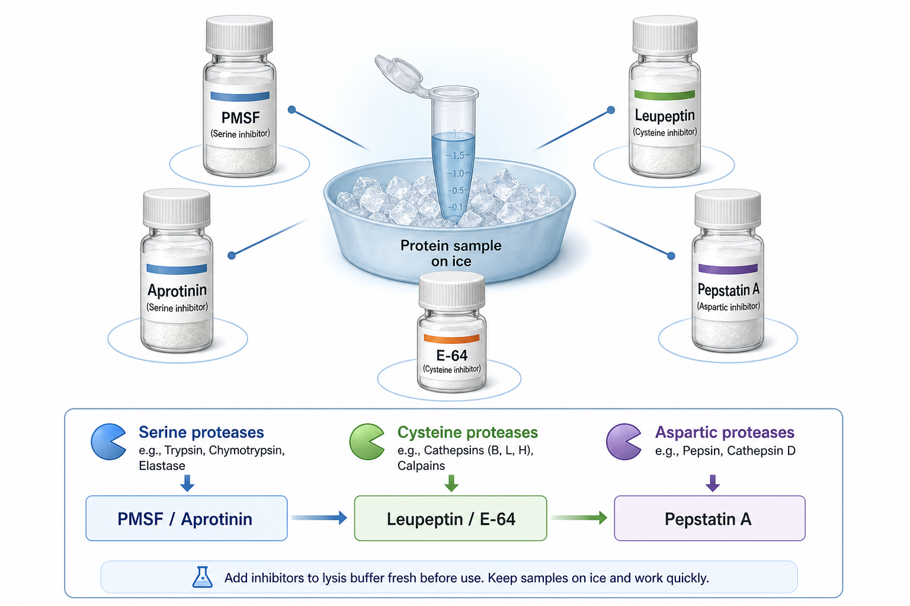

# PMSF

PMSF（phenylmethylsulfonyl fluoride，苯甲基磺酰氟）是一种常用 serine protease inhibitor（丝氨酸蛋白酶抑制剂），常在 [RIPA裂解液](RIPA裂解液.md)、非变性裂解液或其他蛋白提取体系中现用现加，用于减少样本制备过程中蛋白被丝氨酸蛋白酶降解。



图源：Image2 生成的蛋白酶抑制剂成分参考图；PMSF 位于左上方，主要对应 serine proteases（丝氨酸蛋白酶），常与 Aprotinin、Leupeptin、Pepstatin A、E-64 等共同构成广谱 [蛋白酶抑制剂](蛋白酶抑制剂.md) 体系。

## 核心作用

PMSF 会与 serine protease（丝氨酸蛋白酶）活性中心的丝氨酸残基反应，使酶失活。它常用于抑制 trypsin-like（胰蛋白酶样）、chymotrypsin-like（胰凝乳蛋白酶样）等蛋白酶活性，但并不能覆盖所有蛋白酶类型，因此常作为 cocktail（混合抑制剂）的一部分。

Sigma-Aldrich 的 PMSF 产品资料将其列为 serine protease inhibitor，并提示其常以无水有机溶剂储液形式使用。参考：[Sigma-Aldrich PMSF P7626](https://www.sigmaaldrich.com/US/en/product/sigma/p7626)。

## 为什么常说“现用现加”

PMSF 在水溶液中会水解，加入水相裂解液后有效浓度会随时间下降。它可以提前配成 isopropanol（异丙醇）、ethanol（乙醇）或 DMSO（二甲基亚砜）储液，但加入裂解液后应尽快使用。

| 状态 | 稳定性理解 | 实验建议 |
| --- | --- | --- |
| 干粉 | 相对稳定 | 按说明书低温、避湿保存 |
| 有机溶剂储液 | 比水溶液稳定 | 小分装，避免反复冻融 |
| 水相裂解液中 | 不稳定 | 裂解前现加，尽快使用 |

## 使用场景

| 场景 | 是否常用 | 说明 |
| --- | --- | --- |
| [Western blot](<../用(实验流程内容篇)/Western blot.md>) 全蛋白裂解 | 常用 | 防止样本处理阶段降解 |
| 组织匀浆 | 常用 | 组织蛋白酶活性高，更需要低温和抑制剂 |
| IP-WB | 可用 | 需确认不影响蛋白互作和抗体结合 |
| 酶活实验 | 谨慎 | PMSF 可能抑制目标酶或改变活性 |
| 质谱样本 | 谨慎 | 需确认与下游 MS 前处理兼容 |

## PMSF vs Aprotinin vs Leupeptin

| 抑制剂 | 主要靶点 | 优点 | 局限 |
| --- | --- | --- | --- |
| PMSF | 丝氨酸蛋白酶 | 便宜、常用、反应快 | 水相不稳定，有毒性和刺激性 |
| [Aprotinin](Aprotinin.md) | 丝氨酸蛋白酶 | 多肽类抑制剂，常用于 cocktail | 覆盖范围有限，成本较高 |
| [Leupeptin](Leupeptin.md) | 半胱氨酸/部分丝氨酸蛋白酶 | 覆盖 cathepsin/trypsin-like 活性 | 不抑制天冬氨酸蛋白酶 |
| [Pepstatin A](<Pepstatin A.md>) | 天冬氨酸蛋白酶 | 抑制 pepsin/cathepsin D 类 | 水溶性较差 |
| [E-64](E-64.md) | 半胱氨酸蛋白酶 | 不可逆抑制，多用于 cysteine protease | 靶点不覆盖丝氨酸/天冬氨酸蛋白酶 |

## 使用 protocol

### 配储液

**怎么做**：按产品说明书用无水有机溶剂配成高浓度 stock solution（储液），小体积分装，低温保存。

**为什么**：PMSF 在水中不稳定，且反复冻融会增加有效浓度不确定性。

**注意事项**：

- PMSF 有毒且有刺激性，称量和配制时遵守 [SDS与GHS标签](<../实验室安全/SDS与GHS标签.md>)。
- 不建议配大瓶水溶液长期使用。
- 记录溶剂，因为 DMSO/乙醇/异丙醇对某些下游实验的影响不同。

### 加入裂解液

**怎么做**：裂解前将 PMSF 加入预冷裂解液，轻轻混匀后立即用于样本。

**为什么**：有效抑制依赖“足够浓度 + 足够快 + 低温操作”。PMSF 不是慢慢放进去就能保护样本的试剂。

**替代方案**：

- 使用商业 [蛋白酶抑制剂](蛋白酶抑制剂.md) cocktail，减少单独配 PMSF 的危险和误差。
- 若下游不兼容 PMSF，可考虑选择不含 PMSF 的 cocktail，但需要评估保护范围。

## 常见错误与 troubleshooting

| 问题 | 可能原因 | 处理 |
| --- | --- | --- |
| WB 条带出现低分子碎片 | PMSF 漏加、失效或操作太慢 | 换新储液，裂解前现加，全程冰上 |
| 样本重复性差 | PMSF 储液反复冻融或开封太久 | 小分装，记录开封日期 |
| 目标酶活性消失 | PMSF 抑制了目标 serine protease | 酶活实验不要默认加 PMSF |
| 细胞/样本出现溶剂干扰 | PMSF 储液加入体积过大 | 提高储液浓度或换配方 |
| 安全风险 | 粉末或储液接触皮肤/眼睛 | 在合适防护和通风条件下操作 |

## 购买与记录建议

常见供应商包括 [Merck](<../番外/试剂厂商/Merck.md>)/[Sigma](<../番外/试剂厂商/Sigma.md>)、[Thermo Scientific](<../番外/试剂厂商/Thermo Scientific.md>)、[Roche](<../番外/试剂厂商/Roche.md>)、[碧云天](<../番外/试剂厂商/碧云天.md>) 等。日常 WB 更推荐使用商业 cocktail；单独 PMSF 适合需要明确控制 serine protease 抑制条件时使用。

推荐记录模板（中文）：

```text
PMSF品牌：
货号：
批号：
储液浓度：
储液溶剂：
配制日期：
开封日期：
终浓度：
加入时间：
裂解液：
样本类型：
是否同时加入cocktail：
异常现象：
```

Recommended record template (English):

```text
PMSF brand:
Catalog number:
Lot number:
Stock concentration:
Stock solvent:
Preparation date:
Open date:
Final concentration:
Time of addition:
Lysis buffer:
Sample type:
Cocktail also added: yes/no
Abnormal observation:
```

## 小结

PMSF 是便宜、经典、有效但“脾气很急”的丝氨酸蛋白酶抑制剂：它需要新鲜加入、水相中不能久放，并且不能替代完整的广谱蛋白酶抑制剂体系。

## 参考来源

- [Sigma-Aldrich PMSF P7626](https://www.sigmaaldrich.com/US/en/product/sigma/p7626)
- [Thermo Fisher Halt Protease Inhibitor Cocktail](https://www.thermofisher.com/order/catalog/product/78429)
- [CST Western Blot Protocol](https://www.cellsignal.com/learn-and-support/protocols/protocol-western)
