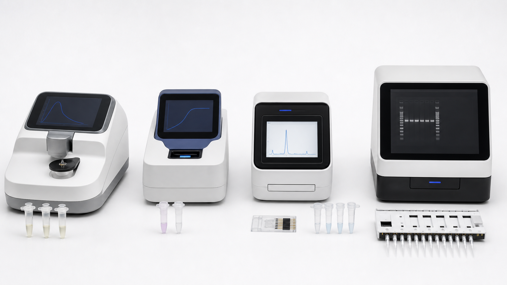

# Qubit荧光计

Qubit fluorometer（Qubit 荧光计）是一类基于 fluorescent dye（荧光染料）的核酸和蛋白定量仪器，常用于 DNA、RNA、dsDNA、ssDNA、miRNA 或蛋白的特异性定量。Qubit 是 [Invitrogen](<../番外/试剂厂商/Invitrogen.md>) / Thermo Fisher 旗下常见产品线。



图源：Image2 生成的核酸质控仪器参考图；从左到右第 2 台为小型荧光计示意，前方为荧光定量 assay tube。

## 工作原理

Qubit 不是测 260 nm 吸光度，而是使用能选择性结合目标分子的荧光染料。染料结合目标核酸或蛋白后荧光增强，仪器根据标准曲线换算浓度。Thermo Fisher 的 Qubit 4 Fluorometer 资料说明，Qubit assays 使用荧光染料实现 DNA、RNA 和蛋白的选择性定量，通常比吸光法更适合低浓度样本。[参考：Thermo Fisher Qubit 4 Fluorometer](https://www.thermofisher.com/order/catalog/product/Q33238)

## 它适合回答什么

| 问题 | Qubit 是否适合 |
| --- | --- |
| 低浓度 RNA 到底有多少 | 适合 |
| DNA/RNA 混合样本中目标分子量 | 比 UV-Vis 更适合 |
| RNA 是否降解 | 不适合，需要 Bioanalyzer/TapeStation |
| 是否有酚/盐污染 | 不直接回答 |
| 文库构建前浓度是否准确 | 适合，尤其是低量样本 |

## Qubit vs NanoDrop

| 项目 | Qubit | 微量 UV-Vis / NanoDrop |
| --- | --- | --- |
| 测量原理 | 荧光染料结合目标分子 | 吸光度 |
| 特异性 | 高，取决于 assay kit | 低，所有吸收 260 nm 的物质都会影响 |
| 低浓度准确性 | 通常更好 | 较差 |
| 纯度指标 | 不提供 A260/A280 | 可提供 A260/A280、A260/A230 |
| 样本消耗 | 需要 assay tube 和工作液 | 1-2 μL 即可 |
| 成本 | 每个样本有试剂成本 | 单次成本低 |

因此，RNA 提取后可以先用 [微量紫外分光光度计](微量紫外分光光度计.md) 快速看纯度，再用 Qubit 做更可靠浓度定量。

## 常见 assay

| Assay | 用途 |
| --- | --- |
| Qubit RNA HS Assay | 低浓度 RNA 定量 |
| Qubit RNA BR Assay | 较宽范围 RNA 定量 |
| Qubit dsDNA HS Assay | 低浓度双链 DNA 定量 |
| Qubit dsDNA BR Assay | 常规双链 DNA 定量 |
| Qubit ssDNA Assay | 单链 DNA 定量 |
| Qubit Protein Assay | 蛋白定量 |

不同 assay 不能混用。RNA assay 不等于 DNA assay，HS 和 BR 的线性范围也不同。

## 使用 protocol

### 选择 assay

**怎么做**：根据样本类型和预期浓度选择 RNA HS、RNA BR、dsDNA HS 等 assay。

**为什么**：染料特异性和标准曲线范围决定结果是否可信。

**注意事项**：

- 不确定浓度时优先选择高灵敏 assay 或先做预估。
- 样本超出范围要稀释重测。
- 同一批实验使用同一 assay 和同一标准曲线。

### 配标准和样本

**怎么做**：按说明配 working solution（工作液），分别加入 standards（标准品）和样本到 Qubit assay tubes。

**为什么**：Qubit 依赖标准曲线定量，标准品配错会导致整批结果偏差。

**注意事项**：

- 使用匹配的 Qubit tube。
- 避光孵育。
- 移液要准确，低体积样本建议使用 [低吸附吸头](低吸附吸头.md)。

### 读数和判断

**怎么做**：选择对应 assay 程序，先读标准品，再读样本。若样本超出范围，按说明稀释后重测。

**为什么**：超出线性范围的读数不能直接相信。

## 常见错误与 troubleshooting

| 问题 | 可能原因 | 处理 |
| --- | --- | --- |
| 浓度与 NanoDrop 差异大 | NanoDrop 受污染物或游离核苷酸影响 | 优先相信适配 assay 的 Qubit 浓度 |
| 重复差异大 | 混匀不足、气泡、标准品错误 | 重新混匀，检查管壁气泡，重配标准 |
| 读数超范围 | 样本太浓或太稀 | 稀释或更换 assay 类型 |
| RNA-seq 文库失败 | 只看浓度没看完整性 | 配合 Bioanalyzer/TapeStation 检查 |

## 购买与记录建议

购买时需要同时考虑仪器、assay kit、Qubit assay tubes 和标准品。常见供应商为 Thermo Fisher / Invitrogen。记录时不要只写“Qubit 测浓度”，而要写清 assay 类型。

推荐记录：

```text
Instrument:
Assay kit:
Catalog number:
Lot number:
Sample type:
Sample dilution:
Standard curve date:
Measured concentration:
Final calculated concentration:
Operator/date:
```

## 小结

Qubit 的价值是更特异、更适合低浓度核酸定量。它不能告诉你 RNA 是否完整，也不提供 A260/A280 纯度比值，所以最稳的 RNA 质控是 Qubit 浓度 + UV-Vis 纯度 + Bioanalyzer/TapeStation 完整性。

## 参考来源

- [Thermo Fisher Qubit 4 Fluorometer](https://www.thermofisher.com/order/catalog/product/Q33238)
- [Thermo Fisher Qubit RNA Assay Kits](https://www.thermofisher.com/us/en/home/life-science/dna-rna-purification-analysis/nucleic-acid-quantitation/qubit-fluorometer-assays/rna-assays.html)
