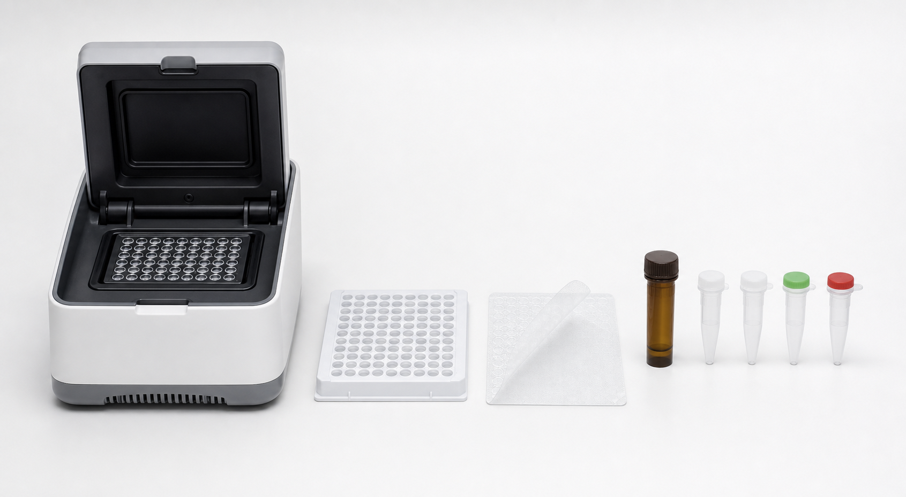

# ROX参比染料

ROX reference dye（ROX 参比染料）是一种 passive reference dye（被动参比染料），常用于部分 qPCR 仪中校正孔间荧光读数差异、移液体积微小差异、蒸发和光路波动。ROX 本身不参与 PCR 扩增，理论上在反应过程中信号应相对稳定。



图源：Image2 生成的 qPCR 核心材料参考图；右侧红色帽小管代表 ROX passive reference dye。

## ROX在 qPCR 中做什么

qPCR 仪读取的是荧光信号。不同孔因为体积、光路、塑料、封板和液面差异，原始荧光会有细微差别。ROX 作为不随扩增变化的参比信号，可用于 normalizing reporter signal（校正报告荧光信号）。

Thermo Fisher 的 ROX Reference Dye 说明将其描述为用于 real-time PCR 的 passive reference dye，可校正非 PCR 相关的荧光波动；Applied Biosystems 的许多 real-time PCR 体系也会要求或支持 ROX normalization。[参考：Thermo Fisher ROX Reference Dye](https://www.thermofisher.com/order/catalog/product/12223012)

## 什么时候需要 ROX

| 仪器/体系 | ROX 需求 |
| --- | --- |
| 部分 Applied Biosystems 仪器 | 常需要 high ROX 或 low ROX，取决于型号 |
| 部分 Stratagene/Agilent 系统 | 常见 ROX 需求 |
| Bio-Rad CFX 系列 | 通常不需要 ROX |
| Roche LightCycler 系列 | 通常不依赖 ROX |
| 不确定时 | 查仪器和 master mix 说明书 |

最危险的情况是“仪器需要 ROX，但体系没有 ROX”或“仪器不需要 ROX，却用了不合适的 ROX 设置”。这可能导致软件归一化错误、曲线异常或 Cq 偏差。

## High ROX、Low ROX、No ROX

| 类型 | 含义 | 适合场景 |
| --- | --- | --- |
| High ROX | 高浓度 ROX | 某些 Applied Biosystems 老型号或指定型号 |
| Low ROX | 低浓度 ROX | 某些 Applied Biosystems、Stratagene 等型号 |
| No ROX | 不含 ROX | Bio-Rad CFX、Roche LightCycler 等不需要 ROX 的系统 |
| Separate ROX | 单独添加 ROX | master mix 不含 ROX 但仪器需要时 |

不同厂商对 high/low ROX 的具体浓度可能不同，不能跨产品随意等同。

## 与 master mix 的关系

[SYBR Green qPCR Master Mix](<SYBR Green qPCR Master Mix.md>) 或 TaqMan master mix 可能已经含 ROX，也可能提供 separate ROX vial（单独 ROX 小管）。使用前要看清：

- `with ROX`
- `low ROX`
- `high ROX`
- `ROX optional`
- `no ROX`

如果已经含 ROX，通常不要额外再加；如果不含 ROX，但仪器需要，则按说明添加。

## 使用 protocol

### 判断是否需要

**怎么做**：先查 [qPCR仪](qPCR仪.md) 型号，再查 master mix 说明。记录仪器是否使用 passive reference，使用哪种 ROX 设置。

**为什么**：ROX 是仪器/软件归一化策略的一部分，不是所有 qPCR 都需要。

**注意事项**：

- 不要因为“别人体系里有 ROX”就照加。
- 更换仪器时必须重新检查 ROX。
- 更换 master mix 时确认 ROX 状态。

### 添加 ROX

**怎么做**：如果 master mix 不含 ROX 且仪器需要，按说明把 ROX 加入反应体系或预混液，轻轻混匀避光。

**为什么**：ROX 是荧光染料，光照和混匀不充分都会影响稳定性。

**注意事项**：

- 不要把 ROX 当作模板、引物或探针的一部分。
- 不同反应孔 ROX 体积必须一致。
- 如果做 multiplex，确认 ROX 通道不会干扰 reporter dye。

## 常见错误与 troubleshooting

| 问题 | 可能原因 | 处理 |
| --- | --- | --- |
| 曲线整体异常 | ROX 设置与体系不匹配 | 检查软件 passive reference 设置 |
| 同板孔间波动大 | 未使用所需 ROX、加样误差、封板差 | 确认 ROX、离心和封板 |
| Cq 与旧体系不一致 | 换了 master mix 或 ROX 浓度 | 做桥接验证，不直接合并数据 |
| 多重检测通道异常 | ROX 与染料通道设置冲突 | 重新设置 reporter 和 passive reference |

## 购买与记录建议

ROX 可能作为单独试剂购买，也可能包含在 master mix 中。常见供应商包括 [Applied Biosystems](<../番外/试剂厂商/Applied Biosystems.md>)、[Thermo Scientific](<../番外/试剂厂商/Thermo Scientific.md>)、[Bio-Rad](<../番外/试剂厂商/Bio-Rad.md>) 等。购买时重点看浓度、适配仪器和是否与目标 master mix 配套。

推荐记录：

```text
ROX status:
High/low/no ROX:
Supplier:
Catalog number:
Lot number:
Final concentration or volume:
Instrument:
Passive reference setting:
Master mix:
```

## 小结

ROX 是 qPCR 的“仪器归一化配件”，不是通用增强剂。它是否需要、需要多少，取决于 qPCR 仪和 master mix。任何 qPCR protocol 都应明确写出 ROX 状态。

## 参考来源

- [Thermo Fisher ROX Reference Dye](https://www.thermofisher.com/order/catalog/product/12223012)
- [Thermo Fisher Real-Time PCR Instruments](https://www.thermofisher.com/us/en/home/life-science/pcr/real-time-pcr/real-time-pcr-instruments.html)
