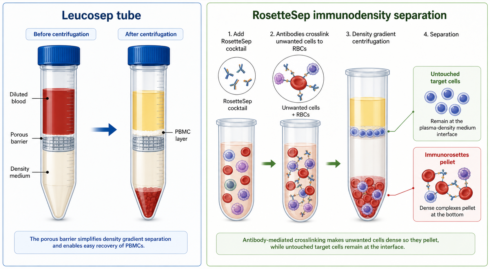

# RosetteSep

RosetteSep 是 [STEMCELL Technologies](<../番外/试剂厂商/STEMCELL Technologies.md>) 的 immunodensity negative selection（免疫密度阴性选择）细胞分离产品线。它通过 antibody cocktail（抗体鸡尾酒）把 unwanted cells（不需要的细胞）交联到 red blood cells（红细胞，RBC）上，使这些细胞在 [密度梯度离心](<../用(实验流程内容篇)/密度梯度离心.md>) 中与红细胞一起沉降，从而在界面层富集 untouched target cells（未被抗体/磁珠直接标记的目标细胞）。



图源：Image2 生成的 Leucosep/RosetteSep 样本前处理示意图。右侧展示 RosetteSep 将非目标细胞与红细胞交联成 immunorosettes（免疫玫瑰花结），沉降到底部；目标细胞保留在密度梯度界面层。

## 定义与命名

RosetteSep 的核心不是磁珠分选，而是 negative selection（阴性选择）加 density gradient centrifugation（密度梯度离心）。抗体 cocktail 识别非目标细胞表面 marker，并把它们与 RBC 交联形成免疫复合物；离心时这些复合物随 RBC 穿过密度介质沉降，目标细胞仍然以 untouched form（未被直接标记状态）富集在 PBMC/MNC 层。

STEMCELL 的 RosetteSep 页面将其描述为可直接从全血中快速分离 untouched immune cells（未接触免疫细胞）的产品体系，通常与 [SepMate管](SepMate管.md) 或传统密度梯度介质配合使用。参考：[STEMCELL RosetteSep](https://www.stemcell.com/products/brands/rosettesep.html)。

## 核心组成与作用

| 组成/步骤 | 作用 |
| --- | --- |
| RosetteSep antibody cocktail | 识别非目标细胞并介导交联 |
| RBC-mediated rosetting | 让不需要的细胞与红细胞形成更高密度复合物 |
| Density gradient medium | 提供分离界面，常配合 [Ficoll](Ficoll.md) 或 [Lymphoprep](Lymphoprep.md) |
| Untouched target cells | 目标细胞不被抗体/磁珠直接结合，适合某些功能实验 |
| Washing step | 去除残留血浆、分离介质和抗体 cocktail |

## 常见用途

| 目标 | 典型用途 | 注意事项 |
| --- | --- | --- |
| T 细胞富集 | T cell activation、功能实验、流式验证 | 需确认是否 total T、CD4、CD8 或 naive/memory |
| B 细胞富集 | BCR 信号、抗体反应研究 | 供体差异和纯度要记录 |
| NK 细胞富集 | 杀伤实验、肿瘤免疫研究 | 功能实验需验证活性保留 |
| 单核细胞富集 | 巨噬/树突状细胞诱导、炎症刺激 | 单核细胞易激活，处理时间要控制 |
| Granulocyte/其他细胞富集 | 特定免疫细胞实验 | 产品 cocktail 必须与目标细胞匹配 |

RosetteSep 产品通常按目标细胞类型设计，不应把一个 cocktail 当作通用免疫细胞分离试剂。

## RosetteSep vs EasySep vs 普通PBMC分离

| 方法 | 分离逻辑 | 优点 | 局限 |
| --- | --- | --- | --- |
| 普通 PBMC 分离 | 只按密度分离 PBMC/MNC | 简单、成本较低、保留混合免疫细胞 | 不能直接富集特定亚群 |
| RosetteSep | 把非目标细胞交联到 RBC，密度梯度中去除 | 目标细胞 untouched，适合从全血快速富集 | 依赖红细胞和密度梯度，cocktail 要精确匹配 |
| [EasySep](EasySep.md) | 磁性颗粒分选，可阳性或阴性选择 | 体系丰富，可处理 PBMC 或其他样本 | 需要磁场设备，部分策略会直接标记目标细胞 |
| 流式分选 | 荧光标记后单细胞分选 | 纯度高，可多 marker 精细定义 | 慢、贵、细胞应激大 |

一句话：RosetteSep 更像“在密度梯度步骤里顺手做阴性去除”，EasySep 更像“用磁性颗粒做可控的分选模块”。如果只是要 PBMC 输入，普通密度梯度就够；如果要 untouched 目标亚群，RosetteSep 才有价值。

## 与 SepMate 的关系

RosetteSep 常与 [SepMate管](SepMate管.md) 组合，用于减少分层操作难度和缩短处理时间。一般逻辑是先将 RosetteSep cocktail 加入全血并孵育，使不需要的细胞与 RBC 形成免疫玫瑰花结；随后进行密度梯度离心，目标细胞留在界面层，再回收洗涤。

需要注意：SepMate 是耗材结构，RosetteSep 是抗体 cocktail。两者可以组合，但不是同一种东西，记录时要分别写清。

## 使用流程

以下是理解框架，正式实验应以对应 RosetteSep 产品说明书为准。

| 步骤 | 操作逻辑 | 关键点 |
| --- | --- | --- |
| 选择 cocktail | 根据目标细胞选择对应 RosetteSep 产品 | 不同目标细胞不能混用 cocktail |
| 加入血样孵育 | 抗体 cocktail 与非目标细胞和 RBC 形成复合物 | 记录血样体积、抗凝剂、孵育时间和温度 |
| 加入密度介质体系 | 可用传统管、SepMate 或类似密度梯度方案 | 体积和离心条件按说明书 |
| 离心分层 | 不需要的细胞随 RBC 沉降，目标细胞在界面层 | 记录 RCF、时间、温度、brake |
| 回收目标层 | 收集界面层 untouched target cells | 避免吸入底部沉淀 |
| 洗涤与质控 | 去除残留介质和抗体 cocktail | 记录细胞数、活率、纯度和回收率 |

## 选择标准

| 需求 | 是否适合 RosetteSep |
| --- | --- |
| 从全血快速富集 untouched 免疫细胞 | 很适合 |
| 不想直接标记目标细胞 | 适合 |
| 只需要普通 PBMC 混合群 | 不需要，普通密度梯度即可 |
| 目标细胞比例很低 | 需要评估回收率和纯度，可能要结合其他分选 |
| 样本不是含 RBC 的全血体系 | 需确认说明书是否适配 |
| 下游需要极高纯度 | 可能需要 EasySep 或流式分选进一步纯化 |

## 常见错误与 troubleshooting

| 问题 | 可能原因 | 处理 |
| --- | --- | --- |
| 纯度不够 | cocktail 选择不匹配、孵育不足、样本异常 | 确认目标细胞类型和产品规格 |
| 回收率低 | 目标细胞比例低、界面回收不足、洗涤损失 | 记录 input/output，优化回收和洗涤 |
| 目标细胞活率低 | 血样放置过久、离心条件过强、处理时间长 | 缩短处理时间，复核 RCF/time |
| 非目标细胞残留多 | rosetting 不充分或密度分离失败 | 检查血样体积、cocktail 用量和分层 |
| 与 EasySep 结果不同 | 分离原理不同 | 按下游目的比较纯度、活率、激活状态和功能 |

## 购买建议

购买 RosetteSep 时首先看目标细胞类型，而不是只看“RosetteSep”品牌名。应确认物种、人/鼠样本、目标细胞、样本类型、是否需要 SepMate 配套、推荐血样体积和下游用途。

建议记录：

```text
RosetteSep target cell type, STEMCELL Technologies, catalog number, lot number, sample type, density medium, tube format, incubation condition
```

如果同一实验比较 RosetteSep 与 EasySep，必须分别记录两种产品的 target population definition（目标群体定义），否则纯度差异很可能来自 marker panel 或 cocktail 设计不同，而不是方法优劣本身。

## 推荐记录模板

中文记录模板：

```text
产品名称：
目标细胞类型：
品牌/供应商：
货号：
批号：
样本类型：
抗凝剂：
血样体积：
cocktail用量：
孵育时间：
孵育温度：
密度介质：
管型：普通离心管/SepMate/其他
离心条件：
brake设置：
目标层回收情况：
洗涤条件：
回收细胞数：
活率：
目标细胞纯度：
非目标细胞残留：
下游用途：
异常现象：
```

English record template:

```text
Product name:
Target cell type:
Brand/supplier:
Catalog number:
Lot number:
Sample type:
Anticoagulant:
Blood volume:
Cocktail volume:
Incubation time:
Incubation temperature:
Density medium:
Tube format: standard tube/SepMate/other
Centrifugation condition:
Brake setting:
Target layer recovery:
Wash condition:
Recovered cell number:
Viability:
Target cell purity:
Residual non-target cells:
Downstream use:
Abnormal observation:
```

## 小结

RosetteSep 是免疫密度阴性选择体系，适合从全血中快速获得 untouched target cells。它的关键不是“比 Ficoll 更高级”，而是通过抗体 cocktail 把非目标细胞与 RBC 交联并随密度梯度沉降。实验记录必须写清目标细胞、cocktail 货号/批号、样本类型、密度介质、管型、离心条件、纯度、回收率和活率。

## 参考来源

- [STEMCELL Technologies RosetteSep](https://www.stemcell.com/products/brands/rosettesep.html)
- [STEMCELL Technologies SepMate](https://www.stemcell.com/products/brands/sepmate.html)
- [STEMCELL Technologies PBMC Isolation](https://www.stemcell.com/peripheral-blood-mononuclear-cell-isolation.html)
