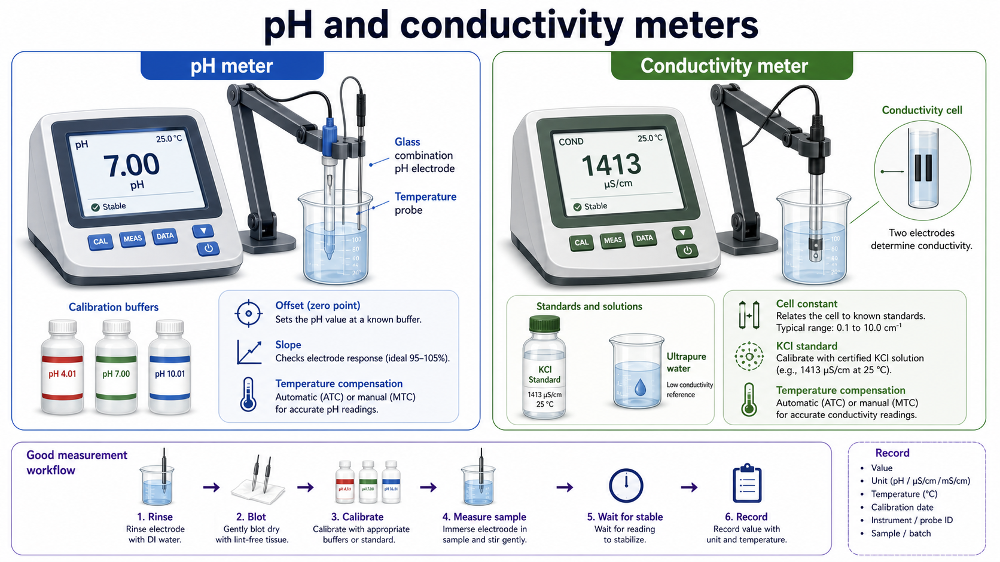

# pH缓冲液

pH calibration buffer（pH 校准缓冲液，常简称 pH 缓冲液）是具有已知 [pH](<../番外/补充知识/pH.md>) 值的标准溶液，主要用于校准、验证和排查 [pH计](pH计.md) 及其电极状态。它不是普通实验配方里的“缓冲体系”，而是测量系统的 reference material（参考物质）。



图源：Image2 生成的溶液测量相关耗材示意图；左侧展示 pH meter、pH 4.01/7.00/10.01 校准液和玻璃电极。

## 为什么 pH 缓冲液重要

pH 读数不是电极“直接看见”溶液酸碱度，而是通过玻璃电极电位差换算出来的结果。仪器必须先用已知 pH 的标准液建立当前电极在当前温度下的响应关系，才能把未知样品的电信号换算为 pH。

校准时最重要的两个概念是：

| 概念 | 含义 | 为什么要看 |
| --- | --- | --- |
| offset（零点偏移） | 电极在 pH 7 附近的读数偏离 | 偏移过大提示电极污染、老化或参比系统异常 |
| slope（斜率） | 电极对 pH 变化的响应幅度 | 斜率太低提示玻璃膜老化、污染、脱水或电解液问题 |

很多 pH 计会在校准结束后显示 slope 百分比、mV/pH 或电极状态。这个数值应当和仪器说明书一起看，不同品牌的合格范围不完全相同。

参考：[Mettler Toledo pH Measurement Guide](https://www.mt.com/us/en/home/library/guides/lab-analytical-instruments/ph-measurement-guide.html)。

## 常见规格

商业 pH 缓冲液最常见的是 25°C 下的 pH 4.01、pH 7.00 和 pH 10.01。不同厂商也会提供 pH 1.68、2.00、3.00、6.86、9.18、12.45 等特殊点位，用于更宽范围或特定标准体系。

| 缓冲液 | 常见颜色 | 主要用途 | 适合校准的样品范围 |
| --- | --- | --- | --- |
| pH 4.01 | 红色或无色 | 酸性点校准 | 酸性 buffer、酸性提取液、部分发酵液 |
| pH 7.00 | 黄色、绿色或无色 | 中性点校准、零点检查 | 细胞培养液、[PBS](PBS.md)、多数生物样品附近 |
| pH 10.01 | 蓝色或无色 | 碱性点校准 | 碱性缓冲液、碱性清洗液、部分化学试剂 |

颜色只是为了减少拿错，并不是 pH 缓冲液本身必须带颜色。做光学、痕量分析或担心染料污染时，可以选 colorless buffer（无色校准缓冲液）。

## pH 缓冲液 vs 实验缓冲液

pH 缓冲液和实验里的 buffer 容易混淆，但它们的设计目的不同。

| 对比对象 | 主要目的 | 是否适合直接用于样品处理 |
| --- | --- | --- |
| pH 校准缓冲液 | 校准 pH 计，给仪器提供已知 pH 标准 | 通常不用于样品处理 |
| [PBS](PBS.md) | 维持细胞或样品的近生理盐环境 | 可以用于洗涤、稀释和短时间维持 |
| [HEPES](HEPES.md) buffer | 在细胞培养或生化反应中稳定 pH | 取决于配方和实验体系 |
| [Tris](Tris.md) buffer | 蛋白、核酸和电泳体系常用缓冲体系 | 取决于配方和温度 |

也就是说，pH 4.01/7.00/10.01 校准液的价值在于“已知、稳定、可追溯”，不是在于能不能保护细胞或蛋白。

## 使用场景

### 日常校准

每次正式测量前，至少用两个点校准：一个接近中性的 pH 7.00，另一个选在样品 pH 所在方向。例如测酸性样品用 pH 7.00 + pH 4.01，测碱性样品用 pH 7.00 + pH 10.01。

如果样品跨度很大，或实验结果高度依赖 pH，建议使用三点校准。三点校准可以更好地覆盖酸性、中性和碱性范围，但会增加校准液污染和操作时间。

### 电极状态检查

如果同一支电极在新鲜 pH 缓冲液中反复校准失败，可能不是样品问题，而是电极状态异常。常见原因包括玻璃膜污染、参比液耗尽、液接界堵塞、电极干放、温度未平衡或缓冲液已经污染。

### 批间和项目记录

长期项目最好记录 pH 缓冲液品牌、货号、批号、开封日期和有效期。这样当培养基、酶反应体系或染色体系突然异常时，才有机会追溯“读数是否可信”。

## 使用 protocol

以下是常规 pH 计校准用法，具体仍以仪器和电极说明书为准。

### 校准前准备

- 取出新鲜 pH 缓冲液小份 aliquot（分装液），不要直接把电极插进原瓶。
- 准备 [超纯水](超纯水.md) 或去离子水用于冲洗电极。
- 让校准液、样品和电极尽量接近同一温度。
- 检查电极是否有气泡、盐结晶、干膜、裂纹或液接界堵塞。

### 校准步骤

1. 用水轻轻冲洗电极，吸水纸轻触吸干，不要擦玻璃膜。
2. 将电极浸入 pH 7.00 缓冲液，等待读数稳定后确认。
3. 冲洗并吸干电极。
4. 根据样品范围选择 pH 4.01 或 pH 10.01 缓冲液，等待稳定后确认。
5. 需要三点校准时，再加入第三个点位。
6. 查看仪器显示的 slope/offset 是否在可接受范围。
7. 校准完成后再测样品，测量不同样品之间也要冲洗并吸干。

### 为什么不能把用过的缓冲液倒回原瓶

电极会带入样品、水、盐、清洗液或其他缓冲液。即使污染量很小，也会逐渐改变原瓶缓冲液的 pH 和离子组成。pH 缓冲液一旦失去准确性，后面的所有样品读数都会系统性漂移。

## 选择和购买

购买 pH 缓冲液时，优先看这些信息：

- 是否标注具体温度下的 pH，例如 pH 7.00 at 25°C。
- 是否有 lot number（批号）和 certificate of analysis, COA（分析证书）。
- 是否 NIST-traceable（可追溯至 NIST 标准）或符合相应标准。
- 是否有 temperature table（温度-pH 对照表）。
- 是一次性袋装、小瓶装，还是大瓶装。
- 是否需要 colored（有色）或 colorless（无色）版本。

常见供应商包括 [Mettler Toledo](<../番外/试剂厂商/Mettler Toledo.md>)、[Thermo Fisher Scientific](<../番外/试剂厂商/Thermo Fisher Scientific.md>) / Orion、[Hanna Instruments](<../番外/试剂厂商/Hanna Instruments.md>)、[Sigma-Aldrich](<../番外/试剂厂商/Sigma-Aldrich.md>) / [Merck](<../番外/试剂厂商/Merck.md>) 等。日常教学或普通缓冲液测量可以选择常规校准液；细胞培养、蛋白纯化、长期项目或仪器质控记录中，建议优先选择有 COA 和批号追踪的产品。

参考：[Thermo Fisher pH buffers and ORP standards](https://www.thermofisher.com/us/en/home/life-science/lab-equipment/ph-electrochemistry/ph-measurement-testing/ph-orp-buffers-solutions/ph-buffers-orp-standards.html)。

## 常见错误与 troubleshooting

| 现象 | 可能原因 | 处理 |
| --- | --- | --- |
| pH 7.00 读数偏离很大 | 电极干放、污染、参比系统异常、缓冲液污染 | 先换新鲜缓冲液，再按说明清洗或重新活化电极 |
| pH 4.01 或 10.01 校准失败 | 电极斜率下降、温度未平衡、选错缓冲液 | 等温度稳定，确认点位，必要时更换电极 |
| 同一样品读数慢慢漂移 | 电极响应慢、样品低离子强度、温度变化 | 延长稳定时间，记录温度，使用适合低离子样品的电极 |
| 不同人测量结果差异大 | 冲洗吸干方式不同、校准点不同、记录不完整 | 固定 SOP，记录校准点、缓冲液批号和 slope |
| 碱性缓冲液很快不准 | CO2 吸收、开盖时间长、反复使用 | 小份分装，减少暴露，频繁更换 |

## 推荐记录模板

中文模板：

```text
pH 缓冲液品牌：
货号：
批号：
标称 pH 和温度：
开封日期：
有效期：
是否有 COA：
本次校准点：
pH 计型号：
电极型号：
slope / offset：
操作者：
备注：
```

English template:

```text
pH buffer brand:
Catalog number:
Lot number:
Nominal pH and temperature:
Opening date:
Expiration date:
COA available:
Calibration points used:
pH meter model:
Electrode model:
Slope / offset:
Operator:
Notes:
```

## 总结

pH 缓冲液是 pH 测量的“尺子”。实验里如果只记录样品 pH，而不记录校准液、校准点、电极状态和温度，就很难判断后续异常到底来自样品本身，还是来自测量系统。越是长期培养、酶反应、蛋白纯化和跨批次比较，越应该把 pH 缓冲液当成可追溯耗材来管理。

## 参考来源

- [Mettler Toledo pH Measurement Guide](https://www.mt.com/us/en/home/library/guides/lab-analytical-instruments/ph-measurement-guide.html)
- [Thermo Fisher pH buffers and ORP standards](https://www.thermofisher.com/us/en/home/life-science/lab-equipment/ph-electrochemistry/ph-measurement-testing/ph-orp-buffers-solutions/ph-buffers-orp-standards.html)
- [IUPAC Gold Book: pH](https://goldbook.iupac.org/terms/view/P04524)
