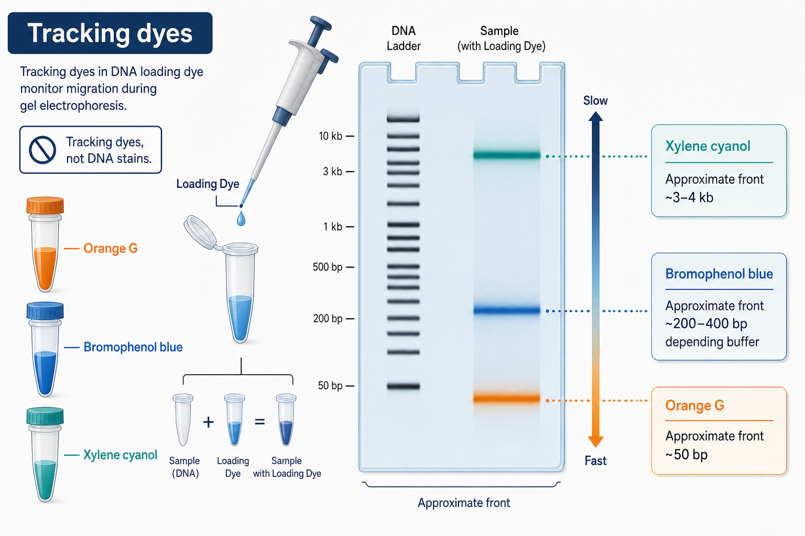

# 二甲苯青

二甲苯青（xylene cyanol FF，常写 XC 或 Xylene Cyanol）是一种 tracking dye（迁移追踪染料），常出现在核酸 [Loading Dye](<Loading Dye.md>) 中，用于在 [琼脂糖凝胶电泳](<../用(实验流程内容篇)/琼脂糖凝胶电泳.md>) 或 PAGE 运行时观察电泳前沿。它不是 [核酸染料](核酸染料.md)，不会像 [SYBR Safe](<SYBR Safe.md>)、[GelRed](GelRed.md) 或 [EB](EB.md) 那样专门让 DNA/RNA 条带发荧光。

图源：Image2 生成的 tracking dyes 示意图；二甲苯青迁移通常慢于 [溴酚蓝](溴酚蓝.md) 和 [Orange G](<Orange G.md>)，更适合提示中大片段附近的运行进度。

## 核心作用

| 作用 | 解释 |
| --- | --- |
| 追踪电泳前沿 | 通过肉眼可见的蓝绿色染料带判断样本已经跑到胶的哪个位置 |
| 辅助上样确认 | 上样时可以看到样本是否进入孔内 |
| 与其他 tracking dye 搭配 | 和溴酚蓝、Orange G 共同覆盖不同迁移范围 |

Sigma-Aldrich 的 nucleic acid electrophoresis protocol 给出的传统 loading buffer 示例包含 glycerol、bromophenol blue 和 xylene cyanol FF，说明二甲苯青是经典核酸上样缓冲液的常见追踪染料。参考：[Sigma-Aldrich Nucleic Acid Electrophoresis Protocol](https://www.sigmaaldrich.cn/CN/en/technical-documents/protocol/genomics/nucleic-acid-gel-electrophoresis/nucleic-acid-electrophoresis)。

## 与溴酚蓝和 Orange G 对比

| Tracking dye | 中文名 | 迁移趋势 | 适合观察 |
| --- | --- | --- | --- |
| Xylene cyanol FF | 二甲苯青 FF | 较慢 | 中大片段附近的运行进度 |
| Bromophenol blue | 溴酚蓝 | 中等 | 常规 PCR 片段和前沿判断 |
| Orange G | 橙黄 G | 较快 | 小片段附近的运行进度 |

具体迁移位置不是固定数字，会受胶浓度、TAE/TBE 缓冲液、电压、温度和商品配方影响。很多厂家会在 loading dye 说明书中给出“在某种胶浓度和缓冲液中大致相当于多少 bp/kb”的参考，但不要把这个当成精确分子量标准。

## 使用注意事项

- 二甲苯青只提示迁移前沿，不代表目标 DNA 条带位置。
- 如果目标片段很小，二甲苯青可能太慢，不能很好提示小片段是否已经跑出。
- 如果目标片段很大，二甲苯青前沿也不能替代 [DNA Ladder](<DNA Ladder.md>)。
- 做成像分析时，tracking dye 的可见颜色可能在某些光源或滤光片下形成阴影，尤其要注意 UV shadow 或背景干扰。

## 常见错误与 troubleshooting

| 问题 | 可能原因 | 建议 |
| --- | --- | --- |
| 以为二甲苯青就是 DNA 条带 | 概念混淆 | 记住 tracking dye 不等于核酸染料 |
| 蓝绿色前沿很散 | 上样过量、孔损伤、盐浓度高 | 降低样本盐分，重新上样 |
| 目标小片段跑丢 | 只看二甲苯青，忽略更快前沿 | 对小片段用 Orange G 或缩短运行时间 |
| 图像背景异常 | 染料或样本组分影响成像 | 换 loading dye 或改为后染 |

## 购买与记录建议

日常实验通常不单独购买二甲苯青粉末，而是购买含有二甲苯青的 6x DNA loading dye 或 ready-to-load ladder。排查问题时应记录 loading dye 品牌、货号、批号、是否含 SDS、追踪染料组成和加入比例。

## 小结

二甲苯青是核酸电泳的“慢速追踪前沿”。它帮助判断运行进度，但不能判断 DNA 条带大小和浓度；真正的大小判断仍然依赖 DNA ladder 和合适的凝胶浓度。

## 参考来源

- [Sigma-Aldrich Nucleic Acid Electrophoresis Protocol](https://www.sigmaaldrich.cn/CN/en/technical-documents/protocol/genomics/nucleic-acid-gel-electrophoresis/nucleic-acid-electrophoresis)
- [Thermo Fisher 6X DNA Loading Dye](https://www.thermofisher.com/order/catalog/product/R0611)
