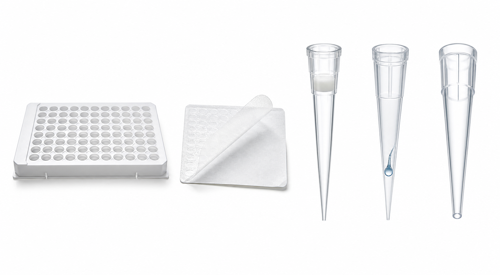

# 光学封板膜

Optical adhesive film / optical sealing film（光学封板膜/光学粘性封板膜）是用于密封 qPCR 板或 PCR 板的透明薄膜。它的作用不只是“盖住孔”，还要在热循环中减少蒸发、避免孔间污染，并允许 [qPCR仪](qPCR仪.md) 读取荧光信号。



图源：Image2 生成的实验耗材对照参考图；从左到右第 2 个为光学封板膜示意，薄膜部分从背衬上揭开。

## 核心作用

| 作用 | 为什么重要 |
| --- | --- |
| 防蒸发 | qPCR 体系体积小，蒸发会改变浓度和 Cq |
| 防孔间污染 | 避免加样后飞溅、气溶胶或液体跨孔 |
| 允许荧光读取 | 光学透明，降低背景和散射 |
| 支持热循环压力 | 在升降温中保持密封 |

Applied Biosystems 的 MicroAmp Optical Adhesive Film 用于 real-time PCR 应用中的 PCR plate 密封；Bio-Rad 的 optical seals 也强调 qPCR/real-time PCR 中需要光学透明密封材料以支持荧光检测。[参考：Applied Biosystems MicroAmp Optical Adhesive Film](https://www.thermofisher.com/order/catalog/product/4311971)；[参考：Bio-Rad PCR Seals](https://www.bio-rad.com/en-us/category/pcr-plate-seals)

## 常见类型

| 类型 | 英文 | 适合场景 | 注意事项 |
| --- | --- | --- | --- |
| 光学粘性封板膜 | Optical adhesive film | qPCR / RT-qPCR | 需要均匀压实，避免皱褶 |
| 热封膜 | Heat seal | 高通量、自动化、长期保存 | 需要热封仪 |
| PCR 管盖/板盖 | Cap strips / plate caps | 普通 PCR 或部分 qPCR | 可能不适合所有光学读取 |
| 铝膜 | Aluminum seal | 避光、保存或非光学检测 | 不适合顶部荧光读取 |

qPCR 一般优先使用厂商推荐的 optical adhesive film 或 optical seal。普通封板膜、铝膜或非光学板盖可能影响荧光读取或密封。

## 与 qPCR板的关系

[qPCR板](qPCR板.md) 和光学封板膜必须一起看。板本身兼容并不代表封板膜一定兼容。需要同时确认：

- 板的 skirt/profile 是否适合对应压盖。
- 封板膜是否适合该反应体积和热循环条件。
- 仪器是顶部读取还是底部读取。
- 是否需要低荧光背景或高透明度。
- 是否需要离心后再上机。

## 使用 protocol

### 贴膜前准备

**怎么做**：加样完成后，检查孔内是否有明显气泡或液滴挂壁。准备光学封板膜和压膜工具，避免触碰膜的粘性面。

**为什么**：粘性面污染会影响密封；气泡会影响荧光读取和热传导。

**注意事项**：

- 手套不要碰粘面。
- 不要让膜粘到台面灰尘或液滴。
- 对易蒸发小体积体系，贴膜后尽快离心和上机。

### 贴膜

**怎么做**：对齐板边后从一侧平稳贴下，用压膜板、刮板或平整工具从中间向四周均匀压实，重点压每一排孔边缘。

**为什么**：局部未压实会导致蒸发，通常表现为边缘孔或个别孔 Cq 异常。

**注意事项**：

- 不要产生皱褶、折线或气泡。
- 不要反复撕开重贴。
- 高通量板每一孔都要均匀受压。

### 离心和上机

**怎么做**：封板后短暂离心，让反应液集中到孔底并去除小气泡，再放入 qPCR 仪。

**为什么**：液体挂壁和气泡会影响热传导与荧光读取。

**注意事项**：

- 离心适配器要支持封板后的 PCR/qPCR 板。
- 上机前检查封板边缘是否翘起。

## 常见错误与 troubleshooting

| 问题 | 可能原因 | 处理 |
| --- | --- | --- |
| 边缘孔 Cq 异常 | 封板不严、蒸发、热盖压力不合适 | 换新膜，均匀压实，确认仪器兼容 |
| 荧光背景高 | 使用非光学膜或膜污染 | 换 optical film，避免触碰粘面 |
| 孔间污染 | 贴膜时液体飞溅、膜反复撕贴 | 规范加样和贴膜，必要时离心后再检查 |
| 膜翘起 | 板型不匹配、压实不足、保存条件不合适 | 使用匹配耗材，检查有效期和储存 |
| 气泡多 | 加样方式或封板前未离心 | 改善移液，封板后短暂离心 |

## 购买与记录建议

购买时优先按 qPCR 仪和 qPCR 板推荐选择。常见供应商包括 [Applied Biosystems](<../番外/试剂厂商/Applied Biosystems.md>)、[Bio-Rad](<../番外/试剂厂商/Bio-Rad.md>)、[Thermo Scientific](<../番外/试剂厂商/Thermo Scientific.md>)、[Eppendorf](<../番外/试剂厂商/Eppendorf.md>) 等。

推荐记录：

```text
Optical sealing film:
Brand:
Catalog number:
Lot number:
Compatible plate:
Compatible instrument:
Sealing tool:
Reaction volume:
Storage condition:
```

## 小结

光学封板膜是 qPCR 成败的细节位点。它同时影响蒸发、污染、荧光读取和孔间一致性；qPCR 重复孔异常时，封板膜和贴膜手法应该优先排查。

## 参考来源

- [Applied Biosystems MicroAmp Optical Adhesive Film](https://www.thermofisher.com/order/catalog/product/4311971)
- [Bio-Rad PCR Plate Seals](https://www.bio-rad.com/en-us/category/pcr-plate-seals)
