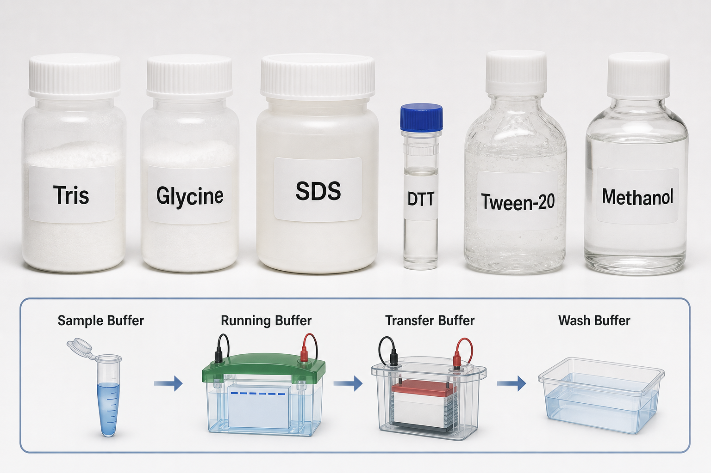

# 十二烷基硫酸钠

SDS（sodium dodecyl sulfate，十二烷基硫酸钠；也常称 sodium lauryl sulfate，月桂基硫酸钠）是一种阴离子去污剂，在 [SDS-PAGE](<../用(实验流程内容篇)/SDS-PAGE.md>) 和 [Western blot](<../用(实验流程内容篇)/Western blot.md>) 中用于使蛋白变性并带上近似均一的负电荷。



图源：Image2 生成的 WB/SDS-PAGE 缓冲体系基础试剂参考图；SDS 位于上排第三瓶，底部示意其主要进入 sample buffer（样本缓冲液）和 running buffer（运行缓冲液）。

## 核心作用

SDS 的疏水尾部可与蛋白疏水区域结合，硫酸基团提供负电荷。多数蛋白在 SDS 和加热条件下会失去天然构象，迁移行为主要由 apparent molecular weight（表观分子量）决定，而不是由原本的形状和电荷决定。

Thermo Fisher 的 UltraPure 10% SDS Solution 官方页面将 SDS 描述为用于聚丙烯酰胺凝胶电泳分子量测定的 protein denaturant（蛋白变性剂）。参考：[Thermo Fisher UltraPure 10% SDS Solution](https://www.thermofisher.com/order/catalog/product/15553027)。

## 常见使用位置

| 位置 | 常见浓度/形式 | 目的 |
| --- | --- | --- |
| [Laemmli上样缓冲液](Laemmli上样缓冲液.md) | 常见 2% SDS 左右，视 1x/2x/4x 而定 | 样本变性、赋予负电荷 |
| running buffer | 常见 0.1% SDS | 维持蛋白-SDS 复合物迁移 |
| [RIPA裂解液](RIPA裂解液.md) | 可含少量 SDS | 增强裂解和溶解能力 |
| [转膜缓冲液](转膜缓冲液.md) | 有时加 0.01%-0.05% SDS | 帮助大蛋白从胶中出来，但可能降低膜结合 |

Bio-Rad 的 10% SDS Solution 页面说明该产品为 10% w/v sodium dodecyl sulfate 溶液，并用于获得可重复的蛋白电泳迁移。参考：[Bio-Rad 10% SDS Solution](https://www.bio-rad.com/en-uk/sku/1610416-10-sds-solution-250-ml?ID=1610416)。

## 粉末 vs 10%溶液

| 形式 | 优点 | 局限 |
| --- | --- | --- |
| SDS粉末 | 便宜，适合大量自配 | 粉尘刺激性强，称量麻烦，溶解需要耐心 |
| 10% SDS溶液 | 使用方便，浓度稳定，减少粉尘暴露 | 成本更高，低温可能析出 |
| 商业预混buffer | 错误少，重复性好 | 灵活性低，依赖厂商配方 |

如果经常配 WB/SDS-PAGE buffer，10% SDS 储液比直接称粉末更稳妥。若 10% SDS 低温析晶，可按厂商建议温和加热并混匀，不要直接把沉淀状态的储液加入关键实验。

## SDS vs LDS vs 去污剂

| 试剂 | 类型 | 常见用途 | 和SDS的区别 |
| --- | --- | --- | --- |
| SDS | 阴离子去污剂 | Laemmli SDS-PAGE | 经典 Tris-Glycine 系统 |
| LDS | lithium dodecyl sulfate，十二烷基硫酸锂 | NuPAGE/Bis-Tris 样本体系 | 低温溶解性更好，常用于特定商业系统 |
| [Triton X-100](<Triton X-100.md>) | 非离子去污剂 | 细胞裂解、膜蛋白温和提取 | 不给蛋白均一负电荷 |
| [Tween-20](Tween-20.md) | 非离子表面活性剂 | WB 洗膜、降低非特异吸附 | 更温和，通常不用于变性电泳赋电 |
| [NP-40](NP-40.md) | 非离子去污剂 | 温和裂解 | 不等同于 SDS 变性作用 |

## 使用 protocol

### 配10% SDS储液

**怎么做**：称取 SDS 粉末，加入纯水至目标体积，室温或温和加热溶解，避免剧烈产生泡沫。

**为什么**：SDS 易起泡，泡沫会影响定容准确性；粉末粉尘对呼吸道和眼睛有刺激风险。

**注意事项**：

- 称量粉末时在通风良好位置操作，佩戴合适 [个人防护装备](<../实验室安全/个人防护装备.md>)。
- 不要高温长时间加热。
- 溶液冷藏后可能析出，使用前确认完全澄清均一。

### 加入样本缓冲液

**怎么做**：按 1x 终浓度加入样本，与 [DTT](DTT.md) 或 [β-巯基乙醇](β-巯基乙醇.md) 共同加热变性。

**为什么**：SDS 破坏非共价相互作用，DTT/β-ME 破坏二硫键，两者作用不同。

## 常见错误与 troubleshooting

| 问题 | 可能原因 | 处理 |
| --- | --- | --- |
| 条带不按分子量迁移 | SDS 终浓度不足或样本未充分变性 | 检查 sample buffer 和加热条件 |
| 样本太黏或泡沫多 | SDS/裂解液混合剧烈，DNA 未剪切 | 轻柔混匀，必要时剪切 DNA |
| 转膜效率低 | transfer buffer SDS 过多影响膜结合 | 降低或去掉转膜 SDS，优化甲醇 |
| 溶液有白色沉淀 | SDS 低温析出 | 温和升温至澄清后使用 |

## 安全与废液

SDS 粉末和浓溶液可刺激皮肤、眼睛和呼吸道，应按 [SDS与GHS标签](<../实验室安全/SDS与GHS标签.md>) 查看具体产品安全信息。含 SDS 的废液通常按实验室化学/生物污染状态分类处理，不要只凭“SDS 常见”就忽略样本来源。

## 购买与记录建议

常见供应商包括 [Bio-Rad](<../番外/试剂厂商/Bio-Rad.md>)、[Thermo Scientific](<../番外/试剂厂商/Thermo Scientific.md>)、[Merck](<../番外/试剂厂商/Merck.md>)/[Sigma-Aldrich](<../番外/试剂厂商/Sigma-Aldrich.md>)。用于电泳时选择 electrophoresis grade（电泳级）或 molecular biology grade（分子生物学级），并记录是粉末还是 10% 溶液。

推荐记录模板（中文）：

```text
SDS形式：粉末/10%溶液/预混buffer
等级：
品牌：
货号：
批号：
储液浓度：
终浓度：
用途：
配制日期：
储存条件：
是否析出：
```

Recommended record template (English):

```text
SDS form: powder/10% solution/premixed buffer
Grade:
Brand:
Catalog number:
Lot number:
Stock concentration:
Final concentration:
Use:
Preparation date:
Storage condition:
Precipitation observed: yes/no
```

## 小结

SDS 是 SDS-PAGE 名字里的核心试剂。它把蛋白从“各有形状和电荷的天然分子”转成更适合按大小比较的蛋白-SDS 复合物；但它的浓度、溶解状态和转膜中是否残留，都会影响后续结果。

## 参考来源

- [Thermo Fisher UltraPure 10% SDS Solution](https://www.thermofisher.com/order/catalog/product/15553027)
- [Bio-Rad 10% SDS Solution](https://www.bio-rad.com/en-uk/sku/1610416-10-sds-solution-250-ml?ID=1610416)
- [Bio-Rad Buffer Formulations PDF](https://www.bio-rad.com/webroot/web/pdf/lsr/literature/Bulletin_6199.pdf)
