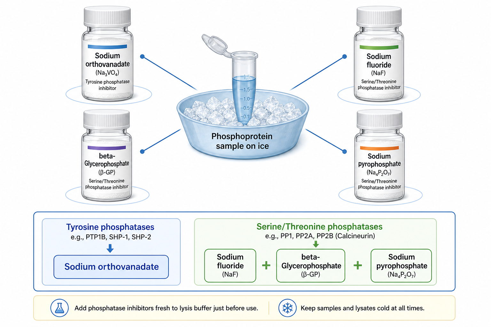

# 原钒酸钠

原钒酸钠（sodium orthovanadate，Na3VO4；常简称 vanadate，钒酸盐）是一种常用 tyrosine phosphatase inhibitor（酪氨酸磷酸酶抑制剂），常在 [Western blot](<../用(实验流程内容篇)/Western blot.md>) 检测 phospho-tyrosine（酪氨酸磷酸化）信号时加入裂解液，用于保护样本中的酪氨酸磷酸化状态。



图源：Image2 生成的磷酸酶抑制剂成分参考图；原钒酸钠位于左上方，主要对应 tyrosine phosphatases（酪氨酸磷酸酶）。

## 核心作用

原钒酸钠常被用于抑制 protein tyrosine phosphatases（PTPs，蛋白酪氨酸磷酸酶），从而保存细胞裂解瞬间的酪氨酸磷酸化状态。NEB 的 activated sodium orthovanadate 产品资料说明，Sodium Orthovanadate 是 protein phosphotyrosyl phosphatases 的 general competitive inhibitor（通用竞争性抑制剂），可用于保存细胞、裂解液和蛋白酪氨酸激酶实验中的蛋白酪氨酸磷酸化状态；资料也提示 EDTA 和还原剂等常见 buffer 组分可能影响其效力。参考：[NEB Sodium Orthovanadate (Vanadate)](https://www.neb.com/en-us/products/p0758-sodium-orthovanadate-activated-vanadate)。

## “活化”是什么意思

实验中常说的 activated vanadate（活化钒酸盐）通常指经过调 pH、煮沸/冷却循环等处理，使其以更适合抑制 PTP 的形式存在。未活化或保存不当的 vanadate 可能形成多聚钒酸盐或不同氧化状态，抑制效果不稳定。

Thermo Scientific Halt Phosphatase Inhibitor Cocktail 页面提到，该 cocktail 含 sodium fluoride、sodium orthovanadate、sodium pyrophosphate 和 beta-glycerophosphate，可同时抑制 serine/threonine phosphatases 和 protein tyrosine phosphatases；其 FAQ 也提示 orthovanadate 冻存后可能出现颜色变化，绿色通常提示活性丢失。参考：[Thermo Fisher Halt Phosphatase Inhibitor Cocktail](https://www.thermofisher.com/order/catalog/product/78420)。

## 原钒酸钠 vs 其他磷酸酶抑制剂

| 试剂 | 主要覆盖 | 典型作用 |
| --- | --- | --- |
| 原钒酸钠 | 酪氨酸磷酸酶 | 保存 phospho-tyrosine 信号 |
| [氟化钠](氟化钠.md) | 丝氨酸/苏氨酸磷酸酶等 | 常见广谱组分 |
| [β-甘油磷酸](β-甘油磷酸.md) | 丝氨酸/苏氨酸磷酸酶 | 常与 NaF 联用 |
| [焦磷酸钠](焦磷酸钠.md) | 多类磷酸酶/磷酸盐相关酶 | cocktail 常见组分 |
| [EDTA](EDTA.md)/[EGTA](EGTA.md) | 金属依赖酶 | 通过螯合金属离子抑制部分酶 |

如果目标是 phospho-ERK、phospho-AKT 这类常见 serine/threonine 位点，仅靠原钒酸钠通常不够；如果目标是 receptor tyrosine kinase（受体酪氨酸激酶）或 phospho-tyrosine 抗体信号，原钒酸钠就更关键。

## 使用 protocol

### 使用商业储液

**怎么做**：优先使用厂家已活化的 100 mM sodium orthovanadate 储液或成熟 phosphatase inhibitor cocktail，裂解前加入到 1x 工作浓度。

**为什么**：自己活化 vanadate 容易受 pH、加热循环和保存影响；商业活化储液能减少不稳定因素。

**注意事项**：

- 不要反复冻融已经明确要求 4 摄氏度保存的 cocktail。
- 注意颜色变化；异常变色要按厂家说明判断是否丢弃。
- 检测 phospho-protein 时同时加入 [蛋白酶抑制剂](蛋白酶抑制剂.md)，否则蛋白完整性仍可能丢失。

### 自配或活化

**怎么做**：按可靠 protocol 调整 pH 并活化，分装保存，使用前确认颜色和澄清度。

**为什么**：vanadate 形态决定抑制效率；错误形态可能导致 phospho-tyrosine 信号保护不足。

**替代策略**：如果只是常规 phospho-WB，直接使用商业 phosphatase inhibitor cocktail 更稳，不建议每次从粉末活化。

## 常见错误与 troubleshooting

| 问题 | 可能原因 | 处理 |
| --- | --- | --- |
| phospho-tyrosine 信号弱 | 未加原钒酸钠、储液失活、收样太慢 | 使用新鲜/活化储液，快速低温裂解 |
| 总蛋白正常但磷酸化消失 | 只加了蛋白酶抑制剂 | 加入 [磷酸酶抑制剂](磷酸酶抑制剂.md) |
| 不同批次信号差异大 | vanadate 活化状态或颜色变化 | 固定品牌/批号，记录颜色和保存条件 |
| 下游酶活异常 | vanadate 抑制目标酶或影响金属/还原环境 | 做 buffer exchange 或改用兼容体系 |

## 安全与废液

钒酸盐应按 [SDS与GHS标签](<../实验室安全/SDS与GHS标签.md>) 管理，避免吸入粉末、皮肤接触或误食。含钒废液不要随意倒入水槽，应按 [化学品安全](<../实验室安全/化学品安全.md>) 和 [实验室废弃物处理](<../实验室安全/实验室废弃物处理.md>) 要求处理。

## 购买与记录建议

常见选择包括 [NEB](<../番外/试剂厂商/NEB.md>) activated sodium orthovanadate、[Thermo Scientific](<../番外/试剂厂商/Thermo Scientific.md>) Halt phosphatase inhibitor cocktail、[Cell Signaling Technology](<../番外/试剂厂商/Cell Signaling Technology.md>) phosphatase inhibitor cocktail，以及 [Merck](<../番外/试剂厂商/Merck.md>)/[Sigma-Aldrich](<../番外/试剂厂商/Sigma-Aldrich.md>) 原钒酸钠产品。普通使用优先买已活化储液或 cocktail；机制实验或特殊配方才考虑自配。

推荐记录模板（中文）：

```text
原钒酸钠形式：粉末/已活化储液/cocktail组分
品牌：
货号：
批号：
储液浓度：
是否已活化：
颜色/澄清度：
终浓度：
加入时间：
裂解液：
目标磷酸化位点：
保存条件：
异常现象：
```

Recommended record template (English):

```text
Sodium orthovanadate form: powder/activated stock/cocktail component
Brand:
Catalog number:
Lot number:
Stock concentration:
Activated: yes/no
Color/clarity:
Final concentration:
Time of addition:
Lysis buffer:
Target phosphorylation site:
Storage condition:
Abnormal observation:
```

## 小结

原钒酸钠是 phospho-tyrosine WB 的核心保护试剂之一。它的关键不是“加没加钒酸盐”这么简单，而是是否活化、是否新鲜、保存颜色是否正常、是否和其他磷酸酶抑制剂共同覆盖目标位点。

## 参考来源

- [NEB Sodium Orthovanadate (Vanadate)](https://www.neb.com/en-us/products/p0758-sodium-orthovanadate-activated-vanadate)
- [Thermo Fisher Halt Phosphatase Inhibitor Cocktail](https://www.thermofisher.com/order/catalog/product/78420)
- [CST Western Blot Protocol](https://www.cellsignal.com/learn-and-support/protocols/protocol-western)
