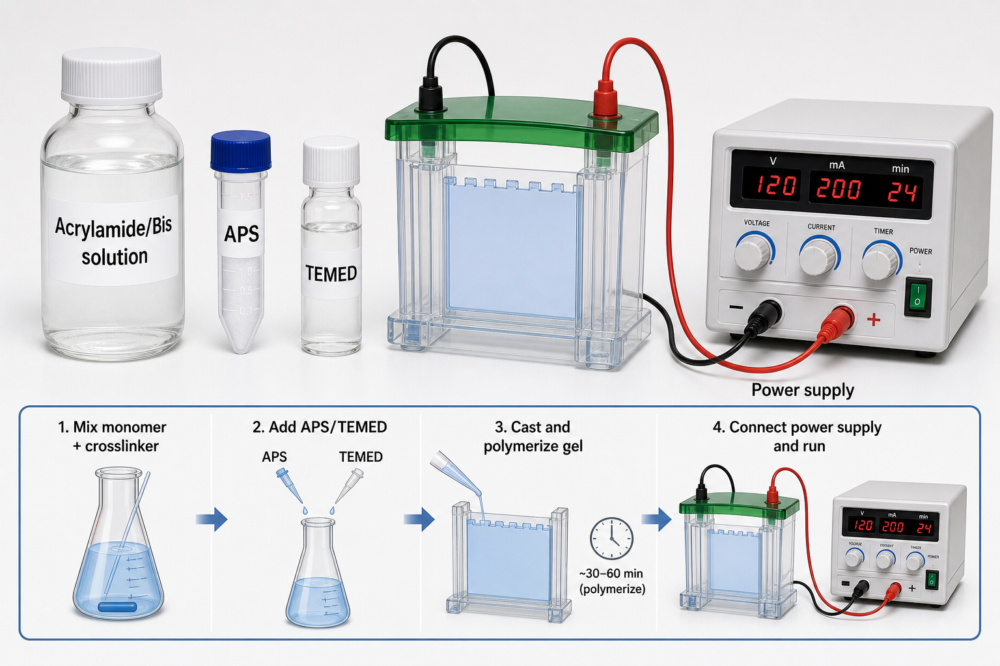

# 双丙烯酰胺

双丙烯酰胺（N,N'-methylenebisacrylamide，N,N'-亚甲基双丙烯酰胺；常简称 Bis 或 Bis-acrylamide）是 polyacrylamide gel（聚丙烯酰胺凝胶）的 crosslinker（交联剂）。在手灌 [SDS-PAGE凝胶](SDS-PAGE凝胶.md) 中，它和 [丙烯酰胺](丙烯酰胺.md) 共同聚合，决定凝胶网络的交联密度、机械强度和有效孔径。



图源：Image2 生成的 SDS-PAGE 聚合与电源参考图；左侧 Acrylamide/Bis 溶液表示丙烯酰胺单体和双丙烯酰胺交联剂的预混体系，底部示意加入 APS/TEMED 后灌胶聚合。

## 核心作用

丙烯酰胺像“线”，双丙烯酰胺像“桥”。只有丙烯酰胺时，体系更接近线性聚合物；加入双丙烯酰胺后，不同聚合链之间被交联，形成三维凝胶网络。这个网络就是蛋白在 [SDS-PAGE](<../用(实验流程内容篇)/SDS-PAGE.md>) 中按大小迁移的分子筛。

Sigma-Aldrich 的 N,N'-Methylenebisacrylamide solution M1533 页面说明，该试剂是用于聚丙烯酰胺凝胶制备的 cross-linking agent（交联剂），并可与 acrylamide 混合用于蛋白和核酸电泳凝胶。参考：[Sigma-Aldrich N,N'-Methylenebisacrylamide M1533](https://www.sigmaaldrich.com/US/en/product/sigma/m1533)。

## Acrylamide:Bis比例怎么理解

| 比例 | 含义 | 实验影响 |
| --- | --- | --- |
| 29:1 | 29 份 acrylamide + 1 份 Bis | 常见 SDS-PAGE 手灌胶体系 |
| 37.5:1 | Bis 相对更少 | 凝胶交联密度更低，孔径/弹性略变 |
| 19:1 | Bis 相对更多 | 交联密度更高，凝胶性质不同 |

两个参数要分开记录：

```text
%T = acrylamide + bis-acrylamide 的总浓度
%C = bis-acrylamide 占 acrylamide + bis-acrylamide 的比例
```

日常记录中常写“30% Acrylamide/Bis 29:1”，这里的 30% 是总单体浓度，29:1 是丙烯酰胺与双丙烯酰胺的比例。

## 和丙烯酰胺的区别

| 项目 | 丙烯酰胺 | 双丙烯酰胺 |
| --- | --- | --- |
| 英文 | Acrylamide | N,N'-methylenebisacrylamide |
| 角色 | 单体，形成聚合链主体 | 交联剂，连接聚合链 |
| 对凝胶影响 | 决定总聚合物浓度和孔径 | 决定交联密度和机械强度 |
| 常见购买形式 | 粉末或 30% 溶液 | 单独粉末/溶液，或 Acrylamide/Bis 预混液 |

日常手灌胶最好使用预混 Acrylamide/Bis 溶液，减少称量粉末和比例错误，也减少未聚合单体暴露。

## 使用 protocol

### 选择预混比例

**怎么做**：根据实验室既有体系选择 29:1 或 37.5:1 等预混溶液；不要在同一项目中无记录地更换比例。

**为什么**：比例改变会影响凝胶孔径、强度和分离效果。WB 条带变化时，如果比例换了，很难判断是生物学变化还是胶条件变化。

### 配胶聚合

**怎么做**：把 Acrylamide/Bis、buffer、[SDS](十二烷基硫酸钠.md) 和水混合后，最后加入 [过硫酸铵](过硫酸铵.md) 和 [TEMED](TEMED.md)，迅速灌胶。

**为什么**：APS/TEMED 加入后自由基聚合启动，体系会逐渐凝固。拖太久会导致灌胶不均或局部提前聚合。

## 常见错误与 troubleshooting

| 问题 | 可能原因 | 处理 |
| --- | --- | --- |
| 胶太软或容易破 | Bis 比例太低、总浓度低、APS/TEMED 不足 | 核对比例和聚合体系 |
| 条带分辨率变差 | Acrylamide:Bis 比例或总浓度变化 | 固定 29:1/37.5:1 并记录 |
| 胶不凝 | APS/TEMED 失效，不一定是 Bis 问题 | 先查 APS/TEMED |
| 不同批次胶差异大 | 自配粉末称量误差或预混液批次变化 | 使用预混液并记录批号 |

## 安全与废液

双丙烯酰胺和丙烯酰胺相关溶液都应按 [SDS与GHS标签](<../实验室安全/SDS与GHS标签.md>) 处理，避免皮肤接触、吸入粉末或溅入眼睛。未聚合废液应作为化学危害废液收集；聚合后的胶也按实验室规定处理。

## 购买与记录建议

常见供应商包括 [Bio-Rad](<../番外/试剂厂商/Bio-Rad.md>)、[Thermo Scientific](<../番外/试剂厂商/Thermo Scientific.md>)、[Merck](<../番外/试剂厂商/Merck.md>)/[Sigma-Aldrich](<../番外/试剂厂商/Sigma-Aldrich.md>)。优先购买 electrophoresis grade（电泳级）Acrylamide/Bis 预混液，减少手工配比误差。

推荐记录模板（中文）：

```text
Acrylamide/Bis产品：
品牌：
货号：
批号：
总浓度：
Acrylamide:Bis比例：
胶终浓度：
APS批号/终浓度：
TEMED批号/用量：
聚合时间：
异常现象：
```

Recommended record template (English):

```text
Acrylamide/Bis product:
Brand:
Catalog number:
Lot number:
Total concentration:
Acrylamide:Bis ratio:
Final gel percentage:
APS lot/final concentration:
TEMED lot/volume:
Polymerization time:
Abnormal observation:
```

## 小结

双丙烯酰胺决定聚丙烯酰胺凝胶的“网怎么连起来”。它常被隐藏在 Acrylamide/Bis 预混液里，但比例一变，凝胶性质就会变；因此记录比例和批号非常重要。

## 参考来源

- [Sigma-Aldrich N,N'-Methylenebisacrylamide M1533](https://www.sigmaaldrich.com/US/en/product/sigma/m1533)
- [Bio-Rad Acrylamide/Bis-acrylamide Solutions](https://www.bio-rad.com/en-us/category/acrylamide-bis-acrylamide-solutions)
- [Sigma-Aldrich Acrylamide A9099](https://www.sigmaaldrich.com/US/en/product/sigma/a9099)
