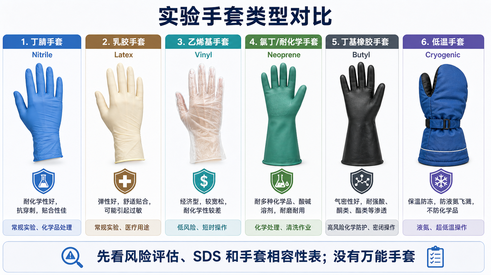

# 实验手套

## 一句话定义

实验手套是 laboratory gloves（实验室手套）的统称，是 [个人防护装备](<../实验室安全/个人防护装备.md>) 中最常用、也最容易被误用的一类耗材。它主要用于降低手部皮肤接触化学品、生物样本、污染表面、低温材料或机械锐器的风险。

手套不是万能屏障。OSHA（Occupational Safety and Health Administration，美国职业安全与健康管理局）手部防护标准要求根据具体 hazard（危险源）选择合适 hand protection（手部防护），包括吸收、割伤、刺伤、擦伤、化学灼伤、热灼伤和有害温度等风险。[参考：OSHA 29 CFR 1910.138](https://www.osha.gov/laws-regs/regulations/standardnumber/1910/1910.138)



## 为什么不能只写“戴手套”

在 protocol 里只写“戴手套”信息量太低，因为不同手套材料的用途差异很大：

- nitrile gloves（丁腈手套）常用于生物实验和一般化学操作，但不代表对所有有机溶剂都安全。
- latex gloves（乳胶手套）弹性和贴合性好，但可能引起 latex allergy（乳胶过敏）。
- vinyl gloves（乙烯基手套）便宜、宽松，适合低风险短时操作，但机械强度和耐化学性通常较弱。
- neoprene gloves（氯丁橡胶手套）常用于较强的化学品处理或清洗作业，通常比一次性薄手套更厚。
- butyl rubber gloves（丁基橡胶手套）常用于某些高危化学品、醛类、酮类、酯类等场景，但笨重、不适合精细移液。
- cryogenic gloves（低温手套/防冻手套）用于液氮、干冰、超低温样本相关操作，重点是防低温冻伤和飞溅，不是化学防护手套。

第一次接触新化学品时，应阅读 [SDS与GHS标签](<../实验室安全/SDS与GHS标签.md>) 并查 glove compatibility chart（手套化学相容性表）。OSHA Laboratory Safety Guidance 也强调，手套材料应根据实际化学品选择，而不是默认一种手套适合所有实验。[参考：OSHA Laboratory Safety Guidance](https://www.osha.gov/sites/default/files/publications/OSHA3404laboratory-safety-guidance.pdf)

## 常见手套类型对比

| 类型 | 英文 | 外观辨认 | 适合场景 | 主要局限 |
| --- | --- | --- | --- | --- |
| 丁腈手套 | Nitrile gloves | 多见蓝色、紫色或黑色，薄型一次性，贴合手指 | 常规生物实验、细胞培养、一般缓冲液、很多短时化学操作 | 对部分有机溶剂不可靠，长时间接触必须查相容性 |
| 乳胶手套 | Latex gloves | 多见乳白/淡黄色，弹性好，贴合性强 | 医疗或低风险生物操作、需要较好触感的操作 | 乳胶过敏风险；耐化学范围有限 |
| 乙烯基手套 | Vinyl gloves | 常较透明、较松、褶皱明显 | 低风险、短时间、非精细操作 | 容易破，贴合性和耐化学性较弱 |
| 氯丁橡胶手套 | Neoprene gloves | 多为较厚、较长袖口，常见绿色或黑色 | 酸碱、清洗、部分化学品处理 | 不适合所有溶剂；精细操作不方便 |
| 丁基橡胶手套 | Butyl rubber gloves | 多为黑色厚手套，长袖口，气密性好 | 某些高风险化学品、醛类/酮类/酯类等需专门防护的场景 | 昂贵、笨重，必须按具体化学品确认 |
| 层压膜手套 | Laminated film gloves | 薄膜感强，常较宽松，可作内层或外层 | 某些特殊溶剂和高危化学品，常作为化学屏障 | 机械强度和灵活性较差，常需外加保护手套 |
| 低温手套 | Cryogenic gloves | 厚、蓬松、保温层明显，可为五指或连指 | 液氮、干冰、超低温样本转移 | 不防化学品；潮湿后防护下降；不能浸入液氮 |
| 防割/防刺手套 | Cut-resistant gloves | 编织或复合材料，通常比一次性手套厚 | 玻璃、刀片、金属边缘、部分解剖或设备维护 | 不等于化学或生物防护，常需外戴一次性手套 |

## 选择逻辑

### 先判断危险源

选择手套之前，先做 [安全风险评估](<../实验室安全/安全风险评估.md>)：

- 是化学品、细胞、人体样本、微生物、低温材料还是锐器？
- 是短时间飞溅风险，还是长时间浸润接触？
- 体积多大？浓度多高？温度多高或多低？
- 是否需要精细操作，例如移液、开盖、装板？
- 手套污染后是否会接触门把手、键盘、手机或公共设备？

### 再查 SDS 和相容性表

对化学品，尤其是有机溶剂、强腐蚀、强氧化、强毒性、致癌或皮肤渗透性强的试剂，必须查 SDS 和手套相容性表。

重要概念：

- breakthrough time（穿透时间）：化学品从手套外侧穿透到内侧所需时间。
- degradation（降解）：手套材料变脆、变黏、膨胀、变硬或失去强度。
- permeation（渗透）：化学分子穿过手套材料的过程，可能肉眼看不出来。
- dexterity（灵活性）：手套越厚通常越不灵活，可能影响移液、开盖和精细操作。

Ansell 和其他手套厂商会提供 chemical resistance guide（耐化学性指南），适合用于初筛，但最终仍要结合本实验室 SOP、SDS 和 EHS 要求。[参考：Ansell Chemical Resistance Guide](https://www.ansell.com/us/en/chemical-glove-resistance-guide)

### 最后决定是否需要叠戴

double gloving（双层手套）适合某些高污染或高后果场景，例如处理人体样本、感染性材料、某些细胞毒试剂或需要频繁更换外层手套的操作。但双层手套不是万能升级：

- 叠戴同一种材料不一定显著解决化学穿透问题。
- 双层手套会降低触感，可能增加移液、开盖或针刺风险。
- 更好的策略可能是换材料、换更厚手套、使用工程控制或减少接触时间。

## 常见实验场景推荐起点

| 场景 | 推荐起点 | 需要升级时 |
| --- | --- | --- |
| 常规细胞培养 | 丁腈一次性手套 | 人体样本、病毒载体、感染性材料时按 [生物安全基础](<../实验室安全/生物安全基础.md>) 升级 |
| 普通缓冲液和盐溶液 | 丁腈手套 | 大体积或加压转移时增加眼部/面部防护 |
| DMSO 相关操作 | 丁腈手套起步，但避免长时间接触 | 如果 DMSO 携带其他有毒小分子，按被溶解物重新评估；参考 [DMSO](DMSO.md) |
| 氯仿、酚、强有机溶剂 | 查 SDS 和相容性表，不默认丁腈足够 | 可能需要丁基、层压膜或专门耐化学手套；参考 [氯仿](氯仿.md) |
| 强酸强碱清洗 | 较厚的氯丁/耐化学手套 | 大体积时加围裙、面屏、通风橱或专用清洗区 |
| 液氮/干冰 | 低温手套 + 眼部/面部防护 | 大量液氮转移时参考 [液氮安全](<../实验室安全/液氮安全.md>) |
| 玻璃破碎/锐器处理 | 防割手套或工具夹取 | 外层再戴一次性手套以避免污染，参考 [锐器安全](<../实验室安全/锐器安全.md>) |

## 使用 protocol

### 戴手套前

- 根据实验风险选择手套类型和尺码。
- 检查是否破损、老化、黏连、变色或污染。
- 确认手套和袖口能覆盖皮肤暴露区域。
- 对化学品实验，确认已经查过 SDS 和相容性。

### 操作中

- 避免戴污染手套触摸手机、门把手、键盘、冰箱把手和公共设备。
- 手套被明显污染、破损、接触未知液体或离开污染区域前，应及时更换。
- 化学品溅到手套上时，不要继续操作到“做完再换”，应按 SDS 和 SOP 处理。
- 需要长时间接触化学品时，按穿透时间设置更换频率。

### 脱手套

- 脱手套时避免外表面接触皮肤。
- 脱除后立即洗手。
- 按污染类型进入对应废弃物流，不要把污染手套丢进普通垃圾。

## 采购和记录建议

采购时不要只写“手套”。

至少记录：

- 材料：nitrile、latex、vinyl、neoprene、butyl、cryogenic 等。
- 尺码：XS/S/M/L/XL。
- 是否无粉：powder-free（无粉）通常更适合细胞培养和分子实验。
- 是否无菌：sterile（无菌）与 non-sterile（非无菌）要区分。
- 厚度和长度：薄型检查手套、加厚手套、长袖口手套。
- 适用标准或等级：如医疗检查级、化学防护等级、低温防护等。
- 品牌、货号、批号、开封日期。

中文记录模板：

```text
手套名称：
材料：
品牌：
货号：
批号：
尺码：
是否无粉：
是否无菌：
厚度/长度：
适用实验：
不适用风险：
SDS/相容性表是否确认：
开封日期：
存放位置：
备注：
```

English record template:

```text
Glove name:
Material:
Brand:
Catalog number:
Lot number:
Size:
Powder-free: yes / no
Sterile: yes / no
Thickness / cuff length:
Intended use:
Not suitable for:
SDS / compatibility chart checked: yes / no
Open date:
Storage location:
Notes:
```

## 常见错误与 troubleshooting

| 问题 | 可能原因 | 后果 | 建议 |
| --- | --- | --- | --- |
| 手套没破但皮肤仍暴露 | 化学品渗透或手套材料不匹配 | 低估皮肤暴露风险 | 查相容性表，不只看是否漏液 |
| 戴两层丁腈处理所有溶剂 | 把厚度当作材料相容性 | 仍可能被某些溶剂穿透 | 换合适材料或改变操作方式 |
| 细胞培养污染变多 | 手套触摸公共物品后继续进 BSC | 污染带入培养体系 | 进入 BSC 前更换或消毒手套，建立清洁/污染边界 |
| 手套太大 | 尺码不合适 | 移液、开盖、夹取时更容易失误 | 选择合适尺码 |
| 低温手套被液氮浸湿 | 误认为低温手套可浸入液氮 | 冻伤风险上升 | 低温手套防飞溅和短时接触，不用于浸泡 |
| 乳胶手套引起皮肤不适 | 乳胶蛋白或添加剂过敏 | 皮炎、瘙痒或过敏反应 | 改用丁腈或无乳胶手套，并报告负责人 |

## 图片和参考图源

本页的对比图是原创示意图，用于帮助辨认外观差异。实际采购和使用前，建议再查看具体产品图片和手套厂商的相容性资料。

可参考的图片/资料来源：

- UC Berkeley EHS glove selection guide：包含实验室手套选择和类型参考。[参考：UC Berkeley EHS Glove Selection Guide](https://ehs.berkeley.edu/glove-selection-guide)
- OSHA hand protection standard：说明手部防护需要根据具体危险选择。[参考：OSHA 29 CFR 1910.138](https://www.osha.gov/laws-regs/regulations/standardnumber/1910/1910.138)
- OSHA Laboratory Safety Guidance：包含实验室 PPE 和手套选择原则。[参考：OSHA Laboratory Safety Guidance](https://www.osha.gov/sites/default/files/publications/OSHA3404laboratory-safety-guidance.pdf)
- Ansell chemical resistance guide：用于按化学品查询手套材料耐受性。[参考：Ansell Chemical Resistance Guide](https://www.ansell.com/us/en/chemical-glove-resistance-guide)
- Fisher Scientific gloves and hand protection：适合查看不同手套类型的商品外观和规格字段。[参考：Fisher Scientific Gloves and Hand Protection](https://www.fishersci.com/us/en/browse/90136101/gloves-and-hand-protection)

## 小结

实验手套是最常用的 PPE，但也是最容易被“默认化”的耗材。正确写法不是“戴手套”，而是写清楚手套材料、用途、限制、更换频率、相容性依据和污染后处理方式。没有万能手套，只有针对具体风险选择的手套。
