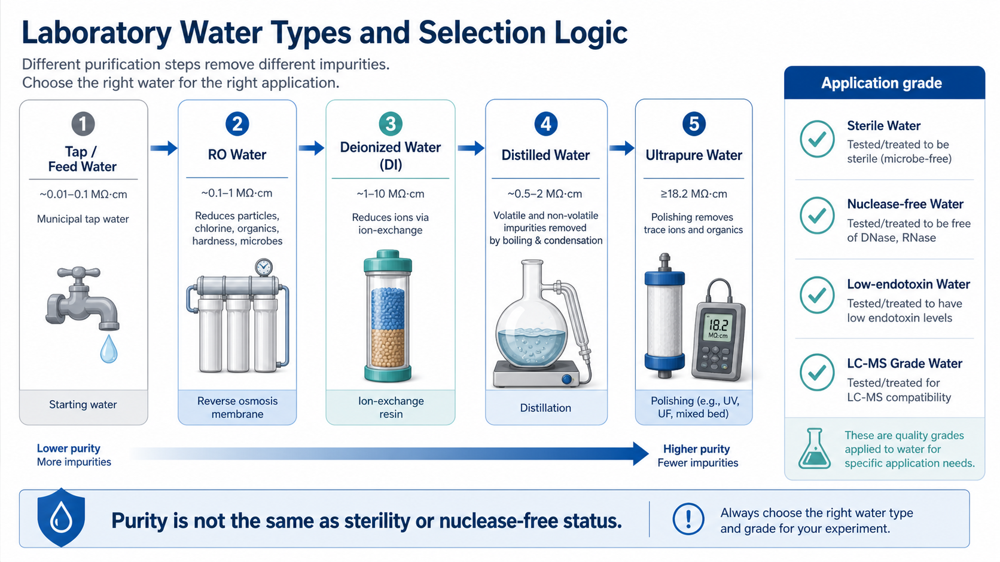

# 无菌水

Sterile water（无菌水）是经过灭菌处理并以无菌形式提供或保存的水。它的核心指标是 sterility（无菌性），而不是离子背景、TOC、核酸酶或内毒素水平；因此无菌水不能自动等同于 [超纯水](超纯水.md)、[无核酸酶水](无核酸酶水.md) 或 low-endotoxin water（低内毒素水）。



图源：Image2 生成的实验用水类型选择逻辑图；sterile water 被放在右侧 application grade，表示它是用途等级，而不是纯化梯度上的“下一步”。

## 核心概念

无菌水解决的是“有没有可生长微生物”的问题。它可以通过 [高压灭菌](<../用(实验流程内容篇)/高压灭菌.md>)、[无菌过滤](<../用(实验流程内容篇)/无菌过滤.md>)、商业无菌灌装等方式获得。

但无菌不代表：

- 离子很少。
- 有机物很低。
- 没有 RNase/DNase。
- 没有内毒素。
- 适合细胞培养、注射或质谱。

这点在生物实验里非常关键：细菌被杀死后，endotoxin（[内毒素](<../番外/补充知识/内毒素.md>)）仍可能存在；水被灭菌后，核酸酶也不一定完全失活或被去除。

## 常见类型

| 类型 | 英文 | 典型用途 | 注意 |
| --- | --- | --- | --- |
| 实验室自制无菌水 | lab-made sterile water | 普通无菌配液、清洗 | 质量取决于原水、容器和灭菌流程 |
| 细胞培养级无菌水 | cell culture grade sterile water | 细胞相关试剂配制 | 关注无菌、内毒素和细胞适用性 |
| 注射用水 | [water for injection, WFI](注射用水.md) | 药品或临床相关制剂 | 有药典和生产要求，不等于普通实验水 |
| 无菌蒸馏水 | sterile distilled water | 一些细胞和分子实验配液 | 仍需看是否 nuclease-free 或 low-endotoxin |
| 无菌无核酸酶水 | sterile nuclease-free water | RNA、PCR、qPCR | 同时控制无菌和核酸酶风险 |

## 常见用途

| 用途 | 是否合适 | 备注 |
| --- | --- | --- |
| 无菌盐溶液或 buffer 配制 | 合适 | 仍需确认水质和配方 |
| 细胞培养相关试剂 | 视等级而定 | 优先 cell culture grade、低内毒素 |
| 重组蛋白或细胞因子复溶 | 视说明书而定 | 有些产品要求无菌水、PBS、酸性 buffer 或含载体蛋白 buffer |
| PCR、RNA、qPCR | 只有无菌不够 | 应使用无核酸酶水 |
| 注射或动物给药 | 不能随意使用实验室无菌水 | 需符合药典或伦理/平台要求 |
| HPLC/LC-MS | 通常不合适 | 应使用分析级或 LC-MS 级水 |

## 无菌水 vs 其他实验用水

| 对比对象 | 关键区别 |
| --- | --- |
| [去离子水](去离子水.md) | DI water 主要去离子；无菌水主要控制微生物 |
| [蒸馏水](蒸馏水.md) | 蒸馏是纯化方法；无菌是微生物状态 |
| [反渗透水](反渗透水.md) | RO 是水系统预处理；无菌水是应用等级 |
| 超纯水 | 超纯水强调低离子/低有机背景；无菌水强调无活微生物 |
| 无核酸酶水 | 无核酸酶水强调 DNase/RNase 控制；无菌水未必适合 RNA |

## 制备和使用 protocol

### 自制无菌水的一般思路

1. 选择合适水源，例如超纯水或去离子水。
2. 分装到耐高压灭菌容器，留出膨胀空间。
3. 按平台 SOP 高压灭菌。
4. 冷却后检查瓶盖、标签、液体外观和容器完整性。
5. 标记水源、灭菌日期、操作者和有效期。
6. 在无菌操作中使用，开封后尽快用完。

### 什么时候选择商业无菌水

以下情况建议直接购买商业产品：

- 细胞培养长期项目。
- 原代细胞、免疫细胞、类器官或干细胞体系。
- RNA、PCR 或测序相关实验。
- 对内毒素、无菌、核酸酶或批间一致性有记录要求。
- 需要符合药典、GMP 或动物实验平台要求。

## 注意事项

### 高压灭菌不能解决所有问题

高压灭菌可以杀灭多数微生物和芽孢，但不等于去除内毒素、有机污染、金属离子或核酸酶残留。对于免疫细胞和炎症因子检测，内毒素尤其容易造成假阳性刺激。

### 开封后不再是“无限无菌”

商业无菌水一旦开封，就受到吸头、瓶口、空气、手套和台面污染风险影响。需要长期使用时，最好小规格包装或无菌分装。

### 不要用无菌水保存电极

pH 电极、部分离子电极和电化学探头需要专用保存液。无菌水即使无菌，也可能因低离子强度损伤电极或稀释参比系统。

## 常见错误与 troubleshooting

| 现象 | 可能原因 | 处理 |
| --- | --- | --- |
| 细胞实验出现炎症背景 | 水无菌但内毒素未控制 | 使用低内毒素或细胞培养级水 |
| PCR/RNA 实验异常 | 无菌水不等于无核酸酶水 | 改用 nuclease-free water |
| 无菌配液后仍污染 | 容器、瓶口、吸头或操作污染 | 使用小包装，改进无菌操作 |
| 自制水开封后浑浊 | 开封污染或储存时间过长 | 丢弃，缩短使用周期 |
| 蛋白复溶后活性差 | 水不符合厂家推荐，pH/盐/载体条件不合适 | 按说明书选择复溶液 |

## 选择和购买

购买时不要只看“sterile”一个词，还要看：

- 是否 cell culture grade。
- 是否 endotoxin tested 或 low endotoxin。
- 是否 DNase-free/RNase-free。
- 包装规格是否适合一次或短期使用。
- 是否有 COA、批号和有效期。
- 是否适合 injection、irrigation、cell culture 或 molecular biology。

常见供应商包括 [Thermo Fisher Scientific](<../番外/试剂厂商/Thermo Fisher Scientific.md>)、[Gibco](<../番外/试剂厂商/Gibco.md>)、[Sigma-Aldrich](<../番外/试剂厂商/Sigma-Aldrich.md>) / [Merck](<../番外/试剂厂商/Merck.md>)、[MilliporeSigma](<../番外/试剂厂商/MilliporeSigma.md>) 等。对于细胞实验，优先选择有 cell culture、sterile、endotoxin 或 COA 信息的产品。

## 推荐记录模板

中文模板：

```text
水类型：无菌水
品牌 / 自制：
货号：
批号：
水源：
灭菌方式：
是否无核酸酶：
是否低内毒素：
开封日期：
用途：
操作者：
备注：
```

English template:

```text
Water type: sterile water
Brand / in-house preparation:
Catalog number:
Lot number:
Water source:
Sterilization method:
Nuclease-free status:
Low-endotoxin status:
Opening date:
Application:
Operator:
Notes:
```

## 总结

无菌水的关键词是“无活微生物”，不是“最高纯度”。它适合无菌配液和部分细胞相关操作，但是否适合 RNA、PCR、免疫细胞、注射或质谱，要看无核酸酶、内毒素、药典和分析等级等额外要求。把无菌当成唯一标准，是实验用水误用里最常见的坑之一。

## 参考来源

- [ASTM D1193 Standard Specification for Reagent Water](https://www.astm.org/d1193-06r18.html)
- [Thermo Fisher water purification](https://www.thermofisher.com/us/en/home/industrial/water-purification.html)
- [Gibco distilled water product page](https://www.thermofisher.com/order/catalog/product/15230162)
