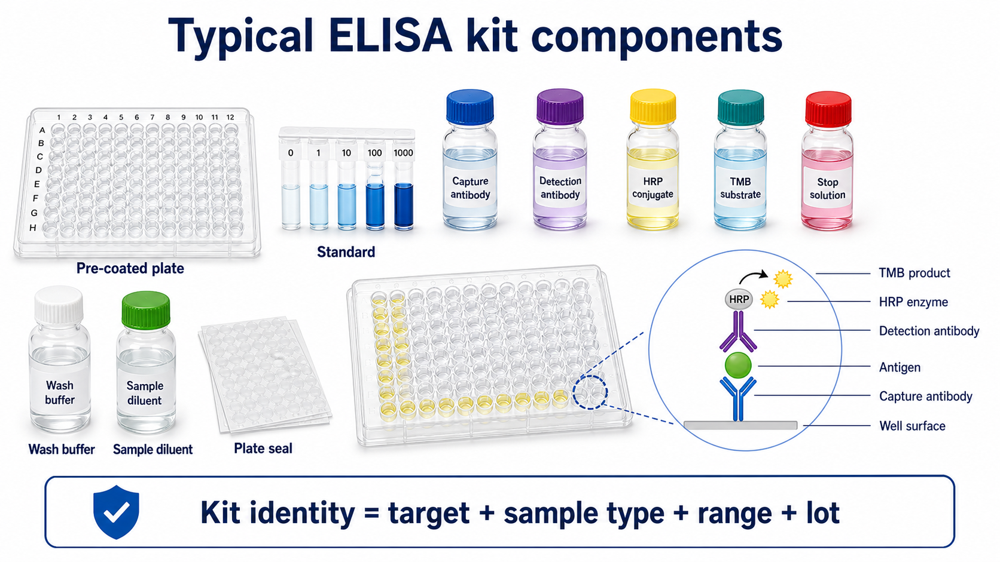

# 检测抗体

Detection antibody（检测抗体）是在 [夹心ELISA](<../用(实验流程内容篇)/夹心ELISA.md>) 中识别已被 [捕获抗体](捕获抗体.md) 捕获的目标抗原的第二支抗体。它通常直接或间接连接 HRP、AP、生物素或荧光标记，用来把抗原-抗体结合事件转化为可检测信号。



图源：Image2 生成的 ELISA kit 组件参考图；图中 detection antibody 位于 antigen 上方，并通过 HRP conjugate 和 TMB substrate 产生显色信号。

## 核心作用

检测抗体负责“确认并放大”目标抗原：

```text
捕获抗体抓住抗原
-> 检测抗体识别抗原另一个表位
-> HRP / streptavidin-HRP / 二抗提供酶信号
-> TMB显色
```

检测抗体不是普通 [一抗](一抗.md) 的简单别名。它必须能在目标抗原已经被捕获的状态下继续结合，且不能和捕获抗体竞争同一个表位。

## 常见形式

| 形式 | 英文 | 特点 |
| --- | --- | --- |
| 未标记检测抗体 | unconjugated detection antibody | 需要酶标二抗检测 |
| 生物素化检测抗体 | biotinylated detection antibody | 常配合 streptavidin-HRP |
| HRP标记检测抗体 | HRP-conjugated detection antibody | 步骤少，背景路径少 |
| AP标记检测抗体 | AP-conjugated detection antibody | 替代 HRP 体系 |
| 荧光检测抗体 | fluorescent detection antibody | 用于荧光读出 |

最常见的 sandwich ELISA kit 使用 biotinylated detection antibody（[生物素化抗体](生物素化抗体.md)）+ [链霉亲和素-HRP](<链霉亲和素-HRP.md>) 或 HRP conjugate，再用 TMB 显色。

## 和捕获抗体的配对关系

| 要点 | 说明 |
| --- | --- |
| 表位不同 | 两支抗体要能同时结合目标抗原 |
| 物种匹配 | 要识别同一目标物种的蛋白 |
| 标准品匹配 | 标准品应包含两支抗体都能识别的结构 |
| 样本兼容 | 样本基质不能明显干扰检测抗体结合 |
| 标记兼容 | 标签和底物/读板模式要匹配 |

如果检测抗体换了 clone，整个 ELISA 的 [特异性](<../番外/补充知识/特异性.md>)、灵敏度和 [交叉反应](<../番外/补充知识/交叉反应.md>) 都可能改变。

## 使用注意事项

### 检测抗体浓度要优化

浓度太低会信号弱，浓度太高会背景高。自建 ELISA 中常用 checkerboard titration 同时优化捕获抗体和检测抗体。

### 关注标签体系

检测抗体若为 biotinylated，需要配合 streptavidin-HRP；若已经 HRP 标记，就不应再加 HRP 二抗。不要把 HRP、AP、荧光和生物素体系混用。

### 避免叠氮钠影响HRP

含 [叠氮钠](叠氮钠.md) 的抗体保存液可能抑制 HRP。若检测链条中使用 HRP，需要确认抗体稀释液和保存液是否兼容。

### 注意内源性干扰

血清、血浆或组织样本中可能有 heterophilic antibodies（异嗜性抗体）、human anti-animal antibodies、内源性 biotin 或 rheumatoid factor 等干扰，造成假阳性或非线性稀释。

## 常见错误与 troubleshooting

| 现象 | 可能原因 | 处理 |
| --- | --- | --- |
| 标准曲线无信号 | 检测抗体不识别被捕获抗原 | 换配对抗体或厂家推荐组合 |
| 背景高 | 检测抗体过浓、洗板不足、封闭不合适 | 降低浓度，优化洗板和封闭 |
| 阴性孔有信号 | 检测抗体非特异结合 | 换 blocker 或提高稀释倍数 |
| 样本稀释不线性 | 基质干扰检测抗体或酶反应 | 做稀释线性和 spike recovery |
| 批次变化后信号变弱 | 检测抗体批号或标记效率变化 | 固定批号，加 QC 对照 |
| HRP体系无信号 | 加错酶标物、叠氮钠抑制 HRP、TMB失效 | 检查标签、稀释液和底物 |

## 购买建议

购买检测抗体时，优先选择与捕获抗体明确配套的 antibody pair 或 ELISA development set。单独购买“anti-target antibody”风险较高，因为它可能只验证了 WB、flow、IHC 或 IF，不一定适合 ELISA detection。

常见供应商包括 [R&D Systems](<../番外/试剂厂商/R&D Systems.md>)、[BioLegend](<../番外/试剂厂商/BioLegend.md>)、[Thermo Fisher Scientific](<../番外/试剂厂商/Thermo Fisher Scientific.md>)、[Abcam](<../番外/试剂厂商/Abcam.md>) 等。选择时看 application validation（应用验证）是否明确写 ELISA detection。

## 记录模板

中文模板：

```text
检测抗体名称：
靶标：
clone：
宿主：
标签：biotin / HRP / AP / 未标记 / 其他
品牌：
货号：
批号：
工作浓度：
稀释液：
配套捕获抗体：
酶标物：
孵育时间/温度：
保存条件：
备注：
```

English template:

```text
Detection antibody name:
Target:
Clone:
Host species:
Label: biotin / HRP / AP / unconjugated / other
Brand:
Catalog number:
Lot number:
Working concentration:
Diluent:
Matched capture antibody:
Enzyme conjugate:
Incubation time/temperature:
Storage condition:
Notes:
```

## 总结

检测抗体是 sandwich ELISA 的第二重识别和信号入口。它必须和捕获抗体配对，识别不同表位，并与 HRP/TMB、biotin-streptavidin 或其他检测体系兼容。检测抗体浓度、标签和洗板条件往往决定背景和动态范围。

## 参考来源

- [BioLegend sandwich ELISA protocol](https://www.biolegend.com/en-us/protocols/sandwich-elisa-protocol)
- [R&D Systems ELISA protocols](https://www.rndsystems.com/resources/protocols)
- [Thermo Fisher Overview of ELISA](https://www.thermofisher.com/us/en/home/life-science/protein-biology/protein-biology-learning-center/protein-biology-resource-library/pierce-protein-methods/overview-elisa.html)
