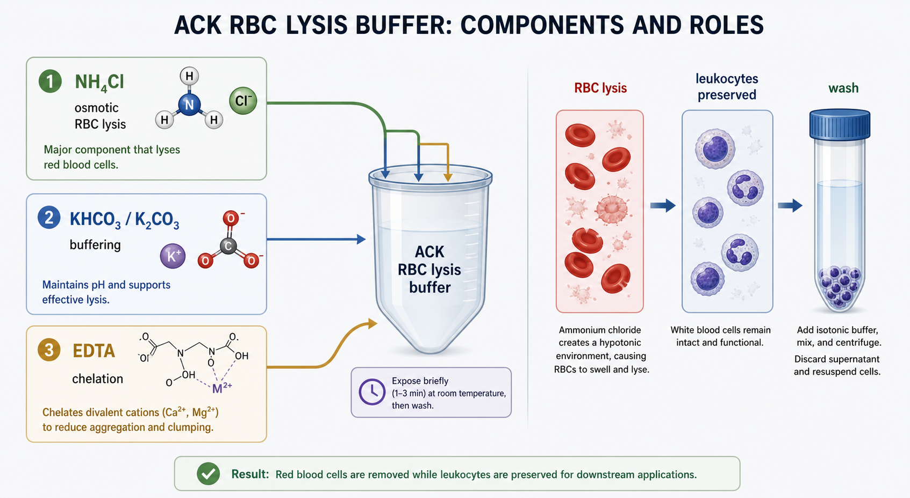

# 氯化铵

氯化铵（ammonium chloride，NH4Cl）是一种常用无机铵盐，在细胞实验中最常见的用途之一是作为 [红细胞裂解液](红细胞裂解液.md)（red blood cell lysis buffer，RBC lysis buffer）或 ACK lysis buffer（ammonium-chloride-potassium lysis buffer，ACK 裂解液）的主要功能成分，用于短时间裂解 erythrocytes（红细胞，RBC）。



图源：Image2 生成的 ACK 红细胞裂解液组分示意图。NH4Cl 是主要红细胞裂解成分，KHCO3/K2CO3 参与缓冲，EDTA 负责螯合，处理后需要及时洗涤。

## 定义与命名

| 名称 | 说明 |
| --- | --- |
| Ammonium chloride | 氯化铵 |
| NH4Cl | 化学式 |
| CAS 12125-02-9 | 常用登记号 |
| ACK lysis buffer component | ACK 红细胞裂解液核心成分 |

PubChem 将 ammonium chloride 记录为无机化合物，分子式为 NH4Cl。参考：[PubChem Ammonium Chloride](https://pubchem.ncbi.nlm.nih.gov/compound/Ammonium-Chloride)。

## 在红细胞裂解中的作用

氯化铵基红细胞裂解液利用红细胞对特定离子和渗透压变化的敏感性，使成熟红细胞发生裂解；而白细胞等有核细胞在短时间、合适 pH 和等渗/近等渗条件下相对更能保留。Thermo Fisher 的 eBioscience 1X RBC Lysis Buffer 说明中也明确该产品含 ammonium chloride，用于裂解人外周血或小鼠造血组织单细胞悬液中的 erythrocytes。参考：[Thermo Fisher eBioscience 1X RBC Lysis Buffer](https://www.thermofisher.com/order/catalog/product/00-4333-57)。

需要强调：NH4Cl 的“选择性”是条件性的。暴露时间太久、温度不合适、pH 不合适或细胞状态差时，白细胞活率和功能也会受影响。

## 常见用途

| 用途 | 为什么用 NH4Cl |
| --- | --- |
| ACK/RBC 裂解液 | 作为红细胞裂解主效应成分 |
| 全血或骨髓样本处理 | 去除红细胞背景，保留白细胞用于流式或培养 |
| PBMC 分离后补救 | [密度梯度离心](<../用(实验流程内容篇)/密度梯度离心.md>) 后红细胞残留时短时间处理 |
| 小鼠脾脏单细胞悬液 | 去除样本中大量红细胞 |
| 分选前样本清理 | 降低红细胞对计数、过滤和分选的干扰 |

## 与 ACK 中其他成分的关系

| 成分 | 常见角色 | 不能忽略的点 |
| --- | --- | --- |
| 氯化铵 | 红细胞裂解主效应成分 | 时间过长会损伤白细胞 |
| [碳酸氢钾](碳酸氢钾.md) | 常见 ACK 缓冲成分之一 | 不能随意用其他钾盐等量替换 |
| [碳酸钾](碳酸钾.md) | 某些商品 RBC lysis buffer 中的缓冲成分 | 碱性更强，配方要按说明书 |
| [EDTA](EDTA.md) | 螯合 Ca2+/Mg2+，减少聚集 | 浓度过高可能影响下游 |
| [PBS](PBS.md) / [DPBS](DPBS.md) | 终止、稀释或洗涤 | 不是裂解主成分 |

## 自配与购买的选择

| 选择 | 优点 | 风险 |
| --- | --- | --- |
| 购买 1X RBC lysis buffer | 即用，减少配方错误 | 单位体积成本高，批号仍需记录 |
| 购买 10X RBC lysis buffer | 储存方便，稀释灵活 | 稀释错误会影响活率和裂解效率 |
| 自配 ACK | 成本低，可按 SOP 固定 | pH、渗透压、称量和无菌控制都要严格 |

如果是关键样本、临床来源样本、单细胞测序或功能实验，优先使用已验证商品试剂或经过充分 QC 的自配批次。自配时应记录称量、溶剂、pH、过滤除菌、配制日期和保存条件。

## 使用注意事项

| 变量 | 为什么重要 | 建议 |
| --- | --- | --- |
| 浓度 | 决定裂解强度 | 不要凭感觉加粉末或浓缩液 |
| pH | 影响白细胞状态和裂解效率 | 按 SOP 调整并记录 |
| 渗透压 | 影响选择性和细胞活率 | 自配后最好验证 |
| 暴露时间 | 过长会损伤目标细胞 | 先短时间处理，再视红细胞残留决定是否重复 |
| 温度 | 影响裂解速度 | 记录室温/4°C/其他条件 |
| 终止与洗涤 | 去除残留裂解液和碎片 | 及时加入缓冲液/培养基并离心洗涤 |

## 常见错误与 troubleshooting

| 问题 | 可能原因 | 处理 |
| --- | --- | --- |
| 红细胞裂解不完全 | NH4Cl 浓度低、时间短、红细胞太多 | 轻度延长或重复短处理 |
| 白细胞活率下降 | 时间过长、pH/渗透压不合适、终止不及时 | 缩短暴露并复核配方 |
| 细胞团聚 | 裂解碎片、DNA 或钙镁离子影响 | 过滤，优化 EDTA 和洗涤 |
| 流式背景高 | 裂解碎片或死细胞多 | 增加洗涤，加入死活染 |
| 自配批次不稳定 | 称量、pH、过滤或储存条件不同 | 建立批记录和小规模 QC |

## 推荐记录模板

中文记录模板：

```text
试剂名称：氯化铵
英文名称：ammonium chloride
品牌/供应商：
货号：
批号：
级别：
CAS：
配制用途：ACK/RBC裂解液/其他
称量量：
最终浓度：
溶剂：
pH：
过滤除菌：
配制日期：
保存条件：
使用浓度：
处理时间：
处理温度：
下游用途：
异常现象：
```

English record template:

```text
Reagent name: ammonium chloride
Chinese name: 氯化铵
Brand/supplier:
Catalog number:
Lot number:
Grade:
CAS:
Preparation purpose: ACK/RBC lysis buffer/other
Weighed amount:
Final concentration:
Solvent:
pH:
Sterile filtration:
Preparation date:
Storage condition:
Working concentration:
Treatment time:
Treatment temperature:
Downstream use:
Abnormal observation:
```

## 小结

氯化铵是 ACK/RBC 红细胞裂解体系中的主效应成分，但它不是“越多越好”。真正决定结果的是浓度、pH、渗透压、处理时间、温度、终止和洗涤是否被控制。任何自配或购买的氯化铵相关裂解液，都应记录到可追溯的批号和配方层级。

## 参考来源

- [PubChem Ammonium Chloride](https://pubchem.ncbi.nlm.nih.gov/compound/Ammonium-Chloride)
- [Thermo Fisher eBioscience 1X RBC Lysis Buffer](https://www.thermofisher.com/order/catalog/product/00-4333-57)
- [BioLegend RBC Lysis Buffer 10X](https://www.biolegend.com/en-us/products/rbc-lysis-buffer-10x-1498)
