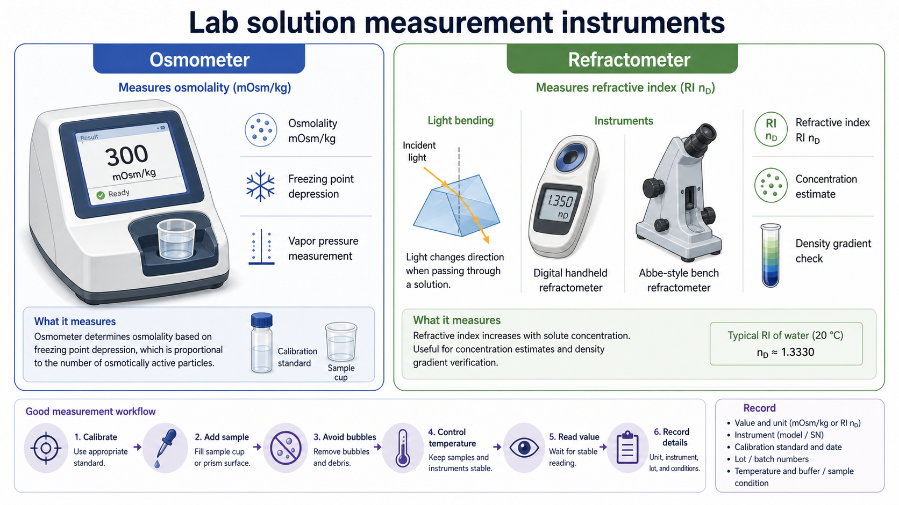

# 渗透压仪

Osmometer（渗透压仪）是用于测量 solution osmolality（溶液渗透质量摩尔浓度，常口语称“渗透压”）的仪器，常见读数单位是 mOsm/kg。它在细胞培养、缓冲液配制、冻存液质控和密度梯度介质配制中很有用，因为细胞和细胞器对水分进出非常敏感。



图源：Image2 生成的溶液测量仪器参考图。左侧展示渗透压仪的常见台式外观、样品杯和 mOsm/kg 读数；右侧展示 [折光仪](折光仪.md) 用于折光率和密度梯度检查的逻辑。

## 定义与命名

渗透压仪的英文是 osmometer。严格说，它通常测量的是 [osmolality（渗透质量摩尔浓度）](<../番外/补充知识/渗透压.md>)，而不是直接测量 osmotic pressure（渗透压压力）。实验记录中最常见写法是：

```text
Osmolality = 300 mOsm/kg
Instrument = osmometer
Method = freezing point depression / vapor pressure / other
```

其中 mOsm/kg 表示每 kg 溶剂中渗透活性粒子的毫渗透摩尔数。对细胞实验来说，这个数比“感觉盐浓度差不多”更可靠。

## 常见类型

| 类型 | 原理 | 优点 | 局限 |
| --- | --- | --- | --- |
| Freezing point depression osmometer（冰点下降渗透压仪） | 溶液中粒子越多，冰点下降越明显 | 细胞培养、临床和常规 QC 很常见 | 需要控制样品洁净度和校准 |
| Vapor pressure osmometer（蒸气压渗透压仪） | 溶质降低水蒸气压 | 对某些高分子或少量样品有用 | 挥发性溶剂和复杂样品可能干扰 |
| Membrane osmometer（膜渗透压仪） | 通过半透膜测渗透压差 | 可用于部分高分子溶液 | 不一定适合常规细胞培养质控 |

多数生命科学实验室最常接触的是冰点下降法渗透压仪。购买和记录时应写清具体方法，因为不同原理对样品类型和干扰因素的敏感性不同。

## 主要用途

| 场景 | 为什么要测 | 典型判断 |
| --- | --- | --- |
| [培养基](培养基.md) / 完全培养基 | 血清、补充剂、药物 stock 会改变最终 osmolality | 细胞长期状态是否异常 |
| [PBS](PBS.md) / [DPBS](DPBS.md) | 洗细胞时避免低渗或高渗刺激 | 洗液是否适合活细胞 |
| [细胞冻存液](细胞冻存液.md) | [DMSO](DMSO.md)、糖、蛋白和盐都会影响水分迁移 | 冻存复苏活率是否稳定 |
| [OptiPrep](OptiPrep.md) / [Nycodenz](Nycodenz.md) 梯度 | 高密度介质必须同时控制密度和渗透环境 | 分离后细胞/细胞器是否受损 |
| 药物处理液 | 高浓度 stock 加入后可能高渗 | vehicle control 是否合理 |
| 自配缓冲液 | 称量或定容误差会改变渗透负担 | 批间一致性 |

渗透压仪最适合回答的问题不是“这个溶液 pH 对不对”，而是“细胞看到的总渗透负担是否合理”。

## 基本操作流程

不同品牌和型号的操作细节不同，下面是通用思路：

```text
开机预热：
确认仪器清洁状态：
用标准液校准：
充分混匀待测样品：
取规定体积加入样品杯：
避免气泡、沉淀和挂壁：
开始测量并等待稳定读数：
记录 mOsm/kg、仪器、校准液、温度和样品批号：
必要时重复测量：
测后清洁样品仓和接触部件：
```

如果样品是含蛋白、血清、细胞碎片或高黏度介质，重复性可能变差。关键样品建议至少测 2-3 次，并记录平均值和异常读数。

## 关键注意事项

| 注意点 | 为什么重要 | 建议 |
| --- | --- | --- |
| 校准液 | 决定读数基线 | 使用厂家推荐标准液，记录批号和日期 |
| 样品体积 | 体积不足会影响测量 | 严格按型号说明加入 |
| 蒸发 | 小体积样品蒸发会浓缩 | 尽快测量，避免敞口放置 |
| 沉淀/颗粒 | 会影响冰点或蒸气压读数 | 必要时澄清样品，记录处理方式 |
| 温度 | 样品和仪器状态影响稳定性 | 按说明书平衡或记录温度 |
| 清洁 | 残留会污染下一次读数 | 每次测后按说明清洁 |
| 方法类型 | 不同原理抗干扰能力不同 | 记录 freezing point/vapor pressure 等方法 |

不要用 [pH计](pH计.md)、[电导率仪](电导率仪.md) 或折光仪直接替代渗透压仪。它们测量的是不同物理量，最多能提示“可能有异常”，不能等价给出 mOsm/kg。

## 和其他溶液质控仪器对比

| 仪器 | 测什么 | 适合回答什么问题 |
| --- | --- | --- |
| 渗透压仪 | osmolality，mOsm/kg | 细胞或细胞器是否会受到渗透压力 |
| pH计 | pH | 酸碱状态是否合适 |
| 电导率仪 | conductivity（电导率） | 离子含量或纯水/缓冲液一致性 |
| 折光仪 | refractive index（RI，折光率） | 某些溶液浓度或密度梯度是否接近目标 |
| [密度计](密度计.md) | density（密度） | 单位体积质量是否达到梯度或配方要求 |

例如 [HEPES](HEPES.md) 加多了可能改变 pH 缓冲能力和 osmolality；[蔗糖](蔗糖.md)或 DMSO 能显著改变 osmolality，却不一定能通过电导率完整反映。

## 选购建议

选择渗透压仪时，优先看实验需求，而不是只看价格：

| 需求 | 关注参数 |
| --- | --- |
| 细胞培养常规质控 | 精度、重复性、标准液供应、样品量 |
| 少量珍贵样品 | 最小样品体积 |
| 高通量培养基批检 | 自动化程度和数据导出 |
| 高黏度或复杂样品 | 仪器适配性和清洁难度 |
| GLP/GMP 记录 | 审计追踪、校准记录、数据管理 |

代表性供应商可参考 [Advanced Instruments](<../番外/试剂厂商/Advanced Instruments.md>)、[Gonotec](<../番外/试剂厂商/Gonotec.md>) 等。购买时不要只记录“osmometer”，而要记录品牌、型号、测量原理、校准液和维护状态。

## 常见错误与 troubleshooting

| 问题 | 可能原因 | 处理 |
| --- | --- | --- |
| 同一样品重复差异大 | 样品未混匀、气泡、残留、仪器未稳定 | 重测前混匀、去气泡、清洁并确认校准 |
| 读数整体偏高 | 蒸发浓缩、称量错误、补充剂过量 | 重新配制或查补充剂加入体积 |
| 读数整体偏低 | 定容过量、盐/糖漏加 | 复核配方和称量记录 |
| 细胞状态差但 pH 正常 | osmolality 偏离或药物 stock 造成高渗 | 测完全培养基和处理液 |
| 梯度分离后活率差 | 梯度介质非等渗 | 测各层梯度工作液 |
| 校准失败 | 标准液过期、样品仓污染或仪器故障 | 更换标准液，清洁，联系维护 |

## 推荐记录模板

中文记录模板：

```text
仪器名称：渗透压仪 / osmometer
品牌：
型号：
序列号：
测量原理：冰点下降/蒸气压/其他
校准液：
校准液批号：
校准日期：
样品名称：
样品批号：
样品状态：
测量体积：
测量温度：
读数：mOsm/kg
重复次数：
平均值：
是否符合目标范围：
清洁/维护状态：
异常现象：
处理决定：
```

English record template:

```text
Instrument name: osmometer
Brand:
Model:
Serial number:
Measurement principle: freezing point depression/vapor pressure/other
Calibration standard:
Calibration standard lot:
Calibration date:
Sample name:
Sample lot:
Sample condition:
Sample volume:
Measurement temperature:
Reading: mOsm/kg
Replicates:
Mean value:
Within target range:
Cleaning/maintenance status:
Abnormal observation:
Decision:
```

## 小结

渗透压仪是判断培养基、冻存液、洗液和密度梯度工作液是否适合细胞/细胞器的重要仪器。它不等于 pH 计、电导率仪或折光仪；真正有价值的是把 mOsm/kg、仪器型号、测量原理、校准液、温度和样品批号一起记录下来。

## 参考来源

- [Advanced Instruments Osmometers](https://www.aicompanies.com/products/osmometers/)
- [Gonotec Osmometers](https://www.gonotec.com/products/osmometers/)
- [IUPAC Gold Book osmolality](https://goldbook.iupac.org/terms/view/O04340/pdf)
- [ATCC Animal Cell Culture Guide](https://www.atcc.org/resources/culture-guides/animal-cell-culture-guide)
