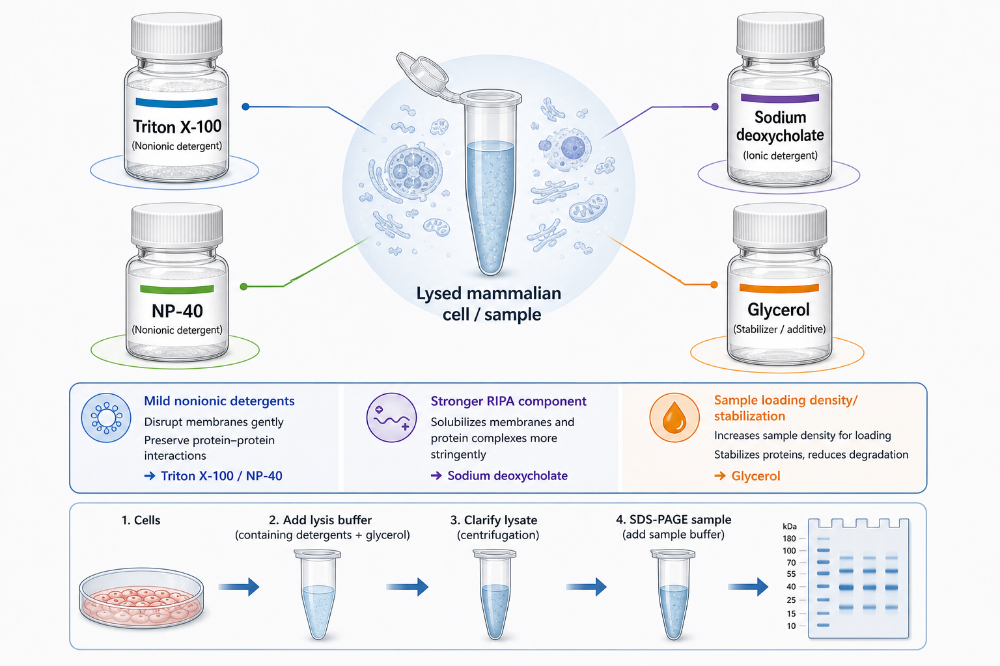

# 甘油

甘油（glycerol，glycerine，丙三醇）是一种高黏度、亲水性小分子，在生命科学实验中常用于增加样本密度、稳定蛋白、调节溶液黏度和作为低温保护/保存组分。它在 [Laemmli上样缓冲液](Laemmli上样缓冲液.md)、蛋白储存 buffer、酶保存液和 [细胞冻存液](细胞冻存液.md) 相关体系中都很常见。



图源：Image2 生成的裂解去污剂与甘油参考图；甘油位于右下方，图中强调其在 sample loading density（上样密度）和 stabilization（稳定）中的作用。图中“reduces degradation”应理解为稳定/低温保护语境下的间接保护，不等同于替代 [蛋白酶抑制剂](蛋白酶抑制剂.md)。

## 核心作用

| 作用 | 解释 | 常见场景 |
| --- | --- | --- |
| 增加样本密度 | 让样本沉入凝胶孔或上样孔 | SDS-PAGE 上样缓冲液 |
| 稳定蛋白 | 降低冻融和界面影响，帮助维持部分构象 | 酶/蛋白保存液 |
| 低温保护 | 降低冰晶和冻融损伤 | 酶储液、细胞/菌株冻存 |
| 调节黏度 | 使溶液更黏稠 | 密度梯度、上样体系 |

Sigma-Aldrich 的 Glycerol G5516 产品资料将其列为 molecular biology grade（分子生物学级）甘油，并列出 sample preservation（样本保存）和 cryopreservation（低温保存）等应用。参考：[Sigma-Aldrich Glycerol G5516](https://www.sigmaaldrich.com/US/en/product/sigma/g5516)。

## 在SDS-PAGE中的作用

在 [SDS-PAGE](<../用(实验流程内容篇)/SDS-PAGE.md>) 的上样体系中，甘油主要让样本密度高于 running buffer（运行缓冲液），从而顺利沉入泳道。Bio-Rad 的 Laemmli Sample Buffer 产品说明显示该 4x 样本缓冲液含 Tris-HCl、SDS、bromophenol blue（溴酚蓝）、glycerol 和 β-mercaptoethanol（β-巯基乙醇）等成分。参考：[Bio-Rad Laemmli Sample Buffer](https://www.bio-rad.com/en-us/sku/1610747-laemmli-sample-buffer-4x?ID=1610747)。

如果漏加甘油或浓度太低，样本可能在孔口扩散、上浮或和 running buffer 混在一起，造成条带变宽、上样量不稳定或样本丢失。

## 甘油 vs DMSO vs 蔗糖

| 试剂 | 主要用途 | 和甘油的区别 |
| --- | --- | --- |
| 甘油 | 上样密度、蛋白/酶保存、冻存辅助 | 黏稠、温和，常用于蛋白体系 |
| [DMSO](DMSO.md) | 细胞冻存、溶解疏水小分子 | 穿透性强，对细胞/蛋白影响更明显 |
| [蔗糖](蔗糖.md) | 密度、渗透压、梯度 | 不同黏度和保护机理 |
| [Ficoll](Ficoll.md) | 密度梯度和上样密度 | 大分子，扩散和黏度特性不同 |

甘油不能简单替代 DMSO。细胞冻存中 DMSO 是经典渗透型 cryoprotectant（低温保护剂），甘油更常用于细菌/酵母或某些蛋白/酶保存。

## 使用 protocol

### 加入上样缓冲液

**怎么做**：按配方加入甘油，常见 1x Laemmli sample buffer 中甘油终浓度约 10% 左右，具体以产品或配方为准。

**为什么**：甘油让样本沉到凝胶孔底部，配合 [溴酚蓝](溴酚蓝.md) 观察上样和电泳前沿。

**注意事项**：

- 甘油黏度高，移液要慢吸慢打。
- 配制高浓度甘油溶液时要充分混匀。
- 不要用未混匀的上样缓冲液上样，浓度不均会影响泳道一致性。

### 蛋白/酶保存

**怎么做**：根据蛋白或酶说明书加入一定比例甘油，低温保存，避免反复冻融。

**为什么**：甘油可以降低冻融造成的结构和活性损失，但不能阻止所有降解。

**替代策略**：对不耐甘油或下游反应受影响的体系，可通过分装、速冻、低温短期保存或换 buffer 优化。

## 常见错误与 troubleshooting

| 问题 | 可能原因 | 处理 |
| --- | --- | --- |
| 样本上浮/扩散 | 甘油不足或 sample buffer 配错 | 换新上样缓冲液 |
| 上样体积误差 | 甘油黏稠，挂壁严重 | 预润湿吸头，慢吸慢打 |
| 酶反应受影响 | 甘油终浓度过高 | 稀释样本或 buffer exchange |
| 冻存后活性下降 | 只靠甘油，冻融次数多 | 小分装，减少冻融，优化保存液 |
| WB 条带不齐 | 上样缓冲液混匀不足 | 充分混匀后短暂离心 |

## 购买与记录建议

常见供应商包括 [Merck](<../番外/试剂厂商/Merck.md>)/[Sigma-Aldrich](<../番外/试剂厂商/Sigma-Aldrich.md>)、[Thermo Scientific](<../番外/试剂厂商/Thermo Scientific.md>)、[Bio-Rad](<../番外/试剂厂商/Bio-Rad.md>)。分子生物学和蛋白实验优先选择 molecular biology grade 或 electrophoresis-suitable grade；用于细胞或微生物保存时注意无菌和内毒素要求。

推荐记录模板（中文）：

```text
甘油品牌：
货号：
批号：
等级：
用途：上样缓冲液/蛋白保存/冻存/其他
终浓度：
配方：
是否无菌：
开封日期：
储存条件：
异常现象：
```

Recommended record template (English):

```text
Glycerol brand:
Catalog number:
Lot number:
Grade:
Use: sample buffer/protein storage/cryopreservation/other
Final concentration:
Formulation:
Sterile: yes/no
Open date:
Storage condition:
Abnormal observation:
```

## 小结

甘油看起来只是“让样本沉下去”的小配方，但它也会影响保存、黏度、冻融和下游反应。记录甘油时要写清终浓度和用途，尤其是上样缓冲液、酶保存液和冻存体系。

## 参考来源

- [Sigma-Aldrich Glycerol G5516](https://www.sigmaaldrich.com/US/en/product/sigma/g5516)
- [Bio-Rad Laemmli Sample Buffer](https://www.bio-rad.com/en-us/sku/1610747-laemmli-sample-buffer-4x?ID=1610747)
- [Sigma-Aldrich Glycerol SDS](https://www.sigmaaldrich.com/US/en/sds/sigma/g5516)
