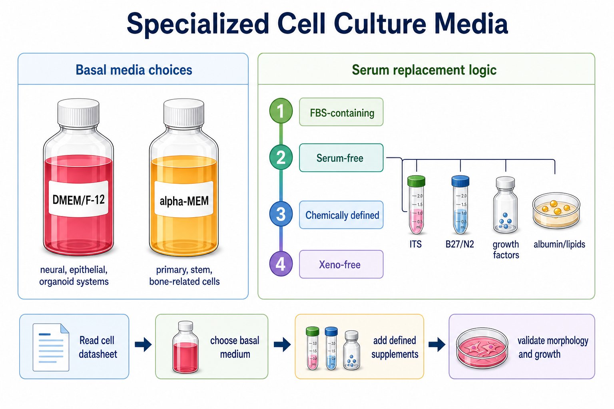

# 生长因子

生长因子（growth factors，生长因子）是能够通过受体信号调控细胞 survival（存活）、proliferation（增殖）、differentiation（分化）、migration（迁移）和 lineage specification（谱系决定）的蛋白或多肽因子。在细胞培养中，它们常作为 [无血清培养基](无血清培养基.md)、[化学成分明确培养基](化学成分明确培养基.md)、干细胞培养、类器官培养和原代细胞培养的关键补充剂。



图源：Image2 生成的专用细胞培养基参考图；growth factors 位于 serum-free step 的定义补充剂层，是替代血清复杂信号的重要组件。

## 核心定位

在 FBS 培养体系中，很多生长和存活信号来自血清这个复杂混合物；在无血清或定义培养基中，这些信号需要用明确的 growth factors 或 cytokines（细胞因子）补回来。Thermo Fisher 的 PeproTech 页面说明，重组 cytokines 和 growth factors 被用于支持干细胞、免疫细胞、类器官、细胞治疗和疾病模型，并强调质量、一致性和从 RUO 到 GMP 的转化需求。参考：[Thermo Fisher PeproTech Proteins](https://www.thermofisher.com/tr/en/home/brands/peprotech.html)。

## 常见类型

| 因子 | 英文全称 | 常见培养用途 |
| --- | --- | --- |
| [EGF](EGF.md) | Epidermal growth factor，表皮生长因子 | 上皮、神经干细胞、类器官、肿瘤模型 |
| [FGF2](FGF2.md) | Fibroblast growth factor 2，成纤维细胞生长因子 2 | 干细胞维持、神经干细胞、MSC、内皮/成纤维相关体系 |
| [TGF-β](TGF-β.md) | Transforming growth factor beta，转化生长因子 β | EMT、分化、免疫调节、纤维化模型 |
| [BMP4](BMP4.md) | Bone morphogenetic protein 4，骨形态发生蛋白 4 | 分化诱导、胚层/骨相关体系 |
| [Activin A](<Activin A.md>) | Activin A，激活素 A | 内胚层、干细胞分化、发育模型 |
| [Wnt3A](Wnt3A.md) | Wnt family member 3A，Wnt3A 蛋白 | Wnt 通路激活、类器官、干细胞状态 |
| [R-spondin](R-spondin.md) | R-spondin，R-脊椎蛋白 | 增强 Wnt 信号，肠道/上皮类器官常见 |
| [Noggin](Noggin.md) | Noggin，BMP 拮抗蛋白 | 抑制 BMP 信号，类器官和分化体系常见 |
| [IL-2](IL-2.md) | Interleukin-2，白细胞介素-2 | T 细胞扩增和免疫细胞培养 |
| [IL-7](IL-7.md) | Interleukin-7，白细胞介素-7 | T 细胞/淋巴细胞存活和发育相关培养 |

这张表是导航，不是配方。生长因子的有效浓度、组合和时序必须按细胞类型和 protocol 决定。

## 为什么生长因子是高风险变量

| 变量 | 影响 |
| --- | --- |
| 物种来源 | human、mouse、rat 蛋白对不同细胞受体活性可能不同 |
| 表达系统 | E. coli、mammalian、insect 表达会影响修饰和活性 |
| 活性单位 | ng/mL 不等于 biological activity，一些产品有 IU 或 ED50 |
| 重构液 | BSA、carrier-free、水、酸、buffer 会影响稳定性 |
| 冻融次数 | 多数蛋白反复冻融会失活 |
| 吸附损失 | 低浓度蛋白易吸附到管壁 |
| 批号 | 活性和纯度可能有批间差异 |

R&D Systems 关于 organoid culture 的资料也强调，Wnt-3a、R-Spondin、Noggin 等生长因子在类器官培养中需要关注 bioactivity（生物活性）和 consistency（一致性）。参考：[R&D Systems Organoid Growth Factors Application Note](https://resources.rndsystems.com/pdfs/appnotes/rndsytems-an_optimizing-organoid_STRY0110888-final.pdf)。

## RUO、animal-free、GMP怎么理解

| 标签 | 含义 | 何时关注 |
| --- | --- | --- |
| RUO | Research use only，仅科研用途 | 常规基础研究 |
| Animal-free | 生产过程中避免动物来源组分 | xeno-free 或转化研究 |
| Carrier-free | 不含载体蛋白 | 适合精确控制，但更容易吸附失活 |
| GMP / PeproGMP / CTS | 更高质量体系和生产控制 | 细胞治疗、工艺开发、转化研究 |

Thermo Fisher 的 PeproGMP 页面说明，PeproGMP recombinant proteins 可用于 stem cells、immune cells 和 organoids 的培养、扩增与改造，并强调质量、批间一致性、规模和法规合规。参考：[Thermo Fisher PeproGMP Recombinant Proteins](https://www.thermofisher.com/mf/en/home/life-science/cell-culture/mammalian-cell-culture/recombinant-proteins/gmp-proteins.html)。

## 使用 protocol

### 重构

**怎么做**：按厂家说明选择 sterile water、PBS、酸性溶液或含 carrier protein 的 buffer 重构，轻柔混匀，避免剧烈涡旋。

**为什么**：不同蛋白溶解性和稳定性差异很大，错误重构会导致沉淀或失活。

### 分装和保存

**怎么做**：按一次或少数几次使用量小分装，通常 -20°C 或 -80°C 保存，避免反复冻融。

**为什么**：低浓度重组蛋白对冻融、吸附和污染敏感。分装能减少活性损失和批内差异。

### 加入培养基

**怎么做**：最后加入预温培养基或按 protocol 加入，记录终浓度、加入时间、换液频率和是否每次新鲜加入。

**为什么**：许多生长因子半衰期短，培养基中浓度会随时间下降。FGF2 等因子尤其容易让“换液节奏”变成隐藏变量。

## 常见错误与 troubleshooting

| 现象 | 可能原因 | 处理 |
| --- | --- | --- |
| 细胞不增殖 | 因子失活、漏加、浓度不足或缺少协同因子 | 换新分装，核对浓度和组合 |
| 分化方向不对 | 因子时序或浓度错误 | 按分化阶段重新检查 protocol |
| 同一配方批间差异 | 生长因子批号或活性不同 | 记录 lot，必要时做批号桥接 |
| 低浓度效果不稳定 | 吸附到管壁或反复冻融 | 用低吸附管、加 carrier、少冻融 |
| 背景信号异常 | 生长因子直接激活目标通路 | 设置 no-factor 或 vehicle 对照 |

## 购买与记录建议

常见供应商包括 [PeproTech](<../番外/试剂厂商/PeproTech.md>)、[R&D Systems](<../番外/试剂厂商/R&D Systems.md>)、[Gibco](<../番外/试剂厂商/Gibco.md>)、[STEMCELL Technologies](<../番外/试剂厂商/STEMCELL Technologies.md>)、[BioLegend](<../番外/试剂厂商/BioLegend.md>)、[Sino Biological](<../番外/试剂厂商/Sino Biological.md>)、[Sigma-Aldrich](<../番外/试剂厂商/Sigma-Aldrich.md>)/[Merck](<../番外/试剂厂商/Merck.md>)。优先选择有明确活性测试、内毒素、纯度、表达系统和保存建议的产品。

推荐记录模板（中文）：

```text
生长因子名称：
英文全称：
品牌：
货号：
批号：
物种来源：
表达系统：
等级：RUO / animal-free / GMP / 其他
是否carrier-free：
重构液：
储液浓度：
终浓度：
冻融次数：
加入时间/换液频率：
使用细胞/阶段：
异常现象：
```

Recommended record template (English):

```text
Growth factor name:
English full name:
Brand:
Catalog number:
Lot number:
Species source:
Expression system:
Grade: RUO / animal-free / GMP / other
Carrier-free: yes/no
Reconstitution buffer:
Stock concentration:
Final concentration:
Freeze-thaw cycles:
Addition timing/media change frequency:
Cell type/stage:
Abnormal observation:
```

## 小结

生长因子是无血清、定义培养基、干细胞、免疫细胞和类器官培养的“信号开关”。它们的影响远大于普通补充剂，必须记录物种、表达系统、批号、活性、重构、分装、冻融和加入节奏。

## 参考来源

- [Thermo Fisher PeproTech Proteins](https://www.thermofisher.com/tr/en/home/brands/peprotech.html)
- [Thermo Fisher PeproGMP Recombinant Proteins](https://www.thermofisher.com/mf/en/home/life-science/cell-culture/mammalian-cell-culture/recombinant-proteins/gmp-proteins.html)
- [R&D Systems Organoid Growth Factors Application Note](https://resources.rndsystems.com/pdfs/appnotes/rndsytems-an_optimizing-organoid_STRY0110888-final.pdf)
