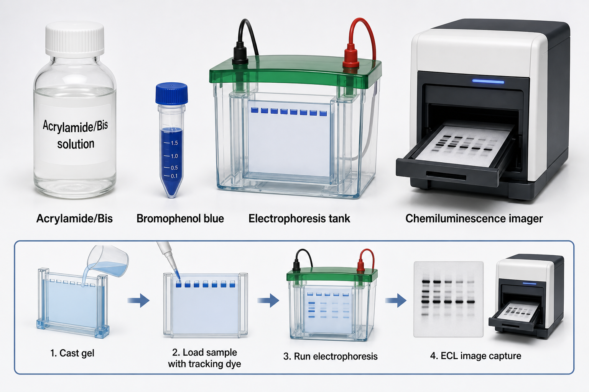

# 电泳槽

电泳槽（electrophoresis tank / electrophoresis cell）是用于在电场中分离核酸或蛋白的实验设备。在蛋白实验中，最常见的是 vertical gel electrophoresis tank（垂直凝胶电泳槽），用于运行 [SDS-PAGE凝胶](SDS-PAGE凝胶.md)，随后可衔接 [Western blot](<../用(实验流程内容篇)/Western blot.md>) 转膜和检测。



图源：Image2 生成的 SDS-PAGE 运行与成像参考图；中间为垂直电泳槽，底部第三步示意运行电泳。

## 核心结构

| 部件 | 作用 | 检查点 |
| --- | --- | --- |
| 内槽/外槽 | 盛放 running buffer（运行缓冲液） | 是否漏液，液面是否正确 |
| 电极 | 提供电场 | 黑负红正，接口牢固 |
| 胶夹/夹具 | 固定凝胶板或预制胶 cassette | 是否夹紧，是否兼容 |
| 凝胶板/预制胶 | 蛋白分离介质 | 厚度、孔数、胶浓度 |
| 盖子安全联锁 | 防止开盖通电 | 盖子没盖好不应通电 |
| [电泳电源](电泳电源.md) | 提供恒压/恒流 | 电压、电流、时间记录 |

Bio-Rad 的 Mini-PROTEAN Tetra Cell 官方资料说明该系统可在同一槽内运行 1-4 块 mini precast 或手灌胶，用于蛋白电泳。参考：[Bio-Rad Mini-PROTEAN Tetra Cell](https://www.bio-rad.com/en-us/product/mini-protean-tetra-cell)。

## 工作逻辑

SDS-PAGE 中，蛋白与 [SDS](十二烷基硫酸钠.md) 结合后整体带负电，通电后从负极向正极迁移。凝胶孔径提供分子筛效应，小蛋白迁移更快，大蛋白迁移更慢。电泳槽负责提供稳定电场、缓冲液环境和机械固定。

## 垂直槽 vs 水平槽

| 类型 | 常见用途 | 特点 |
| --- | --- | --- |
| 垂直电泳槽 | SDS-PAGE、native PAGE、蛋白胶 | 胶薄、分辨率高，适合蛋白 |
| 水平电泳槽 | DNA/RNA 琼脂糖凝胶 | 胶水平放置，适合核酸片段 |
| 毛细管电泳系统 | 高分辨分析 | 仪器化程度高，不是常规 WB 起点 |

不要用核酸水平槽跑 SDS-PAGE，也不要把电泳槽和 [转膜槽](转膜槽.md) 混为一谈。前者负责分离，后者负责把分离结果转移到膜。

## 使用 protocol

### 装胶和加buffer

**怎么做**：确认胶 cassette 与槽兼容，去掉预制胶底部胶条或手灌胶封条，装入夹具，内槽加入正确 running buffer，确认无漏液后加入外槽 buffer。

**为什么**：内槽漏液会导致电流异常、条带歪斜或电泳失败。

**注意事项**：

- Tris-Glycine、Bis-Tris、Tris-Tricine 系统不要随意混用 buffer。
- buffer 太旧会导致电流和 pH 异常。
- 预制胶未去底条是常见新手错误。

### 上样和运行

**怎么做**：上样前冲洗泳道，加入 [蛋白Marker](蛋白Marker.md) 和样本，盖好盖子，连接电源，按胶体系推荐电压运行。

**为什么**：上样质量和电场稳定性直接影响条带形状。

**替代策略**：

- 如果条带笑脸明显，降低电压或改善散热。
- 如果目标小蛋白，提前停止电泳或换高浓度胶。
- 如果目标大蛋白，延长分离时间但控制发热。

## 常见错误与 troubleshooting

| 问题 | 可能原因 | 处理 |
| --- | --- | --- |
| 没有电流 | 电源未连好、盖子未闭合、buffer 未接通 | 检查电源、盖子和液面 |
| 电流过高 | buffer 浓度太高、短路、漏液 | 重新配 buffer，检查装配 |
| 条带笑脸 | 电压过高、发热、盐分高 | 降低电压，换新 buffer |
| 条带歪斜 | 胶未装平、内槽漏液、孔损伤 | 重新装胶，检查漏液 |
| 样本跑不进胶 | 未去底条、buffer 错误、胶干裂 | 检查胶和 buffer |

## 安全注意

电泳槽涉及液体和电压，运行时不要开盖接触 buffer 或电极。若 buffer 泄漏、电源报警、冒泡异常或闻到异味，应立即断电处理。长期使用后需检查电极腐蚀、导线老化和槽体裂纹。

## 购买与记录建议

常见供应商包括 [Bio-Rad](<../番外/试剂厂商/Bio-Rad.md>)、[Thermo Scientific](<../番外/试剂厂商/Thermo Scientific.md>)、[Cytiva](<../番外/试剂厂商/Cytiva.md>)、[Merck](<../番外/试剂厂商/Merck.md>) 等。优先选择与实验室预制胶、手灌胶板和转膜系统兼容的体系。

推荐记录模板（中文）：

```text
电泳槽型号：
品牌：
兼容胶尺寸：
胶类型/浓度：
运行缓冲液：
电压/电流模式：
运行时间：
起始电流：
结束电流：
是否漏液：
目标蛋白大小：
异常现象：
```

Recommended record template (English):

```text
Electrophoresis tank model:
Brand:
Compatible gel size:
Gel type/percentage:
Running buffer:
Voltage/current mode:
Run time:
Initial current:
Final current:
Leak observed: yes/no
Target protein size:
Abnormal observation:
```

## 小结

电泳槽是 SDS-PAGE 的运行环境。条带好不好不只由胶决定，也由电泳槽装配、buffer、漏液、电压、电流和散热共同决定。

## 参考来源

- [Bio-Rad Mini-PROTEAN Tetra Cell](https://www.bio-rad.com/en-us/product/mini-protean-tetra-cell)
- [Thermo Fisher Mini Gel Tank](https://www.thermofisher.com/order/catalog/product/A25977)
- [Bio-Rad Protein Electrophoresis Guide](https://www.bio-rad.com/en-us/applications-technologies/protein-electrophoresis?ID=LUSQ8J3WV)
