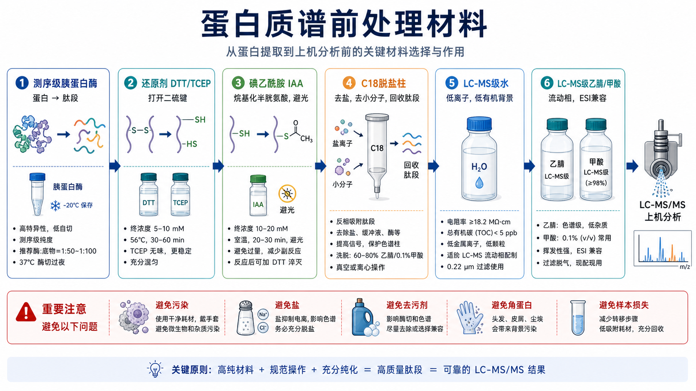

# 碘乙酰胺

Iodoacetamide（IAA，碘乙酰胺）是一种 sulfhydryl-reactive alkylating reagent（巯基反应性烷基化试剂），常在 [蛋白质谱](<../用(实验流程内容篇)/蛋白质谱.md>) 前处理的 reduction-alkylation（还原-烷基化）步骤中使用。它的主要作用是在蛋白二硫键被 [DTT](DTT.md) 或 [TCEP](TCEP.md) 还原后，封闭 cysteine（半胱氨酸）上的巯基，减少二硫键重新形成，并让数据库搜索可以把 carbamidomethylation（氨甲酰甲基化，+57.021 Da）作为固定修饰处理。



图源：Image2 生成的蛋白质谱前处理材料参考图。碘乙酰胺位于第 3 个模块，主要对应半胱氨酸烷基化和避光处理。

## 核心作用

[Thermo Fisher 的 Pierce Alkylating Reagents 页面](https://www.thermofisher.com/order/catalog/product/A39271)说明，iodoacetamide 和 chloroacetamide 是用于 block reduced cysteine residues（封闭还原半胱氨酸残基）的巯基反应性烷基化试剂；还原后用 IAA 或 CAA 烷基化会共价加入 carbamidomethyl group（氨甲酰甲基基团，约 57 Da），并防止二硫键重新形成。

IAA 的关键不是“让蛋白更容易上机”，而是让半胱氨酸状态更统一，减少同一肽段出现多种氧化/还原状态，从而提高鉴定和定量一致性。

## 在质谱 workflow 中的位置

```text
蛋白样本
-> 还原二硫键：DTT 或 TCEP
-> 烷基化半胱氨酸：IAA 或 CAA
-> 酶切：测序级胰蛋白酶
-> C18 脱盐
-> LC-MS/MS
```

如果没有烷基化，半胱氨酸肽段可能在样本处理过程中重新形成二硫键、发生氧化或出现复杂修饰状态，导致数据库搜索和定量变差。

## IAA vs CAA

| 项目 | IAA（碘乙酰胺） | CAA（chloroacetamide，氯乙酰胺） |
| --- | --- | --- |
| 反应性 | 较常用，反应快 | 反应相对温和 |
| 光敏性 | 需要避光 | 也建议注意光照和稳定性 |
| 产物 | 半胱氨酸 carbamidomethylation | 同样形成 carbamidomethylation |
| 常见用途 | 经典质谱前处理 | 现代蛋白组学中也常用 |
| 风险 | 过量或条件不当可增加副反应 | 也需优化条件 |

如果平台 SOP 已经固定使用 CAA，不需要为了“经典”强行改回 IAA。最重要的是同一项目内条件一致，搜索参数与实际烷基化试剂一致。

## 使用要点

**怎么做**：在还原反应后加入 IAA，按 SOP 控制终浓度、时间、温度和避光条件。反应后通常通过加入还原剂或进入后续稀释/酶切步骤处理过量 IAA，具体以平台流程为准。

**为什么重要**：IAA 反应不充分会导致半胱氨酸肽段状态复杂；IAA 过量或时间过长则可能增加非目标副反应。

**注意事项**：

- IAA 对光敏感，通常需要避光。
- 现配现用，不建议长期保存水溶液。
- 过量 IAA 会和后续加入的还原剂反应，也可能影响蛋白酶或其他巯基相关体系。
- 数据库搜索中要把 carbamidomethyl C 设置为与实际实验一致的固定修饰。

**替代策略**：

- 使用 CAA 作为替代烷基化试剂。
- 某些特殊 PTM 或二硫键定位实验可能不做常规还原/烷基化，需要单独设计。

## 常见错误与 troubleshooting

| 问题 | 可能原因 | 处理 |
| --- | --- | --- |
| 半胱氨酸肽段信号不稳定 | 烷基化不足或样本氧化 | 检查 IAA 新鲜度、避光和反应条件 |
| 搜索结果中修饰混乱 | 固定修饰参数和实验不一致 | 确认 carbamidomethyl C 设置 |
| 酶切效率下降 | 过量 IAA 未处理或缓冲条件不合适 | 按 SOP 淬灭或稀释，避免过量 |
| 背景或副反应增加 | IAA 浓度过高、反应过久 | 降低浓度或缩短反应 |
| 重复性差 | 不同批次避光/时间/温度不一致 | 统一反应时长和处理顺序 |

## 购买建议

优先选择适合 protein characterization（蛋白表征）、peptide mapping（肽图）或 proteomics sample preparation（蛋白组学样本前处理）的高纯度 IAA。Thermo 的 no-weigh 单次包装设计用于减少反复开盖造成的污染和反应性损失，这种形式适合小体积、高重复性的质谱前处理项目。

购买和记录时关注：

- 纯度和等级。
- 包装形式：单次预称量更适合减少吸湿和污染。
- 是否有 COA、货号和批号。
- 是否需要避光、防潮、低温储存。

## 推荐记录

### 中文记录

```text
IAA品牌：
货号：
批号：
纯度/等级：
配制浓度：
终浓度：
反应时间：
反应温度：
是否避光：
是否淬灭：
搜索参数：Carbamidomethyl C 固定修饰 yes/no
异常观察：
```

### English record

```text
IAA brand:
Catalog number:
Lot number:
Purity / grade:
Stock concentration:
Final concentration:
Reaction time:
Reaction temperature:
Protected from light: yes/no
Quenched: yes/no
Search parameter: carbamidomethyl C as fixed modification yes/no
Abnormal observations:
```

## 小结

碘乙酰胺是蛋白质谱前处理里控制半胱氨酸状态的关键小试剂。它本身不提供蛋白信息，但会决定肽段状态是否统一、数据库搜索是否正确、定量是否稳定。对 IAA 来说，避光、新鲜、浓度和搜索参数一致，比“随手加一下”重要得多。

## 参考来源

- [Thermo Fisher Pierce Alkylating Reagents](https://www.thermofisher.com/order/catalog/product/A39271)
