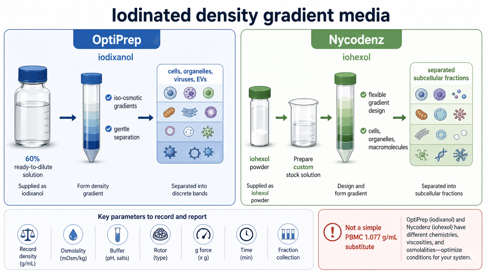

# 碘克沙醇

Iodixanol（碘克沙醇）是一种 non-ionic iodinated compound（非离子碘化化合物），在实验室里最常见的身份是 [OptiPrep](OptiPrep.md) 的核心成分，用来制备 density gradient medium（密度梯度介质）。在医学里它也可作为 radiographic contrast agent（X 线造影剂），但在 protocol 语境中更重要的是：它能在较温和的渗透压条件下提供较高密度。



图源：Image2 生成的碘化密度梯度介质示意图。碘克沙醇对应左侧 OptiPrep 路线：60% w/v ready-to-dilute solution（可直接稀释的储备液）、可调密度、可制备等渗梯度。

## 定义与命名

Iodixanol 的中文名是碘克沙醇。PubChem 将其列为 dimeric, non-ionic, water-soluble radiographic contrast agent（二聚体、非离子、水溶性 X 线造影剂），分子式为 C35H44I6N6O15，分子量约 1550.2 g/mol。参考：[PubChem Iodixanol](https://pubchem.ncbi.nlm.nih.gov/compound/Iodixanol)。

在密度梯度实验中，碘克沙醇通常不是以“自己称粉”的形式出现，而是以 OptiPrep 这种 commercial stock solution（商业储备液）出现。[Axis-Shield OptiPrep](https://axis-shield-density-gradient-media.com/optiprep-the-optimum-density-gradient-medium/) 将 OptiPrep 描述为 sterile and endotoxin-tested solution（无菌、内毒素检测的溶液），含 60% w/v iodixanol in water，密度约 1.32 g/mL。

## 为什么能做密度梯度

| 结构/性质 | 对密度梯度的意义 |
| --- | --- |
| 分子含 6 个 iodine atoms（碘原子） | 碘原子重，能提高溶液密度 |
| 非离子分子 | 不像盐类那样显著增加离子强度 |
| 多个亲水基团 | 水溶性好，适合制备水相梯度 |
| 二聚体结构 | 单个分子量大，在同等密度下可减少颗粒数量贡献的渗透压压力 |
| 可配成等渗梯度 | 对活细胞、细胞器和囊泡更温和 |

简单理解：碘克沙醇把“高密度”和“相对温和的渗透环境”放在一起。它不是靠大量盐离子把溶液变重，而是靠富含碘的水溶性大分子提高密度，因此适合用于细胞、细胞器、病毒和 extracellular vesicles（EVs，细胞外囊泡）这类对环境比较敏感的样本。

## 和 OptiPrep 的关系

| 名称 | 本质 | 使用层级 |
| --- | --- | --- |
| 碘克沙醇 | 化学成分/分子 | 理解性质和原理 |
| OptiPrep | 60% w/v 碘克沙醇商业储备液 | 实验采购和实际配制 |
| OptiPrep gradient | 用 OptiPrep 稀释出来的梯度体系 | 具体 protocol 条件 |

所以实验记录里不建议只写“iodixanol”。更稳妥的写法是：

```text
OptiPrep, iodixanol 60% w/v, supplier, catalog number, lot number, dilution buffer, final density or percentage, osmolality, gradient format
```

这样别人能知道你用的是商品储备液、什么批号、如何稀释，而不是某种不明来源的碘克沙醇粉末或临床注射制剂。

## 主要用途

| 用途 | 典型场景 |
| --- | --- |
| [密度梯度离心](<../用(实验流程内容篇)/密度梯度离心.md>) | 制备连续或不连续 OptiPrep 梯度 |
| [细胞器分离](<../用(实验流程内容篇)/细胞器分离.md>) | 分离 mitochondria（线粒体）、lysosomes（溶酶体）、endoplasmic reticulum（内质网）等 |
| [病毒纯化](<../用(实验流程内容篇)/病毒纯化.md>) | 富集或纯化病毒颗粒 |
| [细胞外囊泡分离](<../用(实验流程内容篇)/细胞外囊泡分离.md>) | 进一步区分 EVs、脂蛋白和蛋白聚集物 |
| 特殊细胞分离 | 目标细胞密度窗口不适合标准 PBMC 介质时进行探索 |

碘克沙醇/OptiPrep 的使用重点不是“照着一个固定百分比做”，而是根据目标颗粒的 buoyant density（浮力密度）、样本耐受性和下游检测要求设计梯度。

## 碘克沙醇 vs 碘海醇

| 项目 | 碘克沙醇 | [碘海醇](碘海醇.md) |
| --- | --- | --- |
| 英文名 | iodixanol | iohexol |
| 分子类型 | 二聚体非离子碘化分子 | 单体非离子碘化分子 |
| 分子式 | C35H44I6N6O15 | C19H26I3N3O9 |
| 分子量 | 约 1550.2 g/mol | 约 821.1 g/mol |
| 密度梯度商品 | OptiPrep | Nycodenz |
| 常见实验形态 | 60% w/v 无菌储备液 | 粉末或自配储备液 |
| 便利性 | 更偏即用储备液路线 | 更偏自配方法开发路线 |

二者的共同点是非离子、含碘、水溶性，能用于高密度但相对温和的水相梯度。主要区别是碘克沙醇常通过 OptiPrep 进入实验，而碘海醇/Nycodenz 更常作为粉末或自配体系出现。

## 使用注意事项

| 注意点 | 原因 | 建议 |
| --- | --- | --- |
| 不要用临床造影剂替代 OptiPrep | 临床制剂可能含缓冲剂、稳定剂或不同浓度规格 | 密度梯度实验优先使用标注为 density gradient medium 的产品 |
| 记录渗透压 | 活细胞和细胞器对渗透压敏感 | 关键实验记录 [osmolality（渗透压）](<../番外/补充知识/渗透压.md>) |
| 记录密度或折光率 | 目标 band 位置由密度决定 | 必要时用 [refractive index（RI，折光率）](<../番外/补充知识/折光率.md>)估算密度 |
| 不要只写百分比 | 同百分比在不同 buffer 中表现可能不同 | 同时写 buffer、密度、温度和转子 |
| 注意残留 | 下游检测可能受介质残留影响 | fraction 收集后设计洗涤、稀释或 buffer exchange |

## 常见错误与 troubleshooting

| 问题 | 可能原因 | 处理 |
| --- | --- | --- |
| 梯度分层不清 | 稀释液和密度设计不合适、分层扰动太大 | 重新计算密度，缓慢分层 |
| 活率或细胞器功能差 | 渗透压、pH 或离心条件不合适 | 复核 buffer 和 osmolality，降低处理强度 |
| 文献条件复现失败 | 只记录百分比，缺少商品批号和 buffer | 补全 OptiPrep 批号、稀释液、转子、x g、时间 |
| 下游检测有背景 | 碘克沙醇残留或分段收集污染 | 增加洗涤、buffer exchange 或 marker 验证 |
| 被误当 PBMC 标准介质 | 混淆了 OptiPrep 和 1.077 g/mL Ficoll 类介质 | 常规 PBMC 优先使用 Ficoll/Lymphoprep/Histopaque |

## 推荐记录模板

中文记录模板：

```text
化合物名称：碘克沙醇 / iodixanol
实际产品名称：
品牌/供应商：
货号：
批号：
原液浓度：
储存条件：
开封日期：
稀释缓冲液：
目标密度或工作百分比：
渗透压：
梯度类型：
目标样本：
离心条件：
fraction收集方式：
下游检测：
异常现象：
```

English record template:

```text
Compound name: iodixanol
Actual product name:
Brand/supplier:
Catalog number:
Lot number:
Stock concentration:
Storage condition:
Open date:
Dilution buffer:
Target density or working percentage:
Osmolality:
Gradient type:
Sample type:
Centrifugation condition:
Fraction collection:
Downstream assay:
Abnormal observation:
```

## 小结

碘克沙醇是理解 OptiPrep 的核心：它通过非离子、含碘、水溶性和高分子量特征，让实验者可以制备高密度但相对温和的梯度。真正写 protocol 时，重点不只是“用了 iodixanol”，而是要写清具体产品、浓度、稀释液、密度、渗透压和离心条件。

## 参考来源

- [PubChem Iodixanol](https://pubchem.ncbi.nlm.nih.gov/compound/Iodixanol)
- [Axis-Shield OptiPrep](https://axis-shield-density-gradient-media.com/optiprep-the-optimum-density-gradient-medium/)
- [STEMCELL Technologies OptiPrep](https://www.stemcell.com/products/optipreptm.html)
