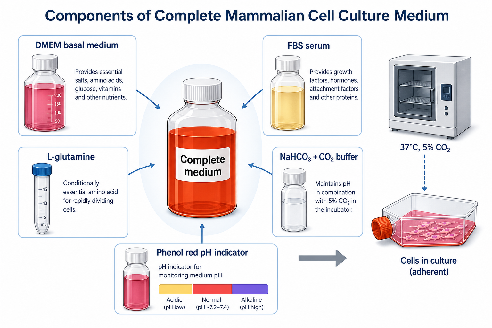

# 碳酸氢钠

碳酸氢钠（sodium bicarbonate，NaHCO3）是细胞培养基中最常见的 CO2/HCO3- buffer system（二氧化碳/碳酸氢盐缓冲体系）组分之一，用于在 [CO2培养箱](CO2培养箱.md) 中维持培养基 pH。



图源：Image2 生成的基础细胞培养基组件示意图；NaHCO3 + CO2 buffer 与 37°C、5% CO2 培养箱共同维持培养基 pH。

## 核心作用

细胞培养基中的碳酸氢盐和培养箱中的 CO2 构成动态平衡。ATCC Animal Cell Culture Guide 说明，培养基中溶解 CO2 与 bicarbonate ions（碳酸氢根离子）处于平衡，很多培养基利用 CO2/bicarbonate 反应维持 pH；常见最佳 pH 范围约 7.2-7.4，可通过补充 sodium bicarbonate 并调控气相 CO2 维持。参考：[ATCC Animal Cell Culture Guide](https://www.atcc.org/resources/culture-guides/animal-cell-culture-guide)。

Gibco Sodium Bicarbonate 7.5% Solution 页面说明，该溶液常用于在 4%-10% CO2 条件下维持细胞培养基 pH，最终 sodium bicarbonate 浓度取决于培养基配方和培养箱 CO2 浓度。参考：[Gibco Sodium Bicarbonate 7.5% Solution](https://www.thermofisher.com/order/catalog/product/25080094)。

## CO2/碳酸氢盐平衡

简化理解：

```text
CO2 + H2O <-> H2CO3 <-> H+ + HCO3-
```

CO2 越高，体系越容易酸化；碳酸氢盐越高，缓冲能力和适配 CO2 条件也会变化。不同培养基配方通常已经为特定 CO2 条件设计好，不应随意改 NaHCO3。

## 和HEPES的区别

| 项目 | 碳酸氢钠/CO2 | [HEPES](HEPES.md) |
| --- | --- | --- |
| 缓冲依赖 | 依赖 CO2 培养箱 | 更适合短时间开放体系 |
| 常见位置 | 多数基础培养基默认体系 | 额外添加或特殊培养基 |
| 优点 | 接近常规细胞培养生态，成本低 | 离开 CO2 时 pH 更稳 |
| 局限 | 离开 CO2 后 pH 易漂移 | 可能影响某些细胞，且光毒性相关风险需注意 |

ATCC 也提醒，HEPES 可有效缓冲 pH，但对某些分化细胞可能有毒性，并会增加培养基对荧光光照诱导光毒性的敏感性。参考：[ATCC Animal Cell Culture Guide](https://www.atcc.org/resources/culture-guides/animal-cell-culture-guide)。

## 使用场景

| 场景 | 碳酸氢钠相关注意 |
| --- | --- |
| 液体培养基 | 通常厂家已经配好，不需额外补加 |
| 粉末培养基复溶 | 常需要按说明加入 NaHCO3 |
| CO2 条件改变 | 需要核对培养基对应 NaHCO3 浓度 |
| 长时间显微镜操作 | 可考虑 HEPES 或控 CO2/温度成像系统 |
| 密闭瓶培养/运输 | CO2 交换受限，pH 逻辑不同 |

## 使用 protocol

### 粉末培养基补加

**怎么做**：按培养基说明书加入指定量 sodium bicarbonate，溶解、调体积、过滤除菌或按厂家推荐流程处理。

**为什么**：粉末培养基常不含或需要使用者单独加入碳酸氢钠；加入量影响最终 pH 和 CO2 适配条件。

**注意事项**：

- 不同培养基的 NaHCO3 需求不同，不要套用一个固定量。
- 7.5% sodium bicarbonate solution 是常见便捷储液，但仍要按配方计算。
- 加入后要结合 CO2 条件平衡，不要只看刚配完的瞬时 pH。

### 培养前平衡

**怎么做**：含碳酸氢盐培养基在使用前可放入 CO2 培养箱短时间平衡，尤其是刚分装或刚预温的培养基。

**为什么**：培养基离开 CO2 环境后会偏碱，放回 CO2 后颜色和 pH 会逐渐恢复。

## 常见错误与 troubleshooting

| 现象 | 可能原因 | 处理 |
| --- | --- | --- |
| 培养基偏紫 | CO2 不足、离开培养箱太久、NaHCO3/CO2 不匹配 | 平衡培养基，检查 CO2 浓度 |
| 培养基偏黄 | 细胞代谢酸化、污染或 CO2 过高 | 检查细胞密度、污染和培养箱 |
| 粉末培养基 pH 不稳定 | NaHCO3 加错或未充分平衡 | 按说明重配并记录 |
| 开放操作时 pH 漂移 | 碳酸氢盐体系离开 CO2 后变弱 | 缩短操作时间或加 HEPES |

## 购买与记录建议

常见供应商包括 [Gibco](<../番外/试剂厂商/Gibco.md>)、[Sigma](<../番外/试剂厂商/Sigma.md>)/[Merck](<../番外/试剂厂商/Merck.md>)、[HyClone](<../番外/试剂厂商/HyClone.md>)。液体培养基通常不需要单独购买 NaHCO3；使用粉末培养基或特殊配方时才更常见。

推荐记录模板（中文）：

```text
培养基名称：
粉末/液体：
NaHCO3品牌：
货号：
批号：
储液浓度：
终浓度：
CO2设定：
是否加入HEPES：
配制日期：
平衡时间：
pH/颜色观察：
异常现象：
```

Recommended record template (English):

```text
Medium name:
Powder or liquid:
NaHCO3 brand:
Catalog number:
Lot number:
Stock concentration:
Final concentration:
CO2 setting:
HEPES added: yes/no
Preparation date:
Equilibration time:
pH/color observation:
Abnormal observation:
```

## 小结

碳酸氢钠不是单纯“调 pH 的盐”，而是必须和 CO2 培养箱一起理解的缓冲体系。培养基颜色、细胞状态和 CO2 条件经常是同一个问题的三个表面。

## 参考来源

- [ATCC Animal Cell Culture Guide](https://www.atcc.org/resources/culture-guides/animal-cell-culture-guide)
- [Gibco Sodium Bicarbonate 7.5% Solution](https://www.thermofisher.com/order/catalog/product/25080094)

