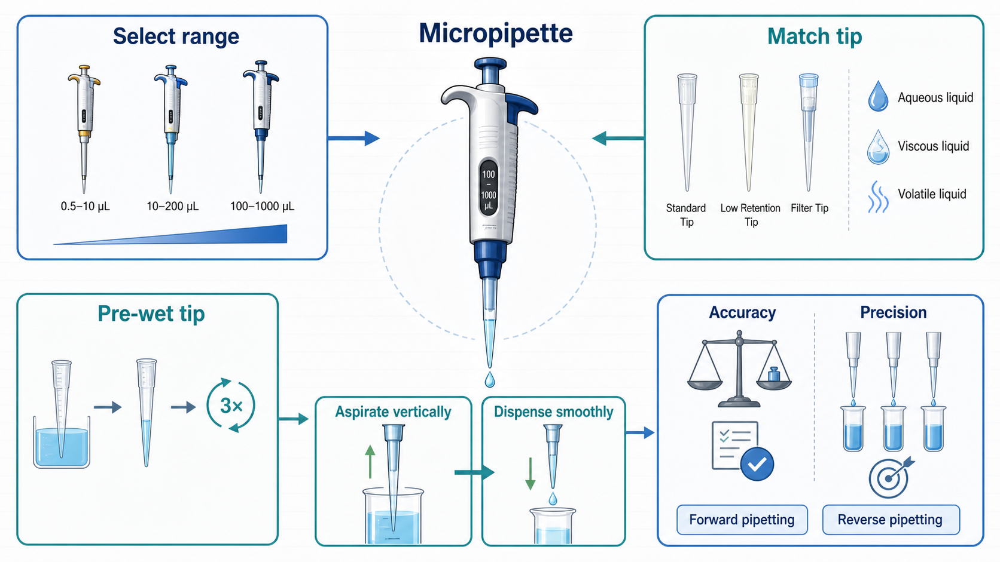
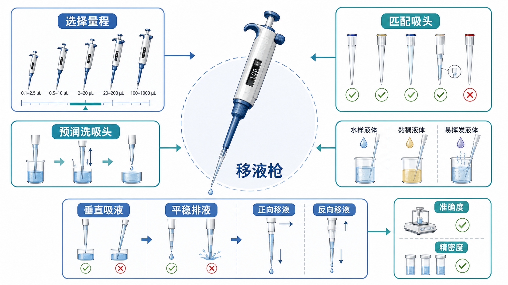

# 移液枪

Micropipette（微量移液器，中文实验室常叫“移液枪”）是用于转移微升级液体的 piston-operated volumetric apparatus（活塞式容量器具）。它看起来只是一个“取液工具”，但在 [RT-qPCR](<../用(实验流程内容篇)/RT-qPCR.md>)、[PCR](<../用(实验流程内容篇)/PCR.md>)、[ELISA](<../用(实验流程内容篇)/ELISA.md>)、[Western blot](<../用(实验流程内容篇)/Western blot.md>) 和 [细胞培养](<../用(实验流程内容篇)/细胞培养.md>) 里，移液枪往往决定了结果是否可重复。





## 历史与定位

现代微量移液器通常追溯到 Heinrich Schnitger 在 1957 年提出的活塞式微量移液装置。EMBO Reports 的历史文章指出，这个发明解决了早期玻璃微量移液操作慢、不方便、重复性差的问题，并引入了可更换塑料吸头和第二档 blow-out（吹出残液）的关键设计。[参考：EMBO Reports, The invention of the modern micropipette](https://www.embopress.org/doi/10.1038/sj.embor.7400520)

这意味着移液枪的核心不是“吸一下、打出去”这么简单，而是一个由枪体、活塞、空气柱或直接活塞、[移液枪吸头](移液枪吸头.md)、操作者手法、液体物理性质共同组成的计量系统。ISO 8655-2:2022 也把 pipette（移液器）的计量要求、最大允许误差、标识和用户信息放在同一个标准框架下讨论。[参考：ISO 8655-2:2022](https://www.iso.org/standard/68797.html)

## 定义与命名

常见中文叫法包括移液枪、微量移液器、微量移液枪、可调移液器。英文里需要区分：

| 名称 | 中文 | 重点 |
| --- | --- | --- |
| Pipette | 移液器/移液管总称 | 范围很大，可以包括玻璃移液管、血清移液管、微量移液器等 |
| Micropipette | 微量移液器 | 常指 0.1-1000 µL 或几 mL 范围的手持活塞式移液器 |
| Air-displacement pipette | 空气置换式移液枪 | 最常用；活塞和液体之间有空气柱 |
| Positive-displacement pipette | [正置换移液器](正置换移液器.md) | 活塞直接接触液体或在专用吸头内接触液体，适合黏稠、易挥发、密度异常液体 |
| Single-channel pipette | 单道移液枪 | 每次处理一个样本或一个孔 |
| Multi-channel pipette | [多道移液枪](多道移液枪.md) | 常见 8 道、12 道，用于 96 孔板等 |
| Electronic pipette | [电动移液器](电动移液器.md) | 电机控制吸液和排液速度，减少人为差异 |
| Repeater pipette / stepper | [连续分液器](连续分液器.md) | 一次吸液，多次等量分液，适合重复加样 |

## 核心结构

常规空气置换式移液枪可以理解成几个部分：

- Plunger button（按钮/推杆）：按下到 first stop（第一档）用于吸液或排出目标体积，按到 second stop（第二档）用于 blow-out（吹出残液）。
- Volume display（容量显示窗）：显示设定体积。
- Piston（活塞）：移动空气柱，间接带动液体进入或离开吸头。
- Tip cone / shaft（吸头连接锥/下半支）：与吸头形成密封。
- Tip ejector（退吸头机构）：避免手接触污染吸头。
- Disposable tip（一次性吸头）：真正接触样本的部分。

关键点：空气置换式移液枪的活塞并不直接碰到液体，中间空气柱会受到温度、湿度、蒸汽压、液体密度、液体黏度影响。Eppendorf 的液体处理说明也强调，空气置换式适合物理性质接近水的液体，而正置换系统没有空气柱，更适合黏度、挥发性、表面张力或密度明显不同的液体。[参考：Eppendorf liquid handling](https://www.eppendorf.com/us-en/Products/Liquid-Handling/All-Pipettes-Dispensers-Automated-Liquid-Handlers-c-WebPSub-H-44564)

## 常见量程

不同品牌命名略有差异，但常见配置如下：

| 常见型号 | 典型范围 | 适合场景 | 不推荐 |
| --- | --- | --- | --- |
| P2 | 0.1-2 µL 或 0.2-2 µL | 极小体积酶、引物、模板 | 新手常规取 0.2 µL，误差很难控制 |
| P10 | 0.5-10 µL | qPCR 引物、酶、少量模板 | 长时间连续加样，手法差异会放大 |
| P20 | 2-20 µL | PCR/RT-qPCR 体系、小体积稀释 | 不要用它取 1 µL 以下 |
| P200 | 20-200 µL | buffer、上样、常规分装 | 不要用它取 5-10 µL 追求精确 |
| P1000 | 100-1000 µL | 培养基、PBS、裂解液等 | 不要用它取 20-50 µL |
| P5000/P10 mL | 0.5-5 mL 或 1-10 mL | 大体积试剂转移 | 替代不了 [血清移液管](血清移液管.md) 和助吸器的所有场景 |

选择原则：目标体积尽量落在移液枪量程的中高区间；如果两个量程都能覆盖，通常优先选更小但不贴近下限的那支。比如 8 µL 更适合 P10 或 P20，而 180 µL 更适合 P200。低端体积不是不能用，而是对手法、吸头、预润洗和校准状态更敏感。

## 空气置换 vs 正置换

| 液体类型 | 空气置换式移液枪 | 正置换移液器 |
| --- | --- | --- |
| 水、PBS、常规 buffer | 首选 | 可以用，但成本高、必要性低 |
| 黏稠液体，如甘油、油、含高蛋白样本 | 容易吸液不足、挂壁、重复性差 | 更推荐 |
| 易挥发液体，如乙醇、丙酮、氯仿 | 空气柱受蒸汽压影响，可能滴漏或体积偏差 | 更推荐 |
| 高密度或低密度液体 | 可能和水校准状态偏离 | 更推荐 |
| 放射性、有毒、强污染样本 | 有倒吸和气溶胶风险 | 专用正置换吸头可降低枪体污染风险 |

Gilson 和 Eppendorf 都把正置换系统推荐给黏稠、非水相、易挥发或具有污染风险的样本。原理上，正置换吸头内的活塞直接推动液体，少了空气柱这个不稳定变量。[参考：Gilson MICROMAN E](https://www.gilson.com/default/shop-products/pipettes/microman-e-m250e-50-250-micro-l.html)；[参考：Eppendorf positive displacement pipettes](https://www.eppendorf.com/ca-en/Products/Liquid-Handling/Positive-Displacement-Pipettes-Dispensers-c-WebPSub-H-12612110)

## 吸头选择

吸头不是“随便能套上就行”。Thermo Fisher 的移液准确性指南明确提示，移液枪和吸头不匹配会造成 inaccuracy（不准确）和 imprecision（不精密），因为密封、材料和模具缺陷都会影响液体转移。[参考：Thermo Fisher 10 steps to improve pipetting accuracy](https://www.thermofisher.com/us/en/home/life-science/lab-plasticware-supplies/lab-plasticware-supplies-learning-center/lab-plasticware-supplies-resource-library/fundamentals-of-pipetting/proper-pipetting-techniques/10-steps-to-improve-pipetting-accuracy.html)

| 吸头类型 | 英文 | 适合场景 | 注意事项 |
| --- | --- | --- | --- |
| 标准吸头 | standard tip | 常规水溶液、buffer、普通分装 | 要匹配枪体，不要靠蛮力硬套 |
| [滤芯吸头](滤芯吸头.md) | filter tip / aerosol barrier tip | RNA、DNA、PCR、qPCR、细胞培养、污染风险样本 | 滤芯被液体打湿后不要继续使用 |
| [低吸附吸头](低吸附吸头.md) | low-retention tip | 蛋白、DNA/RNA、黏稠液体、含表面活性剂液体 | 不等于能解决所有挂壁问题 |
| [宽口吸头](宽口吸头.md) | wide-bore tip | 细胞悬液、类器官、脆弱颗粒、黏稠样本 | 精密度可能不如标准细口吸头，需按场景取舍 |
| 加长吸头 | extended-length tip | 深孔板、窄管、避免枪体接触容器 | 注意吸头插入过深造成外壁挂液 |
| 无菌吸头 | sterile tip | 细胞培养、无菌试剂分装 | 无菌不一定 RNase/DNase-free，要看标签 |

对于 [RNA提取](<../用(实验流程内容篇)/RNA提取.md>)、RT-qPCR 和 PCR，优先选择 sterile, RNase/DNase-free, filter tip（无菌、无 RNase/DNase、带滤芯吸头）。对于普通 [PBS](PBS.md)、buffer 或培养基分装，标准无菌吸头通常足够。

## 标准操作 protocol

### 选择移液枪和吸头

**怎么做**：先确定目标体积，再选择合适量程的移液枪和匹配吸头。不要为了省事用 P1000 取 20 µL，也不要用 P20 长期取 1 µL 以下。

**为什么**：移液误差在低量程端更明显；吸头密封不好会造成系统性偏差。

**替代方案**：

- 如果目标体积太小，例如 0.2-0.5 µL，优先稀释原液后移取更大体积。
- 如果要重复加同一体积到很多孔，用多道移液枪、电动移液器或连续分液器。
- 如果液体黏稠或易挥发，考虑正置换移液器或反向移液。

**出错后果**：体积偏小、孔间差异大、样本间 fold change 被放大或缩小。

### 设置体积

**怎么做**：缓慢转动体积调节轮，接近目标体积时从同一方向逼近；不要超过移液枪标称范围。设好后确认显示窗单位和小数位。

**为什么**：超过量程可能损伤机械结构或让校准失效；读错小数位是新手最常见错误之一。

**替代方案**：重要实验前把所有体积写在配液表里，并在加样前让同伴复核。

**出错后果**：把 10.0 µL 看成 1.00 µL，或者把 P200 设成 020 后误以为是 200 µL，都会直接毁掉体系比例。

### 装吸头

**怎么做**：垂直压入吸头盒中的吸头，轻轻旋紧或按压到密封即可。不要用很大力“捅”吸头盒。

**为什么**：密封不足会漏气；过度用力会损伤 tip cone，也会增加手部疲劳。

**替代方案**：如果某品牌吸头总是难装或容易漏，优先更换匹配系统吸头，而不是用力弥补。

**出错后果**：吸液时出现气泡、液柱缓慢下降、不同孔体积不一致。

### 预润洗吸头

**怎么做**：正式取液前，用同一种液体吸入并完全打出 2-3 次，再开始吸取目标体积。

**为什么**：pre-wetting / pre-rinsing（预润洗）可以让吸头内壁和空气空间更接近样本条件，减少蒸发和表面吸附造成的首枪偏差。Thermo Fisher 建议正式取液前至少反复吸打三次，并指出不预润洗可能让实际排液体积偏低。[参考：Thermo Fisher 10 steps](https://www.thermofisher.com/us/en/home/life-science/lab-plasticware-supplies/lab-plasticware-supplies-learning-center/lab-plasticware-supplies-resource-library/fundamentals-of-pipetting/proper-pipetting-techniques/10-steps-to-improve-pipetting-accuracy.html)

**替代方案**：

- 对极珍贵样本，如果不舍得预润洗样本，可用同 buffer 预润洗，但这不完全等价。
- 对一次性加入 master mix 的普通水溶液，预润洗的收益较小，可按实验精度需求决定。

**出错后果**：第一孔或第一管常常偏低，导致板内位置效应或批次效应。

### 吸液

**怎么做**：先按到第一档，把吸头垂直插入液面下合适深度，再缓慢松开按钮，停顿约 1 秒后离开液面。

**为什么**：吸头插入太浅会吸入空气；插入太深会让液体挂在吸头外壁并一起带走。Thermo Fisher 强调吸液时保持垂直，错误角度和过深浸入都会明显增加误差。[参考：Thermo Fisher immersion depth and angle](https://www.thermofisher.com/us/en/home/life-science/lab-plasticware-supplies/lab-plasticware-supplies-learning-center/lab-plasticware-supplies-resource-library/fundamentals-of-pipetting/proper-pipetting-techniques/10-steps-to-improve-pipetting-accuracy.html)

**替代方案**：

- 对黏稠液体，放慢松开按钮的速度，并延长停顿时间。
- 对易起泡液体，避免快速吸打，优先反向移液。
- 对极小体积，可以把液体打入接收液中并用接收液轻轻冲洗吸头内壁。

**出错后果**：气泡、吸液不足、外壁挂液、重复性差。

### 排液

**怎么做**：把吸头贴到接收管或孔壁，平稳按到第一档排出目标体积；正向移液时，再按到第二档吹出残液；保持按钮按下状态离开液体或管壁，再松开按钮。

**为什么**：贴壁排液能减少液滴残留和飞溅；平稳速度能减少孔间差异。Thermo Fisher 也把稳定推杆力度和速度列为改善准确性的关键因素。[参考：Thermo Fisher plunger force and speed](https://www.thermofisher.com/us/en/home/life-science/lab-plasticware-supplies/lab-plasticware-supplies-learning-center/lab-plasticware-supplies-resource-library/fundamentals-of-pipetting/proper-pipetting-techniques/10-steps-to-improve-pipetting-accuracy.html)

**替代方案**：

- 对 qPCR 板小孔，可贴近孔壁或液面下轻轻排液，避免气泡。
- 对需要混匀的体系，可以排入液体后轻柔吸打混匀，但不要产生泡沫。
- 对高通量板，电动移液器或多道移液枪能降低手速差异。

**出错后果**：残留液滴、气泡、飞溅、交叉污染、孔间体积差。

### 换吸头

**怎么做**：不同样本、不同模板、不同浓度梯度之间换新吸头；从高浓度到低浓度尤其要小心 carryover（残留带入）。

**为什么**：移液枪吸头接触样本后就可能携带 DNA、RNA、蛋白、细胞或试剂残留。

**替代方案**：如果是同一种试剂向多个孔加入，且没有接触样本，可以同一吸头连续分装；但一旦接触样本、模板或细胞悬液，就应更换。

**出错后果**：NTC（no-template control，无模板对照）阳性、阴性样本假阳性、稀释梯度不线性。

## 正向移液与反向移液

Forward pipetting（正向移液）是常规方法：按到第一档吸液，按到第一档排目标体积，再按第二档吹出残液。它适合水、PBS、普通 buffer 和大多数常规试剂。

Reverse pipetting（反向移液）是先按到第二档吸入“目标体积 + 额外体积”，排液时只按到第一档，让多余液体留在吸头中，最后丢弃或回收。Gilson 的技术文章说明，反向移液常用于略黏稠液体，因为额外体积可以补偿残留在吸头中的液体。[参考：Gilson pipetting technique](https://www.gilson.com/default/learninghub/post/helpful-tips-for-ensuring-proper-pipetting-technique.html)

| 场景 | 推荐手法 | 原因 |
| --- | --- | --- |
| 水、PBS、稀 buffer | 正向移液 | 标准、准确、节省样本 |
| 甘油、含蛋白液体、容易挂壁液体 | 反向移液或正置换 | 减少残留造成的低估 |
| 易起泡液体 | 反向移液，慢速操作 | 避免第二档吹出时产生泡沫 |
| 易挥发液体 | 反向移液或正置换 | 减少蒸汽压导致的体积偏差 |
| 珍贵且体积很少的样本 | 谨慎使用反向移液 | 反向移液需要额外液体，可能浪费样本 |

Sartorius 也把反向移液作为处理黏稠、挥发、起泡或小体积液体的一种策略，但反向移液不是万能修正：它改变的是操作模式，不会修好漏气、吸头不匹配或校准失准的移液枪。[参考：Sartorius reverse pipetting](https://www.sartorius.com/en/products/pipetting/reverse-pipetting)

## 与类似工具对比

| 工具 | 最适合 | 不适合 | 备注 |
| --- | --- | --- | --- |
| 移液枪 | 0.1-1000 µL 或几 mL 精确转移 | 大量培养基反复转移 | 生命科学实验最常用 |
| 血清移液管 + [电动助吸器](电动助吸器.md) | 1-50 mL 培养基、PBS、缓冲液 | 1-100 µL 精确加样 | [细胞培养](<../用(实验流程内容篇)/细胞培养.md>) 中常用 |
| 连续分液器 | 大量重复等体积分装 | 每孔体积频繁变化 | 加板、分装试剂很高效 |
| 多道移液枪 | 96 孔板、ELISA、qPCR 加样 | 管间随机单独加样 | 要特别注意每道是否吸液一致 |
| 正置换移液器 | 黏稠、易挥发、高密度、有污染风险液体 | 普通水溶液大批量常规操作 | 吸头成本较高 |
| [瓶口分液器](瓶口分液器.md) | 大体积重复分装固定试剂 | 微升级体系 | 常用于酸碱、溶剂或缓冲液分装 |

## 准确度、精密度与校准

Accuracy / trueness（准确度/正确度）描述平均排液体积是否接近设定体积；precision（精密度）描述多次排液之间是否接近。一个移液枪可能“每次都少 5%”：它精密度不错，但准确度差。也可能平均值正确，但每次忽多忽少：准确度看似可以，精密度差。

ISO 8655-6:2022 规定了 piston-operated volumetric apparatus（活塞式容量器具）体积测定的 gravimetric reference measurement procedure（重量法参考测量程序），也就是通过称量水的质量并换算体积来评价移液器系统。[参考：ISO 8655-6:2022](https://www.iso.org/standard/75211.html)

日常实验室可以做简化版检查：

- 用分析天平称量 10 次去离子水排液质量。
- 记录室温、水温、移液枪型号、吸头型号和设定体积。
- 至少检查低、中、高三个体积点，尤其是常用体积。
- 如果发现系统性偏高/偏低或 CV（coefficient of variation，变异系数）异常，送校准或维修。

正式校准应参考 [移液枪校准](<../用(实验流程内容篇)/移液枪校准.md>)，并尽量按照 ISO 8655 或机构内部 SOP 执行。Eppendorf 的校准服务说明也强调，ISO 8655 会把枪体和吸头作为完整系统，并要求多个体积点、多次重复和环境条件控制。[参考：Eppendorf calibration ISO 8655](https://www.eppendorf.com/us-en/Products/Services/Pipette-and-Dispenser-Services/Calibration-ISO8655-p-PF-11146932)

## 常见错误与 troubleshooting

| 现象 | 常见原因 | 处理 |
| --- | --- | --- |
| 吸头内有气泡 | 松开按钮太快、吸头插入太浅、吸头漏气 | 放慢吸液，调整浸入深度，换匹配吸头 |
| 液柱缓慢下降 | 吸头未密封、活塞密封圈老化、挥发性液体 | 重新装吸头，换枪检查；易挥发液体用反向或正置换 |
| 第一孔总是偏低 | 未预润洗吸头、温度未平衡 | 预润洗 2-3 次，让液体和枪体接近室温 |
| 复孔差异大 | 手速不一致、气泡、板孔未离心、吸头外壁挂液 | 使用 master mix，慢速移液，离心板，保持一致节奏 |
| NTC 阳性 | 吸头重复使用、气溶胶污染、模板带入 | 用滤芯吸头，分区操作，更换水和试剂 |
| 黏稠液体体积偏小 | 液体挂壁，吸液/排液太快 | 低吸附吸头、反向移液、正置换移液器 |
| 小体积结果漂移 | 接近量程下限、蒸发、手温影响 | 稀释后取更大体积，预润洗，缩短暴露时间 |
| 多道枪某一列异常 | 某一道吸头未密封、通道损坏、板底有气泡 | 检查每道液面，换吸头，做通道校准 |
| 枪体被液体倒吸 | 松按钮过快、横放带液吸头、吸头过满 | 立即停止使用，拆下下半支清洁或送修 |
| 按钮发涩或回弹慢 | 污染、缺润滑、弹簧或密封件老化 | 清洁维护，必要时送修和重新校准 |

## 购买建议

如果预算允许，移液枪比很多小试剂更值得买一线品牌，因为它会反复影响所有实验。购买时优先看这些指标：

- 是否覆盖常用量程，尤其是 P10、P20、P200、P1000。
- 是否容易买到稳定匹配的吸头。
- 枪体是否轻、按钮是否顺、退吸头是否省力。
- 下半支是否可高温高压灭菌，或至少容易拆洗。
- 是否有本地校准、维修和配件支持。
- 多道枪每一道是否稳定，是否适配常用 PCR/qPCR 板和 96 孔板。

常见一线或常用品牌：

- [Eppendorf](<../番外/试剂厂商/Eppendorf.md>)：Research plus、Reference、Xplorer、Multipette 系列都很常见，整体优势是体系完整、手感和校准服务成熟。
- [Gilson](<../番外/试剂厂商/Gilson.md>)：PIPETMAN 是经典手动移液枪系列，MICROMAN E 是正置换方向的代表之一。
- [Rainin](<../番外/试剂厂商/Rainin.md>)：属于 [Mettler Toledo](<../番外/试剂厂商/Mettler Toledo.md>)，LTS 吸头系统和 Good Pipetting Practice 培训资料很有代表性。
- [Sartorius](<../番外/试剂厂商/Sartorius.md>)：Biohit、Tacta、Picus 等系列在手动和电动移液器中都常见。
- [Thermo Scientific](<../番外/试剂厂商/Thermo Scientific.md>)：Finnpipette 和 ClipTip 系列常见，ClipTip 的锁定式吸头系统强调密封一致性。
- [BRAND](<../番外/试剂厂商/BRAND.md>)：Transferpette 和 HandyStep 系列常用于手动移液与连续分液。

不建议只按最低价格买“杂牌整套移液枪”。它们可能短期能用，但常见风险是吸头供应不稳定、校准证书不可信、不同批吸头密封差、维修困难。对 qPCR、ELISA、细胞功能实验这类依赖微小体积差异的实验，省下的采购成本可能很快以重复实验的形式还回来。

## 推荐记录方式

写 protocol 或实验记录时，不要只写“加 10 µL”。推荐至少记录：

```text
P20 air-displacement pipette, brand/model, serial number if available
Tip: 10/20 µL filter low-retention tip, sterile, RNase/DNase-free, brand, lot number
Technique: forward pipetting / reverse pipetting
Calibration status: last calibration date, next due date
```

如果实验失败后怀疑移液问题，这些信息比“我应该没加错”有用得多。

## 小结

移液枪的本质是一个微量体积计量系统。最重要的不是背熟某个动作，而是把量程、吸头、液体性质、手法和校准状态一起考虑：水溶液用匹配吸头和正向移液；黏稠、挥发、易起泡液体考虑反向或正置换；小体积优先稀释后取更大体积；关键实验要记录枪、吸头、手法和校准状态。

## 主要参考来源

- [EMBO Reports: The invention of the modern micropipette](https://www.embopress.org/doi/10.1038/sj.embor.7400520)
- [ISO 8655-2:2022: Piston-operated volumetric apparatus - Part 2: Pipettes](https://www.iso.org/standard/68797.html)
- [ISO 8655-6:2022: Gravimetric reference measurement procedure](https://www.iso.org/standard/75211.html)
- [Thermo Fisher: 10 Steps to Improve Pipetting Accuracy](https://www.thermofisher.com/us/en/home/life-science/lab-plasticware-supplies/lab-plasticware-supplies-learning-center/lab-plasticware-supplies-resource-library/fundamentals-of-pipetting/proper-pipetting-techniques/10-steps-to-improve-pipetting-accuracy.html)
- [Gilson: Helpful Tips for Ensuring Proper Pipetting Technique](https://www.gilson.com/default/learninghub/post/helpful-tips-for-ensuring-proper-pipetting-technique.html)
- [Sartorius: Reverse Pipetting Technique](https://www.sartorius.com/en/products/pipetting/reverse-pipetting)
- [Eppendorf: Liquid Handling](https://www.eppendorf.com/us-en/Products/Liquid-Handling/All-Pipettes-Dispensers-Automated-Liquid-Handlers-c-WebPSub-H-44564)
- [Eppendorf: Calibration ISO 8655](https://www.eppendorf.com/us-en/Products/Services/Pipette-and-Dispenser-Services/Calibration-ISO8655-p-PF-11146932)
