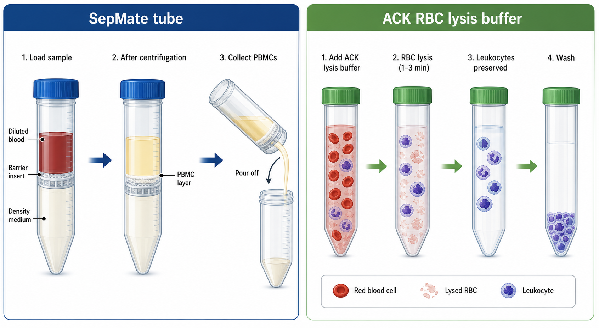

# 红细胞裂解液

红细胞裂解液（red blood cell lysis buffer，RBC lysis buffer）是一类用于选择性裂解 erythrocytes（红细胞，RBC）的缓冲液，常用于去除血液、脾脏、骨髓或 [密度梯度离心](<../用(实验流程内容篇)/密度梯度离心.md>) 后样本中的红细胞残留。最常见的一类是 ammonium chloride-based RBC lysis buffer（氯化铵基红细胞裂解液），也常称为 ACK lysis buffer（ammonium-chloride-potassium lysis buffer，ACK 裂解液）。



图源：Image2 生成的 PBMC 样本前处理示意图。右侧展示红细胞裂解液通过短时间裂解 RBC，保留 leukocytes（白细胞）后再洗涤的基本逻辑。

## 定义与命名

RBC lysis buffer 不是通用细胞裂解液。它的目标是裂解无细胞核、对渗透压和离子环境更敏感的成熟红细胞，同时尽量保留 nucleated cells（有核细胞），例如 lymphocytes（淋巴细胞）、monocytes（单核细胞）和其他白细胞。Thermo Fisher 的 eBioscience 1X RBC Lysis Buffer 页面说明，该产品用于裂解小鼠造血组织和人外周血单细胞悬液中的 erythrocytes，并含有 ammonium chloride（[氯化铵](氯化铵.md)），按说明使用时对淋巴细胞影响较小；有核红细胞不能被氯化铵有效裂解。参考：[Thermo Fisher eBioscience 1X RBC Lysis Buffer](https://www.thermofisher.com/order/catalog/product/00-4333-57)。

BioLegend 的 RBC Lysis Buffer 资料说明，其 10X 产品含 ammonium chloride、potassium carbonate（[碳酸钾](碳酸钾.md)）和 [EDTA](EDTA.md)，使用前需稀释为 1X，且 1X pH 通常在 7.1-7.4。参考：[BioLegend RBC Lysis Buffer 10X](https://www.biolegend.com/en-us/products/rbc-lysis-buffer-10x-1498)。

实验室自配 ACK 常见思路是 [氯化铵](氯化铵.md) 提供红细胞渗透性裂解，[碳酸氢钾](碳酸氢钾.md) 或碳酸钾参与缓冲，EDTA 螯合二价离子并减少细胞聚集。不同商品和自配配方可能不同，正式记录必须以产品说明书或本实验室 SOP 为准。

## 核心成分与作用

| 成分/属性 | 作用 |
| --- | --- |
| 氯化铵 | 主要裂解红细胞，常见于 ACK/RBC lysis buffer |
| 碳酸氢钾或碳酸钾 | 参与缓冲体系，不同配方选择不同 |
| EDTA | 螯合 Ca2+/Mg2+，减少聚集和金属离子相关影响 |
| pH 约 7.1-7.4 | 降低对白细胞的额外损伤 |
| 1X 工作液 | 通常直接用于细胞沉淀或单细胞悬液短时间处理 |

不要把 RBC lysis buffer 和 RIPA、NP-40、Triton X-100 这类总蛋白裂解液混用。后者会裂解或破坏目标有核细胞，不适合活细胞保留。

## 主要用途

| 场景 | 使用目的 | 注意事项 |
| --- | --- | --- |
| PBMC 分离后红细胞残留 | 补救红细胞污染 | 时间要短，避免损伤 PBMC |
| 全血流式前处理 | 去除 RBC，保留白细胞用于染色 | 某些 lyse/fix 产品会固定细胞，不能用于活细胞培养 |
| 小鼠脾脏/骨髓单细胞悬液 | 去除大量红细胞 | 需要充分终止和洗涤 |
| 磁性分选前样本清理 | 减少红细胞对计数和分选的干扰 | 过度裂解会降低回收率和活率 |
| 单细胞测序前样本优化 | 降低 RBC 背景 | 要验证对转录状态和活率影响 |

## RBC裂解液 vs 密度梯度离心

| 项目 | 红细胞裂解液 | 密度梯度离心 |
| --- | --- | --- |
| 核心目的 | 裂解/去除红细胞 | 按密度分离 PBMC/MNC |
| 对样本影响 | 化学/渗透压处理，可能影响白细胞状态 | 机械离心和密度介质暴露 |
| 适合 | 红细胞残留补救、流式前处理、脾脏/骨髓样本 | PBMC/MNC 初步分离 |
| 不适合 | 长时间暴露、敏感功能实验未经验证 | 需要快速裂解少量 RBC 的补救 |
| 记录重点 | 产品、浓度、时间、温度、终止方式 | 密度介质、RCF、brake、界面状态 |

如果目标是获得高质量 PBMC，通常优先做好 Ficoll/Lymphoprep/Histopaque 分层和洗涤；红细胞裂解液更像补救工具，而不是替代密度梯度分离的万能方案。

## RBC裂解液 vs 固定裂解液

| 类型 | 是否保留活细胞 | 适合场景 |
| --- | --- | --- |
| ACK/RBC lysis buffer | 通常用于保留有核细胞活性，但需验证 | 后续培养、分选、功能实验前的红细胞去除 |
| Lyse/fix buffer | 会固定细胞 | 全血流式表型检测，不能用于活细胞培养 |
| Hypotonic water lysis | 操作粗糙，风险高 | 特殊 SOP，不作为默认推荐 |

购买前要确认产品是否含 fixative（固定剂）。做活细胞培养、细胞分选或单细胞实验时，不应误用 lyse/fix 类产品。

## 通用使用流程

以下是理解框架，正式实验应遵循产品说明书。

| 步骤 | 操作逻辑 | 关键点 |
| --- | --- | --- |
| 获得细胞沉淀 | 离心收集含红细胞残留的细胞 | 去除上清，估计红细胞污染程度 |
| 加入 1X RBC 裂解液 | 充分重悬细胞沉淀 | 室温或说明书指定温度，避免过量时间 |
| 短时间孵育 | 让红细胞裂解 | 轻轻混匀，观察红色逐渐变浅 |
| 终止/稀释 | 加入培养基、PBS/DPBS 或说明书推荐缓冲液 | 及时终止，避免白细胞损伤 |
| 离心洗涤 | 去除裂解产物和残留裂解液 | 至少洗涤一次，敏感下游可增加洗涤 |
| 计数质控 | 记录细胞数、活率和红细胞残留 | 决定是否进入下游实验 |

## 使用注意事项

| 变量 | 为什么重要 | 建议 |
| --- | --- | --- |
| 暴露时间 | 过长会损伤白细胞 | 严格按说明书，先短后长优化 |
| 温度 | 影响裂解速度和细胞状态 | 记录室温/4°C/37°C |
| 样本类型 | 脾脏、骨髓、PBMC 残留 RBC 情况不同 | 不同样本不要机械套同一体积和时间 |
| 是否有核红细胞 | 氯化铵对有核 RBC 效果差 | 胎儿/鸟类/某些特殊样本需其他策略 |
| 下游用途 | 培养、流式、RNA、单细胞对状态要求不同 | 关键下游前做小规模验证 |
| 是否含固定剂 | 决定能否用于活细胞 | 购买时确认 ACK vs lyse/fix |

## 常见错误与 troubleshooting

| 问题 | 可能原因 | 处理 |
| --- | --- | --- |
| 红细胞仍很多 | 裂解时间不足、裂解液失效、红细胞量过多 | 延长少量时间或重复一次，避免一次过度裂解 |
| 白细胞活率下降 | 暴露太久、温度不合适、终止不及时 | 缩短孵育，快速终止并洗涤 |
| 细胞团聚 | 裂解后 DNA/碎片多，洗涤不足 | 过滤、温和吹打，必要时优化 EDTA/DNase 条件 |
| 流式背景高 | 裂解碎片、死细胞或血小板残留 | 加死活染，增加洗涤和过滤 |
| 后续培养状态差 | 裂解液残留或处理应激 | 增加洗涤，给细胞休整，降低处理强度 |
| 误用固定裂解液 | 产品类型没看清 | 重新采购适合活细胞的 ACK/RBC lysis buffer |

## 购买建议

| 产品类型 | 适合情况 | 注意事项 |
| --- | --- | --- |
| 1X RBC Lysis Buffer | 直接使用，减少稀释错误 | 体积大时成本较高 |
| 10X RBC Lysis Buffer | 常规实验室使用，稀释灵活 | 必须记录稀释液和 pH |
| ACK Lysing Buffer | 常见活细胞保留型红细胞裂解 | 确认不含固定剂 |
| Lyse/fix 产品 | 全血流式固定检测 | 不适合培养、分选或活细胞功能实验 |

常见供应商包括 [BioLegend](<../番外/试剂厂商/BioLegend.md>)、[BD Biosciences](<../番外/试剂厂商/BD Biosciences.md>) 和 Thermo Fisher/eBioscience 等。购买时重点看产品是否为 1X/10X、是否含固定剂、适用样本、储存条件、开封后稳定性和货号批号追溯。

## 推荐记录模板

中文记录模板：

```text
产品名称：
品牌/供应商：
货号：
批号：
1X或10X：
是否含固定剂：
储存条件：
开封日期：
有效期：
样本类型：
起始细胞数/沉淀大小：
红细胞污染程度：
裂解液体积：
孵育时间：
孵育温度：
终止方式：
洗涤条件：
裂解后细胞数：
裂解后活率：
红细胞残留：
下游用途：
异常现象：
```

English record template:

```text
Product name:
Brand/supplier:
Catalog number:
Lot number:
1X or 10X:
Fixative-containing:
Storage condition:
Open date:
Expiration date:
Sample type:
Starting cell number/pellet size:
RBC contamination level:
Lysis buffer volume:
Incubation time:
Incubation temperature:
Quenching method:
Wash condition:
Post-lysis cell number:
Post-lysis viability:
Residual RBCs:
Downstream use:
Abnormal observation:
```

## 小结

红细胞裂解液是去除 RBC 污染的强力补救工具，但它不是越久越干净、越强越好。真正重要的是：确认产品类型，控制浓度、时间和温度，及时终止并充分洗涤，同时记录裂解前后细胞数、活率和下游用途。

## 参考来源

- [Thermo Fisher eBioscience 1X RBC Lysis Buffer](https://www.thermofisher.com/order/catalog/product/00-4333-57)
- [BioLegend RBC Lysis Buffer 10X](https://www.biolegend.com/en-us/products/rbc-lysis-buffer-10x-1498)
- [STEMCELL Technologies PBMC Isolation](https://www.stemcell.com/peripheral-blood-mononuclear-cell-isolation.html)
