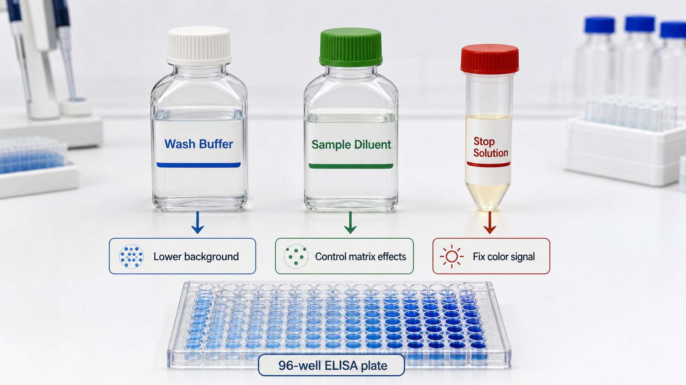

# 终止液

Stop solution（终止液）是在显色型 [ELISA](<../用(实验流程内容篇)/ELISA.md>) 中用于停止 enzyme-substrate reaction（酶-底物反应）并固定读数窗口的酸性或专用反应终止试剂；最常见场景是终止 HRP-TMB 显色反应。



图：ELISA 配套液体试剂示意。终止液的核心作用是把动态显色反应固定到可读的时间点。本图由 Image2 / image-generation model 生成，用于个人学习笔记示意。

## 在 ELISA 里的位置

在常见 horseradish peroxidase（HRP，辣根过氧化物酶）+ [TMB](TMB.md) 体系里，TMB 显色时通常呈蓝色；加入酸性终止液后颜色转为黄色，常在 [酶标仪](酶标仪.md) 上读取 OD450。终止液不是让颜色“永久不变”，而是让所有孔在相近时间点停止继续发展，减少读数时间差造成的误差。

BioLegend 的 sandwich ELISA protocol 在 TMB substrate incubation（TMB 底物孵育）后加入 stop solution 并读取吸光度；R&D Systems 的 ELISA protocols 也采用底物显色后加终止液再读板的逻辑。参考：[BioLegend sandwich ELISA protocol](https://www.biolegend.com/en-us/protocols/sandwich-elisa-protocol)；[R&D Systems ELISA protocols](https://www.rndsystems.com/resources/protocols)。

## 常见组成

| 终止液类型 | 常见成分 | 适用情况 | 注意事项 |
| --- | --- | --- | --- |
| 酸性终止液 | [硫酸](硫酸.md)、[盐酸](盐酸.md)、[磷酸](磷酸.md) 等 | HRP-TMB 显色 ELISA 最常见 | 腐蚀性强，需要 PPE 和规范废液处理 |
| 专用底物终止液 | 厂家配套 stop reagent | 商业 kit 或特殊底物体系 | 不要跨底物体系随意替换 |
| 不终止直接读 | kinetic read（动力学读数） | 需要连续监测反应速度 | 对仪器、时间控制和数据处理要求更高 |

常见商业 stop solution 可能是 0.16-2 M 范围内的酸液，但具体浓度和体积必须按 kit 说明书执行。不同底物如 OPD、ABTS、PNPP 的终止条件并不完全一样，不应把 TMB 终止液自动套用到所有显色体系。

## 为什么加终止液会改变颜色

TMB 的氧化产物在不同 pH 条件下吸收特征不同。HRP 催化 TMB 显色时，反应液通常从无色变蓝；加入酸后，反应停止并形成适合 450 nm 读取的黄色产物。因此同一块板在加终止液前后，适合读取的波长和颜色状态不同。

这也是为什么 protocol 会要求固定显色时间、固定加终止液顺序，并在规定时间内读板。如果某些孔先显色很久、某些孔后终止，就会把操作时间差误当成真实浓度差。

## 和 TMB、洗涤缓冲液、样本稀释液的区别

| 试剂 | 主要作用 | 是否参与读数 |
| --- | --- | --- |
| TMB | HRP 底物，产生颜色信号 | 是，决定显色强度 |
| 终止液 | 停止显色并固定读数窗口 | 是，决定最终读数状态 |
| [洗涤缓冲液](洗涤缓冲液.md) | 去除未结合组分，降低背景 | 间接影响背景 |
| [样本稀释液](样本稀释液.md) | 控制样本基质和反应环境 | 间接影响曲线和样本读数 |

终止液不是“附属步骤”。它把一个仍在变化的显色反应切换成读板状态，因此加液体积、顺序和读板时间都属于实验变量。

## 使用注意事项

终止液通常具有腐蚀性。操作时应穿实验服、佩戴合适手套和护目镜，在符合实验室安全要求的条件下使用。加液时避免溅出，污染台面后应按酸液处理规范清理。

关键操作点：

- 按说明书使用固定体积，例如每孔 50 uL 或 100 uL。
- 加终止液顺序最好与加 TMB 顺序一致。
- 每孔加液后轻轻混匀，避免产生气泡。
- 加完后在说明书要求时间内读板。
- 不要让枪头接触孔内液体后再污染终止液储液槽。
- 废液按含酸和含生物样本/化学底物的要求处理。

如果板上气泡很多，OD 读数可能虚高或孔间差异变大。读板前应检查明显气泡，但不要为了去泡过度震荡导致液体溅出或交叉污染。

## 常见错误与 troubleshooting

| 异常 | 可能原因 | 调整方向 |
| --- | --- | --- |
| 同一浓度复孔差异大 | 加终止液顺序和速度不一致、气泡、混匀不足 | 使用多道移液枪，保持和加底物相同顺序，读板前检查气泡 |
| 高浓度孔过饱和 | 显色时间太长或样本浓度超出范围 | 缩短显色时间，增加样本稀释倍数 |
| 整板信号偏低 | TMB 显色不足、终止过早、HRP 体系失活 | 延长显色时间，检查底物和抗体酶标物 |
| 颜色不从蓝转黄 | 终止液加错、体积不足或底物体系不匹配 | 确认 stop solution 类型和体积 |
| 读数随时间漂移 | 终止后读板太晚或混匀不一致 | 按固定时间窗口读板，统一操作节奏 |

## 购买建议

商业 ELISA kit 优先使用配套 stop solution。自建 HRP-TMB ELISA 时，可以购买通用 TMB stop solution，也可以使用已验证的酸性终止液配方，但需要建立明确的安全、浓度和废液处理记录。

不建议把不同 kit 的终止液随意混用，尤其是当底物不是 TMB、读数波长不同、或说明书明确要求专用 stop reagent 时。长期项目中，终止液批号、浓度和加液体积都应记录。

## 记录模板

中文记录：

```text
实验名称：
检测项目：
底物体系：TMB / OPD / ABTS / PNPP / 其他
终止液名称/厂家：
终止液成分或浓度：
批号：
每孔加入体积：
加液顺序：
显色时间：
终止后读板时间：
读取波长：
是否有气泡：
异常观察：
```

English record:

```text
Experiment:
Target analyte:
Substrate system: TMB / OPD / ABTS / PNPP / other
Stop solution name/vendor:
Stop solution composition or concentration:
Lot number:
Volume per well:
Addition order:
Development time:
Time from stopping to reading:
Reading wavelength:
Bubbles observed: yes / no
Notes/abnormal observations:
```

## 小结

终止液的作用是把显色反应从“正在变化”变成“可以读数”。只要加液顺序、体积、混匀或读板时间不一致，就可能让技术误差伪装成真实生物学差异。

## 参考来源

- [BioLegend sandwich ELISA protocol](https://www.biolegend.com/en-us/protocols/sandwich-elisa-protocol)
- [R&D Systems ELISA protocols](https://www.rndsystems.com/resources/protocols)
- [Thermo Fisher Overview of ELISA](https://www.thermofisher.com/us/en/home/life-science/protein-biology/protein-biology-learning-center/protein-biology-resource-library/pierce-protein-methods/overview-elisa.html)
