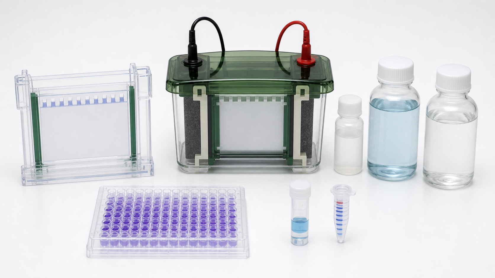

# 转膜槽

转膜槽，常指 wet transfer tank（湿转转膜槽）或 electroblotting tank（电转印槽），是 [Western blot](<../用(实验流程内容篇)/Western blot.md>) 中把 [SDS-PAGE凝胶](SDS-PAGE凝胶.md) 内蛋白转移到 [PVDF膜](PVDF膜.md) 或 [NC膜](NC膜.md) 上的装置。它不是检测系统，而是把“凝胶里的分离结果”搬到“可孵育抗体的膜”上的关键桥梁。



图源：Image2 生成的 Western blot 与 BCA 核心材料参考图；中间蓝色装置示意湿转转膜槽，左侧为预制胶卡夹，右侧为 BCA 相关试剂。

## 核心结构

| 部件 | 作用 | 关键检查点 |
| --- | --- | --- |
| 转膜槽 tank | 盛放 [转膜缓冲液](转膜缓冲液.md)，形成电场环境 | 是否漏液，液面是否覆盖夹板 |
| 电极 electrode | 让带负电的蛋白从凝胶向正极侧膜迁移 | 正负极方向不能反 |
| 凝胶夹 cassette | 固定“海绵-滤纸-凝胶-膜-滤纸-海绵”夹心 | 夹紧但不能错位 |
| [转膜海绵垫](转膜海绵垫.md) | 填充空间、提供压力和缓冲液通道 | 不能太旧、太薄或有沉积 |
| [滤纸](滤纸.md) | 使凝胶和膜均匀接触并导液 | 尺寸略大于胶和膜，不能有气泡 |
| 冷却组件 | 控制转膜发热 | 高电流或长时间转膜时尤其重要 |

Bio-Rad 的 Mini Trans-Blot Cell 官方资料说明，这类小型湿转系统可容纳 mini gel 胶夹，并通过较近的电极距离提高转膜效率；其资料也强调可用于 Western blotting（蛋白免疫印迹）和 nucleic acid transfer（核酸转移）。参考：[Bio-Rad Mini Trans-Blot Cell](https://www.bio-rad.com/en-us/product/mini-trans-blot-cell?ID=589ca8f7-5751-487a-a453-571ee8cc8b7e)。

## 工作逻辑

在 [SDS-PAGE](<../用(实验流程内容篇)/SDS-PAGE.md>) 后，蛋白通常仍带有来自 [SDS](十二烷基硫酸钠.md) 的负电荷。转膜时，凝胶靠近负极，膜靠近正极，电场推动蛋白从凝胶迁移到膜上。膜的作用是把蛋白固定住，方便后续封闭、一抗、二抗和显色。

所以转膜槽的核心不是“越强越好”，而是让电场、接触、散热和缓冲液成分同时稳定。

## 湿转 vs 半干转 vs 快速转膜

| 方式 | 优点 | 局限 | 适合场景 |
| --- | --- | --- | --- |
| 湿转 | 转膜均匀，适合大蛋白和难转蛋白 | 耗 buffer 多，时间较长，占空间 | 常规 WB、大蛋白、正式数据 |
| 半干转 | 速度快，用液少 | 对夹心湿度和接触更敏感 | 中小蛋白、批量快速验证 |
| 快速转膜系统 | 程序化、时间短、重复性好 | 依赖专用耗材或设备 | 高通量、固定 workflow |

如果目标蛋白较大、丰度低或以前经常转膜不足，优先考虑湿转或延长转膜条件；如果目标在 20-100 kDa 且体系成熟，半干或快速转膜可节省时间。

## 标准夹心方向

常见湿转夹心从负极到正极为：

```text
负极 cathode
海绵垫
滤纸
SDS-PAGE 凝胶
PVDF膜或NC膜
滤纸
海绵垫
正极 anode
```

口诀是“蛋白从胶走向膜”。如果方向反了，蛋白会离开凝胶但不会进入目标膜，最终可能出现膜上无条带或条带极弱。

## 使用 protocol

### 组装前准备

**怎么做**：预冷 [转膜缓冲液](转膜缓冲液.md)，裁剪膜和滤纸，PVDF 膜先用甲醇活化再转入 buffer 平衡，NC 膜通常直接 buffer 平衡即可。

**为什么**：膜的润湿状态决定蛋白能否均匀吸附；冷 buffer 和冷却模块可降低发热。

**注意事项**：

- PVDF 膜干了以后容易形成局部不润湿区域。
- 滤纸、膜和凝胶尺寸不要差太多。
- 手不要直接接触膜的蛋白结合区域。

### 夹心组装

**怎么做**：在 buffer 中逐层放置海绵、滤纸、凝胶、膜、滤纸、海绵，用滚棒或移液管轻轻赶走气泡。

**为什么**：气泡是转膜失败最常见原因之一。气泡所在位置没有连续导电液体和物理接触，膜上会出现圆形或不规则空白。

**替代策略**：

- 没有专用滚棒时，可用干净的 15 mL 或 50 mL 离心管轻压排泡。
- 对易碎胶，先在 buffer 中充分平衡，转移时用切胶铲支撑。

### 运行转膜

**怎么做**：确认黑对黑、红对红，加入足量 buffer，放入冷却芯或冰盒，根据目标蛋白大小、胶厚、膜类型选择恒压或恒流条件。

**为什么**：电流过大导致发热、条带扩散或膜变形；电流过小或时间不足则转膜不完全。

**可能出错的结果**：

- 小蛋白转过头：膜上弱，甚至穿膜。
- 大蛋白转不出：胶上仍有强信号。
- 发热严重：条带弥散、膜背景高、胶变形。

### 转膜后检查

**怎么做**：可用 [Ponceau S](Ponceau S.md) 快速检查总蛋白转移是否均匀，再进入封闭和抗体孵育。

**为什么**：转膜问题越早发现越省时间。等到 ECL 显色后才发现整张膜转坏，排查成本会更高。

## 选择标准

| 变量 | 建议 |
| --- | --- |
| 胶尺寸 | 与电泳系统匹配，例如 mini gel、midi gel |
| 同时转膜数量 | 根据样本量选择 1-2 块或更多容量 |
| 目标蛋白大小 | 大蛋白优先湿转和充分冷却 |
| 预算 | 湿转槽一次投入高，但耗材自由度高 |
| 维护难度 | 检查电极腐蚀、线缆老化和夹板变形 |

## 常见错误与 troubleshooting

| 问题 | 可能原因 | 处理 |
| --- | --- | --- |
| 整张膜无信号 | 转膜方向反、膜放错侧、电源未通 | 检查极性和夹心方向 |
| 局部白斑 | 气泡或滤纸褶皱 | 重新组装并排泡 |
| Marker 转移但目标弱 | 目标蛋白太大、转膜不足、膜不合适 | 延长时间，降低甲醇，选择 PVDF |
| 背景高 | 过热、膜干燥、封闭不充分 | 冷却转膜，保持膜湿润 |
| 条带弯曲或扩散 | 电流过大、夹心压力不均 | 降低电流，换新海绵垫 |

## 购买与记录建议

常见选择包括 [Bio-Rad](<../番外/试剂厂商/Bio-Rad.md>) Mini Trans-Blot、Trans-Blot 系列，Thermo/Invitrogen Mini Blot Module，以及 [Cytiva](<../番外/试剂厂商/Cytiva.md>)、[Merck](<../番外/试剂厂商/Merck.md>) 相关转膜耗材体系。若实验室已经固定某一品牌的电泳槽，优先选兼容转膜模块，能减少卡夹尺寸和电源接口问题。

推荐记录模板（中文）：

```text
转膜设备：
转膜方式：湿转/半干/快速
膜类型与孔径：
凝胶浓度与厚度：
转膜缓冲液：
甲醇/SDS比例：
恒压或恒流条件：
转膜时间：
冷却方式：
目标蛋白大小：
转膜后Ponceau S结果：
异常现象：
```

Recommended record template (English):

```text
Transfer device:
Transfer mode: wet/semi-dry/rapid
Membrane type and pore size:
Gel percentage and thickness:
Transfer buffer:
Methanol/SDS percentage:
Voltage/current mode:
Transfer time:
Cooling strategy:
Target protein size:
Post-transfer Ponceau S result:
Abnormal observation:
```

## 小结

转膜槽决定 WB 中“分离结果能否完整搬家”。如果条带不好，不要只怀疑抗体；先看夹心方向、气泡、膜类型、buffer、发热和目标蛋白大小，很多 WB 失败其实卡在转膜这一步。

## 参考来源

- [Bio-Rad Mini Trans-Blot Cell](https://www.bio-rad.com/en-us/product/mini-trans-blot-cell?ID=589ca8f7-5751-487a-a453-571ee8cc8b7e)
- [Bio-Rad Wet/Tank Blotting Systems](https://www.bio-rad.com/en-us/category/wet-tank-blotting-systems?ID=f49905e9-1a24-44df-8161-5021b70113a2)
- [Bio-Rad Mini Trans-Blot Cell literature PDF](https://www.bio-rad.com/webroot/web/pdf/lsr/literature/br109.pdf)
