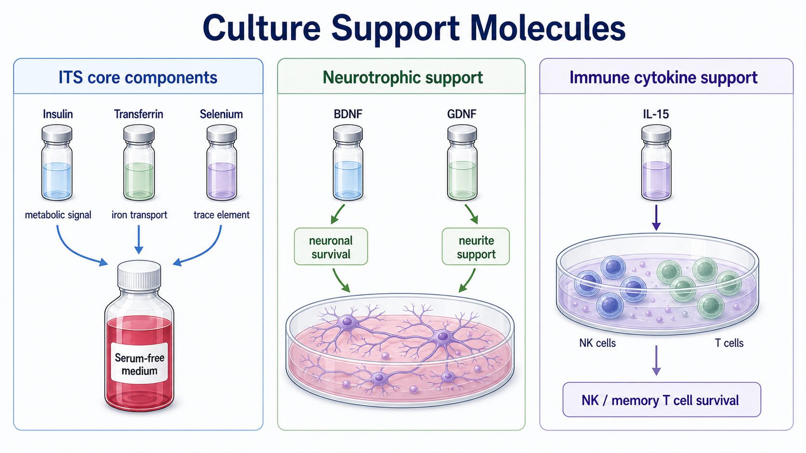

# 转铁蛋白

转铁蛋白（transferrin，转铁蛋白）是铁结合和铁转运蛋白，是 [ITS补充剂](ITS补充剂.md) 的核心成分之一。在无血清或低血清培养中，它用于提供更可控的 iron transport（铁转运）支持，减少游离铁带来的氧化应激和毒性风险。



图源：Image2 生成的培养支持分子参考图；转铁蛋白位于 ITS core components 模块，代表铁转运支持。

## 核心作用

铁是细胞增殖、线粒体功能和多种酶活性所需元素，但游离铁也可能参与 Fenton reaction（芬顿反应）并促进 reactive oxygen species（ROS，活性氧）形成。转铁蛋白通过结合铁并经 transferrin receptor（转铁蛋白受体）介导摄取，为细胞提供更受控的铁来源。

Thermo Fisher 的细胞培养补充剂页面说明，ITS 作为基础培养基补充剂可帮助提高细胞增殖和活率，并减少 FBS 需求；其中 transferrin 是 ITS 的三大核心组分之一。参考：[Thermo Fisher Cell Culture Media Supplements](https://www.thermofisher.com/au/en/home/life-science/cell-culture/mammalian-cell-culture/media-supplements.html)。

## Holo vs apo transferrin

| 类型 | 英文 | 含义 | 选择逻辑 |
| --- | --- | --- | --- |
| Holo-transferrin | iron-saturated transferrin | 已结合铁的转铁蛋白 | 更直接提供铁 |
| Apo-transferrin | iron-free transferrin | 未结合铁或低铁状态 | 更适合控制铁背景 |
| Human transferrin | human-source or recombinant human | 人源/重组人源 | 人源细胞和 xeno-free 逻辑更常关注 |
| Bovine transferrin | bovine-source | 牛源 | 传统配方中可见，不适合 xeno-free |

如果 protocol 只写 “transferrin”，仍需确认是 holo 还是 apo、物种来源、是否 recombinant、是否 carrier-free，以及是否符合 xeno-free 要求。

## 转铁蛋白 vs 铁盐

| 项目 | 转铁蛋白 | 铁盐/无机铁 |
| --- | --- | --- |
| 铁提供方式 | 蛋白结合、受体介导 | 更直接、游离铁风险更高 |
| 可控性 | 更接近生理铁转运 | 容易影响氧化应激 |
| 常见用途 | 无血清/定义培养基 | 特殊补铁或配方调整 |
| 风险 | 来源和铁饱和度差异 | ROS、沉淀、毒性 |

## 使用 protocol

### 通过ITS补加

**怎么做**：使用 100X ITS 按 1X 加入基础培养基。

**为什么**：这是最常见方式，可同时提供胰岛素、转铁蛋白和硒。

### 单独补加

**怎么做**：按产品说明重构或稀释转铁蛋白，加入培养基并记录终浓度、铁饱和状态和来源。

**为什么**：铁代谢相关实验或精细定义培养基中，可能需要单独调节 transferrin。

**注意事项**：

- 做 iron metabolism（铁代谢）或 ROS 实验时，transferrin 是关键变量。
- xeno-free 体系需确认转铁蛋白来源。
- 蛋白类补充剂避免反复冻融和污染。

## 常见错误与 troubleshooting

| 现象 | 可能原因 | 处理 |
| --- | --- | --- |
| 无血清体系增殖差 | 铁转运支持不足 | 加 ITS 或单独 holo-transferrin |
| 氧化应激背景改变 | 铁饱和度或游离铁变化 | 固定 transferrin 类型并记录 |
| xeno-free不成立 | 使用牛源 transferrin | 改用人源/重组版本 |
| 不同批次差异 | apo/holo 或来源不同 | 核对完整产品名和 COA |

## 购买与记录建议

常见供应商包括 [Gibco](<../番外/试剂厂商/Gibco.md>)、[Sigma-Aldrich](<../番外/试剂厂商/Sigma-Aldrich.md>)/[Merck](<../番外/试剂厂商/Merck.md>)、[STEMCELL Technologies](<../番外/试剂厂商/STEMCELL Technologies.md>)。选择时看物种来源、apo/holo 状态、铁饱和度、是否 recombinant、是否无菌和内毒素水平。

推荐记录模板（中文）：

```text
转铁蛋白产品全名：
品牌：
货号：
批号：
来源：人源/牛源/重组/其他
状态：holo / apo / 未注明
储液浓度：
终浓度：
是否通过ITS加入：
基础培养基：
是否xeno-free：
使用细胞/实验目的：
开封/重构日期：
异常现象：
```

Recommended record template (English):

```text
Transferrin product full name:
Brand:
Catalog number:
Lot number:
Source: human/bovine/recombinant/other
State: holo / apo / not specified
Stock concentration:
Final concentration:
Added through ITS: yes/no
Basal medium:
Xeno-free: yes/no
Cell type/experimental purpose:
Open/reconstitution date:
Abnormal observation:
```

## 小结

转铁蛋白在定义培养基中负责“安全送铁”。它比直接加铁盐更可控，但 holo/apo 状态、物种来源和是否重组会影响铁代谢、氧化应激和 xeno-free 判断。

## 参考来源

- [Thermo Fisher Cell Culture Media Supplements](https://www.thermofisher.com/au/en/home/life-science/cell-culture/mammalian-cell-culture/media-supplements.html)
- [Gibco ITS-G Select Supplement User Guide](https://assets.thermofisher.com/TFS-Assets/LSG/manuals/MAN1000664-InsulinTransferrinSeleniumSelectSupplement-UG.pdf)

