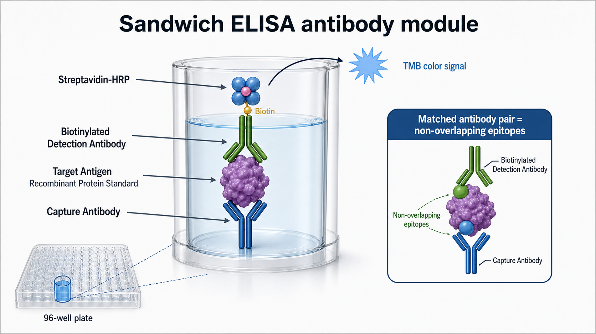

# 配对抗体

Matched antibody pair（配对抗体）是指一组已经验证可以同时识别同一目标抗原不同位点的抗体组合，通常由 [捕获抗体](捕获抗体.md) 和 [检测抗体](检测抗体.md) 构成，是 [夹心ELISA](<../用(实验流程内容篇)/夹心ELISA.md>) 成败的核心变量。



图：夹心 ELISA 抗体模块示意。配对抗体的关键不是“两支抗体都能识别目标”，而是它们能同时占据不冲突的 epitope（[表位](../番外/补充知识/表位.md)）。本图由 Image2 / image-generation model 生成，用于个人学习笔记示意。

## 基本逻辑

在 sandwich enzyme-linked immunosorbent assay（夹心酶联免疫吸附测定）中，捕获抗体先固定在 [酶标板](酶标板.md) 上，目标抗原被捕获后，检测抗体再结合抗原的另一个表位。只有当两支抗体能同时结合目标抗原，信号才会和目标物浓度相关。

BioLegend 的 sandwich ELISA protocol 采用 coating capture antibody、add standards/samples、add detection antibody、add avidin-HRP、add TMB substrate 的流程；这说明配对抗体、酶标放大体系和标准品共同决定最终读数。参考：[BioLegend sandwich ELISA protocol](https://www.biolegend.com/en-us/protocols/sandwich-elisa-protocol)。

## 配对抗体为什么难

两支抗体分别能识别目标抗原，不代表它们能组成有效配对。常见失败原因包括：

| 问题 | 结果 | 解释 |
| --- | --- | --- |
| 识别同一表位或空间重叠表位 | 信号弱或无信号 | 捕获抗体占位后检测抗体无法再结合 |
| 抗原构象被包被或样本处理破坏 | 标准曲线差 | 表位暴露状态改变 |
| 捕获抗体亲和力不足 | 灵敏度低 | 低浓度目标物容易被洗掉 |
| 检测抗体交叉反应 | 背景高或假阳性 | 识别样本中相似蛋白 |
| 标准品和真实样本抗原形态不同 | 曲线好但样本不准 | recombinant protein（重组蛋白）不一定代表天然蛋白 |

因此配对抗体的筛选通常要做 cross-pairing matrix（交叉配对矩阵）：多支抗体分别作为 capture 和 detection 互换测试，选择背景低、曲线范围合适、低浓度区分度好的组合。

## 和单抗、多抗、普通抗体的关系

| 概念 | 重点 | 在 ELISA 里的意义 |
| --- | --- | --- |
| monoclonal antibody（单克隆抗体） | 通常识别单一表位 | 特异性强，批间稳定，适合做捕获或检测 |
| polyclonal antibody（多克隆抗体） | 识别多个表位混合 | 信号强，但批间差异和交叉反应风险更高 |
| antibody pair（配对抗体） | 两支抗体已经验证可共同识别 | 适合快速建立夹心 ELISA |
| antibody set / ELISA pair | 厂家提供的抗体组合 | 常附带推荐浓度、标准品和 protocol |
| [ELISA试剂盒](ELISA试剂盒.md) | 配对抗体加板、标准品、缓冲液等完整体系 | 变量最少，但灵活性较低 |

如果只是买到一支“anti-X antibody”，它不等于可以做夹心 ELISA。真正关键是这支抗体能否和另一支抗体构成非竞争性配对。

## 选择标准

优先看这些信息：

- 是否明确标注 validated for sandwich ELISA（已验证用于夹心 ELISA）。
- 是否提供 paired antibody set（配对抗体套装）或 matched antibody pair。
- 是否包含推荐 capture/detection 浓度。
- 是否说明适用样本类型，例如 serum、plasma、cell culture supernatant。
- 是否提供 recombinant standard（重组标准品）或校准品。
- 是否有数据展示标准曲线、灵敏度、范围和特异性。
- 是否说明与相关家族蛋白的交叉反应。

R&D Systems 的 ELISA protocols 和 BioLegend 的 protocol 都把 standards/samples、capture antibody、detection antibody、enzyme conjugate 和 substrate 放在连续流程中看待；实际选择时也应该把它们作为一个体系，而不是单独看某支抗体。参考：[R&D Systems ELISA protocols](https://www.rndsystems.com/resources/protocols)；[BioLegend sandwich ELISA protocol](https://www.biolegend.com/en-us/protocols/sandwich-elisa-protocol)。

## 使用与优化

如果使用厂家配对抗体，第一轮建议严格按说明书浓度和孵育条件做。后续优化可从以下变量入手：

| 变量 | 主要影响 | 常见调整 |
| --- | --- | --- |
| 捕获抗体包被浓度 | 捕获容量和背景 | 过低灵敏度差，过高可能增加背景 |
| 检测抗体浓度 | 信号强度和背景 | 过高易高背景，过低低浓度识别差 |
| 抗原标准品范围 | 曲线覆盖范围 | 根据样本预期浓度重设梯度 |
| 洗涤强度 | 背景与弱信号保留 | 背景高时先优化洗涤，而不是盲目降抗体 |
| 样本稀释倍数 | 基质效应和曲线落点 | 做稀释线性验证 |

自筛配对抗体时，建议先固定抗原浓度和板型，做 capture antibody × detection antibody 的矩阵筛选，再对最优组合做浓度棋盘滴定。

## 常见异常与 troubleshooting

| 异常 | 可能原因 | 调整方向 |
| --- | --- | --- |
| 标准品无曲线 | 两支抗体不配对、抗原失活、检测体系漏加 | 换配对组合，确认标准品和 HRP/TMB 流程 |
| 背景很高 | 检测抗体过量、非特异性结合、洗涤不足 | 降低检测抗体浓度，优化封闭和洗涤 |
| 低浓度区分不开 | 捕获亲和力不足或酶标放大不够 | 提高捕获抗体、延长孵育或使用生物素-链霉亲和素放大 |
| 样本值异常高 | 交叉反应、异嗜性抗体干扰、Hook 效应 | 做稀释线性、spike recovery 和高低稀释对照 |
| 不同批次差异大 | 抗体批次或标准品批次变化 | 记录批号，保留桥接质控样本 |

## 购买建议

如果目标是尽快建立可靠 ELISA，优先购买 matched antibody pair 或 ELISA development set，而不是随机购买两支单独抗体。若实验对绝对定量要求高，成熟 kit 往往比自建体系更稳。

如果需要灵活更换样本类型、检测范围或抗体来源，自建配对体系更有价值，但要预留筛选时间。长期项目建议一次性购买足够批量，并记录 antibody clone（抗体克隆号）、lot number（批号）、recommended concentration（推荐浓度）和 standard source（标准品来源）。

## 记录模板

中文记录：

```text
检测目标：
抗原物种：
样本类型：
捕获抗体名称/克隆号：
捕获抗体厂家/货号/批号：
检测抗体名称/克隆号：
检测抗体厂家/货号/批号：
是否生物素化：
标准品来源：
包被浓度：
检测抗体浓度：
标准曲线范围：
背景 OD：
最低可区分浓度：
异常观察：
```

English record:

```text
Target analyte:
Antigen species:
Sample type:
Capture antibody name/clone:
Capture antibody vendor/catalog/lot:
Detection antibody name/clone:
Detection antibody vendor/catalog/lot:
Biotinylated: yes / no
Standard source:
Coating concentration:
Detection antibody concentration:
Standard curve range:
Background OD:
Lowest distinguishable concentration:
Notes/abnormal observations:
```

## 小结

配对抗体的本质是“空间上能同时识别同一个目标抗原的两支抗体”。夹心 ELISA 的可靠性，往往不是由某一支抗体决定，而是由捕获、检测、标准品、洗涤和样本基质共同决定。

## 参考来源

- [BioLegend sandwich ELISA protocol](https://www.biolegend.com/en-us/protocols/sandwich-elisa-protocol)
- [R&D Systems ELISA protocols](https://www.rndsystems.com/resources/protocols)
- [Thermo Fisher Overview of ELISA](https://www.thermofisher.com/us/en/home/life-science/protein-biology/protein-biology-learning-center/protein-biology-resource-library/pierce-protein-methods/overview-elisa.html)
