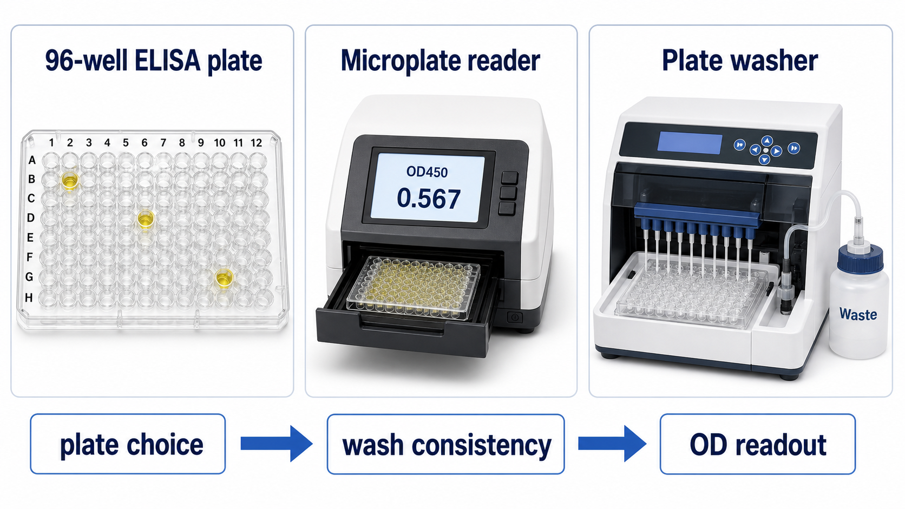

# 酶标仪

Microplate reader（酶标仪，微孔板读板仪）是用于读取 [酶标板](酶标板.md) 信号的仪器。它可以检测 absorbance（[吸光度](<../番外/补充知识/吸光度.md>)）、fluorescence（荧光）、luminescence（发光）等信号；在常规 [ELISA](<../用(实验流程内容篇)/ELISA.md>) 中，最常见用途是读取 HRP-TMB 反应终止后的 [OD450](<../番外/补充知识/OD450.md>)。



图源：Image2 生成的 ELISA 相关设备参考图；中间展示 microplate reader（酶标仪）托盘中放入 96 孔板，并以 OD450 作为 ELISA 吸光度读数示例。

## 核心作用

酶标仪把板孔中的颜色、荧光或发光信号转换为数字。对 HRP-TMB ELISA 来说，典型链条是：

```text
HRP催化TMB显色
-> 加酸终止变成黄色
-> 酶标仪在450 nm读取吸光度
-> 软件用标准曲线计算浓度
```

Thermo Fisher 的 ELISA overview 将 signal measurement（信号测量）列为 ELISA 的关键流程模块；Agilent 的 microplate reader 页面也将 absorbance、fluorescence、luminescence 等读出方式作为微孔板读板仪的主要功能类别。参考：[Thermo Fisher Overview of ELISA](https://www.thermofisher.com/us/en/home/life-science/protein-biology/protein-biology-learning-center/protein-biology-resource-library/pierce-protein-methods/overview-elisa.html)；[Agilent microplate readers](https://www.agilent.com/en/product/microplate-instrumentation/microplate-readers)。

## 常见读出模式

| 模式 | 英文 | 常见应用 | 关键参数 |
| --- | --- | --- | --- |
| 吸光度 | absorbance | ELISA、BCA、酶活、细胞活力显色 | 波长、线性范围、参考波长 |
| 荧光 | fluorescence | 荧光探针、细胞活力、报告基因 | excitation/emission、增益、串光 |
| 发光 | luminescence | luciferase、化学发光 ELISA | 积分时间、暗噪声 |
| 时间分辨荧光 | TRF/TR-FRET | 高灵敏免疫检测、HTS | 延迟时间、窗口 |
| 多模式 | multimode reader | 多种实验平台 | 模块、滤光片或单色器 |

普通 ELISA 入门最需要掌握的是 absorbance reader（吸光度酶标仪）。不要把 qPCR 仪、荧光显微镜和酶标仪的读数逻辑混在一起：它们的光路、样本容器和数据模型都不同。

## OD450 和参考波长

HRP-TMB ELISA 终止后通常读取 450 nm。很多 protocol 还建议读取 570 nm、620 nm 或 630 nm 作为 reference wavelength（参考波长），用于校正板底划痕、指纹、液面不平等光学背景。

| 设置 | 意义 |
| --- | --- |
| OD450 | TMB 终止后黄色产物主读数 |
| OD570/620/630 | 光学背景参考波长 |
| OD450 - reference | 校正后的读数 |

参考波长不是所有实验都必须扣除，但如果说明书要求，应该按说明执行。记录时要写清楚是否做了 reference correction（参考波长校正）。

## 酶标仪 vs 分光光度计

| 维度 | 酶标仪 | 分光光度计 |
| --- | --- | --- |
| 样本容器 | 96/384 孔板 | 比色皿、微量比色杯 |
| 通量 | 高 | 低到中 |
| 常见应用 | ELISA、板式酶活、细胞活力 | 单样本光谱、核酸/蛋白吸光度 |
| 光程 | 孔内液体高度变化大 | 比色皿通常固定 1 cm |
| 数据形式 | 板图 + 多孔数据 | 单样本或少量样本 |

酶标仪适合整板高通量比较，但路径长度和孔液面会影响吸光度。做绝对吸光度方法时，需要确认是否要 pathlength correction（光程校正）。

## 选择参数

购买或选择酶标仪时，至少关注：

- 支持的读出模式：absorbance、fluorescence、luminescence。
- 波长范围和波长选择方式：filter（滤光片）或 monochromator（单色器）。
- 是否支持 450 nm 和参考波长。
- 兼容板型：96 孔、384 孔、透明/白/黑板。
- 线性范围和检测范围。
- 是否支持 shaking（震荡）和温控。
- 软件是否支持 [标准曲线](<../番外/补充知识/标准曲线.md>)、4PL/5PL 拟合和原始数据导出。
- 是否易于导出 CSV/Excel。
- 是否有 IQ/OQ/PQ 或校准验证需求。

常见品牌包括 [Thermo Fisher Scientific](<../番外/试剂厂商/Thermo Fisher Scientific.md>)、[Bio-Rad](<../番外/试剂厂商/Bio-Rad.md>)、[Agilent](<../番外/试剂厂商/Agilent.md>) BioTek、[Revvity](<../番外/试剂厂商/Revvity.md>) 等。基础 ELISA 只需要稳定吸光度读板仪即可；如果以后要做荧光、发光、TR-FRET 或高通量筛选，才需要考虑 multimode reader。

## 使用 protocol

### 读板前检查

- 确认酶标仪预热或自检完成。
- 选择正确 protocol：波长、板型、读板模式。
- 检查板底是否有水滴、指纹或灰尘。
- 检查孔内是否有气泡。
- 确认封板膜已经去除。

### 读板过程

1. 将酶标板按 A1 方向正确放入托盘。
2. 选择 OD450 和参考波长。
3. 确认板图和样本布局。
4. 读板并保存 raw OD（原始吸光度）。
5. 导出数据，保留原始文件和处理文件。

### 为什么要保存原始数据

ELISA 后期可能需要重新扣 blank、剔除气泡孔、改变 4PL/5PL 拟合、检查重复孔 CV 或追溯板图错误。如果只保存最终浓度，很多问题无法复盘。

## 常见错误与 troubleshooting

| 现象 | 可能原因 | 处理 |
| --- | --- | --- |
| 全板 OD 异常低 | 波长设置错、TMB 未显色、读板模式错 | 检查 OD450 和 assay protocol |
| 全板 OD 异常高 | 显色过度、blank 高、读板范围饱和 | 缩短显色时间，检查 blank |
| 个别孔跳点 | 气泡、孔底污渍、划痕 | 去气泡，检查板底，必要时剔除孔 |
| 行列趋势明显 | 加样时间差、温度梯度、读板延迟 | 固定操作节奏，及时读板 |
| 标准曲线拟合差 | 软件模型不合适、标准品错误 | 检查 4PL/5PL 设置和标准品 |
| 不同仪器读数不同 | 光路、滤光片、校准状态差异 | 同一项目尽量固定仪器并做 QC |

## 记录模板

中文模板：

```text
酶标仪品牌：
型号：
仪器编号：
读出模式：
主波长：
参考波长：
板型：
软件版本：
拟合方式：
读板时间：
是否导出原始OD：
操作者：
备注：
```

English template:

```text
Reader brand:
Model:
Instrument ID:
Readout mode:
Primary wavelength:
Reference wavelength:
Plate format:
Software version:
Curve fit:
Reading time:
Raw OD exported:
Operator:
Notes:
```

## 总结

酶标仪是把 ELISA 颜色变成数字的仪器。对 HRP-TMB ELISA 来说，最关键的是正确的 OD450 设置、合适的参考波长、板底和气泡检查、原始 OD 保存，以及标准曲线拟合。仪器本身不是“自动给出真浓度”的黑箱；它只负责读信号，结果是否可信还取决于板图、标准品、洗板和数据处理。

## 参考来源

- [Thermo Fisher Overview of ELISA](https://www.thermofisher.com/us/en/home/life-science/protein-biology/protein-biology-learning-center/protein-biology-resource-library/pierce-protein-methods/overview-elisa.html)
- [Agilent microplate readers](https://www.agilent.com/en/product/microplate-instrumentation/microplate-readers)
- [Thermo Fisher microplate readers](https://www.thermofisher.com/us/en/home/life-science/lab-equipment/microplate-instruments/microplate-readers.html)
