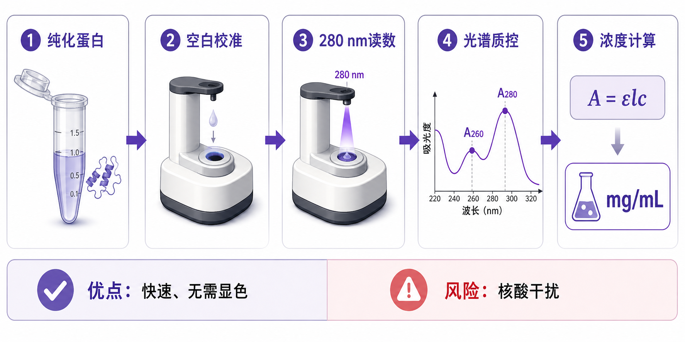

# A280蛋白定量

A280 protein quantification（A280 蛋白定量）是利用蛋白在 280 nm 附近的 ultraviolet absorbance（紫外吸收）来估算蛋白浓度的方法，尤其适合 purified protein（纯化蛋白）、抗体、重组蛋白和柱层析洗脱组分。它属于[蛋白定量](蛋白定量.md)的一种，但和 [BCA蛋白定量](BCA蛋白定量.md)、[Bradford蛋白定量](Bradford蛋白定量.md)不同：A280 不依赖显色试剂，而是直接读蛋白本身的紫外吸收。



A280 的最大优点是快速、无需显色、几乎不消耗样本；最大风险是它只适合相对纯净、背景明确的蛋白样本。样本中如果有 nucleic acid contamination（[核酸污染](../番外/补充知识/核酸污染.md)）、[浊度](../番外/补充知识/浊度.md)升高、颗粒、强紫外吸收缓冲液成分，或者目标蛋白缺少 tryptophan（色氨酸），A280 结果就可能明显偏离真实蛋白浓度。Thermo Fisher 的 NanoDrop One FAQ 也说明，Protein A280 模块通常使用 E1% 或摩尔消光系数加分子量来计算浓度；如果只是粗略估算，才可使用 “1 Abs = 1 mg/mL” 这类近似。参考：[Thermo Fisher NanoDrop One FAQ](https://www.thermofisher.com/order/catalog/product/ND-ONE-W/faqs)

## 发明历史

A280 来自 ultraviolet-visible spectroscopy（紫外-可见分光光度法）在蛋白化学中的应用。早期蛋白纯化和酶学研究需要快速跟踪蛋白在层析柱中的流出情况，280 nm 吸收就成为一种非常方便的在线或离线监测信号。

随着分光光度计和 [微量紫外分光光度计](<../材(实验耗材工具篇)/微量紫外分光光度计.md>) 普及，A280 从“看洗脱峰”进一步发展成常规蛋白浓度估算方法。现在很多仪器的软件会内置 BSA、IgG、lysozyme 或 user-defined protein（用户自定义蛋白）模式，本质上就是把 A280 读数、[光程校正](../番外/补充知识/光程校正.md)、分子量和[消光系数](../番外/补充知识/消光系数.md)结合起来计算浓度。

## 应用场景

| 场景 | 为什么适合 A280 | 重点风险 |
| --- | --- | --- |
| 纯化重组蛋白 | 无需显色，读数快，可保留样本 | 需要知道或估算消光系数 |
| 抗体浓度测定 | IgG 类样本较常用，操作方便 | 样本中缓冲液和稳定剂需匹配 blank |
| 柱层析洗脱峰追踪 | A280 可快速判断蛋白是否洗脱 | 核酸或色素污染会贡献吸收 |
| 蛋白储液质控 | 可同时查看全光谱形状 | 聚集或浑浊会造成散射背景 |
| 蛋白偶联/标记前浓度估算 | 不消耗样本，适合珍贵样本 | 染料或辅基可能吸收 280 nm |
| 细胞裂解液粗略检查 | 可快速判断是否有大量紫外吸收物 | 不适合作为复杂裂解液总蛋白默认定量 |

A280 不适合直接替代常规细胞裂解液的 BCA。粗裂解液里通常含核酸、脂质、碎片、还原剂、去垢剂和许多不同蛋白，A280 很难区分“蛋白吸收”和“非蛋白背景”。

## 实验目的

A280 蛋白定量通常要回答三个问题：

| 问题 | A280 的作用 |
| --- | --- |
| 纯化蛋白大概有多浓？ | 根据 A280 和消光系数换算 mg/mL 或 µM |
| 样本是否够纯净？ | 通过 A260/A280、A260/A230 和全光谱形状判断污染迹象 |
| 是否适合进入下一步？ | 判断是否满足酶活、偶联、冻存、结晶、质谱或 WB 上样需求 |

它的结果最好被理解为“对相对纯净蛋白样本的快速浓度估算”。如果样本用于关键定量比较，建议结合 BCA、Bradford、SDS-PAGE 总蛋白染色或质量平衡结果进行交叉判断。

## 简要实验原理

蛋白在 280 nm 附近的吸收主要来自 aromatic amino acids（芳香族氨基酸），尤其是 tryptophan（色氨酸）和 tyrosine（酪氨酸），以及部分 disulfide bond（二硫键）形成的 cystine（胱氨酸）。ExPASy ProtParam 文档也说明，蛋白的 280 nm 消光系数可根据 Tyr、Trp 和 cystine 的组成进行估算，并提醒含 Trp 的蛋白计算通常更可靠。参考：[ExPASy ProtParam documentation](https://web.expasy.org/protparam/protparam-doc.html)

A280 的浓度换算来自 Beer-Lambert law（比尔-朗伯定律）：

```text
A = εlc
```

其中 A 是 absorbance（吸光度），ε 是 extinction coefficient（消光系数），l 是 path length（光程），c 是 concentration（浓度）。所以，同样的 A280 读数，在不同蛋白、不同消光系数、不同光程下，对应的浓度并不一定相同。

常见计算路径有三种：

| 计算方式 | 适合情况 | 风险 |
| --- | --- | --- |
| 使用 E1% | 已知 1% 蛋白溶液在 1 cm 光程下的吸光系数 | E1% 用错会整体偏差 |
| 使用摩尔消光系数 + 分子量 | 已知蛋白序列、分子量和消光系数 | 修饰、辅基、二聚体状态可能改变吸收 |
| 1 Abs = 1 mg/mL 粗略估算 | 只需要快速大概判断 | 误差可很大，不适合严谨报告 |

## 所需试剂、材料与设备

| 类别 | 常用内容 | 作用与注意事项 |
| --- | --- | --- |
| 待测样本 | 纯化蛋白、抗体、洗脱组分 | 尽量澄清、无明显颗粒、无核酸污染 |
| 空白液 | 与样本完全相同的 buffer | 用于扣除缓冲液背景 |
| 仪器 | 微量紫外分光光度计或[分光光度计](<../材(实验耗材工具篇)/分光光度计.md>) | 读取 280 nm 和全波长光谱 |
| 样本承载 | 微量检测基座、[比色皿](<../材(实验耗材工具篇)/比色皿.md>) 或石英比色皿 | 普通塑料比色皿通常不适合深紫外 |
| 清洁液 | [超纯水](<../材(实验耗材工具篇)/超纯水.md>)、无尘擦拭纸 | 防止残留蛋白影响下一次读数 |
| 低吸附耗材 | [低吸附吸头](<../材(实验耗材工具篇)/低吸附吸头.md>)、低吸附管 | 珍贵低浓度蛋白可减少吸附损失 |
| 参数信息 | 分子量、E1%、摩尔消光系数、样本 buffer | 决定浓度计算是否可信 |

样本如果在 [PBS](<../材(实验耗材工具篇)/PBS.md>) 或简单盐缓冲液中，A280 通常比较好解释；如果在含强吸收组分、还原剂、核酸、咪唑、胍盐或浑浊背景中，必须先用对应 buffer 做 blank，并检查全光谱。

## 实验操作

### 确认样本是否适合 A280

先判断样本是否为相对纯净的蛋白溶液。A280 最适合“我知道这个样本主要就是某一个蛋白或抗体”的情况，而不是复杂细胞裂解液。

为什么重要：A280 不会区分吸收来自蛋白、核酸、辅基、浑浊颗粒还是缓冲液。样本越复杂，A280 越像一个“紫外吸收总和”，而不是准确蛋白浓度。

注意事项：

| 判断点 | 建议 |
| --- | --- |
| 样本来源 | 纯化蛋白、抗体、洗脱组分优先 |
| 样本外观 | 避免明显浑浊、沉淀、颜色异常 |
| 是否含核酸 | 核酸在 260 nm 强吸收，会影响解读 |
| 是否有染料/辅基 | 染料或血红素等可能在近紫外或可见区吸收 |
| 是否知道消光系数 | 严谨定量应输入特异性 E1% 或摩尔消光系数 |

替代策略：如果样本是细胞或组织裂解液，优先选择 BCA；如果样本有强紫外背景但需要总蛋白浓度，可考虑 Bradford、Lowry 或荧光蛋白定量法。

### 准备 blank

用与样本完全相同的 buffer 做 blank（空白校准）。如果样本是从柱上洗脱的，最好使用同批次 [洗脱缓冲液](<../材(实验耗材工具篇)/洗脱缓冲液.md>)；如果样本经过稀释，blank 也要按相同方式稀释。

为什么重要：A280 的读数很容易被 buffer 背景影响。blank 不匹配时，仪器扣除的不是样本真正背景，浓度会系统性偏高或偏低。

注意事项：

| 操作点 | 建议 |
| --- | --- |
| 同一 buffer | 不要用水 blank 去测高盐或咪唑样本 |
| 同一稀释比例 | 样本稀释后，blank 也要同等稀释 |
| 清洁检测面 | 微量检测基座上残留蛋白会污染 blank |
| 多次 blank | 背景不稳时重新清洁和 blank |

可能出错：如果 blank 后水读数不接近 0，说明清洁、液滴、仪器或 blank 本身可能有问题。

### 设置蛋白参数

在仪器或软件中选择 Protein A280 模式，并根据样本选择 BSA、IgG、lysozyme、1 Abs = 1 mg/mL 或 user-defined protein。严谨情况下应输入目标蛋白的 E1%、molar extinction coefficient（摩尔消光系数）和 molecular weight（分子量）。

为什么重要：A280 的浓度不是只由 A280 读数决定，还由蛋白吸光能力决定。两个蛋白 A280 一样，真实浓度可能不同。

注意事项：

| 参数 | 说明 |
| --- | --- |
| E1% | 1% 蛋白溶液、1 cm 光程下的吸光系数，很多仪器可直接用 |
| 摩尔消光系数 | 常由蛋白序列估算，可用 ProtParam 等工具辅助 |
| 分子量 | 用于把摩尔浓度和质量浓度换算 |
| 蛋白状态 | 二硫键、辅基、标签、糖基化和聚集可能影响结果 |

替代策略：如果只是判断是否有足够蛋白做下一步，可以用 1 Abs = 1 mg/mL 粗估，但记录中要明确这是 approximate estimation（近似估算）。

### 测量样本

将样本加入微量检测基座或比色皿，按仪器要求读取 A280。建议每个样本至少测 2-3 次，尤其是高浓度、黏稠或珍贵样本。每次测量后清洁检测面，防止交叉污染。

为什么重要：微量紫外测量体积极小，液滴成形、气泡、残留和蒸发都会影响读数。

注意事项：

| 操作点 | 建议 |
| --- | --- |
| 样本混匀 | 蛋白容易局部浓度不均，尤其是高浓度样本 |
| 避免气泡 | 气泡会改变光路 |
| 避免颗粒 | 颗粒会造成散射背景 |
| 控制浓度范围 | 超出仪器线性范围时应稀释重测 |
| 清洁基座 | 每次样本后用水和擦拭纸清洁 |

可能出错：复测差异大常来自液滴不良、样本黏稠、残留污染、颗粒或检测面未清洁。

### 查看完整光谱

不要只看 A280 数字。应查看 220-350 nm 或更宽范围的 spectrum（光谱），重点看 A260、A280、A230 和高波长背景。

为什么重要：全光谱能告诉你“这个 A280 是不是像蛋白”。纯蛋白通常在 280 nm 附近有清晰吸收；如果 260 nm 过高，提示核酸污染；如果 230 nm 很高，可能有盐、胍、酚类、肽键或缓冲液背景；如果 320 nm 以上仍有明显吸收，可能有浑浊或散射。

常看指标：

| 指标 | 常见含义 |
| --- | --- |
| A280 | 蛋白芳香族残基相关吸收 |
| [A260/A280](../番外/补充知识/A260-A280.md) | 判断核酸污染的重要参考 |
| [A260/A230](../番外/补充知识/A260-A230.md) | 判断盐、酚、胍盐等背景的重要参考 |
| A320 或高波长背景 | 提示浑浊、颗粒、气泡或散射 |
| 光谱形状 | 判断读数是否符合目标样本特征 |

### 计算浓度并记录

使用仪器输出浓度或手动按参数换算浓度。结果应记录浓度、单位、所用模式、E1% 或消光系数、blank buffer、稀释倍数和光谱质控信息。

为什么重要：A280 结果如果没有注明计算参数，后续很难复现。尤其是用了 1 Abs = 1 mg/mL 近似时，必须在记录中明确说明。

注意事项：

| 问题 | 处理 |
| --- | --- |
| 样本超范围 | 稀释后重测，并乘以稀释倍数 |
| A260 很高 | 不能只报告 A280 浓度，应说明核酸污染风险 |
| 光谱基线抬高 | 离心澄清、过滤或换方法 |
| 低浓度样本 | 复测变异会增大，必要时浓缩或换更灵敏方法 |
| 关键样本 | 建议用 BCA 或氨基酸分析等方法交叉验证 |

## 结果解析

| 结果特征 | 可能含义 | 下一步 |
| --- | --- | --- |
| A280 清晰，A260 较低 | 纯蛋白样本较理想 | 可用 A280 浓度进入下一步 |
| A260/A280 偏高 | 核酸污染可能明显 | 做核酸去除、重新纯化或换方法 |
| A230 很高 | 盐、胍盐、酚类或缓冲液背景 | 更换 blank、透析、脱盐或稀释 |
| 高波长背景抬高 | 浑浊、颗粒、聚集或气泡 | 离心澄清，检查样本外观 |
| 复测差异大 | 液滴、残留、样本不均或浓度过低 | 重测并改善清洁/混匀 |
| A280 很低但 BCA 有浓度 | 目标蛋白缺少 Trp/Tyr 或 A280 不敏感 | 不适合用 A280 作为唯一依据 |
| A280 很高但胶上蛋白少 | 核酸、辅基、浑浊或背景吸收 | 检查光谱和样本纯度 |

A280 最容易犯的错误，是把仪器自动给出的 mg/mL 当成“绝对真值”。事实上，它是基于所选参数和样本纯度的计算结果。参数错、blank 错、样本不纯，都会让数字看起来很精确但实际不可靠。

## 异常结果与可能原因

| 异常 | 常见原因 | 解决思路 |
| --- | --- | --- |
| 浓度异常高 | 核酸污染、blank 不匹配、缓冲液吸收、颗粒散射 | 查全光谱；换匹配 blank；离心澄清 |
| 浓度异常低 | 蛋白缺少芳香族残基、消光系数设置错误、样本太稀 | 输入正确消光系数；浓缩样本；换 BCA |
| A260/A280 偏高 | DNA/RNA 污染 | 加核酸酶处理、重新纯化或脱盐 |
| A260/A230 异常 | 胍盐、酚、盐、咪唑或缓冲液背景 | 透析、脱盐、换 buffer |
| 复测 CV 高 | 液滴不稳定、气泡、残留污染、样本黏稠 | 清洁基座，重新混匀，增加复测 |
| 光谱形状异常 | 染料、辅基、聚集、浑浊或仪器污染 | 不只看 A280，结合其他方法确认 |
| 与 BCA/Bradford 差异大 | 方法检测机制不同或样本有干扰 | 根据样本类型选择更合适方法 |

## 与相关方法的区别

| 方法 | 是否需要显色 | 主要读数 | 优势 | 短板 | 更适合 |
| --- | --- | --- | --- | --- | --- |
| A280 | 不需要 | 280 nm 紫外吸收 | 快、无试剂、样本可回收 | 受核酸、浊度、消光系数影响大 | 纯化蛋白、抗体 |
| BCA | 需要 | OD562 | 对很多裂解液更稳，适合 WB 前 | 还原剂/螯合剂干扰 | 常规细胞裂解液 |
| Bradford | 需要 | OD595 | 快、室温、便宜 | 去垢剂敏感，蛋白响应差异 | 简单蛋白溶液快速估算 |
| [Lowry蛋白定量](Lowry蛋白定量.md) | 需要 | OD750 或相关波长 | 经典、较灵敏 | 步骤多、干扰多 | 旧 SOP 或特定体系 |

[PBS](<../材(实验耗材工具篇)/PBS.md>) 在 A280 中通常只是 buffer background（缓冲背景）。如果样本和 blank 都是 PBS，背景通常比较简单；如果样本在复杂洗脱液或裂解液中，PBS blank 反而会导致扣背景错误。

## 推荐记录模板

中文记录模板：

```text
实验日期：
实验目的：
样本名称：
样本来源：
样本 buffer：
仪器型号：
检测模式：Protein A280 / BSA / IgG / user-defined / 1 Abs = 1 mg/mL
光程设置/光程校正：
E1%：
摩尔消光系数：
分子量：
稀释倍数：
blank buffer：
A230：
A260：
A280：
A320：
A260/A280：
A260/A230：
计算浓度：
单位：
复测次数：
复测 CV：
光谱是否异常：
是否存在核酸/浑浊/背景风险：
是否用其他方法验证：
备注：
```

English template:

```text
Date:
Purpose:
Sample name:
Sample source:
Sample buffer:
Instrument:
Measurement mode: Protein A280 / BSA / IgG / user-defined / 1 Abs = 1 mg/mL
Pathlength setting/correction:
E1%:
Molar extinction coefficient:
Molecular weight:
Dilution factor:
Blank buffer:
A230:
A260:
A280:
A320:
A260/A280:
A260/A230:
Calculated concentration:
Unit:
Replicates:
Replicate CV:
Spectrum abnormalities:
Nucleic acid/turbidity/background risk:
Cross-validation method:
Notes:
```

## 总结

A280 蛋白定量的核心是“用蛋白自身的 280 nm 紫外吸收快速估算浓度”。它非常适合纯化蛋白和抗体，因为无需显色、速度快、样本消耗低；但它不适合把复杂裂解液当作总蛋白浓度直接测。A280 的可信度取决于三个条件：样本够纯、blank 匹配、消光系数或计算模式正确。真正好的 A280 记录，不只是一个 mg/mL 数字，而是同时包含完整光谱、A260/A280、A260/A230、A320 背景和计算参数。

## 参考来源

- [Thermo Fisher Scientific: NanoDrop One Microvolume UV Spectrophotometer FAQ](https://www.thermofisher.com/order/catalog/product/ND-ONE-W/faqs)
- [ExPASy ProtParam documentation](https://web.expasy.org/protparam/protparam-doc.html)
- [Thermo Fisher Scientific: Protein Assay Selection Guide](https://www.thermofisher.com/us/en/home/life-science/protein-biology/protein-assays-analysis/protein-assays/protein-assay-selection-guide.html)
