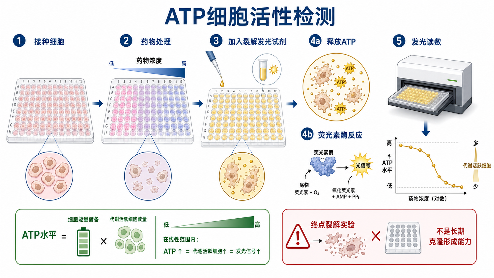

# ATP细胞活性检测

ATP-based cell viability assay（ATP 细胞活性检测）是一类通过测量细胞内 [ATP](../番外/补充知识/ATP.md)（adenosine triphosphate，三磷酸腺苷）总量来估计 viable cells（活细胞/代谢活跃细胞）数量的 [细胞毒性检测](细胞毒性检测.md)。它常用于药物筛选、剂量反应曲线、转染毒性评估和高通量细胞活性检测。

一句话理解：ATP 细胞活性检测问的是“这一孔里还有多少可释放的细胞能量池”，而不是直接问“细胞膜破没破”或“以后还能不能长成克隆”。



图：ATP 细胞活性检测通常加入裂解发光试剂，释放细胞内 ATP，并通过荧光素酶反应产生发光信号。它是终点裂解实验，不能在同一孔继续培养细胞。

## 方法背景

ATP 是活细胞能量代谢的核心分子。多数死亡或严重受损细胞会迅速丢失 ATP，因此 ATP 总量常可作为 viable/metabolically active cells（活细胞/代谢活跃细胞）的间接指标。Promega CellTiter-Glo 是这类实验最常见的代表之一，其官方说明强调该方法通过 ATP 量估计培养物中的 metabolically active cells。参考：[Promega CellTiter-Glo](https://www.promega.com/products/cell-health-assays/cell-viability-and-cytotoxicity-assays/celltiter_glo-luminescent-cell-viability-assay/)。

ATP 检测的常见技术路线是 luciferase-luciferin bioluminescence（荧光素酶-荧光素生物发光反应）。[荧光素酶](<../材(实验耗材工具篇)/荧光素酶.md>)（luciferase）在 [荧光素](<../材(实验耗材工具篇)/荧光素.md>)（luciferin）、ATP、镁离子和氧气等条件下产生光信号，发光强度在合适范围内与 ATP 量相关。Thermo Fisher 的 ATP Determination Kit 也基于这一反应逻辑。参考：[Thermo Fisher ATP Determination Kit](https://www.thermofisher.com/order/catalog/product/A22066)。

## 应用场景

| 场景 | 适合程度 | 说明 |
| --- | --- | --- |
| 高通量药物筛选 | 很适合 | 发光背景低，动态范围通常较好 |
| 估算 IC50 | 很适合 | 适合做多浓度多重复读数 |
| 转染/感染毒性评估 | 适合 | 能快速看总体活性下降 |
| 代谢状态强烈变化的处理 | 需谨慎 | ATP 下降可能来自代谢抑制，不一定等于细胞死亡 |
| 后续继续培养同一孔细胞 | 不适合 | 多数 ATP assay 是裂解型终点实验 |
| 长期克隆形成能力 | 不适合 | 应使用 [克隆形成实验](克隆形成实验.md) |

## 实验目的

ATP 细胞活性检测主要用于：

- 快速评估处理后细胞总体活性；
- 比较不同药物、时间点或细胞背景的短期敏感性；
- 估算 [IC50](../番外/补充知识/IC50.md) 或建立 [剂量反应曲线](../番外/补充知识/剂量反应曲线.md)；
- 为 Western blot、RT-qPCR、免疫荧光或克隆形成实验选择处理浓度；
- 与 [LDH释放实验](LDH释放实验.md)、Annexin V/PI 或形态观察配合，区分代谢活性下降和膜损伤死亡。

## 简要实验原理

常见 ATP 细胞活性检测会把细胞裂解、释放 ATP 和发光反应整合在同一步或相邻步骤中。活细胞越多，通常可释放 ATP 越多，luciferase reaction（荧光素酶反应）产生的 luminescence（发光信号）越强。

在合适线性范围内：

```text
Luminescence ∝ cellular ATP amount ∝ viable/metabolically active cells
```

但这个关系有前提。单个细胞 ATP 含量会受缺氧、营养状态、线粒体功能、药物作用机制、细胞周期和应激状态影响。因此 ATP assay 常适合写作“relative viability”或“ATP-based viability signal”，不应单独写成“细胞死亡增加”。

## ATP assay vs MTT/CCK-8 vs LDH

| 比较点 | ATP细胞活性检测 | [MTT实验](MTT实验.md) / [CCK-8实验](CCK-8实验.md) | LDH释放实验 |
| --- | --- | --- | --- |
| 核心读数 | ATP 总量/发光 | 代谢还原能力/吸光度 | 上清中 LDH 活性/吸光度 |
| 主要生物学含义 | 活细胞能量池 | 活细胞还原代谢 | 细胞膜完整性丧失 |
| 是否裂解细胞 | 多数会裂解 | MTT 终点，CCK-8 通常不裂解 | 通常取上清，不一定裂解样本孔 |
| 灵敏度 | 通常较高 | 中等到较高 | 取决于释放量和背景 |
| 主要风险 | 代谢状态改变影响 ATP | 药物颜色/还原性干扰 | 机械损伤和上清处理影响 |
| 适合问题 | 这一孔总体活性还剩多少 | 代谢活性如何变化 | 细胞膜是否破损 |

若某药物抑制线粒体 ATP 生成，ATP assay 可能比 CCK-8 更早下降；若细胞膜已经破裂，LDH release 可能更直接反映细胞毒性。

## 所需试剂与器材

| 类别 | 常用内容 | 作用 |
| --- | --- | --- |
| 细胞 | 待测细胞系或处理后细胞 | 实验对象 |
| 培养耗材 | [细胞培养板](<../材(实验耗材工具篇)/细胞培养板.md>)，常用白色不透明 96 孔板 | 降低孔间串光，提高发光读数稳定性 |
| 处理因素 | 药物、转染试剂、病毒、材料浸提液等 | 产生待评估效应 |
| ATP 发光试剂 | CellTiter-Glo 或同类 ATP luminescence reagent | 裂解细胞并触发发光反应 |
| 读数设备 | 发光读板仪或支持 luminescence 的 [酶标仪](<../材(实验耗材工具篇)/酶标仪.md>) | 读取 luminescence |
| 对照 | 空白孔、未处理、溶剂、阳性毒性、药物背景孔 | 归一化和排除干扰 |

## 实验操作

### 细胞接种

**怎么做**：按预实验确定的细胞密度接种到适合发光检测的多孔板。贴壁细胞通常恢复一夜后处理，悬浮细胞要注意混匀和沉降。

**为什么重要**：ATP 发光信号通常灵敏，但仍需要落在线性范围内。细胞太多会平台化，细胞太少会接近背景。

**注意事项**：优先使用白色不透明板以提高发光信号并降低孔间串光。边缘孔蒸发会改变体积和细胞状态，应通过板盖、湿盒或不用边缘孔等方式控制。

**替代方案**：如果需要显微镜观察同一孔，透明底白壁板可能更适合；如果还要保留细胞做后续实验，应设计平行板。

### 药物或条件处理

**怎么做**：设置合适浓度梯度、处理时间和溶剂对照。所有孔最终溶剂浓度应一致。

**为什么重要**：ATP assay 常用于 IC50 拟合，剂量范围和处理时间直接决定曲线质量。

**注意事项**：影响线粒体功能、糖酵解、ATP 合成或细胞能量应激的药物，可能让 ATP 下降早于细胞死亡。此时应配合 LDH、Annexin V/PI 或形态观察。

**可能出错的结果**：短时间内 ATP 明显下降，但细胞形态仍然完整，可能代表能量代谢被抑制，不一定是膜破裂死亡。

### 加入裂解发光试剂

**怎么做**：按试剂说明将 ATP 发光试剂平衡到合适温度后加入孔中，混匀并孵育到发光信号稳定，再读板。

**为什么重要**：这一步通常同时完成细胞裂解和发光反应。温度、混匀和等待时间会影响信号稳定性。

**注意事项**：气泡、孔底残留液滴和不均匀混匀都会影响读数。发光信号可能随时间衰减，整板读数顺序和时间窗口要一致。

**替代方案**：若仪器没有发光模式，可考虑 CCK-8、MTT 或 resazurin，但这些 assay 的生物学含义不同。

### 发光读数与归一化

**怎么做**：用发光读板仪读取 relative luminescence units（RLU，相对发光单位），扣除 blank 后归一化到溶剂对照。

常见公式：

```text
Relative viability (%) =
(treated RLU - blank RLU) /
(vehicle control RLU - blank RLU) × 100
```

**注意事项**：不同仪器的积分时间、增益、板型和读数模式会影响绝对 RLU。跨批次比较时应尽量使用相同设置。

## 结果解析

ATP assay 下降可以表示：

- 活细胞数量减少；
- 单细胞 ATP 储备下降；
- 线粒体功能或糖酵解受抑制；
- 细胞进入能量应激；
- 细胞死亡增加。

因此图注和正文中最好写“ATP-based viability decreased”或“luminescence signal decreased”，再用 LDH、Annexin V/PI、cleaved caspase-3 或克隆形成实验支持死亡机制和长期功能结论。

## 常见错误与 troubleshooting

| 问题 | 可能原因 | 处理 |
| --- | --- | --- |
| 所有孔 RLU 过低 | 细胞数太少、试剂失效、温度未平衡、读板设置错误 | 做细胞数线性范围测试，检查试剂和仪器 |
| 重复孔差异大 | 接种不均、混匀不充分、气泡、边缘效应 | 优化接种和混匀，读板前检查气泡 |
| 高浓度药物信号异常 | 药物影响发光反应或 ATP 稳定性 | 设置 drug-only blank，换 assay 验证 |
| 曲线没有上/下平台 | 浓度范围不够或处理时间不合适 | 扩大梯度，调整处理时间 |
| 与 CCK-8 不一致 | ATP 和还原代谢不是同一 readout | 结合机制和其他死亡检测解释 |
| 活性下降但 LDH 不升高 | 代谢/ATP 抑制早于膜破裂 | 增加时间点或 Annexin V/PI 分析 |

## 记录模板

中文记录模板：

```text
细胞系：
传代数：
接种密度：
板型：
处理因素：
浓度梯度：
处理时间：
ATP 试剂品牌/货号/批号：
试剂加入比例：
室温平衡时间：
混匀方式：
发光稳定等待时间：
读板仪设置：
空白孔：
溶剂对照：
阳性毒性对照：
归一化方式：
主要结果：
IC50/EC50：
形态观察：
异常情况：
下一步验证：
```

English record template:

```text
Cell line:
Passage number:
Seeding density:
Plate format:
Treatment:
Dose range:
Treatment duration:
ATP reagent brand/catalog/lot:
Reagent ratio:
Room-temperature equilibration time:
Mixing method:
Signal stabilization time:
Plate reader settings:
Blank wells:
Vehicle control:
Positive cytotoxicity control:
Normalization method:
Main result:
IC50/EC50:
Morphology observation:
Unexpected observations:
Next validation:
```

## 小结

ATP 细胞活性检测灵敏、快速，适合高通量短期活性评估。它的核心限制是读数受细胞能量代谢状态影响，而且多数体系会裂解细胞，是终点实验。解释时应把它作为“ATP/代谢活跃细胞读数”，而不是孤立的死亡证明。

## 参考来源

- Promega. CellTiter-Glo Luminescent Cell Viability Assay. [Promega](https://www.promega.com/products/cell-health-assays/cell-viability-and-cytotoxicity-assays/celltiter_glo-luminescent-cell-viability-assay/)
- Promega. Cell viability assays guide. [Promega](https://www.promega.com/resources/guides/cell-biology/cell-viability-assays/)
- Thermo Fisher Scientific. ATP Determination Kit. [Thermo Fisher](https://www.thermofisher.com/order/catalog/product/A22066)
