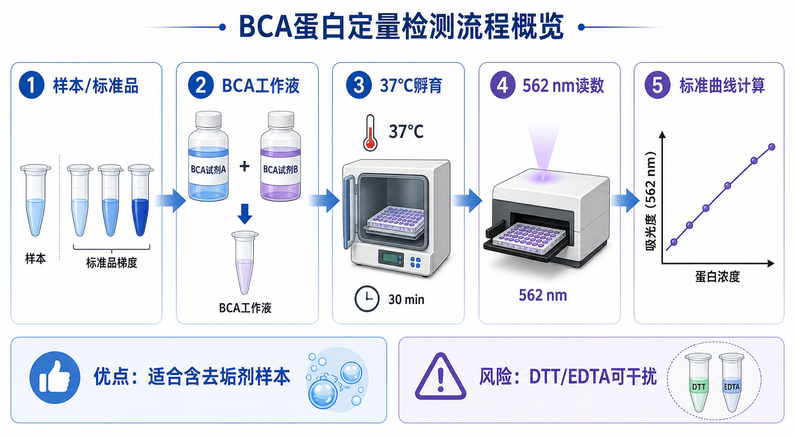

# BCA蛋白定量

BCA protein assay（bicinchoninic acid protein assay，二喹啉甲酸蛋白定量法）是常用的总[蛋白定量](蛋白定量.md)方法，常用于[细胞裂解](细胞裂解.md)后、[SDS-PAGE](<SDS-PAGE.md>) 或 [Western blot](<Western blot.md>) 上样前，帮助把不同样本调整到相同 total protein amount（总蛋白上样量）。



BCA 的优势是流程稳定、线性范围较宽，并且对许多非离子或弱离子去垢剂相对友好；核心风险是会被 reducing agents（还原剂）和 chelating agents（螯合剂）干扰。因此它很适合常规 RIPA 裂解液样本，但不适合已经加入大量 [DTT](<../材(实验耗材工具篇)/DTT.md>)、[TCEP](<../材(实验耗材工具篇)/TCEP.md>)、[β-巯基乙醇](<../材(实验耗材工具篇)/β-巯基乙醇.md>) 或 [EDTA](<../材(实验耗材工具篇)/EDTA.md>) 的样本直接定量。Thermo Fisher 的 Pierce BCA Protein Assay Kit 页面也把 BCA 定位为以 562 nm 读数的铜离子还原/络合比色法，并强调其与多种 detergent（去垢剂）的兼容性。参考：[Thermo Fisher Pierce BCA Protein Assay Kit](https://www.thermofisher.com/order/catalog/product/23225)

## 发明历史

BCA assay 是在 biuret reaction（双缩脲反应）和 Lowry assay（Lowry 蛋白定量法）基础上发展出的改良蛋白定量方法。Smith 等人在 1985 年发表的经典论文系统描述了用 bicinchoninic acid（二喹啉甲酸，BCA）检测蛋白还原铜离子后形成的紫色络合物，从而实现蛋白浓度测定。参考：Smith et al., 1985, [Measurement of protein using bicinchoninic acid](https://doi.org/10.1016/0003-2697(85)90442-7)

相比 Lowry 法，BCA 法步骤更简单、反应体系更适合微孔板高通量操作；相比 [Bradford蛋白定量](Bradford蛋白定量.md)，BCA 对许多常见裂解液中的去垢剂更耐受，因此成为 Western blot 前总蛋白定量的常用默认方案之一。

## 应用场景

| 场景 | BCA 解决什么问题 | 重点风险 |
| --- | --- | --- |
| Western blot 上样前 | 统一每个泳道总蛋白量 | 定量错会造成假性表达差异 |
| SDS-PAGE 考马斯染色前 | 控制每孔上样量，避免过载或过低 | 样本超范围会让条带解释不稳 |
| 免疫共沉淀 input 标准化 | 让不同组起始蛋白总量可比 | 裂解液组分可能影响 BCA 读数 |
| 酶活实验归一化 | 把活性换算为 per mg protein | 干扰物会影响比色结果 |
| 细胞或组织裂解质控 | 判断裂解产物浓度是否足够 | 黏稠、浑浊、沉淀会影响重复性 |
| 蛋白质谱样本预估 | 粗略估算消化前蛋白量 | 含强还原剂、去污剂时需谨慎 |

BCA 不等于“所有蛋白样本都能直接测”。它适合很多常规细胞裂解液，但每次换裂解液、还原剂、去垢剂或样本类型时，都应该重新确认兼容性。

## 实验目的

BCA 蛋白定量的直接目标是得到样本 protein concentration（蛋白浓度），常见单位是 mg/mL、µg/µL 或 µg/mL。真正的实验目的通常是后续计算：每个样本取多少体积，才能加入相同质量的总蛋白。

以 Western blot 为例，如果希望每孔上样 20 µg，总体积 20 µL，那么 BCA 结果会决定每个样本加入多少裂解液、多少补液、多少 [Laemmli上样缓冲液](<../材(实验耗材工具篇)/Laemmli上样缓冲液.md>)。如果这一步错误，后续内参蛋白、总蛋白染色和目标蛋白条带都会跟着失真。

## 简要实验原理

BCA 反应有两个核心步骤。

首先，在 alkaline condition（碱性条件）下，蛋白中的 peptide bond（肽键）以及 cysteine（半胱氨酸）、tryptophan（色氨酸）、tyrosine（酪氨酸）等残基可以把 Cu2+ 还原为 Cu1+。这个过程类似双缩脲反应中的铜离子-蛋白反应。

随后，两个 BCA 分子与一个 Cu1+ 形成紫色络合物，在 562 nm 附近有明显吸收峰，所以通常读取 [OD562](../番外/补充知识/OD562.md)。紫色越深，说明在合适范围内蛋白越多。

但是 OD562 不是浓度本身。必须用 [BSA标准品](<../材(实验耗材工具篇)/BSA标准品.md>) 建立 [标准曲线](../番外/补充知识/标准曲线.md)，再把样本吸光度换算成浓度。这个换算只在试剂盒指定的 [线性范围](../番外/补充知识/线性范围.md) 或工作范围内可靠，超出范围的外推值看起来精确，实际常常不可信。

## 所需试剂、材料与设备

| 类别 | 常用内容 | 作用与注意事项 |
| --- | --- | --- |
| 待测样本 | 细胞裂解液、组织裂解液、纯化蛋白 | 尽量澄清、无大量沉淀，记录裂解液组成 |
| 定量试剂 | [BCA蛋白定量试剂盒](<../材(实验耗材工具篇)/BCA蛋白定量试剂盒.md>) | 通常包含 BCA reagent A 和 reagent B，比例以说明书为准 |
| 标准品 | BSA standard（bovine serum albumin standard，牛血清白蛋白标准品） | 建立标准曲线，避免反复冻融 |
| 反应板 | [96孔板](<../材(实验耗材工具篇)/96孔板.md>) 或透明微孔板 | 需适配 562 nm 吸光读数 |
| 移液工具 | [移液枪](<../材(实验耗材工具篇)/移液枪.md>)、[多道移液枪](<../材(实验耗材工具篇)/多道移液枪.md>)、吸头 | 小体积误差会直接变成浓度误差 |
| 读数仪器 | [酶标仪](<../材(实验耗材工具篇)/酶标仪.md>) 或分光光度计 | 设置 562 nm，记录读数模式 |
| 空白体系 | 与样本 buffer 匹配的 blank | 用来扣除裂解液或稀释液背景 |
| 下游配样 | 上样缓冲液、水或裂解液 | 用于把样本统一到相同蛋白量和体积 |

如果样本来自 [RIPA裂解液](<../材(实验耗材工具篇)/RIPA裂解液.md>)，BCA 通常比 Bradford 更合适。但如果裂解液中含高浓度螯合剂或还原剂，不能只凭“RIPA 可兼容”就默认安全，仍应查具体试剂盒 compatibility table（兼容性表）。

## 实验操作

### 设计板图和稀释方案

先决定标准品梯度、样本稀释倍数、复孔数量和空白设置。常规实验至少 duplicates（双复孔），重要样本或新体系建议 triplicates（三复孔）。

为什么重要：BCA 的结果质量高度依赖板图。标准品、样本和空白位置安排不清，后面很容易出现孔位混淆；样本不稀释或稀释不足，则可能超出标准曲线。

注意事项：

| 检查点 | 建议 |
| --- | --- |
| 标准曲线 | 覆盖预期样本浓度范围，避免全部样本挤在最高点附近 |
| 样本稀释 | 未知浓度样本可以先做 1:5、1:10、1:20 预试 |
| 空白 | 尽量使用与样本相同的裂解液/稀释背景 |
| 复孔 | 复孔相邻方便操作，但可考虑避免全部关键样本在边缘孔 |
| 记录 | 板图保存为图片或表格，避免后续无法追溯 |

可能出错：如果样本 OD 超过最高标准点，不能简单相信软件外推浓度；如果样本 OD 接近空白，微小移液误差会被放大。

### 配制 BSA 标准曲线

用 BSA 标准品按说明书配制浓度梯度。标准品通常从高到低逐级稀释，每一步都要充分混匀并更换枪头。

为什么重要：标准曲线是 BCA 定量的“尺子”。如果标准品配错，即使样本加样完美，最后所有浓度都会系统性错误。

注意事项：

| 风险 | 影响 | 处理 |
| --- | --- | --- |
| 高浓度标准品未混匀 | 曲线高点异常 | 每一步吹打混匀，必要时短暂涡旋 |
| 连续稀释带入 | 低浓度点偏高 | 每步换枪头 |
| 标准品冻融过多 | 曲线斜率异常 | 小份分装，避免反复冻融 |
| 标准范围不合适 | 样本落在曲线外 | 调整样本稀释倍数或标准范围 |

替代方案：如果试剂盒提供 ready-to-use protein standards（即用型蛋白标准品），可以优先使用，减少人为稀释误差。

### 准备 BCA 工作液

按试剂盒说明混合 BCA reagent A 和 reagent B，得到 BCA working reagent（BCA 工作液）。很多 Pierce BCA 类试剂盒使用 A:B = 50:1 的配比，但不同产品可能不同，必须以说明书为准。

为什么重要：工作液比例不正确会影响铜离子供给、显色强度和背景。

注意事项：

| 操作点 | 建议 |
| --- | --- |
| 现配现用 | 工作液放置过久可能影响背景和灵敏度 |
| 估算余量 | 按孔数计算后多配 5-10%，避免中途不够 |
| 避免污染 | 不要把枪头伸回原瓶，避免交叉污染 |
| 观察颜色 | 明显异常变色或沉淀时不要继续使用 |

可能出错：如果整板读数都很低，可能是工作液配比错误、试剂失效或孵育不足；如果空白很高，可能是工作液污染、板污染或 buffer 干扰。

### 加样和混合

把标准品、空白和样本加入 96 孔板，再加入 BCA 工作液。加样顺序要一致，尽量缩短第一孔和最后一孔之间的反应起始时间差。加入工作液后轻轻混匀，避免气泡。

为什么重要：BCA 反应从工作液加入后就开始发展。如果整块板加样时间差太大，前后孔显色时间不同，会造成系统误差。

注意事项：

| 注意点 | 原因 |
| --- | --- |
| 使用合适量程移液枪 | 小体积用大量程枪会增加误差 |
| 避免气泡 | 气泡会改变光路，导致 OD 异常 |
| 检查漏加 | 漏加工作液或样本会造成孤立异常孔 |
| 保持板底清洁 | 指纹、液滴、划痕会影响读数 |

替代方案：样本数量少时可以使用管式体系；样本很多时可以使用多道移液枪，但要先确认每道移液一致性。

### 孵育显色

按试剂盒说明孵育。常见方案是在 37°C 孵育约 30 min，也有室温延长孵育或增强灵敏度方案。孵育条件要在同一次实验中保持一致。

为什么重要：BCA 显色受时间和温度影响明显。温度越高、时间越长，显色越充分，但高浓度点也更容易进入平台区。

注意事项：

| 条件 | 建议 |
| --- | --- |
| 温度 | 使用稳定孵育设备，避免板不同区域温度差 |
| 时间 | 从完成加工作液后统一计时 |
| 蒸发 | 较长孵育时可使用封板膜 |
| 低浓度样本 | 可考虑更长孵育或增强型 BCA，而不是盲目外推 |

可能出错：孵育不足会让低浓度样本和空白难以区分；孵育过度会让高浓度标准点变平，标准曲线变差。

### 读取 OD562

用酶标仪读取 562 nm 吸光度。读数前检查气泡和孔底污染；如果有气泡，可以用无菌针尖轻触或短暂离心/震荡处理，具体取决于板和仪器条件。

为什么重要：BCA 的紫色络合物以 562 nm 读数为常用检测波长。把波长设成 595 nm 或 450 nm，得到的不是正确 BCA 定量读数。

注意事项：

| 检查点 | 建议 |
| --- | --- |
| 波长 | 记录 562 nm，若用近似波长需说明 |
| 板类型 | 透明板适合吸光读数；黑板/白板通常不适合常规 BCA OD |
| 读数前状态 | 无气泡、无沉淀、无明显蒸发 |
| 仪器设置 | 记录 endpoint mode、震荡设置和路径长度校正 |

可能出错：如果某个复孔明显偏离，先看是否有气泡、漏加、孔底污点或边缘蒸发，不要急着解释成样本真实差异。

### 计算浓度和配上样体系

先扣除 blank，再用标准曲线拟合样本浓度。样本浓度要乘以 dilution factor（稀释倍数），得到原始样本浓度。随后根据目标上样量计算体积：

```text
样本体积 = 目标上样蛋白量 / 样本浓度
```

如果浓度单位是 µg/µL，目标上样量是 µg，那么计算出的体积单位就是 µL。

为什么重要：BCA 的终点不是标准曲线图好不好看，而是下游每孔是否真正上了相同质量蛋白。

注意事项：

| 问题 | 处理 |
| --- | --- |
| 样本太浓 | 稀释后重测，避免曲线外外推 |
| 样本太稀 | 降低所有样本上样量，或重新制备样本 |
| 体积差异太大 | 用裂解液或水补齐到相同终体积 |
| 加上样缓冲液 | 明确 4×、5× 或 2×，保证最终浓度一致 |
| 黏稠样本 | 可能有 DNA，需充分剪切或离心澄清 |

可能出错：最常见错误是忘记乘稀释倍数、单位混乱、样本体积算错、或加入上样缓冲液后没有充分混匀。

## 结果解析

| 结果特征 | 说明 | 下一步 |
| --- | --- | --- |
| 标准曲线单调上升 | 反应和稀释总体正常 | 继续检查样本是否落在线性范围 |
| R² 高且残差小 | 拟合较可靠 | 可用曲线中段样本结果 |
| 高浓度标准点平台 | 反应接近饱和 | 去掉平台点或重设浓度范围 |
| 低浓度点接近空白 | 灵敏度不足或背景偏高 | 提高样本浓度或使用增强方案 |
| 复孔差异小 | 移液和反应一致性较好 | 可计算均值和 CV |
| 稀释线性好 | 样本基质干扰较少 | 选择曲线中段稀释倍数报告 |

R² 不能单独作为通过标准。一个曲线即使 R² 很高，也可能因为范围太窄、点数太少或高浓度平台被强行线性拟合而不可靠。更稳妥的判断是同时看标准曲线形状、空白、复孔一致性、样本是否处在线性范围，以及不同稀释倍数换算回原液后是否接近。

## 异常结果与可能原因

| 异常 | 常见原因 | 解决思路 |
| --- | --- | --- |
| 空白很高 | 裂解液背景、工作液污染、板污染、还原剂干扰 | 用匹配 buffer 做 blank；新配工作液；换板 |
| 标准曲线乱跳 | 标准品稀释错误、混匀不足、气泡、漏加 | 重配标准品；检查板图；去气泡 |
| 样本浓度假高 | DTT、TCEP、β-巯基乙醇等还原剂直接还原铜离子 | 改变裂解体系；使用兼容试剂盒；稀释并做 spike recovery |
| 样本浓度假低 | 蛋白沉淀、裂解不充分、样本降解、超出体系兼容性 | 离心澄清；优化裂解；加入蛋白酶抑制剂 |
| 复孔 CV 高 | 移液误差、气泡、边缘效应、样本黏稠 | 重做复孔；避开边缘孔；改善样本均一性 |
| 稀释后不成比例 | [基质效应](../番外/补充知识/基质效应.md)、浑浊、颜色或干扰物浓度变化 | 做多倍稀释；换方法；用匹配 buffer 配标准曲线 |
| WB 上样仍不均 | 计算错误、浓度单位错、上样缓冲液没混匀 | 复核计算表；结合总蛋白染色或内参判断 |

如果 BCA 和下游 Western blot 总蛋白染色明显矛盾，不要自动相信其中一个。需要回头检查样本裂解、BCA 兼容性、上样计算、凝胶上样体积和转膜情况。

## 与相关方法的区别

| 方法 | 核心读数 | 优势 | 短板 | 什么时候选 |
| --- | --- | --- | --- | --- |
| BCA | OD562 | 对许多去垢剂兼容，适合常规裂解液 | 还原剂/螯合剂干扰明显 | 常规 WB 前总蛋白定量 |
| Bradford | OD595 | 快速、便宜、室温反应 | 对去垢剂敏感，蛋白间响应差异较大 | 简单蛋白溶液快速估算 |
| [Lowry蛋白定量](Lowry蛋白定量.md) | OD750 或相关波长 | 灵敏度较高，经典方法 | 步骤多，干扰多 | 旧 SOP 或特定传统体系 |
| [A280蛋白定量](A280蛋白定量.md) | 280 nm 紫外吸收 | 无需显色，不消耗试剂 | 对核酸、浑浊和蛋白组成敏感 | 纯化蛋白、抗体或已知蛋白 |

BCA 和 [PBS](<../材(实验耗材工具篇)/PBS.md>) 的关系也容易混淆：PBS 只是可能参与稀释或洗涤的缓冲液，不会自己完成蛋白显色。若样本背景接近 PBS，BCA 通常更容易解释；若样本背景是 RIPA、尿素、SDS、强还原剂或高 EDTA，就要优先查说明书兼容性。

## 推荐记录模板

中文记录模板：

```text
实验日期：
实验目的：
样本名称：
样本来源：
裂解液/缓冲液：
试剂盒品牌：
货号：
批号：
标准品：
标准曲线范围：
样本稀释倍数：
复孔数量：
工作液配比：
反应体系体积：
孵育温度：
孵育时间：
读数仪器：
读数波长：
空白设置：
标准曲线公式：
R²：
样本 OD562：
换算浓度：
是否在线性范围内：
目标上样量：
计算上样体积：
异常孔/排除孔：
备注：
```

English template:

```text
Date:
Purpose:
Sample names:
Sample source:
Lysis buffer/background:
Kit brand:
Catalog number:
Lot number:
Protein standard:
Standard curve range:
Sample dilution factor:
Replicates:
Working reagent ratio:
Reaction volume:
Incubation temperature:
Incubation time:
Reader/instrument:
Read wavelength:
Blank setting:
Standard curve equation:
R-squared:
Sample OD562:
Calculated concentration:
Within linear range:
Target loading amount:
Calculated loading volume:
Outlier/excluded wells:
Notes:
```

## 总结

BCA 蛋白定量是常规细胞裂解液和 Western blot 前上样归一化的高频方法。它的关键不是“把样本和试剂混在一起读 OD”，而是标准曲线、样本稀释、buffer 匹配、干扰物控制和下游上样计算共同构成一个质量控制流程。BCA 的默认优势是对许多去垢剂友好，默认风险是还原剂和螯合剂干扰；只要样本背景复杂，就必须先看试剂盒兼容性表，再决定是否需要稀释、换 buffer、换试剂盒或换定量方法。

## 参考来源

- [Thermo Fisher Scientific: Pierce BCA Protein Assay Kit](https://www.thermofisher.com/order/catalog/product/23225)
- Smith PK, Krohn RI, Hermanson GT, et al. [Measurement of protein using bicinchoninic acid](https://doi.org/10.1016/0003-2697(85)90442-7). Analytical Biochemistry. 1985.
- [Bio-Rad: Protein Assays](https://www.bio-rad.com/en-us/applications-technologies/protein-assays)
