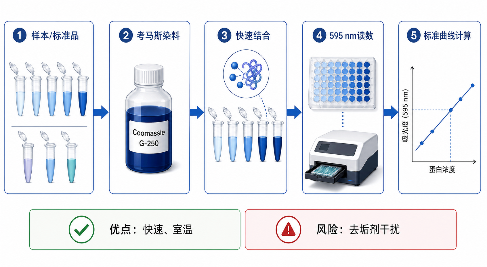

# Bradford蛋白定量

Bradford protein assay（Bradford 蛋白定量法）是一种基于 Coomassie Brilliant Blue G-250（考马斯亮蓝 G-250）染料与蛋白结合后吸收峰变化的总[蛋白定量](蛋白定量.md)方法，通常读取 [OD595](../番外/补充知识/OD595.md)。它最大的优点是快速、室温即可操作，最大的限制是容易受 detergent（去垢剂）影响，并且不同蛋白对染料的响应不完全一致。



在常规实验中，Bradford 常用于快速估算纯化蛋白、简单缓冲液中的蛋白浓度，或者作为 [BCA蛋白定量](BCA蛋白定量.md) 的对照选择。Bio-Rad 的 Bradford protein assay 页面将该法描述为 acidified Coomassie Brilliant Blue G-250（酸化考马斯亮蓝 G-250）与蛋白结合后的可见光颜色变化，并说明其吸收峰从 470 nm 移向 595 nm。参考：[Bio-Rad Bradford Protein Assay](https://www.bio-rad.com/featured/en/bradford-protein-assay.html)

## 发明历史

Bradford assay 由 Marion M. Bradford 在 1976 年发表，原始论文题为 “A rapid and sensitive method for the quantitation of microgram quantities of protein utilizing the principle of protein-dye binding”。这个方法的核心贡献是把 Coomassie Brilliant Blue G-250 与蛋白结合后的颜色变化变成一种快速、灵敏、易操作的蛋白定量方案。参考：Bradford, 1976, [A rapid and sensitive method for the quantitation of microgram quantities of protein](https://doi.org/10.1016/0003-2697(76)90527-3)

在 BCA 和微量紫外分光光度计普及之前，Bradford 因为速度快、试剂便宜、室温反应，很快成为实验室常用蛋白定量方法。直到现在，它仍然适合一些“缓冲液简单、需要快速判断浓度”的场景。

## 应用场景

| 场景 | 为什么适合 Bradford | 重点风险 |
| --- | --- | --- |
| 纯化蛋白快速估算 | 反应快，几分钟即可读数 | 不同蛋白染料响应不同 |
| 柱层析馏分筛查 | 可以快速判断哪些馏分含蛋白 | 缓冲液成分可能影响背景 |
| 简单裂解液粗略定量 | 操作省时，适合预实验 | 去垢剂会明显干扰 |
| 蛋白纯化过程 QC | 可快速比较 flow-through、wash、elution | 高盐、咪唑或添加剂需确认兼容性 |
| 教学实验 | 颜色变化直观，适合理解标准曲线 | 不适合复杂样本直接推断绝对浓度 |

如果目标是 [Western blot](<Western blot.md>) 前严格统一上样，而样本来自 [RIPA裂解液](<../材(实验耗材工具篇)/RIPA裂解液.md>)、含 [SDS](<../材(实验耗材工具篇)/SDS.md>)、[Triton X-100](<../材(实验耗材工具篇)/Triton X-100.md>)、[NP-40](<../材(实验耗材工具篇)/NP-40.md>) 或 [Tween-20](<../材(实验耗材工具篇)/Tween-20.md>)，通常需要优先考虑 BCA 或专门兼容去垢剂的 Bradford 变体，而不是默认直接做普通 Bradford。

## 实验目的

Bradford 蛋白定量的目标是通过标准曲线把样本的 absorbance at 595 nm（595 nm 吸光度）换算成 protein concentration（蛋白浓度）。在实际工作中，它最常用于快速回答三个问题：

| 问题 | Bradford 能提供什么 |
| --- | --- |
| 这个样本有没有蛋白？ | 蓝色加深说明有可被染料响应的蛋白 |
| 大概浓度是多少？ | 通过标准曲线得到估算浓度 |
| 是否值得进入下一步？ | 判断样本是否足够做 SDS-PAGE、酶活或纯化分析 |

Bradford 更适合快速筛查和相对比较。若要做严谨的组间定量，尤其是样本缓冲液复杂或蛋白组成差异很大时，需要特别注意方法学偏差。

## 简要实验原理

Coomassie Brilliant Blue G-250（考马斯亮蓝 G-250）在酸性环境中主要呈红棕色或绿色形式；当它与蛋白结合后，染料稳定为蓝色形式，最大吸收峰转移到 595 nm 附近。因此，蛋白越多，在合适范围内蓝色越深，OD595 越高。

Bradford 染料主要通过 basic amino acids（碱性氨基酸，尤其 arginine，精氨酸）和 hydrophobic interaction（疏水相互作用）与蛋白结合。也正因为这样，不同蛋白的氨基酸组成不同，单位质量蛋白产生的 OD595 并不完全一致。

这就是 Bradford 的关键逻辑：它很快，但“染料响应”不完全等于“真实蛋白质量”。使用 [BSA标准品](<../材(实验耗材工具篇)/BSA标准品.md>) 或 [牛γ球蛋白标准品](<../材(实验耗材工具篇)/牛γ球蛋白标准品.md>) 建立 [标准曲线](../番外/补充知识/标准曲线.md) 时，默认假设样本蛋白与标准蛋白的染料响应相近；如果两者差异很大，绝对浓度会有偏差。

## 所需试剂、材料与设备

| 类别 | 常用内容 | 作用与注意事项 |
| --- | --- | --- |
| 待测样本 | 纯化蛋白、柱层析馏分、简单裂解液 | 尽量避免强去垢剂、强碱或颜色干扰 |
| 显色试剂 | Bradford reagent（Bradford 试剂），核心成分是[考马斯亮蓝](<../材(实验耗材工具篇)/考马斯亮蓝.md>) G-250 | 与蛋白结合后显蓝色 |
| 标准品 | BSA 或 bovine gamma globulin, BGG（牛γ球蛋白） | 建立标准曲线 |
| 反应容器 | [96孔板](<../材(实验耗材工具篇)/96孔板.md>)、透明微孔板或比色皿 | 需适合 595 nm 吸光读数 |
| 移液工具 | [移液枪](<../材(实验耗材工具篇)/移液枪.md>)、[多道移液枪](<../材(实验耗材工具篇)/多道移液枪.md>)、吸头 | 快速加样时要保持孔间一致性 |
| 读数仪器 | [酶标仪](<../材(实验耗材工具篇)/酶标仪.md>) 或 [分光光度计](<../材(实验耗材工具篇)/分光光度计.md>) | 设置 595 nm |
| 空白体系 | 与样本 buffer 匹配的 blank | 扣除缓冲液和试剂背景 |

如果样本中含有蓝色染料、浑浊颗粒、沉淀或高浓度去垢剂，Bradford 的 OD595 很容易被扭曲。此时应先离心澄清、稀释样本、换 buffer，或直接选择 BCA/A280 等其他方案。

## 实验操作

### 设计标准曲线和样本稀释

先根据样本预期浓度选择标准曲线范围。未知样本可以设置多个稀释倍数，例如 1:2、1:5、1:10 或更高稀释。标准品和样本都建议设置 duplicates（双复孔），关键实验可设置 triplicates（三复孔）。

为什么重要：Bradford 的 [线性范围](../番外/补充知识/线性范围.md) 通常比想象中窄，且高浓度样本容易进入非线性区域。样本只有落在标准曲线可靠范围内，换算浓度才有意义。

注意事项：

| 检查点 | 建议 |
| --- | --- |
| 标准蛋白 | 尽量选择与样本响应接近的标准品 |
| 稀释液 | 标准品和样本 blank 尽量匹配 buffer 背景 |
| 浓度范围 | 让样本尽量落在曲线中段 |
| 复孔 | 复孔差异大时不要强行取平均 |

可能出错：如果样本太浓，OD595 可能不再随浓度线性增加；如果样本太稀，读数接近 blank，计算误差会很大。

### 配制标准品

用 [BSA](<../材(实验耗材工具篇)/BSA.md>)、BSA 标准品或 BGG 标准品配制已知浓度梯度。连续稀释时每一步都要混匀，并更换枪头。

为什么重要：Bradford 的标准曲线不仅是浓度尺子，也隐含了“标准蛋白和样本蛋白染料响应相似”的假设。不同标准蛋白会给出不同换算结果。

替代方案：若实验室 SOP 固定使用 BSA，就保持同一标准品，便于批次间比较；若目标样本是免疫球蛋白或抗体，BGG 可能比 BSA 更接近响应，但仍需看具体目的。

可能出错：标准品冻融过多、稀释未混匀或低浓度点被高浓度残留污染，都会造成标准曲线弯曲或点位跳动。

### 加入 Bradford 试剂

把标准品、空白和样本加入板孔或比色皿中，再加入 Bradford reagent。加入后轻轻混匀，避免气泡。Bradford 反应很快，因此加样节奏要一致。

为什么重要：Bradford 的颜色发展速度快，读数时间窗口相对短。第一孔和最后一孔显色时间差过大，会造成孔间系统误差。

注意事项：

| 注意点 | 原因 |
| --- | --- |
| 快速但稳定加样 | 减少反应时间差 |
| 避免气泡 | 气泡会影响 595 nm 吸光读数 |
| 保持试剂均一 | 染料沉淀或混匀不足会造成背景不稳 |
| 记录试剂批号 | 不同批次斜率可能不同 |

替代策略：如果样本很多，可以用多道移液枪并按列操作；如果样本较少，比色皿体系也可以，但需要匹配相应体积和光程。

### 室温反应

按试剂说明书在 room temperature（室温）反应一定时间。常见 Bradford 体系反应只需数分钟，但不同试剂盒的推荐时间不同，必须以具体说明书为准。

为什么重要：Bradford 不是越久越好。染料-蛋白复合物可能随时间出现漂移，读数时间不一致会影响重复性。

注意事项：

| 条件 | 建议 |
| --- | --- |
| 时间 | 同一批样本使用统一计时 |
| 温度 | 避免冷试剂和室温样本混用造成反应差异 |
| 光照 | 常规短时间影响不大，但应避免长时间暴露和蒸发 |
| 沉淀 | 若孔中出现明显沉淀，不应直接解释为真实浓度 |

可能出错：等待时间过长、板边缘蒸发或试剂沉淀，会导致复孔差异增大。

### 读取 OD595

用酶标仪或分光光度计读取 595 nm 吸光度。读数前确认无气泡、孔底无污点、液面无明显不均。

为什么重要：Bradford 的蓝色复合物主要用 595 nm 读数。如果波长设置错误，曲线仍可能“看起来有趋势”，但换算没有方法学意义。

注意事项：

| 检查点 | 建议 |
| --- | --- |
| 波长 | 记录 595 nm |
| 板型 | 使用透明吸光板，不要用黑色或白色荧光/发光板 |
| 空白 | 使用与标准品/样本背景相匹配的 blank |
| 异常孔 | 先排查气泡、沉淀、漏加和孔位错误 |

可能出错：整板背景偏高常见于试剂问题、buffer 背景或板污染；单孔异常多来自气泡、漏加或混匀不足。

### 计算浓度并判断是否可用

扣除 blank 后，用标准曲线把样本 OD595 换算为稀释后浓度，再乘以 dilution factor（稀释倍数）得到原始浓度。只报告落在标准曲线可靠范围内的样本结果。

为什么重要：Bradford 的速度很快，但计算环节仍然和 BCA 一样严肃。曲线外外推、忘记乘稀释倍数、单位混乱，都会让后续上样或纯化判断出错。

注意事项：

| 判断点 | 建议 |
| --- | --- |
| 曲线形状 | 单调上升，避免高点平台 |
| R² | 只能辅助判断，不能替代残差和复孔检查 |
| 复孔 CV | 过高时应重测或排除明确异常孔 |
| 稀释线性 | 多个稀释倍数换算回原液应大致接近 |

如果不同稀释倍数换算回原始浓度差异很大，说明可能存在 [基质效应](../番外/补充知识/基质效应.md)、非线性、缓冲液干扰或移液误差。

## 结果解析

| 结果 | 可能含义 | 下一步 |
| --- | --- | --- |
| 标准曲线快速变蓝且单调上升 | 反应正常 | 检查样本是否在线性范围 |
| 样本读数高于最高标准 | 样本过浓或干扰物假高 | 稀释重测 |
| 样本读数接近 blank | 蛋白太低或 blank 背景太高 | 浓缩样本或优化 blank |
| 复孔差异大 | 气泡、移液、沉淀或反应时间不一致 | 重做复孔 |
| R² 好但高浓度点平台 | 强行线性拟合掩盖非线性 | 去掉平台点或重设曲线 |
| BSA 曲线好但样本异常 | 样本蛋白组成或 buffer 背景不同 | 做稀释线性或换方法 |

Bradford 特别适合“快筛”，但不适合把所有复杂样本都当成绝对浓度精确值。对于关键实验，最好结合下游 SDS-PAGE 总蛋白染色、BCA 复测或 A280 全波长扫描来判断。

## 异常结果与可能原因

| 异常 | 常见原因 | 处理策略 |
| --- | --- | --- |
| 整体 OD595 偏高 | blank 背景高、染料沉淀、样本颜色干扰 | 更换 blank；离心试剂；检查样本颜色 |
| 标准曲线低点乱跳 | 低浓度移液误差、污染、气泡 | 增加复孔；重配低浓度标准点 |
| 高浓度标准点不再上升 | 超出线性范围或染料饱和 | 降低最高标准浓度 |
| 样本浓度假高 | 去垢剂、浑浊、颗粒或颜色干扰 | 稀释样本；换 buffer；改用 BCA |
| 样本浓度假低 | 蛋白与染料响应弱、标准品不匹配 | 换标准蛋白；做方法对比 |
| 复孔 CV 高 | 加样时间差、气泡、混匀不足 | 优化加样顺序和读数时间 |
| 与 BCA 结果差异大 | 方法响应机制不同、干扰物不同 | 优先结合样本背景和下游结果解释 |

## 与相关方法的区别

| 方法 | 核心机制 | 优势 | 短板 | 更适合 |
| --- | --- | --- | --- | --- |
| Bradford | 考马斯染料与蛋白结合，读 OD595 | 快、便宜、室温 | 去垢剂敏感，蛋白间响应差异 | 快速估算、简单蛋白溶液 |
| BCA | 蛋白还原 Cu2+，BCA 络合 Cu1+，读 OD562 | 对许多去垢剂更耐受，线性范围较宽 | 还原剂和螯合剂干扰 | WB 前常规裂解液定量 |
| [Lowry蛋白定量](Lowry蛋白定量.md) | 铜反应 + Folin 显色 | 灵敏度较高，经典 | 步骤多，干扰多 | 旧 SOP 或特定体系 |
| [A280蛋白定量](A280蛋白定量.md) | 芳香族氨基酸紫外吸收 | 无需显色，快速 | 核酸/浊度/蛋白组成影响大 | 纯化蛋白、抗体 |

Bradford 与 [PBS](<../材(实验耗材工具篇)/PBS.md>) 的关系比较简单：PBS 只是可能作为稀释背景，不参与染料显色。PBS 背景通常比复杂裂解液更容易处理，但标准品和样本最好使用相同或相近的 buffer，否则仍可能出现背景差异。

## 推荐记录模板

中文记录模板：

```text
实验日期：
实验目的：
样本名称：
样本来源：
样本 buffer：
Bradford 试剂品牌：
货号：
批号：
标准蛋白：BSA / BGG / 其他
标准曲线浓度范围：
样本稀释倍数：
反应体系体积：
反应温度：
反应时间：
读数仪器：
读数波长：
空白设置：
复孔数量：
标准曲线公式：
R²：
样本 OD595：
换算浓度：
是否在线性范围：
异常孔/排除孔：
备注：
```

English template:

```text
Date:
Purpose:
Sample names:
Sample source:
Sample buffer:
Bradford reagent brand:
Catalog number:
Lot number:
Protein standard: BSA / BGG / other
Standard curve range:
Sample dilution factor:
Reaction volume:
Reaction temperature:
Reaction time:
Reader/instrument:
Read wavelength:
Blank setting:
Replicates:
Standard curve equation:
R-squared:
Sample OD595:
Calculated concentration:
Within linear range:
Outlier/excluded wells:
Notes:
```

## 总结

Bradford 蛋白定量的核心价值是快：加入考马斯染料后短时间内读取 OD595，就能得到蛋白浓度估算。它适合简单缓冲液、纯化蛋白和快速筛查；但它对去垢剂、样本颜色、沉淀和蛋白种类响应差异更敏感。实际选择时，可以把 Bradford 理解为“快速判断工具”，而把 BCA 理解为“常规裂解液和 WB 前更稳妥的默认工具”。如果样本背景复杂，先查兼容性，再决定是否换方法。

## 参考来源

- Bradford MM. [A rapid and sensitive method for the quantitation of microgram quantities of protein utilizing the principle of protein-dye binding](https://doi.org/10.1016/0003-2697(76)90527-3). Analytical Biochemistry. 1976.
- [Bio-Rad: Bradford Protein Assay](https://www.bio-rad.com/featured/en/bradford-protein-assay.html)
- [Thermo Fisher Scientific: Bradford Assay](https://www.thermofisher.com/us/en/home/life-science/protein-biology/protein-assays-analysis/protein-assays/bradford-assays.html)
