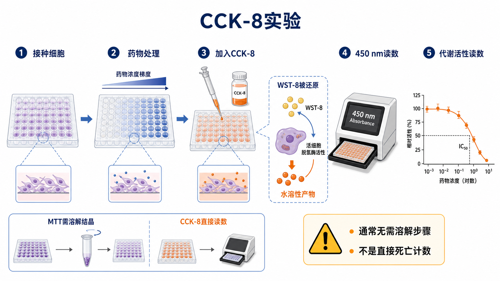

# CCK-8实验

CCK-8 assay（Cell Counting Kit-8 assay，细胞计数试剂盒-8 实验）是一种基于 [WST-8](<../材(实验耗材工具篇)/WST-8.md>) 的水溶性四唑盐类细胞活性检测方法，常用于药物敏感性、细胞增殖、转染毒性和材料细胞相容性评估。它属于 [细胞毒性检测](细胞毒性检测.md) 中的代谢型 readout，读数反映活细胞还原能力和细胞数量的综合结果。

WST-8 的英文全称是 2-(2-methoxy-4-nitrophenyl)-3-(4-nitrophenyl)-5-(2,4-disulfophenyl)-2H-tetrazolium monosodium salt，中文可译作 2-(2-甲氧基-4-硝基苯基)-3-(4-硝基苯基)-5-(2,4-二磺酸苯基)-2H-四唑单钠盐。活细胞脱氢酶可将 WST-8 还原为水溶性的橙色 [formazan](../番外/补充知识/甲臜.md)（甲臜）产物，通常在 450 nm 读取吸光度。



图：CCK-8 实验通过 WST-8 生成水溶性甲臜产物，通常无需像 MTT 那样额外溶解结晶，因此流程更简化，但它依然是代谢活性读数，不是直接死亡计数。

## 方法背景

CCK-8 是 MTT/WST 类四唑盐检测体系的改良路线之一。与 [MTT实验](MTT实验.md) 相比，CCK-8 的核心优势是产物水溶性好，通常无需吸去培养基、溶解结晶和强力混匀，因此操作更简洁，对贴壁细胞扰动更少。Dojindo 官方说明指出，CCK-8 使用 WST-8，经活细胞脱氢酶还原后产生水溶性 formazan，颜色深浅可用作活细胞数量指标。参考：[Dojindo CCK-8](https://www.dojindo.com/products/ck04/)。

但“更方便”不等于“没有偏差”。CCK-8 仍然依赖细胞代谢还原活性，任何影响细胞代谢、还原状态、培养基颜色或药物光学背景的因素，都可能影响结果。

## 应用场景

| 场景 | 适合程度 | 说明 |
| --- | --- | --- |
| 药物剂量反应曲线 | 很适合 | 操作简单，适合多浓度多重复 |
| 转染条件毒性评估 | 很适合 | 对细胞扰动较小 |
| 增殖趋势比较 | 适合 | 需要确认线性范围 |
| 高通量初筛 | 适合 | 可直接读板，流程短 |
| 强颜色/强还原性化合物 | 需谨慎 | 可能干扰 450 nm 吸光度或 WST-8 反应 |
| 细胞死亡机制判断 | 不足 | 需要 LDH、Annexin V/PI 或机制实验补充 |

## 实验目的

CCK-8 实验主要用于：

- 快速评估处理后细胞短期活性；
- 比较不同药物或不同细胞背景的敏感性；
- 估算 [IC50](../番外/补充知识/IC50.md)；
- 优化转染、感染、药物处理或材料浸提液浓度；
- 为后续 Western blot、RT-qPCR、免疫荧光、流式或克隆形成实验选择处理条件。

## 简要实验原理

CCK-8 中的 WST-8 在电子载体存在下，被活细胞脱氢酶还原成橙色、水溶性甲臜。活细胞越多、代谢还原能力越强，450 nm 附近吸光度通常越高。

在合适线性范围内：

```text
CCK-8 absorbance ∝ viable cell number × reducing/metabolic activity per cell
```

这意味着 CCK-8 更适合描述 relative cell viability（相对细胞活性）或 metabolic activity（代谢活性），而不是单独证明细胞死亡。

## CCK-8 vs MTT

| 比较点 | CCK-8实验 | MTT实验 |
| --- | --- | --- |
| 核心试剂 | WST-8 | MTT |
| 产物 | 水溶性橙色甲臜 | 不溶性紫色甲臜结晶 |
| 是否需要溶解步骤 | 通常不需要 | 通常需要 |
| 常见读数波长 | 约 450 nm | 约 570 nm |
| 操作速度 | 较快 | 较慢 |
| 对贴壁细胞扰动 | 较小 | 吸液和溶解步骤可能扰动细胞 |
| 成本 | 通常较高 | 通常较低 |
| 共同限制 | 代谢读数，受细胞状态和化合物干扰 | 代谢读数，受细胞状态和化合物干扰 |

如果实验重点是快速、重复性和多条件筛选，CCK-8 通常优先；如果需要低成本或复现老文献，MTT 仍有价值。

## 所需试剂与器材

| 类别 | 常用内容 | 作用 |
| --- | --- | --- |
| 细胞 | 贴壁细胞、悬浮细胞或处理后细胞 | 待检测对象 |
| 培养耗材 | [细胞培养板](<../材(实验耗材工具篇)/细胞培养板.md>)，常用 96 孔板 | 建立剂量梯度 |
| 处理因素 | 药物、转染试剂、病毒、材料浸提液等 | 产生待评价效应 |
| CCK-8 试剂 | 含 WST-8 的商品化试剂 | 形成橙色水溶性甲臜 |
| 读数设备 | [酶标仪](<../材(实验耗材工具篇)/酶标仪.md>) | 读取 450 nm 吸光度 |
| 对照 | 空白孔、未处理、溶剂、阳性毒性、药物背景孔 | 校正背景和干扰 |

## 实验操作

### 细胞接种

**怎么做**：将状态良好的细胞按预实验确定的密度接种到多孔板。贴壁细胞通常先贴壁恢复，再进行药物或条件处理。

**为什么重要**：CCK-8 的可解释前提是信号处在线性范围内。不同细胞系增殖速度和还原能力差异明显，同一接种量不一定适用于所有细胞。

**注意事项**：边缘孔容易蒸发，重复孔差异会变大。正式实验前最好做 cell number titration（细胞数梯度测试）。

**替代方案**：若需要长期处理，可用平行板在不同时间点读数，避免同一孔反复读数造成条件变化。

### 药物或条件处理

**怎么做**：设置浓度梯度、处理时间和溶剂对照。所有处理组最终溶剂浓度应一致。处理结束前记录形态变化。

**为什么重要**：CCK-8 常用于估算 IC50，剂量梯度是否覆盖完整效应区间会直接影响拟合可靠性。

**注意事项**：强颜色药物、浑浊样品、纳米材料或直接还原 WST-8 的化合物都可能造成假信号。

**替代方案**：如果怀疑光学或化学干扰，可设置 drug-only blank，或换用 ATP 发光法、LDH release、细胞计数/成像验证。

### 加入 CCK-8 试剂

**怎么做**：按试剂说明向每孔加入 CCK-8 试剂，轻轻混匀后在培养箱中孵育。孵育到颜色差异明显但未饱和时读板。

**为什么重要**：孵育时间过短信号不足，过长可能让高细胞数孔饱和，使组间差异被压缩。

**注意事项**：CCK-8 对光和污染也敏感，试剂应按说明储存。读板前检查气泡，因为气泡会影响 450 nm 吸光度。

**可能出错的结果**：所有孔 OD 都很高，可能是接种太多或孵育太久；所有孔 OD 都很低，可能是细胞太少、试剂失效或处理过强。

### 读板与归一化

**怎么做**：通常读取 450 nm 吸光度，必要时用参考波长扣除背景。归一化时先扣 blank，再除以溶剂对照。

常见公式：

```text
Relative viability (%) =
(treated OD450 - blank OD450) /
(vehicle control OD450 - blank OD450) × 100
```

**注意事项**：如果药物本身有颜色或浑浊，drug-only blank 很重要。若背景随浓度变化，不能只用一个 blank 统一扣除。

## 结果解析

CCK-8 曲线下降常被解释为细胞活性下降，但可能来自：

- 活细胞数减少；
- 增殖速度下降；
- 单细胞代谢还原能力下降；
- 细胞周期阻滞；
- 化合物直接干扰 WST-8 或 450 nm 读数；
- 细胞过密导致读数平台化。

因此推荐写作时使用“relative viability decreased”或“CCK-8 signal decreased”，再根据 LDH、Annexin V/PI、形态观察或克隆形成实验进一步说明死亡或长期功能损害。

## 常见错误与 troubleshooting

| 问题 | 可能原因 | 处理 |
| --- | --- | --- |
| 重复孔差异大 | 接种不均、边缘效应、气泡 | 优化混匀，避免边缘孔或用防蒸发措施 |
| OD450 全部过高 | 细胞太多、孵育太久 | 降低接种密度或缩短 CCK-8 孵育 |
| OD450 全部过低 | 细胞太少、试剂失效、处理过强 | 做细胞数梯度，检查试剂储存 |
| 高浓度药物 OD 异常 | 药物颜色、沉淀或还原性干扰 | 设置 drug-only blank，换 assay 验证 |
| 曲线没有下平台 | 最高浓度不够或处理时间不合适 | 扩大浓度范围或调整时间 |
| 与显微镜形态不一致 | CCK-8 受代谢状态影响 | 加入细胞计数、Live-Dead 或 LDH 验证 |

## 记录模板

中文记录模板：

```text
细胞系：
传代数：
接种密度：
板型：
处理因素：
浓度梯度：
处理时间：
CCK-8 品牌/货号/批号：
CCK-8 加入比例：
孵育时间：
读板波长：
空白孔：
药物背景孔：
溶剂对照：
阳性毒性对照：
归一化方式：
主要结果：
IC50/EC50：
显微镜观察：
异常情况：
下一步验证：
```

English record template:

```text
Cell line:
Passage number:
Seeding density:
Plate format:
Treatment:
Dose range:
Treatment duration:
CCK-8 brand/catalog/lot:
CCK-8 reagent ratio:
Incubation time:
Reading wavelength:
Blank wells:
Drug-only background wells:
Vehicle control:
Positive cytotoxicity control:
Normalization method:
Main result:
IC50/EC50:
Microscopic observation:
Unexpected observations:
Next validation:
```

## 小结

CCK-8 实验的优势是操作简洁、灵敏、适合多孔板和高通量筛选；核心限制是它仍然测量代谢还原活性，不是直接死亡计数。真正解释细胞毒性时，应把 CCK-8 与形态观察、LDH、Annexin V/PI、ATP assay 或克隆形成实验组合使用。

## 参考来源

- Dojindo. Cell Counting Kit-8 (CCK-8) product information. [Dojindo CCK-8](https://www.dojindo.com/products/ck04/)
- Dojindo. Cell Counting Kit-8 Technical Manual. [Dojindo manual](https://www.dojindo.com/manual/CK04.pdf)
- Promega. Cell viability and cytotoxicity assay guide. [Promega](https://www.promega.com/resources/guides/cell-biology/cell-viability-assays/)
