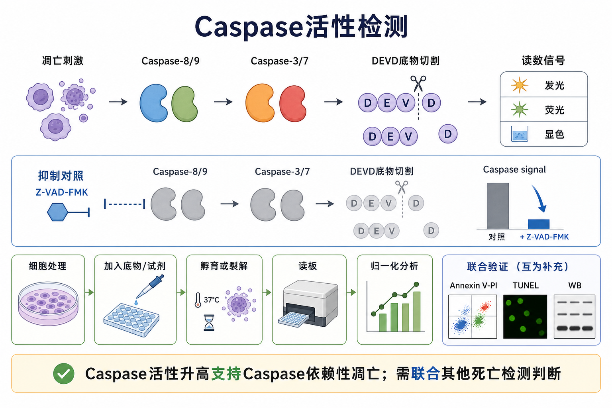
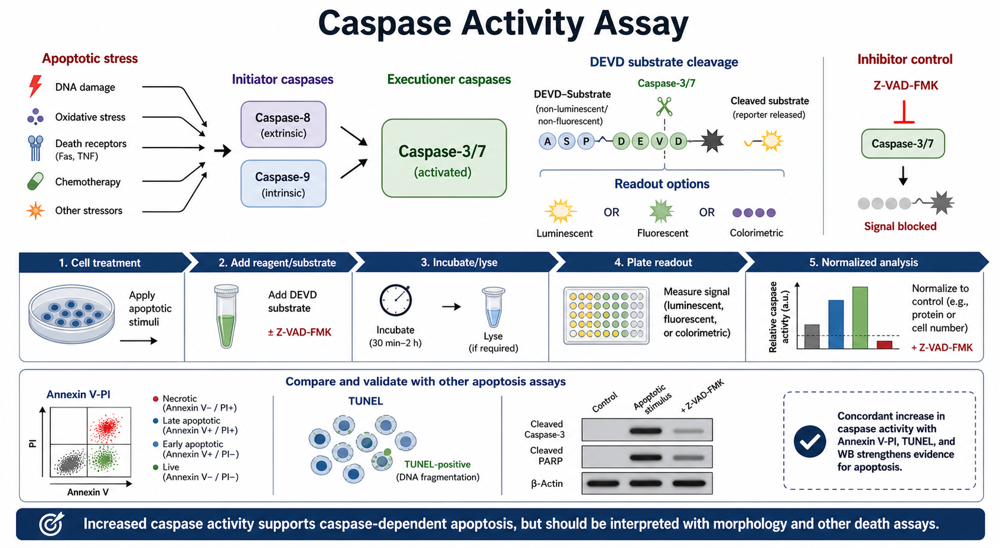

# Caspase活性检测

Caspase activity assay（Caspase 活性检测）是通过检测 [Caspase](../番外/补充知识/Caspase.md) 对特异性肽底物的切割活性，来判断细胞是否启动了 Caspase 介导的死亡程序。它最常用于评估 [Caspase依赖性凋亡](../番外/补充知识/Caspase依赖性凋亡.md)，尤其是 [Caspase-3](../番外/补充知识/Caspase-3.md) 和 [Caspase-7](../番外/补充知识/Caspase-7.md) 这类执行者 Caspase 的活化。





一句话理解：Caspase 活性升高通常支持“细胞正在发生 Caspase 依赖性凋亡”，但它不是单独的死亡方式判定。更稳妥的证据链通常是 Caspase 活性检测 + [Annexin V-PI染色](<Annexin V-PI染色.md>) + [TUNEL](TUNEL.md) + [Western blot](<Western blot.md>) 中的 cleaved Caspase-3 / cleaved [PARP](../番外/补充知识/PARP.md)。

## 实验发明历史与背景

Caspase 这个名字来自 cysteine-dependent aspartate-directed protease，中文可以理解为“半胱氨酸依赖性、天冬氨酸特异性蛋白酶”。经典综述指出，Caspase 家族蛋白通常以前体酶形式存在，在凋亡信号中被级联激活，并在底物蛋白的天冬氨酸位点之后切割。参考：[Cohen, 1997, Biochemical Journal](https://pmc.ncbi.nlm.nih.gov/articles/PMC1218630/)；[Thornberry and Lazebnik, 1998, Science](https://pubmed.ncbi.nlm.nih.gov/9721091/)。

早期 Caspase 研究的一个重要节点是 CPP32/apopain，也就是后来被广泛称为 Caspase-3 的蛋白酶。Nicholson 等人在 1995 年报道了与 PARP 裂解和凋亡相关的 ICE/CED-3 家族蛋白酶，并提出抑制这一蛋白酶可以阻断部分凋亡事件。参考：[Nicholson et al., 1995, Nature](https://www.nature.com/articles/376037a0)。

随着微孔板读板系统普及，Caspase 活性检测从传统的裂解液酶学检测，发展出发光、荧光、显色和活细胞成像等多种平台。现在最常见的是基于 DEVD 序列的 Caspase-3/7 检测，其中 DEVD 是 Asp-Glu-Val-Asp 的单字母氨基酸序列。Promega 的 Caspase-Glo 3/7 技术资料说明，DEVD-aminoluciferin 被 Caspase-3/7 切割后释放 aminoluciferin，随后由 luciferase 产生发光信号，信号强度与 Caspase 活性相关。参考：[Promega Caspase-Glo 3/7 Assay Technical Bulletin](https://www.promega.co.uk/resources/protocols/technical-bulletins/101/caspase-glo-37-assay-protocol/)。

## 应用场景

- 判断药物、基因敲低、基因过表达、辐射、氧化应激、营养剥夺等处理是否诱导 Caspase 依赖性凋亡。
- 比较不同处理组的凋亡强度，尤其适合做时间梯度和剂量梯度。
- 筛选促凋亡化合物或抗凋亡保护条件。
- 用 pan-caspase inhibitor（泛 Caspase 抑制剂）[Z-VAD-FMK](<../材(实验耗材工具篇)/Z-VAD-FMK.md>) 做机制验证：如果 Z-VAD-FMK 能明显降低信号并部分救回表型，说明该死亡过程至少有 Caspase 依赖成分。
- 和 Annexin V-PI、TUNEL、WB、[线粒体膜电位检测](线粒体膜电位检测.md)、[LDH释放实验](LDH释放实验.md) 联合，区分早期凋亡、晚期凋亡、继发性坏死和非凋亡性细胞死亡。
- 做高通量药物筛选时，用发光平台快速读取大量孔板数据。

Thermo Fisher 的 Caspase assay 页面也强调，Caspase 检测能提供凋亡过程中的酶活信息，但由于细胞死亡级联反应复杂且动态，推荐使用多参数方法综合判断。参考：[Thermo Fisher Caspase Assays](https://www.thermofisher.cn/ca/en/home/life-science/cell-analysis/cell-viability-and-regulation/apoptosis/caspase-assays.html)。

## 实验目的

这个实验通常有四个层次的目的：

- 定性判断：处理后 Caspase-3/7 是否被激活。
- 定量比较：不同组之间 Caspase 活性升高多少倍。
- 时间定位：Caspase 活化发生在处理后多久，是早于 DNA 断裂、膜破裂，还是已经进入晚期死亡阶段。
- 机制验证：Z-VAD-FMK、Caspase-3/7 inhibitor 或上游通路抑制剂能否降低信号。

如果只想知道“细胞是否还活着”，Caspase 活性检测不是最直接方法，应优先考虑 [CCK-8实验](CCK-8实验.md)、[MTT实验](MTT实验.md)、ATP 细胞活性检测或 LDH 释放。如果想知道“死亡是不是以凋亡机制为主”，Caspase 活性检测才更有解释力。

## 简要实验原理

Caspase 是一类切割天冬氨酸位点后的半胱氨酸蛋白酶。不同 Caspase 偏好不同短肽底物序列：

| 检测对象 | 常见底物序列 | 常见解释 |
|---|---|---|
| Caspase-3/7 | DEVD | 执行者 Caspase 活性，最常用于凋亡检测 |
| Caspase-8 | LETD | 外源性死亡受体通路相关上游活化 |
| Caspase-9 | LEHD | 线粒体内源性通路相关上游活化 |

常见读数平台：

| 平台 | 基本逻辑 | 优点 | 局限 |
|---|---|---|---|
| 发光法 | Caspase 切割发光底物，释放 luciferase 可利用的小分子底物 | 灵敏度高，适合 96/384 孔板，高通量友好 | 需要发光读板仪，通常会裂解细胞，不能保留细胞形态 |
| 荧光法 | Caspase 切割荧光底物或释放 DNA 结合染料 | 可用于读板、显微镜或流式；部分试剂可做活细胞观察 | 受化合物自发荧光、培养基背景和滤光片设置影响 |
| 显色法 | Caspase 切割 pNA 等显色底物，测吸光度 | 仪器门槛低 | 灵敏度通常低于发光法和荧光法 |
| WB 验证 | 检测 cleaved Caspase-3、cleaved PARP 等蛋白剪切产物 | 机制证据强，能看到分子量变化 | 不是活性实时读数，操作耗时 |

Promega 的 Caspase-Glo 3/7 FAQ 建议发光法使用不透明白色孔板，因为黑色板会降低发光信号，透明板可能增加孔间串扰。参考：[Promega Caspase-Glo 3/7 FAQ](https://worldwide.promega.com/resources/pubhub/faq/faq-caspase-glo-3-7/)。

## 所需试剂、耗材和设备

| 类别 | 推荐内容 | 作用 | 关键注意事项 |
|---|---|---|---|
| 细胞样本 | 贴壁细胞、悬浮细胞、原代细胞、类器官裂解样本 | 提供待检测 Caspase 活性 | 必须设置相近细胞数量，否则信号差异可能只是细胞量差异 |
| Caspase 检测试剂盒 | [Caspase-Glo试剂盒](<../材(实验耗材工具篇)/Caspase-Glo试剂盒.md>) 或同类发光/荧光/显色试剂盒 | 提供缓冲体系和底物 | 不同 kit 的裂解能力、孵育时间、读数窗口不同 |
| 底物 | [Caspase底物](<../材(实验耗材工具篇)/Caspase底物.md>)、[DEVD底物](<../材(实验耗材工具篇)/DEVD底物.md>) | 被目标 Caspase 切割后产生信号 | 底物序列不是绝对特异，只能解释为“偏向某类 Caspase” |
| 抑制剂 | Z-VAD-FMK | 泛 Caspase 抑制对照 | 需要预处理，且浓度过高可能产生非特异影响 |
| 阳性诱导剂 | [Staurosporine](<../材(实验耗材工具篇)/Staurosporine.md>) 等已知凋亡诱导剂 | 验证体系能检测到 Caspase 活化 | 不同细胞对诱导剂敏感性差异很大 |
| 孔板 | [96孔板](<../材(实验耗材工具篇)/96孔板.md>)、[白色96孔板](<../材(实验耗材工具篇)/白色96孔板.md>)、[黑色96孔板](<../材(实验耗材工具篇)/黑色96孔板.md>) | 反应和读数载体 | 发光优先白色板，荧光优先黑色板，显色可用透明板 |
| 裂解体系 | [裂解缓冲液](<../材(实验耗材工具篇)/裂解缓冲液.md>)、DTT 等 | 释放胞内 Caspase 或维持酶活 | 有些 one-step kit 已包含裂解功能，不要重复加入不兼容裂解液 |
| 读数设备 | [发光读板仪](<../材(实验耗材工具篇)/发光读板仪.md>)、[酶标仪](<../材(实验耗材工具篇)/酶标仪.md>) | 读取 RLU、RFU 或 OD | 需要提前确认仪器是否支持对应检测模式 |
| 验证抗体 | [Caspase-3抗体](<../材(实验耗材工具篇)/Caspase-3抗体.md>)、cleaved Caspase-3 antibody、cleaved PARP antibody | WB 验证 Caspase 通路活化 | 抗体要区分 total 与 cleaved 形式 |

## 实验设计

### 选择检测对象

最常见的选择是 Caspase-3/7 活性检测，因为 Caspase-3/7 位于 [凋亡执行通路](../番外/补充知识/凋亡执行通路.md) 下游，信号通常更接近最终凋亡执行状态。

如果你想区分上游通路，可以增加 Caspase-8 和 Caspase-9 活性检测：

- Caspase-8 更偏向 death receptor pathway（死亡受体通路）相关线索。
- Caspase-9 更偏向 mitochondrial pathway（线粒体通路）相关线索。
- Caspase-3/7 是更下游的执行者读数，适合作为主 readout。

但要注意：短肽底物有交叉识别风险，Caspase-8/9 活性检测不能单独替代 WB、抑制剂实验或遗传学验证。

### 设置对照

最少应该包含：

| 对照 | 目的 | 读数预期 |
|---|---|---|
| Blank 空白孔 | 试剂 + 培养基，无细胞 | 背景信号 |
| Vehicle 对照 | 溶剂处理细胞，例如 DMSO vehicle | 基线 Caspase 活性 |
| Positive control 阳性对照 | 已知凋亡诱导剂处理 | Caspase 活性升高 |
| Z-VAD-FMK 抑制剂对照 | 诱导剂 + pan-caspase inhibitor | Caspase 信号下降 |
| Cell number control | 相同接种量或用细胞数/蛋白量归一化 | 排除细胞数量影响 |

Promega FAQ 也建议设置 blank、negative control 和 positive control，并强调细胞状态、剂量、时间和细胞数量会影响 Caspase-3/7 最大活性窗口。参考：[Promega Caspase-Glo 3/7 FAQ](https://worldwide.promega.com/resources/pubhub/faq/faq-caspase-glo-3-7/)。

### 选择时间点

Caspase 活化通常是动态事件，而不是固定终点。一个常见错误是只做一个 24 h 时间点，然后发现信号不升高，就认为没有凋亡。实际上：

- 太早：Caspase 还没有明显活化。
- 正好：Caspase 活性升高，Annexin V 阳性增加，细胞膜完整性可能仍相对保留。
- 太晚：细胞已经脱落、裂解或进入继发性坏死，Caspase 活性可能下降。

推荐第一次探索时做 4-6 个时间点，例如 3 h、6 h、12 h、24 h、36 h、48 h。具体时间取决于细胞类型和处理强度。

## 实验操作

下面以 96 孔板 Caspase-3/7 发光法为主线。不同厂家试剂盒的体积、孵育时间和读数设置不同，实际操作必须以说明书为准。

### 细胞铺板和处理

做法：

- 将细胞均匀接种到 96 孔板中，保证各组细胞数接近。
- 贴壁细胞应在处理前完成贴壁和状态恢复。
- 按实验设计加入药物、转染、基因敲低、辐射或其他刺激。
- 同步设置 vehicle、positive control 和 Z-VAD-FMK 抑制剂组。

为什么重要：

Caspase 读数本质上和“每孔细胞总量”有关。处理组信号升高可能来自单细胞 Caspase 活性升高，也可能只是细胞数量更多。因此要么严格控制接种量，要么用蛋白量、细胞数、DNA 含量或平行孔活性检测进行归一化。

注意事项：

- 细胞不要过度融合。过度融合会改变应激状态和药物敏感性。
- 处理药物如果本身发光、吸光或荧光异常，需要设置化合物背景孔。
- 悬浮细胞读数前不要随意弃上清，否则容易丢失死亡细胞。

替代方案：

- 如果处理后细胞大量脱落，可收集上清和贴壁细胞一起检测。
- 如果细胞数量少，可改用更灵敏的发光平台。
- 如果需要保留细胞形态，可使用活细胞 Caspase-3/7 荧光探针，然后显微镜或流式读取。

可能出错导致的结果：

- 铺板不均：孔间 CV 很大，统计显著性不稳定。
- 细胞太少：信号接近背景。
- 细胞太多：信号饱和，剂量效应被压平。

### 抑制剂和阳性对照设置

做法：

- Z-VAD-FMK 通常需要在凋亡刺激前预处理一段时间。
- 阳性对照选择本细胞系已知有效的凋亡诱导条件。
- 抑制剂本身要设置 vehicle 对照，因为 Z-VAD-FMK 常用 DMSO 溶解。

为什么重要：

只有“处理组 Caspase 信号升高”还不够。加入 Z-VAD-FMK 后信号下降，才更能说明这个读数确实依赖 Caspase 活性，而不是底物、仪器或样本背景造成的假阳性。

注意事项：

- Z-VAD-FMK 不是万能凋亡拦截剂。某些细胞死亡会从 Caspase 依赖转向 Caspase 非依赖通路。
- 抑制剂浓度过高可能影响细胞状态，导致解释混乱。
- 如果阳性对照没有升高，优先怀疑细胞状态、诱导剂条件、试剂保存或读板设置。

### 试剂平衡和底物准备

做法：

- 按说明书将底物和缓冲液配成工作液。
- 发光试剂通常需要平衡到室温，避免温度差影响反应速率和发光稳定性。
- DTT 或还原剂如果是 kit 要求的组分，应现用现加。

为什么重要：

Caspase 是酶活检测，温度、pH、离子强度、还原环境和底物状态都会影响反应。不同孔之间如果温度不一致，可能导致边缘孔和中心孔读数差异。

注意事项：

- 避免反复冻融底物。
- 避光保存荧光底物。
- 不要把不同 kit 的底物、缓冲液和裂解液随意混用。

替代方案：

- 如果只需要 Caspase-3/7 总活性，one-step 发光 kit 最方便。
- 如果需要显微镜观察单细胞定位，可用 CellEvent 类活细胞荧光探针。
- 如果需要和蛋白表达关联，可同步留样做 WB。

### 加入检测试剂和孵育

做法：

- 按说明书向每孔加入检测试剂。
- 混匀时避免产生大量气泡。
- 室温或指定温度孵育到推荐时间范围后读数。

Promega 产品页以 Caspase-Glo 3/7 为例说明，常见流程是向细胞中加入等体积单一试剂，混匀后孵育 30 min 到 3 h，再读取发光；具体窗口以试剂盒说明书为准。参考：[Promega Caspase-Glo 3/7 Assay System](https://www.promega.com/products/cell-health-assays/apoptosis-assays/caspase_glo-3_7-assay-systems/?catNum=G8092)。

为什么重要：

发光法常常是“裂解 + 酶切 + 发光”连续发生。如果混匀不充分，裂解和底物接触不均匀；如果孵育时间差异太大，不同孔之间就不再可比。

注意事项：

- 多孔板操作要控制加样顺序和读数顺序。
- 气泡会影响吸光和荧光读数，也可能影响发光读取。
- 不要把孔板暴露在强光或剧烈温度变化环境中。

可能出错导致的结果：

- 混匀不足：同组重复孔差异大。
- 孵育过短：信号弱。
- 孵育过长：信号饱和或死亡晚期背景增加。

### 读板

做法：

- 发光法读取 RLU（relative luminescence units，相对发光单位）。
- 荧光法读取 RFU（relative fluorescence units，相对荧光单位），按底物要求选择激发/发射波长。
- 显色法读取 OD，一般与 pNA 等显色产物相关。

为什么重要：

不同平台读数单位不同，不能直接横向比较绝对值。真正有意义的是同一批实验内部经过背景扣除和归一化后的相对变化。

注意事项：

- 发光读板仪不一定等同于普通吸光酶标仪，要确认仪器模块。
- 同一实验内尽量使用相同 gain、integration time 和 plate type。
- 如果化合物颜色深或自发荧光强，显色/荧光平台容易受干扰。

### 数据归一化和统计

常用计算：

```text
Background-corrected signal = raw signal - blank signal

Relative caspase activity =
background-corrected treatment signal / background-corrected vehicle signal
```

如果处理明显改变细胞数，可以进一步归一化：

```text
Normalized caspase activity =
background-corrected caspase signal / cell number or protein amount
```

可选归一化方式：

- 平行孔做细胞活性或细胞数检测。
- 同孔或平行孔做总蛋白定量，例如 [BCA蛋白定量](BCA蛋白定量.md)。
- 对贴壁细胞使用 DNA 含量或核染色计数。

注意：如果处理导致细胞大量死亡，按蛋白量归一化可能会放大晚期死亡样本的噪音。最好结合显微镜观察和细胞数信息解释。

## 结果解析

### 典型结果模式

| 结果模式 | 可能解释 | 下一步 |
|---|---|---|
| Caspase-3/7 活性升高，Z-VAD-FMK 可抑制 | 处理诱导 Caspase 依赖性凋亡 | 做 Annexin V-PI、TUNEL 或 WB 增强证据链 |
| Caspase 活性升高，但 Z-VAD-FMK 不抑制 | 抑制剂条件无效、信号背景异常或死亡过程复杂 | 优化抑制剂浓度和时间，检查试剂与读板设置 |
| Annexin V 阳性升高，但 Caspase 不升高 | Caspase 非依赖性死亡、时间点错过、早晚期不匹配 | 做时间梯度，增加线粒体膜电位和 WB |
| TUNEL 阳性升高，但 Caspase 不升高 | DNA 损伤、晚期死亡或非典型凋亡 | 加入 DNA damage marker 和形态学证据 |
| WB cleaved Caspase-3 阳性，但活性检测弱 | 样本裂解/底物/读板问题，或活性窗口已过 | 检查试剂活性，缩短或延长时间点 |
| Caspase 活性强，细胞活性不下降 | 早期凋亡或亚致死应激 | 延长时间点，结合后续死亡指标 |

### 与其他死亡检测的区别

| 方法 | 主要读到什么 | 与 Caspase 活性检测的关系 |
|---|---|---|
| Annexin V-PI | 磷脂酰丝氨酸外翻和膜完整性 | 更接近细胞群体死亡分期；不能直接说明 Caspase 是否参与 |
| TUNEL | DNA 断裂产生的 3'-OH 末端 | 可支持凋亡晚期或 DNA 片段化，但不是 Caspase 特异 |
| Western blot | cleaved Caspase-3、cleaved PARP 等蛋白剪切 | 机制验证更强，但不是直接酶活读数 |
| LDH 释放 | 细胞膜破裂导致 LDH 外泄 | 偏向膜损伤和坏死/晚期死亡，不区分 Caspase |
| CCK-8/MTT/ATP | 代谢活性或 ATP 水平 | 适合看活性下降，不说明死亡机制 |

CST 的 cleaved Caspase-3 抗体资料中说明，cleaved Caspase-3 可检测活化 Caspase-3 的裂解片段，并且 Caspase-3 参与 PARP 等关键蛋白裂解。参考：[Cell Signaling Technology Cleaved Caspase-3 marker](https://www.cellsignal.com/products/primary-antibodies/apoptosis-marker-cleaved-caspase-3-asp175-western-detection-kit/9660)。

## 异常结果与可能原因

| 异常 | 常见原因 | 解决策略 |
|---|---|---|
| 所有孔信号都低 | 试剂失活、读板模式错误、细胞量太少、时间点过早 | 换阳性对照验证，检查仪器模式，增加细胞量或延长处理时间 |
| 空白孔背景高 | 试剂污染、培养基或药物自带信号、板材不合适 | 更换试剂，设置化合物背景孔，使用推荐孔板 |
| 重复孔差异大 | 铺板不均、加样顺序差异、气泡、边缘效应 | 使用多道移液器，轻柔混匀，避免边缘孔或加入外圈缓冲液 |
| 处理组信号不升反降 | 细胞死亡太晚期、细胞脱落丢失、Caspase 非依赖性死亡 | 收集漂浮细胞，提前时间点，联合 LDH/Annexin V-PI |
| 阳性对照不工作 | 诱导剂失效、细胞不敏感、处理时间不合适 | 换阳性诱导剂，做剂量和时间优化 |
| Z-VAD-FMK 不抑制 | 抑制剂失效、预处理不足、浓度不合适、死亡路径非 Caspase 依赖 | 重新配制，调整预处理时间，验证 cleaved Caspase-3 |
| 信号饱和 | 细胞过多、孵育过长、gain 设置过高 | 降低接种量，缩短孵育，调整读板参数 |
| 荧光读数异常 | 药物自发荧光、培养基背景、滤光片不匹配 | 设置化合物背景孔，换无酚红培养基或改用发光法 |

## 常见错误和 troubleshooting

### 把 Caspase 活性等同于“凋亡比例”

Caspase 活性是酶活强度，不是百分比。它会受到细胞数量、反应时间、底物浓度和单细胞酶活水平共同影响。要得到凋亡比例，应该结合流式或成像定量。

### 只做一个终点

Caspase 活化有峰值。只测一个时间点很容易错过峰值，尤其是药物强、细胞死亡快、或者细胞大量脱落时。第一次做新模型时应做时间梯度。

### 忽略细胞脱落

很多凋亡细胞会从贴壁状态脱落。如果只检测贴壁细胞，可能低估死亡细胞的 Caspase 活性。处理强烈时要同时收集上清漂浮细胞。

### 用错孔板

发光实验用透明板容易出现孔间串扰，黑色板会压低信号；荧光实验用白色板可能增加背景反射。孔板选择不是细节，是读数质量的一部分。

### 没有抑制剂对照

没有 Z-VAD-FMK 或 Caspase-3/7 inhibitor 对照时，很难说明信号升高确实来自 Caspase 活性。尤其在化合物筛选中，底物、发光体系和化合物本身都可能产生干扰。

## 购买和选择建议

| 场景 | 优先选择 |
|---|---|
| 常规 96 孔板定量 | 发光 Caspase-3/7 kit，例如 [Promega](../番外/试剂厂商/Promega.md) Caspase-Glo 系列 |
| 需要活细胞成像 | 荧光活细胞 Caspase-3/7 probe，例如 [Thermo Fisher Scientific](<../番外/试剂厂商/Thermo Fisher Scientific.md>) CellEvent 类产品 |
| 需要和 WB 证据闭环 | cleaved Caspase-3、cleaved PARP 抗体，例如 [Cell Signaling Technology](<../番外/试剂厂商/Cell Signaling Technology.md>) |
| 预算有限、仪器简单 | 显色底物或国产试剂盒，但需要更认真做阳性对照和线性范围验证 |
| 高通量筛选 | 发光法 + 白色 96/384 孔板 + 自动化加样 |

记录商业试剂时建议至少记录：品牌、公司、货号、批号、检测对象、读数平台、储存条件、开封日期和有效期。例如：

```text
Caspase-Glo 3/7 Assay System, Promega, Cat. No. G809x, Lot No. xxxx, luminescent Caspase-3/7 assay, stored at recommended condition, opened on yyyy-mm-dd
```

## 推荐记录模板

中文模板：

```text
实验名称：
细胞类型：
处理条件：
接种密度：
检测平台：发光 / 荧光 / 显色 / 成像
Caspase 检测对象：Caspase-3/7 / Caspase-8 / Caspase-9 / 其他
试剂盒品牌与货号：
试剂批号：
孔板类型：
读板仪型号：
诱导剂与浓度：
Z-VAD-FMK 或其他抑制剂条件：
处理时间点：
孵育时间：
blank 信号：
vehicle 信号：
treatment 信号：
归一化方式：
相对 Caspase 活性：
是否同步做 Annexin V-PI / TUNEL / WB：
异常现象：
结论：
```

English template:

```text
Experiment name:
Cell type:
Treatment condition:
Seeding density:
Detection platform: luminescent / fluorescent / colorimetric / imaging
Caspase target: Caspase-3/7 / Caspase-8 / Caspase-9 / other
Kit brand and catalog number:
Reagent lot number:
Plate type:
Plate reader model:
Apoptosis inducer and concentration:
Z-VAD-FMK or inhibitor condition:
Treatment time point:
Incubation time:
Blank signal:
Vehicle signal:
Treatment signal:
Normalization method:
Relative caspase activity:
Parallel Annexin V-PI / TUNEL / WB:
Unexpected observations:
Conclusion:
```

## 小结

Caspase 活性检测的优势是快速、灵敏、定量友好，尤其适合回答“处理是否启动了 Caspase 依赖性凋亡”这个问题。它的弱点也很明确：它不是细胞死亡比例，不是凋亡的唯一证据，也不能单独排除坏死、焦亡、铁死亡或 Caspase 非依赖性死亡。

最推荐的理解方式是：Caspase 活性检测给出“机制方向”，Annexin V-PI 给出“群体分期”，TUNEL 给出“DNA 断裂结果”，WB 给出“关键蛋白剪切证据”。这些证据相互吻合时，凋亡结论才更稳。

## 参考来源

- [Cohen GM. Caspases: the executioners of apoptosis. Biochemical Journal, 1997.](https://pmc.ncbi.nlm.nih.gov/articles/PMC1218630/)
- [Thornberry NA, Lazebnik Y. Caspases: enemies within. Science, 1998.](https://pubmed.ncbi.nlm.nih.gov/9721091/)
- [Nicholson DW et al. Identification and inhibition of the ICE/CED-3 protease necessary for mammalian apoptosis. Nature, 1995.](https://www.nature.com/articles/376037a0)
- [Promega Caspase-Glo 3/7 Assay Technical Bulletin.](https://www.promega.co.uk/resources/protocols/technical-bulletins/101/caspase-glo-37-assay-protocol/)
- [Promega Caspase-Glo 3/7 FAQ.](https://worldwide.promega.com/resources/pubhub/faq/faq-caspase-glo-3-7/)
- [Thermo Fisher Scientific Caspase Assays.](https://www.thermofisher.cn/ca/en/home/life-science/cell-analysis/cell-viability-and-regulation/apoptosis/caspase-assays.html)
- [Cell Signaling Technology Cleaved Caspase-3 apoptosis marker information.](https://www.cellsignal.com/products/primary-antibodies/apoptosis-marker-cleaved-caspase-3-asp175-western-detection-kit/9660)
