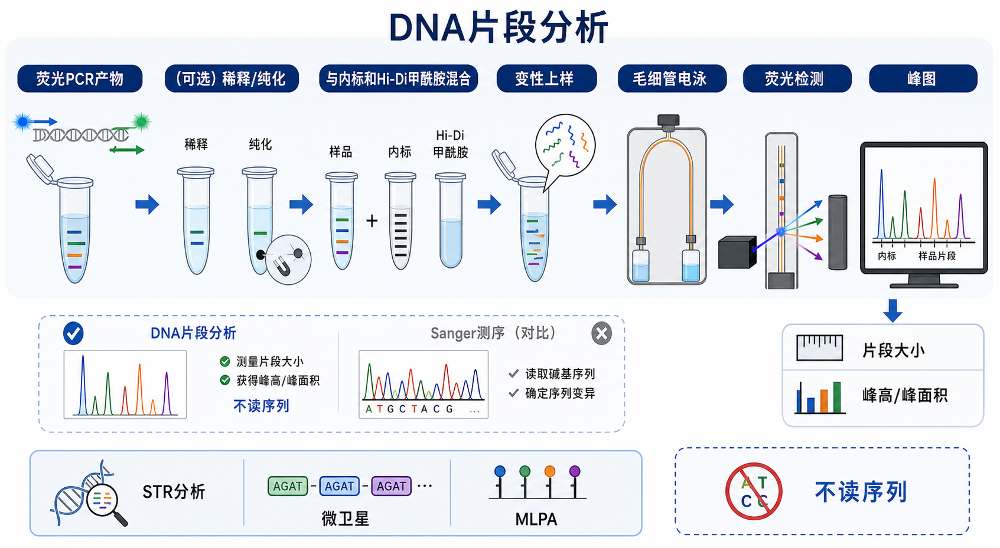

# DNA片段分析

DNA fragment analysis（DNA片段分析）是一类以荧光标记 DNA 片段为读数对象的遗传分析方法：先用 [PCR](PCR.md) 或 multiplex ligation-dependent probe amplification（[MLPA](MLPA.md)，多重连接探针扩增）等反应产生不同长度的荧光片段，再通过 [毛细管电泳](毛细管电泳.md) 分离，最后用 internal size standard（内标/尺寸标准品）把迁移时间换算成片段大小、[峰高](../番外/补充知识/峰高.md) 和 [峰面积](../番外/补充知识/峰面积.md)。它的核心输出不是 A/T/G/C 碱基序列，而是“这个荧光片段有多长、峰有多高、峰面积是多少、能否分型”。Thermo Fisher 对 fragment analysis 的定义也强调：DNA 片段被荧光标记、经 capillary electrophoresis（CE，毛细管电泳）分离，并与内标比较后确定大小。参考：[Thermo Fisher - What is fragment analysis?](https://www.thermofisher.com/us/en/home/life-science/sequencing/sequencing-learning-center/capillary-electrophoresis-information/what-is-fragment-analysis.html)。



一句话理解：如果 Sanger sequencing（[Sanger测序](Sanger测序.md)，桑格测序）是“读一串碱基顺序”，DNA 片段分析就是“测一组荧光 DNA 片段的长度和峰型”；它特别适合 short tandem repeat（[STR分析](STR分析.md)，短串联重复序列分析）、[微卫星分析](微卫星分析.md)、细胞系鉴定、拷贝数相关片段检测和 CRISPR insertion/deletion analysis（[CRISPR indel分析](CRISPR indel分析.md)，CRISPR 插入/缺失分析）初筛。

## 实验发明历史与背景

DNA 片段分析不是单一发明，而是由 fluorescence-labeled PCR（荧光标记 PCR）、capillary gel electrophoresis（毛细管凝胶电泳）、laser-induced fluorescence（[激光诱导荧光](../番外/补充知识/激光诱导荧光.md)，LIF）和遗传分析软件共同成熟起来的 workflow。它和现代 Sanger 测序共享很多硬件：毛细管阵列、聚合物基质、激光/相机检测系统和 Applied Biosystems 类遗传分析仪。

它真正有价值的地方在于：很多生物学问题并不需要知道完整序列，只需要知道片段长度是否变化、等位基因峰型是否匹配、多个荧光片段之间的相对比例是否异常。Thermo Fisher 的 fragment analysis 应用页也列出 cell line authentication（细胞系鉴定）、microsatellite marker analysis（微卫星标记分析）、CRISPR-Cas9 编辑效率筛查、SNP genotyping（单核苷酸多态性分型）等应用，并指出多重荧光标记可让多个重叠位点在同一次运行中区分。参考：[Thermo Fisher Fragment Analysis](https://www.thermofisher.com/us/en/home/life-science/sequencing/fragment-analysis.html)。

## 应用场景

| 应用 | 读数逻辑 | 适合回答的问题 | 主要风险 |
|---|---|---|---|
| STR 分析 | 多个位点的重复单元数导致片段长度不同 | 细胞系鉴定、样本身份确认、混样判断 | stutter 峰、等位基因掉落、混合峰 |
| 微卫星分析 | microsatellite（微卫星）重复数改变造成峰位改变 | 基因分型、群体遗传、microsatellite instability（[微卫星不稳定性](../番外/补充知识/微卫星不稳定性.md)，MSI）相关研究 | 非特异扩增、峰型解释依赖阈值 |
| MLPA | 多个探针被连接后形成不同长度的荧光扩增片段 | 拷贝数变异、外显子缺失/重复、特定甲基化检测 | 需要参考样本、批间归一化和软件质量控制 |
| CRISPR indel 初筛 | 编辑后目标区插入/缺失改变片段长度或峰型 | 判断 bulk pool 是否出现编辑、粗略比较编辑效率 | 小 indel 分辨率和复杂混合型解释有限 |
| SNP/SNaPshot 类分型 | 单碱基延伸或等位基因特异片段产生不同荧光峰 | 已知位点分型 | 只适合预设位点，不发现未知变异 |
| PCR 片段质控 | 目标片段与杂峰的长度和强度 | 判断扩增是否干净、是否有引物二聚体或非特异产物 | 不能替代测序确认序列 |

## 实验目的

- 确定荧光 DNA 片段的大小：通常以 base pair（bp，碱基对）表示。
- 判断 genotype（[等位基因分型](../番外/补充知识/等位基因分型.md)）：例如 STR 或微卫星位点的等位基因组合。
- 比较相对峰强：用峰高或峰面积判断不同片段的相对丰度。
- 识别异常峰型：例如 stutter peak（[stutter峰](../番外/补充知识/stutter峰.md)，重复滑移峰）、pull-up peak（[pull-up峰](../番外/补充知识/pull-up峰.md)，光谱串色峰）、dye blob（[染料团](../番外/补充知识/染料团.md)）或 incomplete adenylation（不完全加 A）。
- 做快速筛查：尤其是细胞系 STR 鉴定、CRISPR indel 初筛、MLPA 拷贝数分析等。

## 简要实验原理

### 荧光标记 PCR

DNA 片段分析通常使用 fluorescence-labeled primer（[荧光PCR引物](<../材(实验耗材工具篇)/荧光PCR引物.md>)，荧光标记 PCR 引物）扩增目标区域。不同位点可以用不同颜色染料标记；只要片段大小和染料通道能被软件区分，就可以 multiplex PCR（多重 PCR）在一个反应里同时检测多个位点。

关键点不是“扩增得越多越好”，而是峰高要落在仪器和软件推荐的线性范围内。过量 PCR 产物会让主峰过高，导致峰形变宽、基线抬高、pull-up 峰和大小判定偏差。

### 内标与片段大小标准曲线

每个样本孔通常需要加入 internal size standard（内标/尺寸标准品），例如带有固定长度片段和固定荧光通道的 [荧光内标](<../材(实验耗材工具篇)/荧光内标.md>) 或 [尺寸标准品](<../材(实验耗材工具篇)/尺寸标准品.md>)。软件先根据内标峰建立 [片段大小标准曲线](../番外/补充知识/片段大小标准曲线.md)，再把样本峰的 [迁移时间](../番外/补充知识/迁移时间.md) 换算成 bp。

这也是 DNA 片段分析和普通琼脂糖凝胶电泳的关键差别：普通凝胶常用外部 DNA ladder 粗略估算条带大小；片段分析是在每一个上机样本里放内标，因此能校正孔间进样、毛细管状态和运行条件造成的迁移差异。Thermo Fisher 的教学页也强调 unknown sample 会与 size standard 和 formamide 混合，size standard 用于样本峰定尺并校正进样变化。参考：[Thermo Fisher - What is fragment analysis?](https://www.thermofisher.com/us/en/home/life-science/sequencing/sequencing-learning-center/capillary-electrophoresis-information/what-is-fragment-analysis.html)。

### 变性上样和毛细管分离

多数 Applied Biosystems 风格的 fragment analysis workflow 会把荧光 PCR 产物、内标和 [Hi-Di甲酰胺](<../材(实验耗材工具篇)/Hi-Di甲酰胺.md>) 或等效变性上样液混合，变性后上机。甲酰胺的作用是帮助 DNA 保持单链状态，减少二级结构和再退火，使片段主要按长度而不是构象差异迁移。

上机后，样本被电动进样到含 [聚合物基质](<../材(实验耗材工具篇)/聚合物基质.md>) 的 [毛细管阵列](<../材(实验耗材工具篇)/毛细管阵列.md>) 中。高压电场使短片段通常先到达检测窗口，长片段后到达；激光激发荧光染料，检测系统记录不同颜色通道的信号。

### 峰图和分型

软件会输出 electropherogram（电泳峰图）。横轴通常是片段大小或迁移时间，纵轴通常是 relative fluorescence unit（[RFU](../番外/补充知识/RFU.md)，相对荧光单位）。对一般 DNA sizing，读数重点是每个峰的 bp 值和峰强；对 STR 或微卫星，软件还会把峰映射到 [等位基因ladder](<../材(实验耗材工具篇)/等位基因ladder.md>) 并给出等位基因名称；对 MLPA，软件更关心每个探针峰与参考样本相比的相对比例。

[GeneMapper](<../材(实验耗材工具篇)/GeneMapper.md>)、[Peak Scanner](<../材(实验耗材工具篇)/Peak Scanner.md>)、[Microsatellite Analysis Software](<../材(实验耗材工具篇)/Microsatellite Analysis Software.md>) 或 [Coffalyser.Net](<../材(实验耗材工具篇)/Coffalyser.Net.md>) 等软件不是“自动给最终真相”的工具，而是把峰检测、定尺、阈值、分型和质控规则系统化。Thermo Fisher 的软件页把 Peak Scanner 描述为用于 DNA fragment sizing 的软件，GeneMapper 用于 Applied Biosystems 电泳式分型系统的 DNA sizing 和 allele calling；MRC Holland 也说明 MLPA 产物通过毛细管电泳分离和定量，并可用 Coffalyser.Net 做高级质量控制。参考：[Thermo Fisher Sanger and Fragment Analysis Software](https://www.thermofisher.com/us/en/home/life-science/sequencing/sanger-sequencing/sanger-dna-sequencing/sanger-sequencing-data-analysis.html)、[MRC Holland MLPA](https://www.mrcholland.com/technology/mlpa)。

## 所需试剂、耗材和设备

| 类别 | 常用内容 | 作用 | 注意事项 |
|---|---|---|---|
| 模板 | genomic DNA（基因组 DNA）、PCR 产物、MLPA 反应产物 | 提供待分析片段 | DNA 降解、抑制物和混样都会影响峰型 |
| 扩增体系 | DNA polymerase（DNA 聚合酶）、dNTP、buffer、荧光 PCR 引物 | 产生带荧光的目标片段 | 多重体系要检查引物互作、非特异峰和 dye channel |
| 变性上样 | Hi-Di 甲酰胺或平台指定 formamide | 保持单链 DNA，减少二级结构 | 吸湿、老化或反复冻融会增加背景 |
| 内标 | 荧光内标、尺寸标准品 | 将迁移时间换算为片段大小 | 内标峰缺失或错配会让整孔定尺失败 |
| 仪器 | [毛细管测序仪](<../材(实验耗材工具篇)/毛细管测序仪.md>) / genetic analyzer（遗传分析仪） | 自动进样、分离和检测 | 记录仪器型号、毛细管长度、聚合物、run module |
| 耗材 | 毛细管阵列、聚合物基质、buffer、[96孔板](<../材(实验耗材工具篇)/96孔板.md>)、封板膜 | 支持分离运行 | 气泡、盐、沉淀和孔位错配是常见问题 |
| 软件 | GeneMapper、Peak Scanner、Microsatellite Analysis Software、Coffalyser.Net | 峰识别、定尺、分型、质控 | 阈值、bin set、panel、analysis method 必须记录 |
| 对照 | [阴性对照](../番外/补充知识/阴性对照.md)、[阳性对照](../番外/补充知识/阳性对照.md)、allelic ladder、参考样本 | 判断污染、分型准确性和批次质量 | STR/MLPA 类实验没有合适对照很难解释 |

## 实验设计

### 先定义“要看什么峰”

片段分析最容易出错的地方，是还没想清楚读数逻辑就开始上机。设计前要先确认：

- 目标片段大小范围：内标和 run module 必须覆盖这个范围。
- 需要几个染料通道：多重 PCR 中不同位点要避免同色同尺寸重叠。
- 是否需要 allele ladder：STR 和微卫星分型通常需要。
- 是否需要参考样本：MLPA 和相对定量类应用需要同批参考。
- 能接受的分辨率：1 bp 差异可以被 CE 高分辨检测，但复杂重复区仍需要严格阈值和人工复核。

### 控制峰高，而不是追求最亮

DNA 片段分析的理想峰不是最高峰，而是在线性范围内、峰形尖锐、基线干净、通道间串色低的峰。可以通过降低模板量、减少 PCR cycles（循环数）、稀释 PCR 产物、缩短进样或调整分析阈值来控制峰强。具体参数要按仪器和试剂盒说明，不应把某个实验室的时间/电压直接搬到另一个平台。

### 多重 PCR 要留出峰位和颜色空间

同一个 dye channel（染料通道）里的片段大小最好有足够间隔；不同 dye channel 虽然颜色不同，但过强信号可能造成光谱串色，所以不能无限堆叠位点。做复杂 panel 时，要同步考虑 amplicon size、dye set、primer compatibility、allele range 和 stutter pattern。

### 做好光谱校准和软件方法

spectral calibration（[光谱校准](../番外/补充知识/光谱校准.md)）用于让仪器区分不同荧光染料的信号。染料组、matrix standard、仪器型号、软件版本和 analysis method 如果不匹配，常见表现是 pull-up 峰、颜色串扰或峰调用错误。Thermo Fisher 的 fragment analysis 教学页也指出，应针对所选染料组进行相应的 spectral calibration。参考：[Thermo Fisher - What is fragment analysis?](https://www.thermofisher.com/us/en/home/life-science/sequencing/sequencing-learning-center/capillary-electrophoresis-information/what-is-fragment-analysis.html)。

## 实验操作

下面是通用理解框架，不替代具体试剂盒、仪器和软件 SOP。司法、临床或诊断用途必须遵守相应法规、验证文件和实验室质量体系。

### 样本 DNA 准备

做法：

- 提取 DNA，记录样本来源、提取方法、浓度和保存状态。
- 用 [Qubit荧光计](<../材(实验耗材工具篇)/Qubit荧光计.md>) 或其他适合方法定量；必要时评估降解和抑制物。
- 对低量、降解、formalin-fixed paraffin-embedded（[FFPE](../番外/补充知识/FFPE.md)，福尔马林固定石蜡包埋）或复杂样本，先评估是否适合片段分析。

意义：

DNA 片段分析对模板质量很敏感。模板太少会导致 allele dropout（等位基因掉落）或峰低；模板太多会导致过载、stutter 增高和 pull-up；抑制物会让 PCR 失败或不同位点扩增不均。

替代策略：

- 如果只是确认 PCR 条带是否存在，先用 [琼脂糖凝胶电泳](琼脂糖凝胶电泳.md) 更便宜。
- 如果要确认序列变化，使用 Sanger 测序或 next-generation sequencing（[下一代测序](../番外/补充知识/下一代测序.md)，NGS）。
- 如果样本高度降解，优先选择短扩增子 panel。

### 荧光 PCR 或片段生成

做法：

- 根据目标位点设计普通 PCR、multiplex PCR、SNaPshot 或 MLPA 类反应。
- 使用带荧光染料的引物或探针，让最终产物可被毛细管检测。
- 设置阴性对照和阳性/参考对照。

意义：

毛细管只负责分离和检测，不能修复前端扩增的错误。非特异扩增会形成杂峰；引物二聚体会形成小片段峰；多重 PCR 失衡会导致某些位点峰过强、某些位点掉落。

替代策略：

- 单个位点问题可以先做单重 PCR，确认干净后再并入 multiplex。
- 如果主峰过高，优先稀释 PCR 产物，而不是盲目调整软件阈值。
- 如果某位点长期弱峰，考虑重新设计引物或调整位点间 primer ratio（引物比例）。

### 稀释、纯化和上样混合

做法：

- 按平台建议稀释 PCR 产物。
- 将样本与内标、Hi-Di 甲酰胺或指定上样液混合。
- 封板、离心去气泡，并保持孔位记录一致。

意义：

很多片段分析 workflow 不需要像 Sanger 测序那样做复杂反应后纯化，但“可以不纯化”不等于“脏样本也没关系”。盐、乙醇、沉淀、过量引物、游离染料和气泡都可能造成进样失败、异常电流、宽峰或染料团。

替代策略：

- 峰太强：增加稀释倍数。
- 背景高或 dye blob 明显：考虑 PCR cleanup、重新配制上样混合液或更换老化试剂。
- 小片段杂峰多：优化 PCR 特异性，必要时做尺寸选择。

### 变性和上机

做法：

- 根据仪器或 kit SOP 对上样混合液做热变性并快速冷却。
- 选择正确 run module、dye set、size standard 和 plate record。
- 上机前检查毛细管阵列、聚合物、buffer、waste 和仪器维护状态。

意义：

变性不足会导致双链或二级结构影响迁移；内标选择错误会让定尺失败；run module 错误会让分离窗口不匹配；plate record 错孔会造成样本身份错误。

替代策略：

- 对重复出现异常峰形的样本，重新变性上样。
- 对整板异常，优先检查内标、polymer、buffer、光谱校准和 run module，而不是只怀疑样本。

### 软件分析和人工复核

做法：

- 导入原始数据，选择正确 panel、bin set、size standard 和 analysis method。
- 查看内标峰、基线、峰高范围、颜色通道、阳性对照和阴性对照。
- 对自动分型结果进行人工复核，标记 stutter、pull-up、dye blob、off-ladder allele 和低于阈值的峰。

意义：

自动软件适合批量处理，但最终解释依赖实验设计和质控。NIJ 的 STR 数据解释培训也把 stutter、3'-A nucleotide addition、spurious peaks、pull-up 等作为需要在 allele call 前评估的 artifacts。参考：[NIJ STR Data Analysis - Extraneous Peaks](https://nij.ojp.gov/nij-hosted-online-training-courses/str-data-analysis-and-interpretation-forensic-analysts/data-interpretation-allele-calls/step-2-extraneous-peaks)。

替代策略：

- 普通 sizing 可用 Peak Scanner 或同类软件。
- Applied Biosystems 分型系统常用 GeneMapper。
- MLPA 推荐使用 MRC Holland 支持的 Coffalyser.Net 或实验室验证过的软件流程。

## 结果解析

| 读数 | 含义 | 怎么看 | 常见误区 |
|---|---|---|---|
| 片段大小 | 样本峰相对于内标换算的 bp 值 | 观察是否落在预期范围或 allele bin | 把 bp 小数位当成绝对真实序列长度 |
| 峰高 | 峰顶强度，常以 RFU 表示 | 判断信号强弱、过载和掉落风险 | 只追求高峰而忽略线性范围 |
| 峰面积 | 峰下面积，反映总荧光信号 | 可用于相对定量和比例比较 | 不同位点/染料不能随意横向比较 |
| 内标峰 | 每孔的定尺参考 | 应完整、顺序正确、峰形稳定 | 内标失败时仍强行解释样本峰 |
| allele call | 软件给出的等位基因名称 | 结合 ladder、bin 和阈值复核 | 把自动 call 当成无需检查的结论 |
| artifact flag | 软件或人工标记的异常峰 | 看是否影响目标峰解释 | 低峰、stutter、pull-up 混淆为真实等位基因 |

对普通科研样本，结果解析的顺序建议是：

- 先看阴性对照是否有峰，排除污染。
- 再看阳性对照或 ladder 是否正常，确认体系和软件方法可用。
- 再看每孔内标是否正常，确认定尺可靠。
- 然后看目标峰是否在预期范围、峰高是否在线性范围、峰形是否尖锐。
- 最后再判断等位基因、片段大小差异或相对峰面积差异。

## 异常结果和可能原因

| 异常 | 常见表现 | 可能原因 | 处理思路 |
|---|---|---|---|
| 无峰或全板弱峰 | 样本峰和内标峰都低 | 上样失败、内标漏加、毛细管/聚合物/仪器问题 | 查内标、run log、进样电流、耗材状态 |
| 样本峰弱但内标正常 | 目标峰低或缺失 | PCR 失败、模板不足、引物问题、抑制物 | 回查 PCR、模板质量、阳性对照 |
| 峰过高或宽峰 | 主峰饱和、拖尾 | PCR 产物过浓、进样过量 | 稀释样本、降低模板量或循环数 |
| pull-up 峰 | 强峰同一迁移位置在其他颜色出现小峰 | 光谱校准不佳、信号过载、染料组不匹配 | 重新光谱校准、稀释样本、检查 dye set |
| stutter 峰 | STR 主峰附近出现规律性小峰 | PCR 滑移，STR 位点常见 | 使用位点特异 stutter 阈值，不直接当成等位基因 |
| 加 A 不完全 | 主峰旁边出现相差 1 bp 的峰 | Taq 末端加 A 不充分、反应条件不合适 | 按 kit 要求延伸，优化 PCR，不随意合并峰 |
| dye blob | 宽而钝的单色异常峰 | 游离染料、试剂老化、纯化不足 | 清理 PCR 产物、更换试剂、避光保存 |
| 内标错峰 | size calling 失败或所有样本偏移 | 内标选择错误、内标降解、软件方法不匹配 | 选正确 size standard，重新分析 |
| 阴性对照有峰 | NTC 或 blank 出现目标峰 | PCR 产物污染、气溶胶、孔间串样 | 重配体系、分区操作、检查耗材和加样流程 |
| 孔位错配 | 结果与样本身份不符 | plate map 错误、上样顺序错 | 使用双人核对或条码化记录 |

## DNA片段分析 vs Sanger测序 vs 凝胶电泳

| 方法 | 主要问题 | 输出 | 优势 | 局限 |
|---|---|---|---|---|
| DNA 片段分析 | 片段多长、峰型如何、能否分型 | bp、RFU、峰高、峰面积、allele call | 高分辨、可多重、适合 STR/微卫星/MLPA | 不直接给碱基序列 |
| Sanger 测序 | 碱基顺序是什么 | chromatogram、序列、质量 | 直观验证单一模板序列 | 混合模板解释困难，通量有限 |
| 琼脂糖凝胶电泳 | 是否有条带、大小是否大致正确 | 条带图 | 便宜、快速、可观察产物纯度 | 分辨率和定量性有限 |
| 微流控芯片电泳 | 片段分布和质量如何 | 虚拟凝胶、峰图、RIN/DIN | 样本量少、质控方便 | 多用于 QC，不一定适合等位基因分型 |

## 记录模板

中文记录：

```text
实验名称：
样本编号：
应用类型：STR / 微卫星 / MLPA / CRISPR indel / 普通片段定尺
模板来源与浓度：
PCR/片段生成体系：
荧光引物/探针：
内标/尺寸标准品：
上样液/甲酰胺：
仪器型号：
毛细管阵列/聚合物：
run module / dye set：
软件与版本：
analysis method / panel / bin set：
阳性对照结果：
阴性对照结果：
主要峰大小与峰高：
异常峰记录：
结论：
```

English record:

```text
Experiment name:
Sample ID:
Application type: STR / microsatellite / MLPA / CRISPR indel / fragment sizing
Template source and concentration:
PCR or fragment-generation chemistry:
Fluorescent primer/probe:
Internal size standard:
Loading solution/formamide:
Instrument model:
Capillary array/polymer:
Run module / dye set:
Software and version:
Analysis method / panel / bin set:
Positive control:
Negative control:
Major peak size and peak height:
Artifact notes:
Conclusion:
```

## 购买和平台建议

- 如果实验室已经有 Applied Biosystems 遗传分析仪，优先沿用对应的毛细管、聚合物、染料组、内标和 GeneMapper/Peak Scanner 生态，减少方法转移变量。
- 如果主要做 STR 或人源细胞系鉴定，优先选择成熟 STR kit、等位基因 ladder 和验证过的分析软件，不要自己随意拼 panel。
- 如果主要做 MLPA，优先按 MRC Holland 或相应 kit 说明选择探针、参考样本和 Coffalyser.Net 分析流程。
- 如果只是看 PCR 产物有无和大致大小，不一定需要片段分析；普通凝胶更便宜。
- 如果要确认序列、发现未知突变或解析复杂 indel，片段分析只能作为筛查，最终仍可能需要 Sanger 或 NGS。

## 总结

DNA 片段分析的核心不是“另一种测序”，而是高分辨、自动化、可多重的荧光片段大小分析。它最擅长把“长度差异”和“峰型差异”转化为可比较数据，因此在 STR、微卫星、MLPA、细胞系鉴定和 CRISPR indel 初筛中很有用。它最容易出错的地方也很明确：PCR 不干净、峰过载、内标失败、光谱校准错误、软件阈值不合理、artifact 被误判为真实峰。

## 参考来源

- Thermo Fisher Scientific: [What is fragment analysis?](https://www.thermofisher.com/us/en/home/life-science/sequencing/sequencing-learning-center/capillary-electrophoresis-information/what-is-fragment-analysis.html)
- Thermo Fisher Scientific: [Fragment Analysis Applications](https://www.thermofisher.com/us/en/home/life-science/sequencing/fragment-analysis.html)
- Thermo Fisher Scientific: [Sanger Sequencing and Fragment Analysis Software](https://www.thermofisher.com/us/en/home/life-science/sequencing/sanger-sequencing/sanger-dna-sequencing/sanger-sequencing-data-analysis.html)
- MRC Holland: [MLPA: Multiplex Ligation-dependent Probe Amplification](https://www.mrcholland.com/technology/mlpa)
- National Institute of Justice: [STR Data Analysis and Interpretation - Extraneous Peaks](https://nij.ojp.gov/nij-hosted-online-training-courses/str-data-analysis-and-interpretation-forensic-analysts/data-interpretation-allele-calls/step-2-extraneous-peaks)
