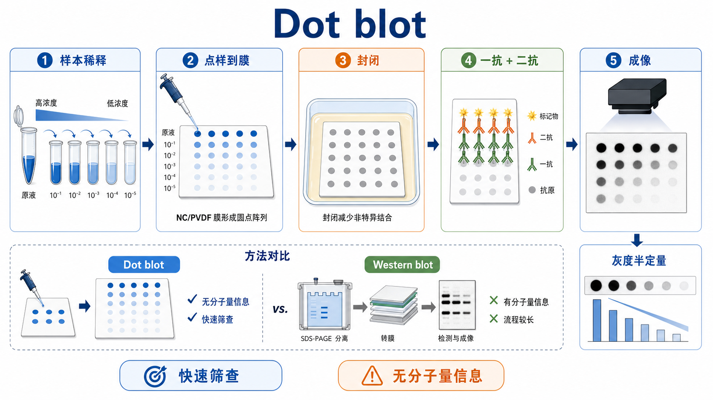

# Dot blot

Dot blot（斑点印迹，也常叫 dot immunoblot，斑点免疫印迹）是一种把蛋白、核酸或其他可固定样本直接点到膜上，再用抗体或探针检测目标分子的 blotting（印迹）方法。这里主要讨论 protein dot blot（蛋白斑点印迹）：样本不经过 [SDS-PAGE](SDS-PAGE.md) 分离，也不需要 [Western blot](<Western blot.md>) 的转膜步骤，而是直接在 [NC膜](<../材(实验耗材工具篇)/NC膜.md>) 或 [PVDF膜](<../材(实验耗材工具篇)/PVDF膜.md>) 上形成斑点信号。



一句话理解：Dot blot 是“把样本直接点到膜上做免疫检测”；它快、省样本、适合筛查和半定量，但没有 [蛋白分子量](../番外/补充知识/蛋白分子量.md) 信息，因此不能替代 Western blot 对条带大小和特异性的判断。

## 实验发明历史与背景

Dot blot 属于 blotting 技术家族。传统 Western blot 需要先用凝胶电泳按分子量分离蛋白，再把蛋白转移到膜上检测；dot blot 则省略电泳和转膜，把样本直接固定到膜上。Abcam 的 Dot blot protocol 也明确说明：dot blot 与 western blot 类似，但蛋白样本不经 electrophoresis（电泳）分离，而是直接点到膜或纸基质上。参考：[Abcam Dot blot protocol](https://www.abcam.com/en-us/technical-resources/protocols/dot-blot)。

这种方法的价值不在于“看目标蛋白是不是正确分子量”，而在于快速并行比较很多样本、很多稀释度或很多抗体条件。Bio-Rad 在 Western blot 低丰度蛋白优化资料中也提到，dot blot 可作为优化 primary antibody（[一抗](<../材(实验耗材工具篇)/一抗.md>)）、secondary antibody（[二抗](<../材(实验耗材工具篇)/二抗.md>)）和 lysate（裂解液）浓度范围的第一步，后续再进入 Western blot。参考：[Bio-Rad low-abundance protein detection guide](https://www.bio-rad-antibodies.com/detect-and-quantify-low-abundant-proteins-by-western-blot.html)。

## 应用场景

- 快速筛查抗体是否能识别目标抗原。
- 做抗原、抗体或样本的 serial dilution（梯度稀释），寻找合适检测范围。
- 比较多个样本中目标蛋白的相对水平。
- 粗略估计 purified protein（纯化蛋白）或 peptide（多肽）浓度。
- 初步测试 blocking buffer（[封闭液](<../材(实验耗材工具篇)/封闭液.md>)）、一抗稀释度、二抗稀释度和显色体系。
- 核酸或修饰核酸检测中，也可做 RNA/DNA dot blot，但膜类型、固定方式和探针策略不同，本页不作为核酸 dot blot 的详细 protocol。

不适合的情况：

- 需要判断目标条带分子量是否正确：应使用 Western blot。
- 需要区分目标蛋白和非特异条带：dot blot 只能看到斑点强弱，看不到条带大小。
- 需要精确定量：dot blot 通常只能半定量，严格定量更适合 ELISA、MS 或经过验证的定量 Western blot。
- 抗体特异性未知：阳性点不一定意味着检测到的是正确蛋白。

## 实验目的

Dot blot 的核心目的包括：

- 用较少时间和样本快速判断目标分子是否可被检测。
- 用梯度稀释确认信号是否处于 [线性范围](../番外/补充知识/线性范围.md)。
- 优化一抗、二抗、封闭液、洗涤条件和曝光时间。
- 在进入 Western blot、ELISA 或更复杂实验前做小规模筛查。
- 对多样本进行半定量比较，但需要阳性对照、阴性对照和标准曲线支持。

## 简要实验原理

### 直接固定样本到膜上

蛋白样本点到 NC 膜或 PVDF 膜后，会通过疏水作用、静电作用和膜孔结构被吸附固定。与 Western blot 不同，dot blot 不经历电泳分离，因此膜上每个斑点是“该样本中所有可结合膜的成分”的局部混合物。

### 封闭减少非特异结合

膜本身有很强的蛋白结合能力。如果不封闭，一抗、二抗或样本中的其他蛋白都可能吸附到膜上，造成 [背景信号](../番外/补充知识/背景信号.md)。常见封闭体系包括 [脱脂奶粉](<../材(实验耗材工具篇)/脱脂奶粉.md>)、[BSA](<../材(实验耗材工具篇)/BSA.md>) 或商业封闭液。Bio-Rad 的免疫检测资料强调，blocking（封闭）用于防止抗体非特异结合 blotting membrane（印迹膜），常用 3-5% BSA 或 non-fat dried milk（脱脂奶粉）配合 PBS/TBS 体系。参考：[Bio-Rad blocking and antibody incubation](https://www.bio-rad-antibodies.com/immunodetection-blocking-antibody-incubation-western-blotting.html)。

### 抗体检测产生斑点信号

最常见的免疫 dot blot 使用一抗识别目标抗原，再用 HRP-conjugated secondary antibody（HRP 标记二抗）或 fluorescent secondary antibody（荧光二抗）产生信号。若使用 [HRP标记二抗](<../材(实验耗材工具篇)/HRP标记二抗.md>)，通常配合 [ECL发光液](<../材(实验耗材工具篇)/ECL发光液.md>) 和 [化学发光成像仪](<../材(实验耗材工具篇)/化学发光成像仪.md>) 检测；若用荧光二抗，则需要相应荧光成像系统。

### 半定量依赖线性范围

Dot blot 的斑点强度可以做 densitometry（[斑点灰度分析](../番外/补充知识/斑点灰度分析.md)），但只有在信号未饱和、背景稳定、样本点样一致、抗体反应未达到平台期时，斑点强度才适合半定量比较。一个过黑的强点常常不可靠，因为它可能已经超出 [动态范围](../番外/补充知识/动态范围.md)。

## 所需试剂、耗材和设备

| 类别 | 常用内容 | 作用 | 注意事项 |
|---|---|---|---|
| 样本 | 细胞裂解液、培养上清、纯化蛋白、多肽、标准品 | 提供待检测目标 | 最好做梯度稀释 |
| 膜 | NC 膜或 PVDF 膜 | 固定样本 | PVDF 通常需甲醇预润湿 |
| 点样工具 | 移液枪、窄口吸头、模板板或 [Dot blot点样仪](<../材(实验耗材工具篇)/Dot blot点样仪.md>) | 形成规则斑点 | 点样体积和位置要一致 |
| 封闭体系 | 封闭液、脱脂奶粉、BSA | 降低非特异背景 | 磷酸化抗体常优先考虑 BSA |
| 洗涤液 | [TBST](<../材(实验耗材工具篇)/TBST.md>) 或 [PBST](<../材(实验耗材工具篇)/PBST.md>) | 去除未结合抗体 | HRP/AP/磷酸化体系需注意 buffer 兼容性 |
| 检测抗体 | 一抗、二抗、[荧光二抗](<../材(实验耗材工具篇)/荧光二抗.md>) | 特异识别目标 | 需要优化稀释度 |
| 检测试剂 | ECL、显色底物或荧光成像 | 生成可记录信号 | 避免曝光饱和 |
| 记录和分析 | 成像系统、ImageJ/Fiji 或厂家软件 | 灰度分析 | 必须扣除局部背景 |

## 实验设计

### 先明确问题类型

| 问题 | Dot blot 是否合适 | 设计重点 |
|---|---|---|
| 抗体能否识别抗原 | 合适 | 阳性抗原、阴性抗原、抗体稀释梯度 |
| 哪个样本表达更高 | 可做初筛 | 样本蛋白量一致、梯度稀释、内参或总蛋白控制 |
| 条带大小是否正确 | 不合适 | 应做 Western blot |
| 目标是否有非特异条带 | 不合适 | 应做 Western blot 或抗体特异性验证 |
| 最佳抗体稀释度 | 合适 | 一抗和二抗棋盘式稀释 |

### 设计点样布局

Dot blot 的布局应在点样前画好。每个膜上至少应包含：

- positive control（[阳性对照](../番外/补充知识/阳性对照.md)）：已知能产生信号的样本或标准品。
- negative control（[阴性对照](../番外/补充知识/阴性对照.md)）：不含目标抗原或不应被识别的样本。
- blank（空白点）：buffer 或稀释液本身。
- serial dilution（梯度稀释）：判断信号是否随样本量递减。
- technical replicate（技术重复）：判断点样和检测一致性。

### 选择膜和封闭体系

| 选择 | 优点 | 局限 | 适合场景 |
|---|---|---|---|
| NC 膜 | 背景通常较低，容易润湿 | 蛋白结合容量相对低，机械强度较弱 | 常规蛋白 dot blot |
| PVDF 膜 | 结合容量高，机械强度好 | 背景可能更高，需甲醇活化 | 低丰度样本或需要重复处理 |
| 脱脂奶粉封闭 | 便宜、通用 | 含酪蛋白和生物素，可能干扰磷酸化/生物素体系 | 常规总蛋白抗体 |
| BSA 封闭 | 更适合磷酸化抗体和部分特殊检测 | 成本较高，有时背景不一定低 | 磷酸化、修饰抗体、避免奶粉干扰 |

## 实验操作

下面以蛋白 dot blot 的手工点样流程为主，同时说明真空点样仪的差异。正式实验应以抗体说明书、膜说明书和检测系统说明为准。

### 样本准备和梯度稀释

做法：

- 准备目标样本、阳性对照、阴性对照和空白。
- 根据预期丰度做 2 倍、5 倍或 10 倍梯度稀释。
- 若比较不同裂解液样本，尽量先用 BCA 或其他方法统一总蛋白浓度。

为什么重要：

Dot blot 的半定量能力来自“斑点强度随样本量递增或递减”。如果只点一个浓度，很难判断信号是否过饱和、过低或处于线性范围。

可能出错导致的结果：

- 样本太浓：所有点都很黑，无法比较。
- 样本太稀：所有点接近背景，误判为阴性。
- 未统一总蛋白：样本间差异可能只是上样量不同。

### 膜准备

做法：

- 按点样布局剪取合适大小的膜。
- 用铅笔轻轻标记方向和网格，不要用会扩散的墨水。
- NC 膜通常可直接润湿；PVDF 膜通常先用甲醇短暂活化，再转入水或 TBS/TBST 平衡。

为什么重要：

膜的方向和布局一旦丢失，后续斑点很难对应样本。PVDF 未充分活化可能导致样本扩散不均或结合异常。

注意事项：

- 不要用手直接接触膜的检测区域。
- 保持膜平整，避免皱褶造成局部背景。
- 甲醇易燃，应在合适通风条件下使用。

### 点样

做法：

- 将膜放在干净平整表面。
- 用小体积移液枪缓慢点样，让液滴自然吸附到膜上。
- 每个点之间保持足够间距，避免扩散重叠。
- 点样后让膜自然干燥或按 protocol 固定。

为什么重要：

点样形态会直接影响灰度分析。斑点过大、边缘不规则、重叠或局部穿透不均，都会让半定量不可靠。

注意事项：

- 不要用枪头戳膜。
- 尽量保持每个点体积一致。
- 同一膜上点样顺序要记录清楚。
- 对高通量或高重复性需求，可使用真空 dot blot manifold（dot blot 点样仪）。

### 固定和干燥

做法：

- 对蛋白样本，通常让膜干燥即可增强吸附。
- 对核酸 dot blot，可能需要 UV crosslinking（紫外交联）或烘烤固定。
- 固定后进入封闭步骤。

为什么重要：

固定不足会导致样本在后续封闭和洗涤中流失；过度干燥或不均匀干燥则可能造成斑点边缘效应。

### 封闭

做法：

- 用足量封闭液完全覆盖膜。
- 室温轻柔摇晃封闭。
- 封闭后可用 TBST 或 PBST 简短洗涤。

为什么重要：

封闭决定背景水平。Abcam 的 Dot blot protocol 也将 blocking 作为降低 dried membrane（干燥膜）非特异位点信号的关键步骤，并举例使用 milk/TBST 或 BSA。参考：[Abcam Dot blot protocol](https://www.abcam.com/en-us/technical-resources/protocols/dot-blot)。

替代策略：

- 背景高：换 BSA、商业封闭液或优化 Tween-20 浓度。
- 磷酸化抗体：优先避免奶粉封闭。
- 生物素/链霉亲和素体系：避免含生物素成分的封闭剂。

### 一抗孵育

做法：

- 将一抗按说明书或预实验结果稀释到抗体稀释液中。
- 完全覆盖膜，轻柔摇晃孵育。
- 孵育后洗涤，去除未结合一抗。

为什么重要：

一抗浓度过高会造成背景和假阳性，过低会造成弱信号。Dot blot 很适合在同一张膜上用多个抗原梯度测试抗体识别能力。

注意事项：

- 新抗体应做稀释梯度。
- 一抗是否适合 dot blot 需要查 datasheet 或实验验证。
- 若检测目标是修饰位点，应设置修饰阳性和非修饰阴性对照。

### 二抗孵育和洗涤

做法：

- 加入 HRP 标记二抗或荧光二抗。
- 孵育后用 TBST/PBST 充分洗涤。
- 保持膜湿润，不要在抗体孵育和洗涤过程中干膜。

为什么重要：

二抗会放大信号，也会放大背景。Bio-Rad 的免疫检测 protocol 强调，封闭、抗体孵育、底物孵育和洗涤都要使用足够体积并保持 gentle agitation（轻柔摇晃），避免膜干燥。参考：[Bio-Rad immunodetection protocol](https://www.bio-rad-antibodies.com/western-blot-protocol-immunodetection-indirect-direct.html)。

### 显色或发光成像

做法：

- 按试剂说明加入 ECL 或显色底物。
- 使用化学发光成像仪、荧光成像仪或扫描系统记录图像。
- 设置多个曝光时间，避免只保留饱和图。

为什么重要：

Dot blot 的定量上限常常被曝光饱和限制。过曝后的黑点看起来很“强”，但灰度值已经不再能反映样本量。

注意事项：

- 成像前可拍白光图，记录膜方向和斑点布局。
- 用于比较的图像必须在同一曝光条件下获得。
- 若某些点饱和，应选择较短曝光或降低样本量/抗体浓度。

### 灰度分析

做法：

- 用 ImageJ/Fiji 或成像系统软件圈定每个斑点区域。
- 扣除局部背景。
- 用阳性标准品或梯度稀释建立 [标准曲线](../番外/补充知识/标准曲线.md)。
- 只比较线性范围内的点。

为什么重要：

斑点信号不是天然等于蛋白量。只有在相同点样量、相同膜、相同抗体孵育、相同曝光、同一线性范围内，灰度半定量才有意义。

## 结果解析

### 理想结果

- 阳性对照有清晰斑点。
- 阴性对照和空白点背景低。
- 梯度稀释呈现随样本量下降而减弱的信号。
- 重复点之间形态和强度接近。
- 目标样本信号落在线性范围内，没有明显饱和。

### 需要谨慎解读的结果

- 所有样本都强阳性：可能样本过量、抗体太浓或背景太高。
- 阳性对照也没有信号：可能抗体失活、膜处理失败、ECL 失效或成像设置错误。
- 阴性对照也有明显信号：抗体交叉反应或非特异结合。
- 点边缘很黑、中间浅：可能点样体积太大、扩散不均或膜吸附过快。
- 同一样本重复差异大：点样手法、膜湿润状态或局部干膜问题。

## 异常结果与 troubleshooting

| 异常结果 | 可能原因 | 解决策略 |
|---|---|---|
| 无信号 | 样本量太低；抗体不识别；二抗不匹配；ECL 失效 | 增加样本量；确认一抗宿主和二抗匹配；加入阳性对照 |
| 背景很高 | 封闭不足；抗体过浓；洗涤不足；膜干燥 | 延长封闭；降低抗体浓度；增加洗涤；保持膜湿润 |
| 点过大或拖尾 | 点样体积过大；枪头接触膜；膜不平 | 减小体积；轻柔点样；使用模板或点样仪 |
| 点强度饱和 | 样本或抗体浓度过高；曝光太长 | 做梯度稀释；降低抗体浓度；缩短曝光 |
| 重复性差 | 点样位置不一致；膜状态不均；样本沉淀 | 统一布局；预润湿膜；充分混匀样本 |
| 阴性对照阳性 | 抗体非特异识别；二抗背景；样本污染 | 换抗体；设置无一抗对照；提高洗涤强度 |
| 与 Western blot 不一致 | Dot blot 无分子量分离；抗体可能识别多个蛋白 | 用 Western blot 验证条带大小和特异性 |

## Dot blot vs Western blot vs Slot blot vs ELISA

| 方法 | 核心逻辑 | 优点 | 局限 | 适合场景 |
|---|---|---|---|---|
| Dot blot | 样本直接点到膜上检测 | 快、省样本、适合筛查 | 无分子量信息，半定量 | 抗体优化、多样本初筛 |
| [Slot blot](Slot blot.md) | 样本通过槽形孔上样到膜 | 形状更规则，适合密度分析 | 仍无分子量信息 | 多样本半定量 |
| Western blot | SDS-PAGE 分离后转膜检测 | 有分子量信息，特异性更强 | 流程长，耗样本 | 验证蛋白大小和表达 |
| ELISA | 抗原/抗体在板上结合并显色 | 定量能力强，高通量 | 依赖配对抗体或标准品 | 浓度定量、样本筛查 |

一个实用判断：Dot blot 可作为“快筛”和“优化条件”的前哨实验；一旦要证明目标蛋白大小、排除非特异条带或支撑关键结论，应回到 Western blot 或其他正交验证。

## 购买和记录建议

- 膜：常规蛋白 dot blot 可从 NC 膜开始；低丰度目标或需要高结合容量时可测试 PVDF 膜。
- 点样方式：少量样本可手工点样；需要整齐阵列和重复性时考虑 dot blot manifold 或 slot blot manifold。
- 抗体：优先记录一抗 clone、host、isotype、货号、批号和推荐应用；不要默认 WB 抗体一定适合 dot blot。
- 封闭液：记录奶粉、BSA 或商业封闭液，以及 TBST/PBST、Tween-20 浓度。
- 成像：记录 ECL 类型、曝光时间、是否饱和、分析软件和背景扣除方式。

## 推荐记录模板

### 中文记录模板

```text
实验日期：
样本名称：
目标分子：
膜类型：NC / PVDF / 其他
点样方式：手工 / dot blot manifold / slot blot manifold
点样体积：
样本稀释梯度：
阳性对照：
阴性对照：
空白点：
封闭液：
洗涤液：
一抗名称、厂家、货号、批号：
一抗稀释度和孵育条件：
二抗名称、厂家、货号、批号：
二抗稀释度和孵育条件：
检测试剂：
成像设备：
曝光时间：
是否有饱和点：
灰度分析方法：
异常情况和处理：
```

### English record template

```text
Date:
Sample name:
Target molecule:
Membrane type: NC / PVDF / other
Spotting method: manual / dot blot manifold / slot blot manifold
Spotting volume:
Sample dilution series:
Positive control:
Negative control:
Blank spot:
Blocking buffer:
Wash buffer:
Primary antibody name, manufacturer, catalog number, lot number:
Primary antibody dilution and incubation condition:
Secondary antibody name, manufacturer, catalog number, lot number:
Secondary antibody dilution and incubation condition:
Detection reagent:
Imaging system:
Exposure time:
Saturated spots: yes / no
Densitometry method:
Issues and actions:
```

## 小结

Dot blot 是一个很适合“快筛、优化、半定量”的实验，但它的优点和缺点来自同一个事实：样本没有经过分离。它可以快速告诉你某个样本或某个稀释度是否有可检测信号，却不能告诉你信号来自哪个分子量的蛋白。真正可靠的 dot blot 不是看单个黑点有多深，而是看阳性/阴性对照是否成立、梯度稀释是否在线性范围内、背景是否低、重复点是否一致，以及关键结论是否有 Western blot、ELISA 或其他方法支撑。

## 参考来源

- Abcam. Dot blot protocol. https://www.abcam.com/en-us/technical-resources/protocols/dot-blot
- Bio-Rad. Western Blot Protocol: Immunodetection - Indirect and Direct. https://www.bio-rad-antibodies.com/western-blot-protocol-immunodetection-indirect-direct.html
- Bio-Rad. Immunodetection - Blocking and Antibody Incubation. https://www.bio-rad-antibodies.com/immunodetection-blocking-antibody-incubation-western-blotting.html
- Bio-Rad. Detect and quantify low-abundance proteins by western blot. https://www.bio-rad-antibodies.com/detect-and-quantify-low-abundant-proteins-by-western-blot.html
