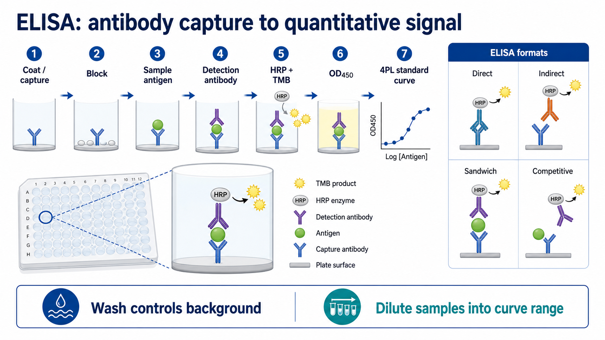

# ELISA

ELISA（Enzyme-linked immunosorbent assay，酶联免疫吸附试验）是一类把 antigen-antibody recognition（抗原-抗体识别）转化为 enzyme signal（酶促信号）的固相免疫检测方法。最常见形式是在 [酶标板](<../材(实验耗材工具篇)/酶标板.md>) 中固定抗原或抗体，经过封闭、加样、洗板、酶标检测和读板，用 [酶标仪](<../材(实验耗材工具篇)/酶标仪.md>) 读取吸光度或其他信号。

本页默认场景是最常用的 96 孔板 sandwich ELISA（[夹心ELISA](夹心ELISA.md)，夹心酶联免疫吸附试验）：用 [捕获抗体](<../材(实验耗材工具篇)/捕获抗体.md>) 固定目标抗原，再用 [检测抗体](<../材(实验耗材工具篇)/检测抗体.md>) 和 HRP（Horseradish peroxidase，[辣根过氧化物酶](<../材(实验耗材工具篇)/辣根过氧化物酶.md>)）/TMB（3,3',5,5'-Tetramethylbenzidine，[TMB](<../材(实验耗材工具篇)/TMB.md>)）体系产生 OD450 信号，并通过 [标准曲线](<../番外/补充知识/标准曲线.md>) 计算样本浓度。




图源：Image2 生成的 ELISA summary graph abstract。中文版用于快速理解流程，英文版用于 GitHub/英文记录场景；图中重点强调洗板控制背景、样本稀释进入标准曲线范围。

## 实验发明历史

ELISA 的核心思想来自 20 世纪 70 年代早期的 enzyme immunoassay（酶免疫测定）：把抗原-抗体特异性识别和酶促显色结合起来，避免放射免疫测定中放射性同位素的使用。Engvall 和 Perlmann 在 1971 年发表的工作是 ELISA 早期经典文献之一，用酶标抗体实现免疫球蛋白定量检测。参考：[Engvall and Perlmann, 1971, PubMed](https://pubmed.ncbi.nlm.nih.gov/5135623/)。

现代 ELISA 已经发展成非常成熟的平台：可以是手工 96 孔板，也可以是自动化洗板和读板；可以测蛋白、抗体、激素、病原抗原、小分子竞争体系，也可以扩展为多重免疫检测。

## 应用场景

| 场景 | 常见样本 | ELISA回答的问题 |
| --- | --- | --- |
| 细胞因子检测 | 细胞培养上清、血清、血浆 | 某个 cytokine 是否升高，浓度是多少 |
| 生长因子/激素检测 | 血清、上清、组织匀浆 | 分泌量或处理后变化 |
| 抗体滴度 | 血清、免疫动物样本 | 抗体是否产生，滴度多高 |
| 病原抗原或抗体检测 | 血清、鼻咽样本、培养液 | 是否存在特定病原或免疫反应 |
| 药物 PK/ADA | 血清、血浆 | 药物浓度或抗药抗体 |
| 质量控制 | 重组蛋白、培养基、制备批次 | 是否有目标残留或批间差异 |

ELISA 的强项是大量样本中对一个或少数几个目标做可重复定量。若需要看蛋白大小和条带形态，[Western blot](<Western blot.md>) 更合适；若需要看单细胞层面的阳性比例，[流式细胞术](流式细胞术.md) 更合适；若需要同时测几十个因子，[多重因子检测](多重因子检测.md) 可能更合适。

## 实验目的

ELISA 可以服务三个层级的目的：

| 目的 | 典型问题 | 结果形式 |
| --- | --- | --- |
| 定性 | 样本是否阳性 | positive/negative 或 cutoff |
| 半定量 | 哪组信号更高 | OD 值、相对单位、fold change |
| 绝对定量 | 样本中目标浓度是多少 | pg/mL、ng/mL、U/mL 等 |

科研中最常见的是绝对或相对定量。真正可靠的定量不只取决于 OD450 数值，而取决于标准曲线、样本稀释、重复孔、空白扣除和样本基质是否合适。

## 简要实验原理

ELISA 的核心链条是：

```text
板面固定抗原或抗体
-> 封闭非特异吸附位点
-> 加入样本中的目标分子
-> 加入检测抗体或酶标抗体
-> 洗去未结合组分
-> 加底物显色或发光
-> 读板并由标准曲线换算浓度
```

Thermo Fisher 的 ELISA overview 将 ELISA 概括为一种 plate-based assay，并把 coating/capture、blocking、probing/detection 和 signal measurement 作为主要流程模块；其资料也区分 direct、indirect、sandwich 和 competitive 等形式。参考：[Thermo Fisher Overview of ELISA](https://www.thermofisher.com/us/en/home/life-science/protein-biology/protein-biology-learning-center/protein-biology-resource-library/pierce-protein-methods/overview-elisa.html)。

在 HRP-TMB 显色 ELISA 中，HRP 催化 TMB 产生颜色变化。加入酸性 stop solution（终止液，常见为 [硫酸](<../材(实验耗材工具篇)/硫酸.md>) 体系）后，颜色通常稳定为黄色，并在 450 nm 附近读取吸光度。最终 OD450 不是浓度本身，而是要通过标准曲线换算。

## ELISA类型对比

| 类型 | 板面固定 | 检测逻辑 | 优点 | 局限 | 适合场景 |
| --- | --- | --- | --- | --- | --- |
| [直接ELISA](直接ELISA.md) | 抗原 | 酶标一抗直接识别抗原 | 步骤少、快 | 信号放大弱，需要标记一抗 | 抗原存在性、简单筛查 |
| [间接ELISA](间接ELISA.md) | 抗原 | 一抗 + 酶标二抗 | 信号放大好，二抗通用 | 背景和交叉反应路径更多 | 抗体滴度、血清抗体检测 |
| [夹心ELISA](夹心ELISA.md) | 捕获抗体 | 抗原被两只抗体夹住 | 特异性和灵敏度高 | 需要匹配抗体对 | 细胞因子、分泌蛋白、血清蛋白 |
| [竞争ELISA](竞争ELISA.md) | 抗原或抗体 | 样本目标物与标记物竞争结合 | 适合小分子或单表位目标 | 信号常与浓度负相关，解释更绕 | 激素、小分子、药物、半抗原 |
| [ELISPOT](ELISPOT.md) | 捕获抗体 | 单细胞分泌物形成 spot | 可看分泌细胞频率 | 不是普通浓度 ELISA | 免疫细胞分泌功能 |

如果只是“测上清里某个细胞因子浓度”，优先考虑商业 sandwich [ELISA试剂盒](<../材(实验耗材工具篇)/ELISA试剂盒.md>)。如果是“检测血清里有没有某抗体”，indirect ELISA 更常见。小分子因为常常只有一个表位，不能同时被两只抗体夹住，所以常用 competitive 逻辑。

## 实验所需试剂、耗材和设备

### 试剂

| 试剂 | 作用 |
| --- | --- |
| 捕获抗体 | 固定目标抗原，决定 sandwich ELISA 特异性入口 |
| 标准品 | 建立标准曲线，用于浓度换算 |
| 样本 | 血清、血浆、细胞上清、组织裂解液等 |
| 检测抗体 | 识别目标抗原另一个表位 |
| HRP 标记二抗或 streptavidin-HRP | 把结合事件转化为酶促信号 |
| [封闭液](<../材(实验耗材工具篇)/封闭液.md>) | 降低板面非特异吸附 |
| 洗涤液 | 常用 [PBS](<../材(实验耗材工具篇)/PBS.md>) 或 TBS + [Tween-20](<../材(实验耗材工具篇)/Tween-20.md>) |
| TMB 底物 | HRP 显色底物 |
| 终止液 | 终止 TMB 显色并稳定读板窗口 |

封闭液常见成分包括 [BSA](<../材(实验耗材工具篇)/BSA.md>)、[酪蛋白](<../材(实验耗材工具篇)/酪蛋白.md>) 或商业 blocker。不同 target、抗体和板面会对 blocker 很敏感，因此高背景时不要只调整抗体浓度，也要比较封闭体系。

### 耗材和设备

| 耗材/设备 | 作用 |
| --- | --- |
| 酶标板 | 提供固相吸附或捕获表面 |
| [移液枪](<../材(实验耗材工具篇)/移液枪.md>) / [多道移液枪](<../材(实验耗材工具篇)/多道移液枪.md>) | 加样、洗板、加底物和终止液 |
| [洗板机](<../材(实验耗材工具篇)/洗板机.md>) | 提高洗板一致性，降低孔间差异 |
| 酶标仪 | 读取 OD450 或其他信号 |
| 封板膜 | 减少蒸发和污染 |
| 低吸附管 | 配制标准品和稀释样本 |

ELISA 对移液一致性非常敏感。多道移液枪、加样节奏、板图设计和重复孔安排，往往比“是否会背 protocol”更影响结果。

## 实验操作

不同试剂盒和自建 ELISA 的体积、时间、温度会不同。以下是通用逻辑，正式实验应优先按 kit manual 或抗体对说明书执行。

### 板图设计

**怎么做**：实验前先设计 plate map（板图），安排 blank、standard、QC、sample、重复孔和必要对照。标准曲线通常做连续梯度稀释，并至少做 duplicate（双孔）或 triplicate（三孔）。

**为什么重要**：ELISA 是整板实验。加样顺序、边缘孔、孵育时间差和温度梯度会影响孔间读数。板图提前设计可以避免读板后才发现没有空白孔、标准曲线范围不够或样本没有重复。

**注意事项**：

- 标准曲线应覆盖预期样本浓度。
- 高低浓度样本不要只放在板的一侧。
- 尽量让同组样本均匀分布，避免把组别和板位置完全重合。
- 边缘孔容易受蒸发影响，敏感实验可避免使用边缘孔或加入 buffer 做边缘控制。

**替代方案**：样本很多时可分多板，但每块板都应有标准曲线或跨板 QC。不要只在第一块板做标准曲线，然后把曲线直接套到所有板。

**错误后果**：板图混乱会导致样本身份错误；标准曲线不足会导致浓度无法换算；边缘效应会制造假差异。

### 包被或捕获

**怎么做**：自建 sandwich ELISA 常将捕获抗体稀释在 coating buffer 中，加到高结合力板孔中，室温孵育数小时或 4°C overnight。商业 pre-coated plate（预包被板）则跳过这一步。

**为什么重要**：捕获抗体决定目标抗原是否能被稳定固定在板上。包被浓度太低会信号弱，太高可能增加背景或浪费抗体。

**注意事项**：

- 按抗体说明书选择 coating buffer 和浓度。
- 避免板孔干掉。
- 包被后洗板要稳定，不要让残液过多影响封闭。
- 不同板品牌和表面处理可能影响吸附。

**替代方案**：可使用 pre-coated ELISA kit、streptavidin-coated plate + biotinylated capture antibody，或购买 matched antibody pair（配对抗体）。

**错误后果**：捕获不足会全板低信号；捕获抗体不匹配会标准品也无信号；板面不一致会孔间 CV 偏高。

### 封闭

**怎么做**：加入封闭液覆盖未被抗体或抗原占据的板面位点，常在室温孵育 1 h 左右，随后洗板或按说明直接进入下一步。

**为什么重要**：板面很容易非特异吸附蛋白、抗体和酶标物。封闭不足会让阴性孔和空白孔升高，降低 signal-to-noise ratio（信噪比）。

**注意事项**：

- blocker 要和检测体系兼容。
- 使用 biotin-streptavidin 体系时，要注意某些 blocker 或样本中的内源性 biotin 可能影响结果。
- 封闭后板孔不要干燥。

**替代方案**：BSA、casein、鱼明胶、商业 ELISA blocker 都可比较。不同 target 不一定共用同一个最佳 blocker。

**错误后果**：高背景、空白孔偏高、低浓度样本无法区分。

### 标准品和样本准备

**怎么做**：按说明书复溶 [标准品](<../材(实验耗材工具篇)/标准品.md>)，用 sample diluent（样本稀释液）做梯度稀释。样本根据预期浓度做合适倍数稀释，目标是让 OD 落在标准曲线可靠范围内。

**为什么重要**：ELISA 定量依赖标准曲线。标准品配错、混匀不足或稀释液不匹配，会让整板结果系统性错误。

**注意事项**：

- 标准品复溶后要充分但温和混匀。
- 连续稀释时每一步都要换新吸头并充分混匀。
- 血清、血浆、组织裂解液和培养上清的基质不同，不能默认同样稀释倍数。
- 冻融会影响某些蛋白，样本最好分装保存。

**替代方案**：未知浓度样本可先做 pilot dilution（预实验稀释），例如 1:2、1:5、1:10、1:20 梯度，找到可落在曲线范围的稀释倍数。

**错误后果**：标准曲线不成型会导致整板不可用；样本过浓会超过上限甚至出现 hook effect（[Hook效应](<../番外/补充知识/Hook效应.md>)）；样本过稀会低于检测限。

### 加样孵育

**怎么做**：将标准品、样本和对照加入对应孔中，按说明在室温或 37°C 孵育。孵育期间通常封板，避免蒸发和污染。

**为什么重要**：这一步决定目标抗原与捕获抗体是否达到足够结合。孵育时间和温度改变会影响灵敏度、背景和重复性。

**注意事项**：

- 加样顺序要固定，尤其是底物和终止液步骤。
- 避免气泡，气泡会影响读板。
- 粘稠样本要慢吸慢打。
- 样本基质可能干扰抗体结合或酶反应。

**替代方案**：低丰度 target 可延长孵育、提高样本体积或使用更灵敏 kit；高背景样本可增加稀释倍数或更换稀释液。

**错误后果**：孵育不足会低信号；蒸发会造成边缘孔偏高；气泡会导致异常 OD。

### 洗板

**怎么做**：用 wash buffer 加满板孔，充分浸润后倒掉或吸走，重复 3-5 次。最后一次洗板后要拍干残液，但不要让孔干燥。

**为什么重要**：洗板是 ELISA 背景控制的核心。未结合抗体、酶标物和样本蛋白如果残留，会被 TMB 放大成背景。

**注意事项**：

- 洗涤液体积要足够覆盖孔壁。
- 每次洗板要尽量一致。
- 手动洗板时避免交叉污染。
- 洗板机要确认针位、吸液高度和残液量。

**替代方案**：高背景可增加洗板次数、延长浸泡时间、调整 Tween-20 浓度或换洗板机；低信号时不要盲目过度洗板，先检查抗体和标准品。

**错误后果**：洗不干净会高背景；洗得不一致会 CV 高；吸头或洗板针碰到孔底可能造成涂层损伤。

### 检测抗体和酶标物

**怎么做**：加入检测抗体，洗板后加入 HRP 标记二抗、streptavidin-HRP 或其他酶标物。部分 kit 的检测抗体已经直接 HRP 标记，可以减少步骤。

**为什么重要**：检测抗体提供第二重特异性，HRP 把结合量转化为可读信号。抗体浓度和孵育时间决定信号强度与背景之间的平衡。

**注意事项**：

- 检测抗体必须识别与捕获抗体不同的表位。
- HRP 体系避免使用含 [叠氮钠](<../材(实验耗材工具篇)/叠氮钠.md>) 的稀释液。
- 酶标物浓度过高会显著提高背景。

**替代方案**：可使用 biotinylated detection antibody + streptavidin-HRP 放大信号，或改用 AP、荧光、化学发光体系。

**错误后果**：抗体对不匹配会无标准曲线；酶标物过浓会全板发黄；检测抗体交叉反应会假阳性。

### TMB显色和终止

**怎么做**：加入 TMB substrate，避光孵育至颜色达到合适强度，再按相同顺序加入终止液。常规 HRP-TMB 终止后在 450 nm 读取 OD。

**为什么重要**：显色时间把酶活转化为 OD 值。显色不足会低信号，显色过度会饱和，导致高浓度孔无法定量。

**注意事项**：

- 加 TMB 和终止液的顺序要一致。
- 避免 TMB 被金属、光照或污染提前变色。
- 如果最高标准孔已经很深，及时终止。
- 加终止液后按说明书限定时间内读板。

**替代方案**：可使用 chemiluminescent ELISA（化学发光 ELISA）提高灵敏度，或用 fluorescent ELISA（荧光 ELISA）增加动态范围，但设备和试剂要匹配。

**错误后果**：加样节奏不一致会造成列间差异；过度显色会曲线平台化；终止不充分会读数继续变化。

### 读板

**怎么做**：用酶标仪读取 OD450，必要时用 570 nm 或 620 nm 做 reference wavelength（参考波长）校正光学瑕疵。读板前检查孔内气泡、液滴和污渍。

**为什么重要**：读板是把颜色转换为数值。气泡、指纹、板底污渍、液面不平和读板波长设置错误都会影响 OD。

**注意事项**：

- 选择正确波长。
- 保留原始 OD 数据，不只保存计算结果。
- 检查 blank 和最高标准是否合理。
- 不要把超出曲线范围的 OD 强行换算浓度。

**替代方案**：对于很低浓度 target，可选更灵敏检测体系或浓缩样本；对于高浓度样本，优先稀释后重测。

**错误后果**：读板设置错会整板无效；气泡会制造离群值；超范围换算会给出看似精确但实际错误的浓度。

## 结果解析

### 空白孔、阴性孔和背景

blank（空白孔）通常包含底物、终止液和缓冲体系，但不含目标反应链条。阴性孔可能是不含目标抗原的样本或阴性对照。空白孔用于扣除板和试剂本底，阴性孔用于判断非特异性结合或样本背景。

如果 blank 很高，优先怀疑底物污染、板污染或终止/读板问题。如果 blank 正常但阴性孔高，优先怀疑封闭、洗板、抗体浓度或样本基质。

### 标准曲线

ELISA 标准曲线常用 [4PL曲线](<../番外/补充知识/4PL曲线.md>)（four-parameter logistic curve，四参数逻辑曲线）拟合；部分非对称曲线可用 [5PL曲线](<../番外/补充知识/5PL曲线.md>)。不要用简单线性拟合覆盖整个 S 形曲线。

基本判断：

- 标准曲线应随浓度单调变化。
- 重复孔 CV 应在可接受范围内。
- 样本 OD 应落在曲线可定量区间。
- 超过最高标准或低于最低可靠标准的样本应稀释或报告为超范围。

### 样本浓度换算

如果样本稀释后测得浓度为 50 pg/mL，稀释倍数为 10，则原样本浓度为：

```text
50 pg/mL x 10 = 500 pg/mL
```

记录结果时必须写明 dilution factor（稀释倍数）。没有稀释倍数的 ELISA 结果很容易误读。

### LOD和LOQ

[LOD](<../番外/补充知识/LOD.md>)（limit of detection，检测限）表示能与空白区别开的最低水平；[LOQ](<../番外/补充知识/LOQ.md>)（limit of quantification，定量限）表示能较可靠定量的最低水平。低于 LOQ 的结果不能像正常浓度一样做精确比较。

### 基质效应

[基质效应](<../番外/补充知识/基质效应.md>) 指样本中的血清蛋白、脂质、盐、裂解液、培养基成分、异嗜性抗体或补体等影响抗原-抗体结合或酶反应。判断基质效应常用 [Spike-and-recovery](<../番外/补充知识/Spike-and-recovery.md>) 和 [稀释线性](<../番外/补充知识/稀释线性.md>) 测试。

如果样本稀释后计算出的原始浓度不一致，说明不是简单“稀释倍数问题”，而可能存在基质干扰或 hook effect。

## 异常结果和可能原因

| 异常 | 常见原因 | 处理 |
| --- | --- | --- |
| 全板无信号 | 标准品漏加、检测抗体/HRP/TMB 漏加、读板波长错误 | 检查流程记录，用阳性标准品重跑 |
| 标准曲线无梯度 | 标准品复溶错误、稀释错误、抗体对不匹配 | 重配标准品，检查捕获/检测抗体 |
| 空白孔高 | TMB 污染、板污染、终止液或读板问题 | 换底物和板，检查试剂颜色 |
| 阴性孔高 | 封闭不足、洗板不足、抗体过浓 | 优化 blocker、增加洗板、稀释抗体 |
| 重复孔 CV 高 | 移液不一致、气泡、洗板不均、边缘效应 | 使用多道移液枪，检查气泡和洗板机 |
| 高浓度样本反而低 | Hook effect | 稀释样本重测 |
| 样本不随稀释线性下降 | 基质效应、异嗜性抗体、裂解液干扰 | 做 spike recovery，换稀释液或样本处理 |
| 边缘孔偏高或偏低 | [边缘效应](<../番外/补充知识/边缘效应.md>)、蒸发、温度梯度 | 封板、平衡温度、避免边缘孔 |
| 低浓度端不稳定 | 接近 LOD/LOQ、移液误差 | 增加重复孔，优化标准曲线范围 |
| 曲线平台过早 | 显色过度、抗体/酶标物过浓 | 缩短显色时间，降低浓度 |

## ELISA与其他方法对比

| 方法 | 更适合回答的问题 | 和 ELISA 的关键区别 |
| --- | --- | --- |
| Western blot | 蛋白是否存在、分子量是否正确、是否有剪切/修饰条带 | WB 看条带形态，ELISA 更适合高通量定量 |
| [RT-qPCR](RT-qPCR.md) | mRNA 表达量变化 | qPCR 测 RNA，不等于蛋白浓度 |
| 流式细胞术 | 单细胞阳性比例、表面/胞内蛋白表达 | 流式给细胞分布，ELISA 给孔内总体浓度 |
| 多重因子检测 | 同时测多个 cytokine | 多重信息量高，但抗体交叉和动态范围更复杂 |
| [蛋白质谱](蛋白质谱.md) | 蛋白组、肽段和修饰的无偏或靶向检测 | 质谱更开放，ELISA 更标准化和便宜 |

一个常见判断是：如果你需要“很多样本里某一个已知蛋白的浓度”，ELISA 很强；如果你需要“蛋白是否大小正确、是否有多个 isoform”，不要用 ELISA 取代 WB。

## 商业kit和自建ELISA

| 选择 | 优点 | 局限 | 适合情况 |
| --- | --- | --- | --- |
| 商业 ELISA kit | 快、参数清楚、有标准品和说明书 | 成本高，灵活性较低 | 常规靶点、结果需要稳定 |
| matched antibody pair | 比 kit 灵活，可优化 | 需要自己验证条件 | 靶点成熟但需要自定义体系 |
| 完全自建 ELISA | 自由度最高 | 开发成本和失败风险高 | 新靶点、特殊物种或特殊基质 |

购买 kit 时要看：

- target species（目标物种）。
- sample type（样本类型）：serum、plasma、cell culture supernatant、tissue lysate。
- detection range（检测范围）。
- sensitivity（灵敏度）和 LOQ。
- specificity/cross-reactivity（特异性/交叉反应）。
- recovery 和 linearity of dilution 数据。
- 标准品形式和单位。
- 是否 pre-coated。
- 需要的样本体积。

常见供应商包括 [R&D Systems](<../番外/试剂厂商/R&D Systems.md>)、[Thermo Fisher Scientific](<../番外/试剂厂商/Thermo Fisher Scientific.md>)、[BioLegend](<../番外/试剂厂商/BioLegend.md>)、[Bio-Rad](<../番外/试剂厂商/Bio-Rad.md>)、[Abcam](<../番外/试剂厂商/Abcam.md>) 等。ELISA kit 不建议只按靶点名字替换，必须同时比较物种、样本类型、检测范围、标准品和基质验证。

R&D Systems 的 ELISA kit 和 DuoSet 体系常强调 sample type、standard curve、reagent preparation 和 wash step；BioLegend 的 sandwich ELISA protocol 也把 coating、blocking、sample incubation、detection、substrate 和 readout 作为核心流程。参考：[R&D Systems ELISA protocols](https://www.rndsystems.com/resources/protocols)；[BioLegend sandwich ELISA protocol](https://www.biolegend.com/en-us/protocols/sandwich-elisa-protocol)。

## 推荐记录模板

中文模板：

```text
实验名称：
ELISA 类型：直接 / 间接 / 夹心 / 竞争 / 其他
检测靶标：
样本类型：
样本处理：
试剂盒品牌：
货号：
批号：
标准品范围：
样本稀释倍数：
重复孔数量：
板号 / 板图文件：
读板波长：
参考波长：
拟合方式：4PL / 5PL / 线性 / 其他
空白扣除方式：
QC 结果：
异常孔：
操作者：
日期：
备注：
```

English template:

```text
Experiment name:
ELISA format: direct / indirect / sandwich / competitive / other
Target:
Sample type:
Sample preparation:
Kit brand:
Catalog number:
Lot number:
Standard range:
Sample dilution factor:
Replicates:
Plate ID / plate map file:
Reading wavelength:
Reference wavelength:
Curve fit: 4PL / 5PL / linear / other
Blank subtraction:
QC result:
Outlier wells:
Operator:
Date:
Notes:
```

## 总结

ELISA 的核心不是“按顺序加一堆液体”，而是把特异性结合、非特异背景控制、酶促放大和标准曲线定量连成一个体系。真正决定结果可信度的是：抗体对是否合适、样本是否落在曲线范围、洗板是否一致、基质效应是否被评估，以及原始 OD 和稀释倍数是否完整记录。

## 参考来源

- [Engvall and Perlmann, 1971, PubMed](https://pubmed.ncbi.nlm.nih.gov/5135623/)
- [Thermo Fisher Overview of ELISA](https://www.thermofisher.com/us/en/home/life-science/protein-biology/protein-biology-learning-center/protein-biology-resource-library/pierce-protein-methods/overview-elisa.html)
- [R&D Systems ELISA protocols](https://www.rndsystems.com/resources/protocols)
- [BioLegend sandwich ELISA protocol](https://www.biolegend.com/en-us/protocols/sandwich-elisa-protocol)
- [Bio-Rad ELISA guide](https://www.bio-rad-antibodies.com/elisa-types-direct-indirect-sandwich-competitive-elisa.html)
